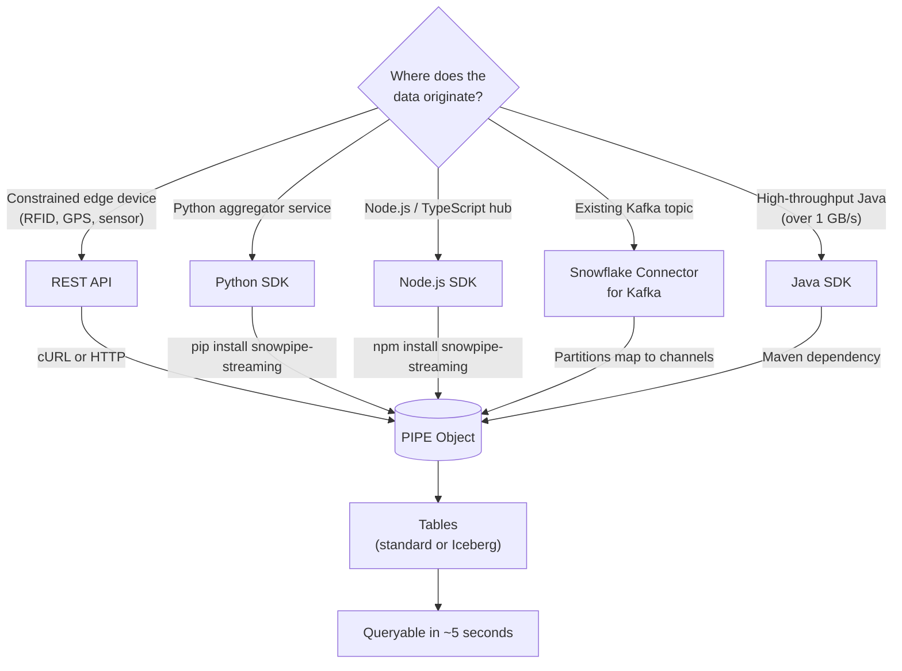

# Ingestion Decision Tree

Author: SE Community
Last Updated: 2026-05-15
Expires: 2026-07-14
Status: Reference Implementation

Reference Implementation: Review and customize for your requirements.

## Overview

How to choose between the Snowpipe Streaming REST API, language SDKs (Python, Node.js, Java), and the Snowflake Connector for Kafka based on the source of your IoT data.

## Diagram

## Component Descriptions

| Path | Best For | Throughput Guidance |
|------|----------|---------------------|
| REST API | Edge devices that cannot run an SDK runtime | Up to ~1 MB/s per device |
| Python SDK | Aggregator/gateway services in Python | 10s of MB/s per process |
| Node.js SDK | IoT hubs, Lambda functions, TypeScript apps | 10s of MB/s per process |
| Java SDK | High-throughput aggregators, established Java estates | Up to 10 GB/s per table |
| Kafka Connector | Existing Kafka event bus (MQTT -> Kafka -> Snowflake) | Hundreds of MB/s aggregate |

## Change History
See `.claude/DIAGRAM_CHANGELOG.md` or project-specific changelog.
