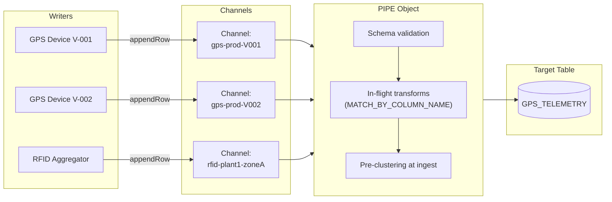

# PIPE and Channel Architecture

Author: SE Community
Last Updated: 2026-05-15
Expires: 2026-07-14
Status: Reference Implementation

Reference Implementation: Review and customize for your requirements.

## Overview

How writers, channels, and the PIPE object compose to deliver ordered, exactly-once row ingestion into a Snowflake table. Every streaming write -- from REST API, SDK, or Kafka -- flows through this same shape.

## Diagram

## Component Descriptions

| Component | Role | Notes |
|-----------|------|-------|
| Writer | Process producing rows (device, service, connector task) | One writer can manage many channels |
| Channel | Ordered, dedicated lane into a pipe | One per source partition; long-lived; deterministic naming |
| PIPE Object | Server-side processing layer | Auto-created as `<TABLE>-STREAMING`, or custom via `CREATE PIPE` |
| Target Table | Standard or Iceberg table | Schema evolution and clustering keys apply |

## Key Properties

- Rows within a single channel arrive **in order**
- Multiple channels can target the same pipe (and table)
- Each channel maintains its own offset token for exactly-once recovery
- A single client is bound to one pipe, but can manage thousands of channels

## Change History
See `.claude/DIAGRAM_CHANGELOG.md` or project-specific changelog.
