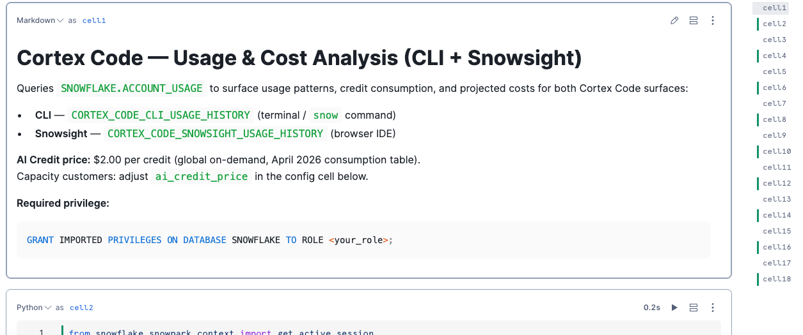
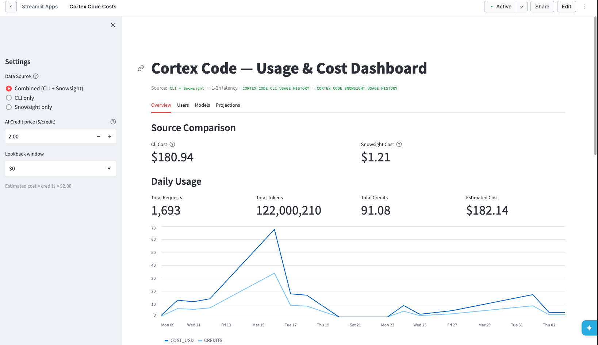

# Cortex Code — Usage & Cost Tool

Two artifacts for surfacing Cortex Code costs from your Snowflake account — covering **both the CLI and Snowsight surfaces**:

- **`notebook.ipynb`** — grab-and-run Snowflake Notebook with 9 Python cells
- **`streamlit_app.py`** — interactive Streamlit in Snowflake dashboard (4 tabs + source picker)

No Snowflake objects are created. Both artifacts read directly from `SNOWFLAKE.ACCOUNT_USAGE`:
- `CORTEX_CODE_CLI_USAGE_HISTORY` — terminal / `snow` command
- `CORTEX_CODE_SNOWSIGHT_USAGE_HISTORY` — browser IDE (Snowsight)

**Author:** SE Community  
**Created:** 2026-04-03 | **Expires:** 2026-07-06 | **Status:** ACTIVE

> **No support provided.** Review, test, and validate before any customer use.

---

## Screenshots

**Notebook** — runs directly in Snowflake, no install required:



**Streamlit Dashboard** — interactive source picker, 4 tabs, live cost metrics:



---

## Quick Start

### Option A — One-Shot Deploy (recommended)

1. In Snowsight: open a new SQL worksheet
2. Paste the contents of `deploy_all.sql`
3. Click **Run All**

This creates:
- Schema `SNOWFLAKE_EXAMPLE.CORTEX_CODE_COSTS`
- Notebook `CORTEX_CODE_COSTS_NOTEBOOK` (fetched from GitHub)
- Streamlit app `CORTEX_CODE_COSTS_APP` (fetched from GitHub)

### Option B — Manual Deploy

#### Step 1 — Grant access (if not already granted)

```sql
GRANT IMPORTED PRIVILEGES ON DATABASE SNOWFLAKE TO ROLE <your_role>;
```

#### Step 2a — Run the Notebook

1. In Snowsight: **Projects → Notebooks → + Notebook → Import .ipynb**
2. Upload `notebook.ipynb`
3. Select a warehouse and run all cells

#### Step 2b — Deploy the Streamlit App

1. In Snowsight: **Projects → Streamlit → + Streamlit App**
2. Choose a warehouse and database/schema
3. Paste the contents of `streamlit_app.py` into the editor
4. Click **Run**

---

## What It Shows

| Section | Description |
|---------|-------------|
| Source Comparison | CLI vs Snowsight cost split (Combined mode) |
| Daily Usage | Requests, tokens, credits, estimated USD — last 30/60/90 days |
| Weekly Trend | Week-over-week adoption and spend |
| Top Users | Ranked by credit consumption |
| Hourly Pattern | Peak usage hours |
| Usage by Model | Per-model credit breakdown (cache read/write split) |
| Cost Projections | Min/mean/max day → week → month → year extrapolations |
| Model Pricing | Official Table 6(e) rates (April 1, 2026) |
| Governance | Budget setup SQL, notification options, threshold actions, model selection guide, RBAC |

---

## Architecture

```
SNOWFLAKE.ACCOUNT_USAGE.CORTEX_CODE_CLI_USAGE_HISTORY
SNOWFLAKE.ACCOUNT_USAGE.CORTEX_CODE_SNOWSIGHT_USAGE_HISTORY
    ↓
notebook.ipynb                streamlit_app.py
(9 cells, parameterized)      (4 tabs + sidebar source picker)
  0. Config (source selector)   Overview  → source split, daily trend, hourly
  1. Daily summary              Users     → top 25 by credits
  2. Weekly trend               Models    → per-model breakdown + pricing ref
  3. Top users                  Projections → min/mean/max extrapolations
  4. Hourly pattern
  5. Usage by model
  6. Cost projections
  7. CLI vs Snowsight comparison
  8. Model pricing ref
```

---

## Pricing Reference

Source: [Snowflake Service Consumption Table, Table 6(e) — Cortex Code](https://www.snowflake.com/legal-files/CreditConsumptionTable.pdf) (effective April 1, 2026)

| Model | Input | Output | Cache Write | Cache Read |
|-------|------:|-------:|------------:|-----------:|
| claude-4-sonnet | 1.50 | 7.50 | 1.88 | 0.15 |
| claude-opus-4-5/4-6 | 2.75 | 13.75 | 3.44 | 0.28 |
| claude-sonnet-4-5/4-6 | 1.65 | 8.25 | 2.07 | 0.17 |
| openai-gpt-5.2 | 0.97 | 7.70 | — | 0.10 |
| openai-gpt-5.4 | 1.38 | 8.25 | — | 0.14 |

_All rates are AI Credits per 1M tokens. On-demand global AI Credit price: **$2.00/credit**._

---

## Cleanup

If deployed via `deploy_all.sql`:
```sql
DROP SCHEMA IF EXISTS SNOWFLAKE_EXAMPLE.CORTEX_CODE_COSTS CASCADE;
```

If deployed manually: delete the notebook and/or Streamlit app from Snowsight.
