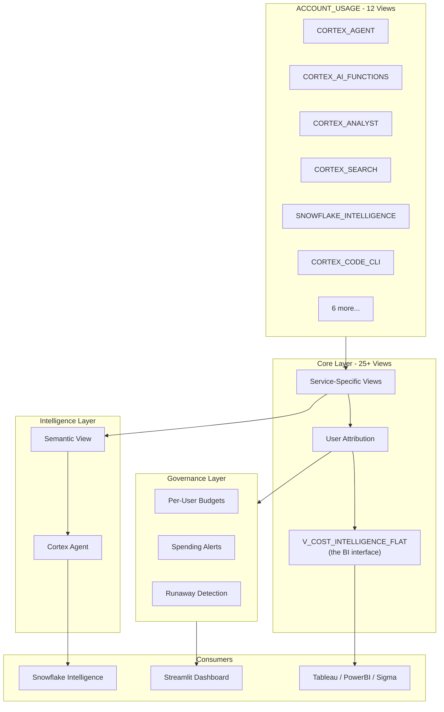

# Cortex Cost Intelligence v4.0

Inspired by a real customer question: *"I have 12 different Cortex services running -- how do I see what they all cost in one place and ask questions about it in natural language?"*

This tool answers that question with a semantic view over 12 ACCOUNT_USAGE views, a Cortex Agent for natural language cost queries, a single denormalized BI view for Tableau/PowerBI/Sigma, and an optional governance module with per-user budgets and runaway detection. The semantic view is the product -- everything else is a presentation layer.

**Author:** SE Community
**Last Updated:** 2026-03-02 | **Expires:** 2026-04-02 | **Status:** ACTIVE

> **No support provided.** This code is for reference only. Review, test, and modify before any production use.
> This tool expires on 2026-04-02. After expiration, validate against current Snowflake docs before use.

> **FinOps Journey (3 of 4):** For REST API-specific billing (tokens, not credits), see [tool-cortex-rest-api-cost](../tool-cortex-rest-api-cost/). For query-level warehouse optimization, see [guide-cost-drivers](../guide-cost-drivers/). For generating REST API usage, see [guide-cortex-anthropic-redirect](../guide-cortex-anthropic-redirect/).

---

## The Operational Pain

Snowflake Cortex now has 12 separate ACCOUNT_USAGE views for cost tracking -- Agents, AI Functions, Analyst, Search, Intelligence, Code CLI, Fine-Tuning, Document Processing, REST API, Provisioned Throughput, and two legacy views. Each has different column names, different billing units (credits vs. dollars per million tokens), and different latency windows.

No single view shows total Cortex spend. No built-in way to ask *"Who are the top 5 spenders?"* or *"Which service is growing fastest?"* in natural language.

---

## What It Does

### Ask questions in natural language

Open **Snowflake Intelligence** and find the **Cortex Cost Intelligence** agent:

- *"What was our total Cortex spend last month?"*
- *"Who are the top 5 spenders?"*
- *"What's the cheapest model for COMPLETE?"*
- *"Which service is growing fastest?"*

> [!TIP]
> **Pattern demonstrated:** Semantic view over ACCOUNT_USAGE views + Cortex Agent -- the pattern for natural language analytics over operational metadata.

### Connect your BI tool

Point Tableau, PowerBI, Sigma, or Hex at `V_COST_INTELLIGENCE_FLAT`. Every row = one service event. Dimensions: date, service, user, model, function, role. Metrics: credits, cost_usd, operations, tokens. No joins needed.

### Govern with budgets

```sql
CALL PROC_GRANT_AI_ACCESS('ALICE', 500);
CALL PROC_CHECK_USER_BUDGETS();
CALL PROC_MONITOR_AND_CANCEL_RUNAWAY_QUERIES(50);
```

> [!TIP]
> **Pattern demonstrated:** Per-user AI budgets with automated runaway detection -- the governance layer for Cortex cost control.

---

## Architecture



---

## Explore the Results

After deployment:

- **Snowflake Intelligence** -- Open the Cortex Cost Intelligence agent and ask cost questions in natural language
- **BI Tools** -- Connect to `V_COST_INTELLIGENCE_FLAT` for zero-join analytics
- **Key Views** -- Query directly for specific needs:

| View | Purpose |
|---|---|
| `V_COST_INTELLIGENCE_FLAT` | Single denormalized view for any BI tool |
| `V_CORTEX_DAILY_SUMMARY` | Daily aggregates by service type |
| `V_USER_SPEND_ATTRIBUTION` | Per-user, per-service, per-model spend |
| `V_MODEL_EFFICIENCY` | Cross-service model cost comparison |
| `V_COST_ANOMALIES_CURRENT` | Active week-over-week cost spikes |

---

<details>
<summary><strong>Deploy (1 step, ~5 minutes)</strong></summary>

> [!IMPORTANT]
> Requires `ACCOUNTADMIN` role access (for ACCOUNT_USAGE access).

Copy [`deploy_all.sql`](deploy_all.sql) into a Snowsight worksheet and click **Run All**.

### What Gets Deployed

| Tier | What | Opt-in? |
|---|---|---|
| **1. Core** | 25+ monitoring views, flat view, snapshot table, config | Always |
| **2. Intelligence** | Semantic view + Cortex Agent | Always |
| **3. Governance** | Per-user budgets, spending alerts, runaway detection | Run `sql/05_governance/` separately |
| **4. Dashboard** | 6-page Streamlit app | Run Streamlit deploy separately |

### Coverage -- 12 ACCOUNT_USAGE Views

| Service | View | Status |
|---|---|---|
| Cortex Analyst | `CORTEX_ANALYST_USAGE_HISTORY` | GA |
| Cortex AI Functions | `CORTEX_AI_FUNCTIONS_USAGE_HISTORY` | GA (Mar 2026) |
| Cortex Agent | `CORTEX_AGENT_USAGE_HISTORY` | Preview (Feb 2026) |
| Snowflake Intelligence | `SNOWFLAKE_INTELLIGENCE_USAGE_HISTORY` | Feb 2026 |
| Cortex Code CLI | `CORTEX_CODE_CLI_USAGE_HISTORY` | Feb 2026 |
| Provisioned Throughput | `CORTEX_PROVISIONED_THROUGHPUT_USAGE_HISTORY` | New |
| Cortex Search | `CORTEX_SEARCH_DAILY_USAGE_HISTORY` | GA |
| Cortex Search Serving | `CORTEX_SEARCH_SERVING_USAGE_HISTORY` | GA |
| Fine-Tuning | `CORTEX_FINE_TUNING_USAGE_HISTORY` | GA |
| Document Processing | `CORTEX_DOCUMENT_PROCESSING_USAGE_HISTORY` | GA |
| REST API | `CORTEX_REST_API_USAGE_HISTORY` | GA |
| Legacy | `CORTEX_FUNCTIONS_USAGE_HISTORY` | Legacy |

</details>

<details>
<summary><strong>Troubleshooting</strong></summary>

| Symptom | Fix |
|---------|-----|
| Views return no data | ACCOUNT_USAGE views have up to 3-hour latency. Wait and retry. |
| Agent not visible | Verify the semantic view `SV_CORTEX_COST_INTELLIGENCE` exists. |
| Governance procs not found | Governance is opt-in. Run `sql/05_governance/` scripts separately. |
| `TOKENS_GRANULAR` errors | This column is an OBJECT (not array). Access via `:"input"::NUMBER`. |

</details>

## Cleanup

Run [`teardown_all.sql`](teardown_all.sql) in Snowsight to remove all tool objects.

<details>
<summary><strong>Development Tools</strong></summary>

This project is designed for AI-pair development.

- **AGENTS.md** -- Project instructions for Cortex Code and compatible AI tools
- **.claude/skills/** -- Project-specific AI skills (Cursor + Claude Code)
- **Cortex Code in Snowsight** -- Open this project in a Workspace for AI-assisted development
- **Cursor** -- Open locally with Cursor for AI-pair coding

> New to AI-pair development? See [Cortex Code docs](https://docs.snowflake.com/en/user-guide/cortex-code/cortex-code)

</details>

## Documentation

- [MCP Integration](docs/05-MCP_INTEGRATION.md)
