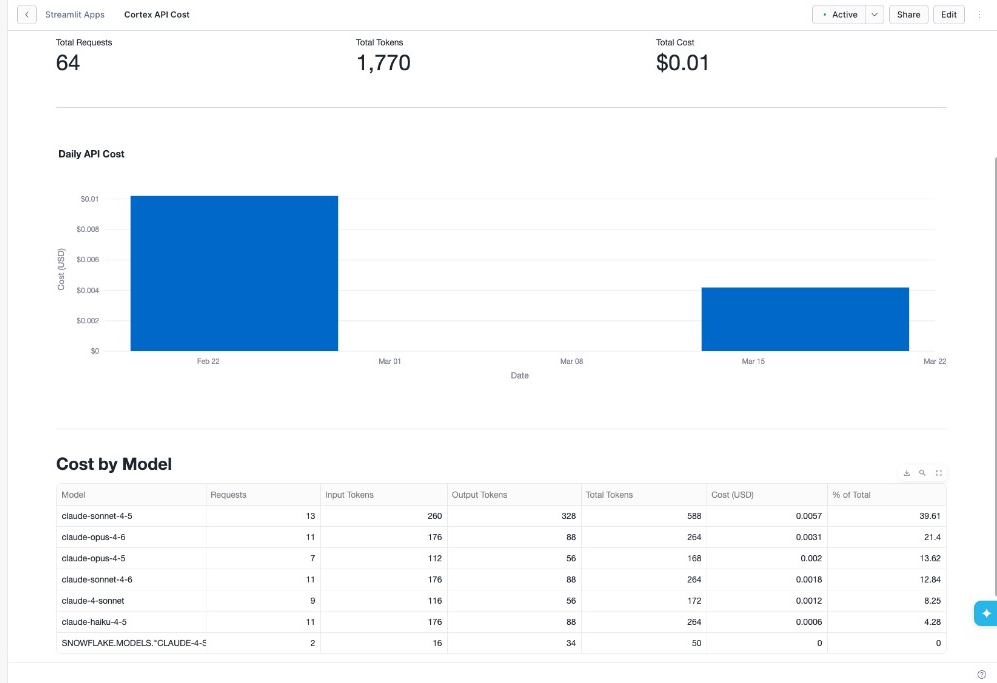
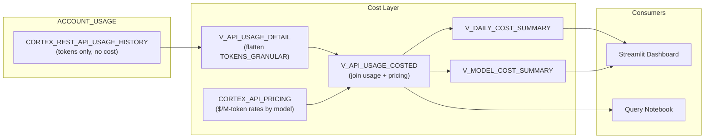

# Cortex REST API Cost

Inspired by a real customer question: *"Our REST API bill is in dollars per million tokens, not credits -- where do I see what we actually spent?"*

This tool queries `CORTEX_REST_API_USAGE_HISTORY`, applies the published per-model token rates from the Service Consumption Table, and shows actual dollar cost in a Streamlit dashboard and a step-by-step notebook.

**Pair-programmed by:** SE Community + Cortex Code
**Last Updated:** 2026-03-02 | **Expires:** 2026-04-02 | **Status:** ACTIVE

> **No support provided.** This code is for reference only. Review, test, and modify before any production use.
> This tool expires on 2026-04-02. After expiration, validate against current Snowflake docs before use.

> **FinOps Journey (2 of 4):** For broader Cortex AI cost governance (12 services), see [tool-cortex-cost-intelligence](../tool-cortex-cost-intelligence/). For query-level warehouse optimization, see [guide-cost-drivers](../guide-cost-drivers/). To generate REST API usage to track, see [guide-cortex-anthropic-redirect](../guide-cortex-anthropic-redirect/).

---

## The Operational Pain

Cortex REST API calls -- direct model inference via `/api/v2/cortex/inference:complete` -- are billed in **dollars per million tokens**, not credits. This is a different billing model from SQL-invoked AI functions, Cortex Agents, and Snowflake Intelligence (all credits). The usage view has no cost column -- only token counts. You have to join with pricing tables manually to see actual spend.

---

## What It Does

- **Total requests, tokens, and dollar cost** for a selectable lookback window (7 / 30 / 90 days)
- **Daily cost trend** as a bar chart
- **Cost by model** with request counts, token breakdown, and percentage of total spend

The pricing formula: `cost = (input_tokens x input_rate / 1,000,000) + (output_tokens x output_rate / 1,000,000)`

> [!TIP]
> **Pattern demonstrated:** ACCOUNT_USAGE view + pricing table join for dollar-cost attribution -- the pattern for any token-billed Snowflake service.

---

## Architecture

---

<strong>Deploy (1 step, ~2 minutes)</strong>

> [!IMPORTANT]
> Requires `ACCOUNTADMIN` (one-time for Git API integration) and `SYSADMIN` for schema/views.

Copy [`deploy_all.sql`](deploy_all.sql) into a Snowsight worksheet and click **Run All**.

Then open **Projects > Streamlit > CORTEX_REST_API_COST_APP** for the dashboard, or **Projects > Notebooks > CORTEX_REST_API_COST_NOTEBOOK** for the query walkthrough.

### What Gets Deployed

| Object | Type | Purpose |
|--------|------|---------|
| `SNOWFLAKE_EXAMPLE.CORTEX_REST_API_COST` | Schema | All tool objects |
| `SFE_CORTEX_REST_API_COST_WH` | Warehouse | XS, auto-suspend 60s |
| `CORTEX_API_PRICING` | Table | $/million-token rates per model and region |
| `V_API_USAGE_DETAIL` | View | Flattens `TOKENS_GRANULAR` into input/output columns |
| `V_API_USAGE_COSTED` | View | Joins usage with pricing for dollar cost per request |
| `V_DAILY_COST_SUMMARY` | View | Daily aggregation |
| `V_MODEL_COST_SUMMARY` | View | Per-model aggregation with % of total |
| `CORTEX_REST_API_COST_APP` | Streamlit | Single-page cost dashboard |
| `CORTEX_REST_API_COST_NOTEBOOK` | Notebook | 10-step query walkthrough |

No data? Make a Cortex REST API call and check back after the ACCOUNT_USAGE latency window (~45 minutes).

<strong>Troubleshooting</strong>

| Symptom | Fix |
|---------|-----|
| Views return no data | ACCOUNT_USAGE views have ~45 min latency. Recent API calls may not appear yet. |
| Pricing mismatch | Check `CORTEX_API_PRICING` rates against the latest [Service Consumption Table](https://www.snowflake.com/legal-files/CreditConsumptionTable.pdf). |
| `TOKENS_GRANULAR` errors | This column is an OBJECT. Access via `:"input"::NUMBER`, not array indexing. |

## Cleanup

Run [`teardown_all.sql`](teardown_all.sql) in Snowsight to remove all tool objects.

<strong>Development Tools</strong>

This project is designed for AI-pair development.

- **AGENTS.md** -- Project instructions for Cortex Code and compatible AI tools
- **.claude/skills/** -- Project-specific AI skills (Cursor + Claude Code)
- **Cortex Code in Snowsight** -- Open this project in a Workspace for AI-assisted development
- **Cursor** -- Open locally with Cursor for AI-pair coding

> New to AI-pair development? See [Cortex Code docs](https://docs.snowflake.com/en/user-guide/cortex-code/cortex-code)

## References

- [CORTEX_REST_API_USAGE_HISTORY view](https://docs.snowflake.com/en/sql-reference/account-usage/cortex_rest_api_usage_history)
- [Service Consumption Table (PDF)](https://www.snowflake.com/legal-files/CreditConsumptionTable.pdf) -- Tables 6(b) and 6(c)
- [Cortex LLM REST API](https://docs.snowflake.com/en/user-guide/snowflake-cortex/cortex-llm-rest-api)
