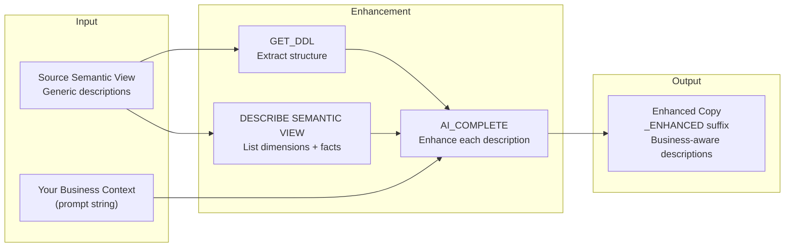

# Semantic View Enhancer

Inspired by a real customer question: *"I have an existing semantic view with generic descriptions like 'Order status code' -- how do I enrich them with our actual business definitions without rebuilding the view from scratch?"*

This tool answers that question with a single stored procedure that reads your existing semantic view, enhances every dimension and fact description with Cortex AI using your business context, and creates an enhanced copy. Your original view is never modified.

**Author:** SE Community
**Last Updated:** 2026-03-04 | **Expires:** 2026-05-03 | **Status:** ACTIVE

> **No support provided.** This code is for reference only. Review, test, and modify before any production use.
> This tool expires on 2026-05-03. After expiration, validate against current Snowflake docs before use.

---

## The Operational Pain

Semantic views power Cortex Analyst -- but their accuracy depends on description quality. Auto-generated descriptions say *"Order status code"* when the business needs *"Order fulfillment stage: F=Fulfilled (shipped), O=Open (awaiting payment), P=Processing (warehouse)."* Better descriptions mean better natural language query accuracy.

Rebuilding the view from scratch loses the existing structure. Editing YAML by hand for 50+ columns is tedious and error-prone.

---

## What It Does

```sql
CALL SFE_ENHANCE_SEMANTIC_VIEW(
    P_SOURCE_VIEW_NAME => 'ORDERS_VIEW',
    P_BUSINESS_CONTEXT_PROMPT => 'Order fulfillment system. Status: F=Fulfilled, O=Open, P=Processing. Priority: 1-URGENT (24hr SLA), 2-HIGH (48hr), 3-MEDIUM (5 day).'
);

-- Before: "Order status code"
-- After:  "Order fulfillment stage: F=Fulfilled (shipped), O=Open (awaiting payment), P=Processing (warehouse)."
```

> [!TIP]
> **Pattern demonstrated:** `GET_DDL('SEMANTIC_VIEW')` + `DESCRIBE SEMANTIC VIEW` + `AI_COMPLETE` for automated description enhancement -- the pattern for enriching existing metadata with AI.

---

## Architecture



---

## Explore the Results

After deployment:

```sql
-- Compare original vs enhanced
DESCRIBE SEMANTIC VIEW YOUR_SEMANTIC_VIEW;
DESCRIBE SEMANTIC VIEW YOUR_SEMANTIC_VIEW_ENHANCED;
```

### When to Use This vs Native Features

| Scenario | Recommendation |
|----------|----------------|
| Creating a **new** semantic view | Use [Semantic View Autopilot](https://docs.snowflake.com/en/user-guide/views-semantic/autopilot) with "AI-Generated Descriptions" |
| Enhancing an **existing** semantic view | Use this tool |
| Need **custom business context** in descriptions | Use this tool |
| Programmatic/CLI enhancement (not UI) | Use this tool |

---

<details>
<summary><strong>Deploy (1 step, ~2 minutes)</strong></summary>

Copy [`deploy.sql`](deploy.sql) into a Snowsight worksheet and click **Run All**.

### What Gets Created

| Object Type | Name | Purpose |
|------------|------|---------|
| Warehouse | `SFE_ENHANCEMENT_WH` | X-SMALL, 60s auto-suspend |
| Schema | `SNOWFLAKE_EXAMPLE.SEMANTIC_ENHANCEMENTS` | Tool namespace |
| Procedure | `SFE_ENHANCE_SEMANTIC_VIEW` | Main enhancement procedure (Python 3.11) |
| Function | `SFE_ESTIMATE_ENHANCEMENT_COST` | Cost estimation |
| Procedure | `SFE_DIAGNOSE_ENVIRONMENT` | Environment diagnostics |

### Estimated Costs

| Component | Estimated Cost |
|-----------|----------------|
| Setup (X-SMALL, ~2 min) | < $0.01 |
| Per enhancement (10 dimensions) | ~$0.005 |
| Per enhancement (50 dimensions) | ~$0.025 |
| Per enhancement (100 dimensions) | ~$0.05 |

</details>

<details>
<summary><strong>Troubleshooting</strong></summary>

| Symptom | Fix |
|---------|-----|
| "Semantic view not found" | Verify with `SHOW SEMANTIC VIEWS` and check spelling. |
| "Could not get DDL" | Ensure you have SELECT privilege on the view. |
| "Cortex function not available" | Contact Snowflake support to enable Cortex features. |
| Enhancement doesn't make sense | Refine business context with more specific definitions. |

</details>

## Cleanup

Run [`teardown.sql`](teardown.sql) in Snowsight to remove all tool objects.

<details>
<summary><strong>Development Tools</strong></summary>

This project is designed for AI-pair development.

- **AGENTS.md** -- Project instructions for Cortex Code and compatible AI tools
- **.claude/skills/** -- Project-specific AI skills (Cursor + Claude Code)
- **Cortex Code in Snowsight** -- Open this project in a Workspace for AI-assisted development
- **Cursor** -- Open locally with Cursor for AI-pair coding

> New to AI-pair development? See [Cortex Code docs](https://docs.snowflake.com/en/user-guide/cortex-code/cortex-code)

</details>

## References

- [Snowflake Semantic Views Documentation](https://docs.snowflake.com/en/user-guide/views-semantic)
- [Cortex COMPLETE Function](https://docs.snowflake.com/en/user-guide/snowflake-cortex/llm-functions)
- [GET_DDL Function](https://docs.snowflake.com/en/sql-reference/functions/get_ddl)
- [DESCRIBE SEMANTIC VIEW](https://docs.snowflake.com/en/sql-reference/sql/desc-semantic-view)
