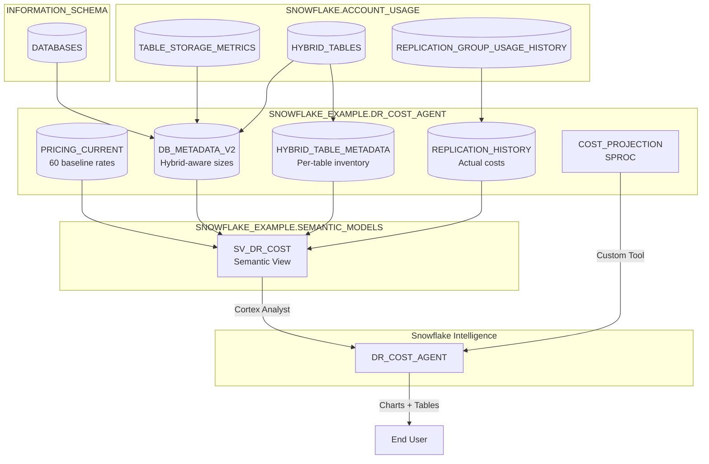

# Data Flow - DR Cost Agent
Author: SE Community
Last Updated: 2026-04-09
Expires: 2026-05-01
Status: Reference Implementation

Reference Implementation: This code demonstrates production-grade architectural patterns and best practices. Review and customize security, networking, and logic for your organization's specific requirements before deployment.

## Overview
Data ingestion and processing flow for DR/replication cost estimation using Snowflake Intelligence.

## Component Descriptions

### Data Foundation
- **PRICING_CURRENT**: Baseline BC rates per cloud/region/service type (seeded by deploy.sql)
- **DB_METADATA_V2**: Per-database sizes with hybrid table exclusion for accurate replication sizing
- **HYBRID_TABLE_METADATA**: Individual hybrid table inventory (skipped during replication)
- **REPLICATION_HISTORY**: Actual replication credits and bytes from ACCOUNT_USAGE

### Semantic Layer
- **SV_DR_COST**: Semantic view powering Cortex Analyst for natural language queries

### Agent Layer
- **DR_COST_AGENT**: Snowflake Intelligence agent with three tools:
  - Cortex Analyst (structured data queries via semantic view)
  - COST_PROJECTION (deterministic projection SPROC)
  - data_to_chart (built-in visualization)
