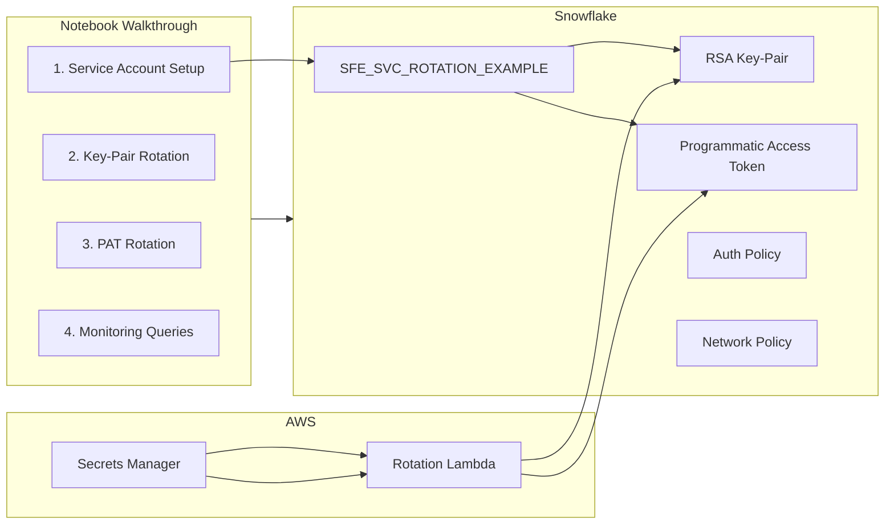

# Secrets Rotation Workbook

Inspired by a real operational question: *"How do I rotate key-pair credentials and PATs for Snowflake service accounts without downtime -- and automate it with AWS Secrets Manager?"*

This tool answers that question with a Snowflake Native Notebook that walks through both rotation patterns step by step. Creates a purpose-built example service user so you can see every step live, then adapt it for your own accounts.

**Pair-programmed by:** SE Community + Cortex Code
**Created:** 2026-03-06 | **Expires:** 2026-04-05 | **Status:** ACTIVE

> **No support provided.** This code is for reference only. Review, test, and modify before any production use.
> This tool expires on 2026-04-05. After expiration, validate against current Snowflake docs before use.

---

## The Operational Pain

Service accounts connecting to Snowflake via key-pair auth or PATs need regular credential rotation. Manual rotation means downtime risk, missed rotations, and credentials that live forever. AWS Secrets Manager can automate rotation -- but wiring it to Snowflake's specific rotation SQL (`ALTER USER ... ROTATE PAT`, RSA key swap) requires understanding constraints that aren't obvious from the docs alone.

---

## What It Does

### Pattern 1: Key-Pair Rotation

Assigns RSA public key to a service user, verifies fingerprints, and explains how AWS Secrets Manager native rotation handles the dual-key swap.

### Pattern 2: PAT Rotation

Creates a PAT, rotates it live, shows before/after token state, and walks through the Lambda-based rotation flow.

### Monitoring

10 SQL queries covering PAT inventory, expiration alerts, stale tokens, login audit, and fingerprint verification.

> [!TIP]
> **Pattern demonstrated:** AWS Secrets Manager + Snowflake rotation SQL for automated, zero-downtime credential rotation.

---

## Architecture

---

<strong>Deploy (2 steps, ~5 minutes)</strong>

> [!IMPORTANT]
> Requires `ACCOUNTADMIN` (or USERADMIN + SECURITYADMIN + SYSADMIN) for creating the example objects.

**Step 1 -- Deploy:**

Copy [`deploy_all.sql`](deploy_all.sql) into Snowsight and click **Run All**. Creates the schema and imports the notebook.

**Step 2 -- Open the notebook:**

Navigate to **Projects > Notebooks > SECRETS_ROTATION_WORKBOOK** and run cells step by step.

### What Gets Created (by deploy)

| Object | Purpose |
|--------|---------|
| Schema `SNOWFLAKE_EXAMPLE.SECRETS_ROTATION` | Tool namespace |
| Notebook `SECRETS_ROTATION_WORKBOOK` | Interactive walkthrough |

### What Gets Created (by notebook cells)

| Object | Purpose |
|--------|---------|
| User `SFE_SVC_ROTATION_EXAMPLE` | Example service account (TYPE=SERVICE) |
| Role `SFE_SVC_ROTATION_ROLE` | Service role |
| Role `SFE_SVC_ROTATION_ROTATOR_ROLE` | Rotation privileges |
| Network Policy | Service account network restriction |
| Auth Policy | Authentication method restriction |

<strong>Troubleshooting</strong>

| Symptom | Fix |
|---------|-----|
| PAT creation fails | Service users require a network policy to generate PATs. The notebook creates one. |
| PAT rotation returns empty token | `token_secret` only appears once in the ALTER USER ROTATE PAT output. Copy it immediately. |
| Cannot rotate from PAT session | PAT rotation cannot be performed from a PAT-authenticated session. Use key-pair or password auth. |

## Cleanup

Run [`teardown_all.sql`](teardown_all.sql) in Snowsight to remove all objects (including those created by notebook cells).

<strong>Development Tools</strong>

This project is designed for AI-pair development.

- **AGENTS.md** -- Project instructions for Cortex Code and compatible AI tools
- **.claude/skills/** -- Project-specific AI skill
- **Cortex Code in Snowsight** -- Open in a Workspace for AI-assisted development
- **Cursor** -- Open locally for AI-pair coding

> New to AI-pair development? See [Cortex Code docs](https://docs.snowflake.com/en/user-guide/cortex-code/cortex-code)

## References

- [Key-Pair Authentication](https://docs.snowflake.com/en/user-guide/key-pair-auth)
- [Programmatic Access Tokens](https://docs.snowflake.com/en/user-guide/programmatic-access-tokens)
- [ALTER USER ... ROTATE PAT](https://docs.snowflake.com/en/sql-reference/sql/alter-user-rotate-programmatic-access-token)
- [CREDENTIALS View](https://docs.snowflake.com/en/sql-reference/account-usage/credentials)
- [Snowflake Key Pair (AWS Secrets Manager)](https://docs.aws.amazon.com/secretsmanager/latest/userguide/mes-partner-Snowflake.html)
