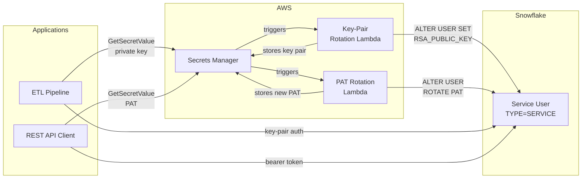
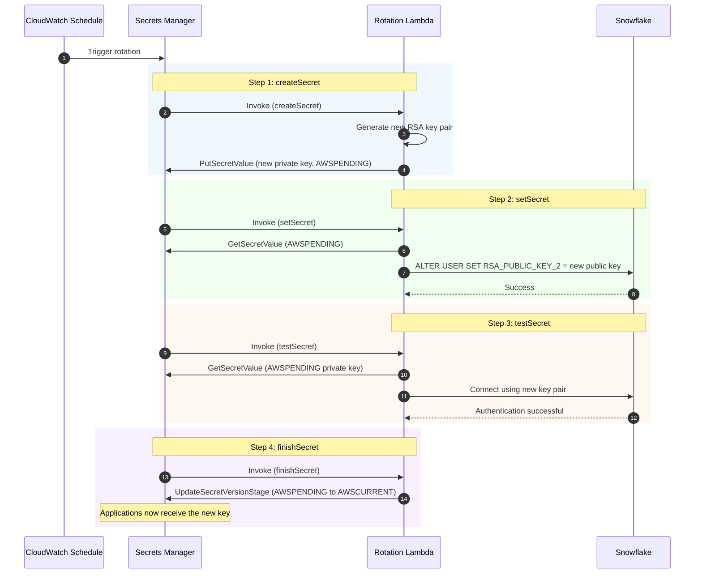
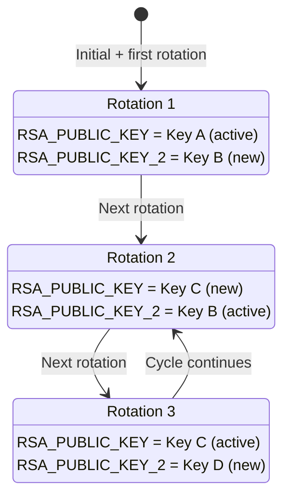
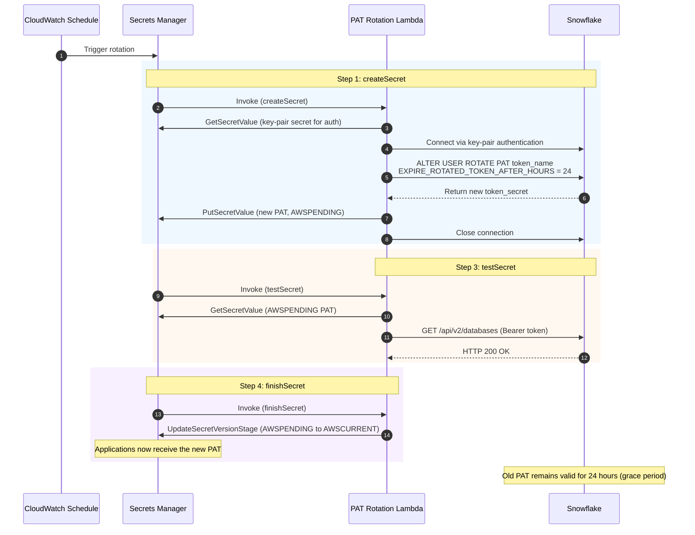
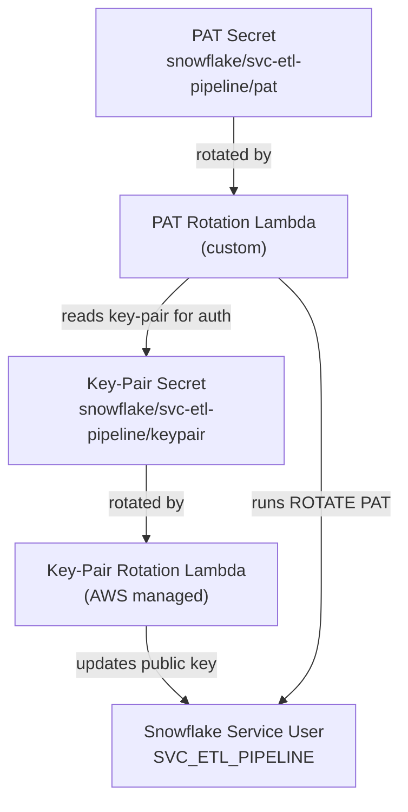

# Architecture Diagrams

## Overview: Two Rotation Patterns

---

## Pattern 1: Key-Pair Rotation (Native Secrets Manager)

The AWS-managed rotation Lambda handles the full lifecycle. Snowflake's dual public key slots
(`RSA_PUBLIC_KEY` and `RSA_PUBLIC_KEY_2`) enable zero-downtime rotation.

### Dual Key Slot Rotation Cycle

On each rotation, the Lambda alternates which public key slot it updates:

---

## Pattern 2: PAT Rotation (Custom Lambda)

The custom Lambda authenticates to Snowflake via key-pair (from Pattern 1) because
PAT rotation cannot be performed from a PAT-authenticated session.

### PAT Rotation Token Lifecycle

```mermaid
gantt
    title PAT Token Lifecycle During Rotation
    dateFormat HH:mm
    axisFormat %H:%M

    section OldToken
        Active (AWSCURRENT)       :active, old, 00:00, 24h
        Grace period              :crit, grace, after old, 24h

    section NewToken
        Pending (AWSPENDING)      :pending, 00:00, 1h
        Active (AWSCURRENT)       :active, new, after pending, 47h
```

---

## Secret Dependencies

Pattern 2 depends on Pattern 1 for its authentication pathway:

> **Important:** Schedule key-pair rotation and PAT rotation at different times to avoid
> a window where the PAT Lambda attempts to use a key pair that is mid-rotation.
> A safe pattern: key-pair rotates on the 1st, PAT rotates on the 15th.
