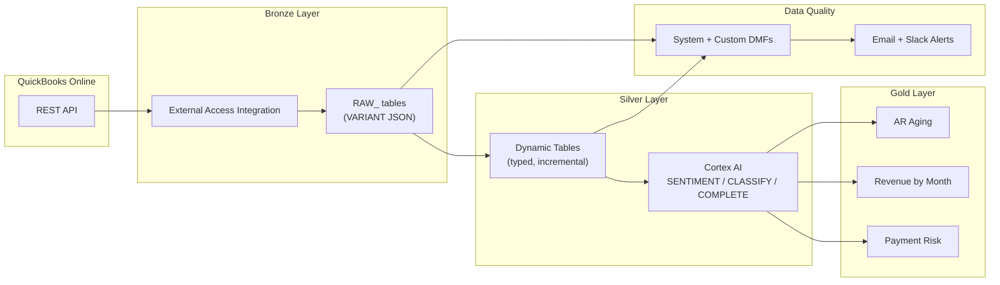

# QuickBooks API Medallion Architecture

Inspired by a real customer question: *"Can I pull data from QuickBooks into Snowflake without an external ETL tool -- and enrich it with AI along the way?"*

This demo answers that question with a full medallion pipeline -- Bronze raw JSON, Silver typed tables with Cortex AI enrichment, Gold analytics views -- plus Data Metric Functions for continuous quality monitoring. Runs with synthetic sample data (no QBO credentials required) or with a live QuickBooks Online connection.

**Author:** SE Community
**Last Updated:** 2026-03-02 | **Expires:** 2026-05-01 | **Status:** ACTIVE

> **No support provided.** This code is for reference only. Review, test, and modify before any production use.
> This demo expires on 2026-05-01. After expiration, validate against current Snowflake docs before use.

---

## The Problem

A growing business runs on QuickBooks Online for invoicing, payments, and vendor management. Their data team needs that accounting data in Snowflake for analytics -- AR aging, revenue trends, vendor spend -- but they don't want to pay for another ETL tool or maintain a custom connector.

They also want AI-powered enrichment: sentiment analysis on invoice notes, customer risk classification, and anomaly detection. And they need quality monitoring so they know when the data breaks.

How do you build all of that with only Snowflake-native features?

---

## The Progression

### 1. Bronze -- External Access Integration for API ingestion

A Python stored procedure calls the QuickBooks Online API directly from Snowflake via an External Access Integration. Raw JSON responses land in VARIANT columns with metadata (fetch timestamp, pagination cursors, CDC markers).

```sql
CREATE OR REPLACE EXTERNAL ACCESS INTEGRATION qbo_api_access
    ALLOWED_NETWORK_RULES = (qbo_api_rule)
    ALLOWED_AUTHENTICATION_SECRETS = (qbo_oauth_secret)
    ENABLED = TRUE;
```

> [!TIP]
> **Pattern demonstrated:** External Access Integration + Python stored procedure for REST API ingestion -- the Snowflake-native alternative to external ETL tools.

### 2. Silver -- Dynamic Tables with Cortex AI enrichment

Dynamic Tables extract typed columns from raw JSON and add AI enrichment in a single declarative layer. `AI_SENTIMENT` scores invoice notes, `AI_COMPLETE` generates structured analysis, `AI_CLASSIFY` categorizes customers -- all refreshed automatically via `TARGET_LAG`.

```sql
CREATE DYNAMIC TABLE DT_ENRICHED_INVOICES
    TARGET_LAG = '1 hour'
    WAREHOUSE = SFE_QB_API_WH
AS
SELECT
    raw:Id::STRING AS invoice_id,
    AI_SENTIMENT(raw:CustomerMemo:value::STRING) AS memo_sentiment,
    AI_CLASSIFY(raw:Line[0]:Description::STRING, ['Product', 'Service', 'Expense']) AS line_type
FROM RAW_INVOICES;
```

> [!TIP]
> **Pattern demonstrated:** Cortex AI functions inside Dynamic Tables -- enrichment that refreshes automatically with your data pipeline.

### 3. Gold -- Analytics views with AI insights

Pre-computed views for AR aging, revenue by month, vendor spend, customer lifetime value, and AI-powered customer classification and payment risk scoring.

> [!TIP]
> **Pattern demonstrated:** Medallion Gold layer combining traditional aggregations with Cortex AI classification for AI-enriched analytics.

### 4. Data Quality -- DMFs with expectations and anomaly detection

System and custom Data Metric Functions monitor every layer. Expectations define thresholds. Anomaly detection flags week-over-week spikes. Email and Slack notifications alert on failures.

> [!TIP]
> **Pattern demonstrated:** Data Metric Functions with `SYSTEM$DATA_METRIC_SCAN` for continuous, serverless quality monitoring across a medallion pipeline.

---

## Architecture



---

## Explore the Results

After deployment, explore the pipeline at each layer:

- **Bronze** -- Query `RAW_INVOICES`, `RAW_CUSTOMERS`, `RAW_PAYMENTS` to see raw JSON
- **Silver** -- Query `DT_COMPLETIONS`, enriched dynamic tables with AI columns
- **Gold** -- Query `AR_AGING`, `REVENUE_BY_MONTH`, `ENRICHED_INVOICE_NOTES` for analytics
- **Data Quality** -- Query `DQ_EXPECTATION_SUMMARY` or check the Snowsight Data Quality tab
- **Streamlit** -- Upload the Streamlit app for interactive exploration

---

<details>
<summary><strong>Deploy (2 paths, ~5 minutes)</strong></summary>

> [!IMPORTANT]
> Requires **Enterprise** edition, `SYSADMIN` + `ACCOUNTADMIN` role access, and Cortex AI enabled in your region.

**Path A -- Sample data (no credentials needed):**

Copy [`deploy_all.sql`](deploy_all.sql) into a Snowsight worksheet and click **Run All**. Includes synthetic data with intentional quality issues so DMFs light up immediately.

**Path B -- Live QuickBooks API:**

See [docs/02-API-SETUP.md](docs/02-API-SETUP.md) for OAuth 2.0 setup, then deploy.

### What Gets Created

| Object Type | Name | Purpose |
|---|---|---|
| Schema | `SNOWFLAKE_EXAMPLE.QB_API` | Demo schema |
| Warehouse | `SFE_QB_API_WH` | Demo compute |
| Bronze Tables | `RAW_INVOICES`, `RAW_CUSTOMERS`, `RAW_PAYMENTS` | Raw JSON from QBO |
| Silver Dynamic Tables | `DT_*` | Typed + enriched |
| Gold Views | `AR_AGING`, `REVENUE_BY_MONTH`, `VENDOR_SPEND` | Analytics |
| DMFs | System + Custom | Quality monitoring |

### Sample Data Quality Issues

The sample data intentionally includes issues so DMFs fire:

| Issue | Invoice | DMF That Catches It |
|-------|---------|-------------------|
| NULL customer_id | INV-007 | `NULL_COUNT` |
| Duplicate invoice ID | INV-003 (twice) | `DUPLICATE_COUNT` |
| Negative amount | INV-008 (-$500) | `DMF_POSITIVE_AMOUNT` |
| Due date before txn date | INV-009 | `DMF_DATE_SEQUENCE` |
| Orphan customer reference | INV-010 (customer 99) | `DMF_FK_CHECK` |

### Estimated Costs

| Component | Size | Est. Credits/Hour |
|---|---|---|
| Warehouse | X-SMALL | 1 |
| Dynamic Table refresh | X-SMALL | <0.1 |
| Cortex AI enrichment | Per-row | ~0.01/row |
| DMFs (serverless) | Serverless | <0.1 |
| **Total** | | **<2 credits** for full deployment + 1 hour of exploration |

</details>

<details>
<summary><strong>Troubleshooting</strong></summary>

| Symptom | Fix |
|---------|-----|
| DMFs not firing | DMFs are serverless -- ensure `DATA_METRIC_SCHEDULE` is set on the table. |
| Dynamic tables stuck in FAILED | Check `SELECT * FROM TABLE(INFORMATION_SCHEMA.DYNAMIC_TABLE_REFRESH_HISTORY())` for errors. |
| Cortex functions unavailable | Verify your region supports Cortex AI. See [Cortex availability](https://docs.snowflake.com/en/user-guide/snowflake-cortex/llm-functions#availability). |

</details>

## Cleanup

Run [`teardown_all.sql`](teardown_all.sql) in Snowsight to remove all demo objects.

<details>
<summary><strong>Development Tools</strong></summary>

This project is designed for AI-pair development.

- **AGENTS.md** -- Project instructions for Cortex Code and compatible AI tools
- **.claude/skills/** -- Project-specific AI skills (Cursor + Claude Code)
- **Cortex Code in Snowsight** -- Open this project in a Workspace for AI-assisted development
- **Cursor** -- Open locally with Cursor for AI-pair coding

> New to AI-pair development? See [Cortex Code docs](https://docs.snowflake.com/en/user-guide/cortex-code/cortex-code)

</details>

## Documentation

- [Getting Started](docs/01-GETTING-STARTED.md)
- [API Setup (OAuth 2.0)](docs/02-API-SETUP.md)
- [Architecture Guide](docs/03-ARCHITECTURE.md)
