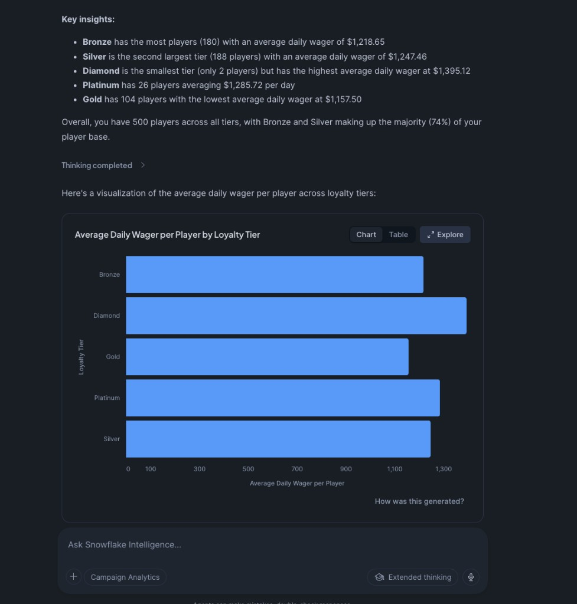
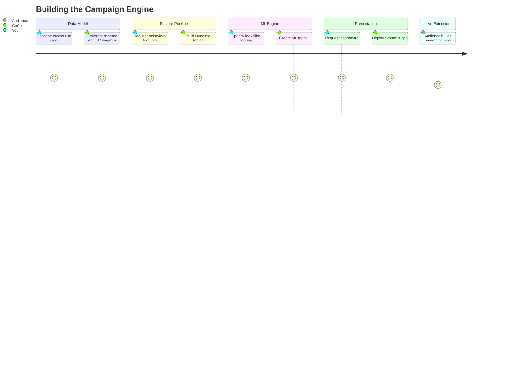

# Casino Campaign Recommendation Engine

> [!CAUTION]
> DEMONSTRATION PROJECT - EXPIRES: 2026-05-01
> This demo uses Snowflake features current as of March 2026.
> After expiration, a warning banner will be added to this README and deploy_all.sql.
> **No support provided.** This code is for reference only. Review, test, and modify before any production use.

**Built in ~2 hours with AI-pair programming.**

A production-grade campaign recommendation engine for casino operators -- audience targeting via ML classification and player lookalike matching via vector similarity -- built entirely through AI-pair development.

**Pair-programmed by:** SE Community + Cortex Code
**Last Updated:** 2026-03-02 | **Expires:** 2026-05-01 | **Status:** ACTIVE


## Quick Start

**Deploy in Snowsight (no clone needed):**
Copy [`deploy_all.sql`](deploy_all.sql) into a Snowsight worksheet and click **Run All**.

**Develop with Cortex Code:**
```bash
bash <(curl -sL https://raw.githubusercontent.com/sfc-gh-miwhitaker/sfe-public/main/shared/get-project.sh) demo-campaign-engine
cd sfe-public/demo-campaign-engine && cortex
```

### Complexity Card

| Metric | Manual Estimate | AI-Pair Actual |
|---|---|---|
| Development time | ~40 hours | ~2 hours |
| Lines of code | ~1,200 | ~1,200 |
| Snowflake features | 9 | 9 |
| Documentation | Written separately | Auto-generated |
| Tests | Written separately | Inline validation |

## What This Creates

| Object Type | Name | Purpose |
|---|---|---|
| Schema | `SNOWFLAKE_EXAMPLE.CAMPAIGN_ENGINE` | Demo schema |
| Warehouse | `SFE_CAMPAIGN_ENGINE_WH` | Demo compute |
| Tables | `PLAYERS`, `CAMPAIGNS`, `RESPONSES`, `CAMPAIGN_SEED_PLAYERS` | Source data |
| Dynamic Tables | `DT_PLAYER_FEATURES` | Feature engineering pipeline |
| Stored Procedure | `SP_FIND_LOOKALIKES` | Vector similarity lookalike finder |
| ML Model | `CLASSIFICATION` on campaign responses | Audience targeting |
| Semantic View | Campaign analytics | Natural language queries |
| Streamlit App | Campaign dashboard | Interactive UI |

## What You Get

1. **Campaign Audience Targeting** -- ML classification scores every player's likelihood of responding to a campaign type, ranked by predicted probability
2. **Player Lookalike Finder** -- Given 10 seed players, finds 10 more with the most similar behavioral patterns using vector cosine similarity
3. **Campaign Copy Generator** -- LLM-powered campaign messaging and channel strategy recommendations
4. **Interactive Dashboard** -- Streamlit app with Campaign Targeting and Player Lookalike tabs
5. **Natural Language Analytics** -- Cortex Intelligence Agent for ad-hoc campaign and player queries



## How It Was Built

This project was built in five acts, each driven by a single natural-language prompt. See [DEMO_SCRIPT.md](DEMO_SCRIPT.md) for the full presenter playbook.



| Act | Prompt | What Was Built |
|---|---|---|
| 1 | "Describe the casino use case..." | Data model (4 tables, ER diagram) |
| 2 | "Create a feature engineering pipeline..." | Dynamic Tables, VECTOR(FLOAT,16) |
| 3 | "Add a lookalike finder and campaign scorer..." | Python proc, ML CLASSIFICATION, Cortex COMPLETE |
| 4 | "Create an interactive dashboard..." | Streamlit app, Semantic View, Intelligence Agent |
| 5 | *(Live with audience)* | Extension built in real-time |

## Development Tools

This project is designed for AI-pair development.

- **AGENTS.md** -- Project instructions for Cortex Code and compatible AI tools
- **.claude/skills/** -- Project-specific AI skills (Cursor + Claude Code)
- **Cortex Code in Snowsight** -- Open this project in a Workspace for AI-assisted development
- **Cursor** -- Open locally with Cursor for AI-pair coding

> [!TIP]
> New to AI-pair development? See [Cortex Code docs](https://docs.snowflake.com/en/user-guide/cortex-code/cortex-code)

## First Time Here?

1. **Deploy** -- Copy `deploy_all.sql` into Snowsight, click "Run All"
2. **Explore** -- Open the Streamlit dashboard from Snowsight > Streamlit
3. **Query** -- Ask the Cortex Intelligence Agent natural-language questions
4. **Cleanup** -- Run `teardown_all.sql` when done

## Build It Yourself

> [!TIP]
> Want to learn AI-pair programming instead of just deploying the finished product? The **[Guided Build](GUIDED_BUILD.md)** walks you through constructing this entire project from scratch -- one prompt at a time, with validation at every step.

You'll learn 7 AI-pair techniques (one per step), evolve AGENTS.md from 3 lines to full project context, and see how each prompting pattern avoids a specific anti-pattern that would break the build. Takes ~90 minutes and produces ~1,200 lines of working code.

| What You'll Learn | Example |
|---|---|
| Describe the problem, not the solution | Business domain -> schema with ML-ready columns |
| Specify constraints, not code | Statistical distributions -> GENERATOR() logic |
| Name the Snowflake feature | "Dynamic Tables with TARGET_LAG" -> auto-refresh pipeline |
| State platform constraints | "Python because VECTOR not in SQL scripting" -> correct proc |
| Evolve AGENTS.md progressively | 3 lines -> 40 lines across 7 steps |

## Snowflake Features Demonstrated

| Feature | Usage |
|---|---|
| VECTOR(FLOAT, 16) data type | Player behavior embeddings |
| VECTOR_COSINE_SIMILARITY | Lookalike matching |
| Dynamic Tables (TARGET_LAG) | Automated feature refresh |
| SNOWFLAKE.ML.CLASSIFICATION | Campaign audience scoring |
| SNOWFLAKE.CORTEX.COMPLETE | Campaign recommendation text |
| Semantic View + Intelligence Agent | Natural language campaign analytics |
| Streamlit in Snowflake | Interactive dashboard |
| Python stored procedures | Lookalike engine logic |
| GENERATOR() + UNIFORM() | Synthetic data generation |

## Estimated Demo Costs

| Component | Size | Est. Credits/Hour |
|---|---|---|
| Warehouse (SFE_CAMPAIGN_ENGINE_WH) | X-SMALL | 1 |
| Dynamic Table refresh | X-SMALL, hourly | <0.1 |
| ML CLASSIFICATION training | One-time | ~0.5 |
| Cortex COMPLETE calls | Per-query | ~0.01/query |
| Streamlit | Per-viewer | Included in warehouse |

**Total estimated cost:** <2 credits for full deployment + 1 hour of exploration.

> [!IMPORTANT]
> **Edition required:** Enterprise (for ML CLASSIFICATION and Dynamic Tables).

## Prompt Catalog

Every SQL and Python file in this project was generated from a natural-language prompt. See the [prompts/](prompts/) directory for the full catalog.

## Troubleshooting

<details>
<summary><strong>Common issues and fixes</strong></summary>

| Symptom | Fix |
|---------|-----|
| ML CLASSIFICATION fails | Ensure Enterprise edition. Classification requires Enterprise or higher. |
| Dynamic table stuck | Check `SELECT * FROM TABLE(INFORMATION_SCHEMA.DYNAMIC_TABLE_REFRESH_HISTORY())` for errors. |
| Streamlit app not visible | Navigate to Snowsight > Streamlit. The app deploys as part of `deploy_all.sql`. |
| Vector similarity returns no results | Verify `DT_PLAYER_FEATURES` has refreshed. Check `SYSTEM$DYNAMIC_TABLE_GRAPH_REFRESH_STATUS()`. |

</details>

## Cleanup

Run `teardown_all.sql` in Snowsight to remove all demo objects.

## Project Structure

```
demo-campaign-engine/
├── deploy_all.sql            -- Single entry point (Run All in Snowsight)
├── teardown_all.sql          -- Complete cleanup
├── sql/                      -- Numbered SQL scripts
│   ├── 01_setup/             -- Schema and warehouse
│   ├── 02_data/              -- Tables and sample data
│   ├── 03_features/          -- Dynamic Tables (feature engineering)
│   ├── 04_engine/            -- ML, vector similarity, LLM
│   ├── 05_cortex/            -- Semantic view and agent
│   ├── 06_streamlit/         -- Dashboard deployment
│   └── 99_cleanup/           -- Teardown scripts
├── streamlit/                -- Streamlit app source
├── assets/                   -- Screenshots and images
├── diagrams/                 -- Architecture diagrams
├── docs/                     -- User guides
└── prompts/                  -- AI prompt catalog
```
