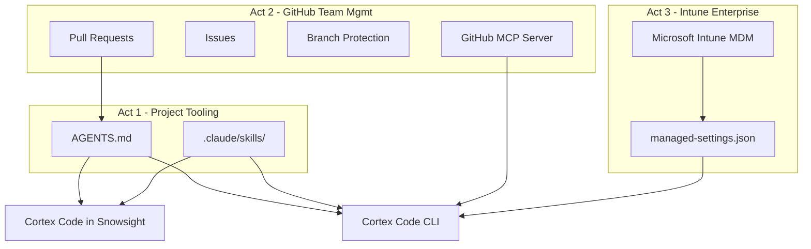

# GitHub-Powered Project Tooling for Cortex Code

Inspired by a real customer question: *"How do I get the same coding standards enforced in Cortex Code on CLI and in Snowsight -- without maintaining two sets of configs?"*

This demo answers that question in three acts: store your `AGENTS.md` and skills in a GitHub repo, and Cortex Code reads them automatically on both surfaces. GitHub's collaboration features become your team management layer. Intune adds the enterprise enforcement wrapper.

**Pair-programmed by:** SE Community + Cortex Code
**Last Updated:** 2026-03-02 | **Expires:** 2026-04-15 | **Status:** ACTIVE

> **No support provided.** This code is for reference only. Review, test, and modify before any production use.
> This demo expires on 2026-04-15. After expiration, validate against current Snowflake docs before use.

---

## The Problem

A data engineering team uses Cortex Code in two places: locally via the CLI (in their cloned repos) and in Snowsight (via Git-connected Workspaces). They want every developer -- and every AI assistant -- to follow the same SQL standards, naming conventions, and security rules regardless of which surface they use.

Without a shared source of truth, standards drift. CLI users customize their local configs. Snowsight users don't get any project context at all. New team members start from scratch.

---

## The Approach

### 1. Project Tooling -- one `AGENTS.md`, both surfaces

Store `AGENTS.md` and `.claude/skills/` in a GitHub repo. Cortex Code reads them automatically -- from your local clone on the CLI, and from a Git-connected Workspace in Snowsight. Same file, same standards, zero duplication.

> [!TIP]
> **Pattern demonstrated:** `AGENTS.md` as the single source of truth for AI coding standards across CLI and Snowsight.

### 2. GitHub Team Management -- PRs, Issues, branch protection

Use GitHub's collaboration features to manage standards evolution: propose changes via PR, review as a team, enforce via branch protection. The GitHub MCP server lets Cortex Code interact with Issues and PRs directly.

> [!TIP]
> **Pattern demonstrated:** GitHub MCP with 1Password or PAT for team-wide standards governance through familiar Git workflows.

### 3. Intune Enterprise -- `managed-settings.json` via MDM

For organizations that need enforcement (not just guidelines), deploy `managed-settings.json` via Microsoft Intune. This locks down MCP server configurations, model selection, and telemetry at the device level.

> [!TIP]
> **Pattern demonstrated:** `managed-settings.json` via MDM for organization-level Cortex Code configuration enforcement.

---

## Architecture



---

## Explore the Results

After deployment, three paths let you experience the demo:

- **Act 1** -- Clone this repo, run `cortex` in the directory, and ask it to write a query. Watch it follow the standards in `AGENTS.md`. Then open the same repo as a Snowsight Workspace and verify identical behavior. See [docs/01-PROJECT-TOOLING.md](docs/01-PROJECT-TOOLING.md).
- **Act 2** -- Set up the GitHub MCP server and use Cortex Code to create Issues, review PRs, and manage standards as a team. See [docs/02-GITHUB-TEAM-MANAGEMENT.md](docs/02-GITHUB-TEAM-MANAGEMENT.md).
- **Act 3** -- Deploy `managed-settings.json` via Intune for org-wide enforcement. See [docs/03-INTUNE-ENTERPRISE.md](docs/03-INTUNE-ENTERPRISE.md).

---

<details>
<summary><strong>Deploy (~5 minutes)</strong></summary>

> [!IMPORTANT]
> Requires `ACCOUNTADMIN` role access for the sample Snowflake objects.

**Step 1 -- Deploy sample objects:**

Copy [`deploy_all.sql`](deploy_all.sql) into a Snowsight worksheet and click **Run All**. Creates a schema with sample tables to test standards against.

**Step 2 -- Try it locally:**

```bash
bash <(curl -sL https://raw.githubusercontent.com/sfc-gh-miwhitaker/sfe-public/main/shared/get-project.sh) demo-coco-governance-github
cd sfe-public/demo-coco-governance-github && cortex
```

The standards in `AGENTS.md` are already active. Try: *"Write a query that finds the top 5 customers by total order amount"*

### What Gets Created

| Object Type | Name | Purpose |
|---|---|---|
| Schema | `SNOWFLAKE_EXAMPLE.COCO_GOVERNANCE_GITHUB` | Demo workspace |
| Warehouse | `SFE_COCO_GOVERNANCE_GITHUB_WH` | Compute for sample queries |
| Tables | `CUSTOMERS`, `ORDERS`, `PRODUCTS` | Sample data to test standards against |

### Reference Configs

| File | Purpose |
|------|---------|
| `reference/mcp-github-1password.json` | GitHub MCP config with 1Password (recommended) |
| `reference/mcp-github-pat.json` | GitHub MCP config with PAT |
| `reference/managed-settings-mcp-enabled.json` | Org-level managed settings template |
| `reference/intune-config.json` | Intune deployment config for managed-settings |

</details>

<details>
<summary><strong>Troubleshooting</strong></summary>

| Symptom | Fix |
|---------|-----|
| Cortex Code doesn't follow standards | Verify `AGENTS.md` is in the project root. Run `cortex` from the project directory. |
| GitHub MCP not connecting | Check PAT permissions (repo, issues, pull_requests). Verify the MCP config path. |
| Snowsight Workspace missing standards | Ensure the Git repo is connected and `AGENTS.md` is in the repo root. |

</details>

## Cleanup

Run [`teardown_all.sql`](teardown_all.sql) in Snowsight to remove all Snowflake objects.

<details>
<summary><strong>Development Tools</strong></summary>

This project is designed for AI-pair development.

- **AGENTS.md** -- Project standards (the primary deliverable of this demo)
- **.claude/skills/** -- SQL review procedure skill
- **Cortex Code in Snowsight** -- Open this project in a Workspace for AI-assisted development
- **Cursor** -- Open locally with Cursor for AI-pair coding

> New to AI-pair development? See [Cortex Code docs](https://docs.snowflake.com/en/user-guide/cortex-code/cortex-code)

</details>

## Documentation

- [Act 1: Project Tooling](docs/01-PROJECT-TOOLING.md)
- [Act 2: GitHub Team Management](docs/02-GITHUB-TEAM-MANAGEMENT.md)
- [Act 3: Intune Enterprise](docs/03-INTUNE-ENTERPRISE.md)
