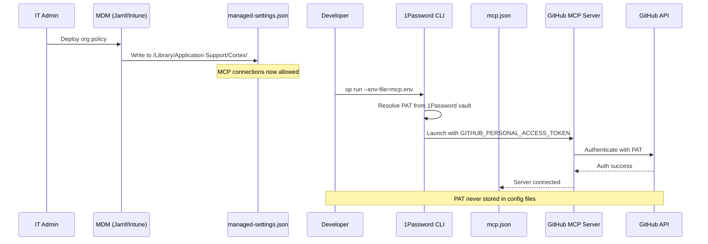

# Auth Flow

```mermaid
sequenceDiagram
    participant IT as IT Admin
    participant MDM as MDM (Jamf/Intune)
    participant MS as managed-settings.json
    participant DEV as Developer
    participant OP as 1Password CLI
    participant MCP as mcp.json
    participant GH as GitHub MCP Server
    participant API as GitHub API

    IT->>MDM: Deploy org policy
    MDM->>MS: Write to /Library/Application Support/Cortex/
    Note over MS: MCP connections now allowed

    DEV->>OP: op run --env-file=mcp.env
    OP->>OP: Resolve PAT from 1Password vault
    OP->>GH: Launch with GITHUB_PERSONAL_ACCESS_TOKEN
    GH->>API: Authenticate with PAT
    API-->>GH: Auth success
    GH-->>MCP: Server connected

    Note over DEV,API: PAT never stored in config files
```
