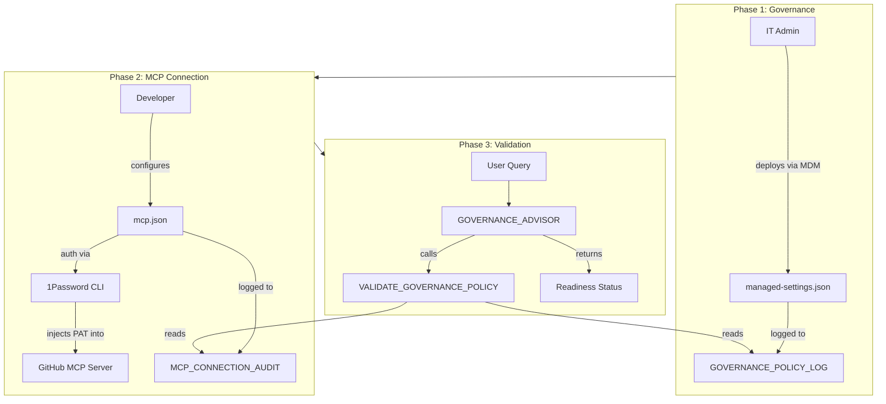

# Data Flow

```mermaid
flowchart TB
    subgraph governance ["Phase 1: Governance"]
        IT["IT Admin"] -->|deploys via MDM| MS["managed-settings.json"]
        MS -->|logged to| GPL["GOVERNANCE_POLICY_LOG"]
    end

    subgraph connection ["Phase 2: MCP Connection"]
        DEV["Developer"] -->|configures| MCP["mcp.json"]
        MCP -->|auth via| OP["1Password CLI"]
        OP -->|injects PAT into| GH["GitHub MCP Server"]
        MCP -->|logged to| MCA["MCP_CONNECTION_AUDIT"]
    end

    subgraph advisor ["Phase 3: Validation"]
        QRY["User Query"] --> AGENT["GOVERNANCE_ADVISOR"]
        AGENT -->|calls| UDF["VALIDATE_GOVERNANCE_POLICY"]
        UDF -->|reads| GPL
        UDF -->|reads| MCA
        AGENT -->|returns| STATUS["Readiness Status"]
    end

    governance --> connection
    connection --> advisor
```
