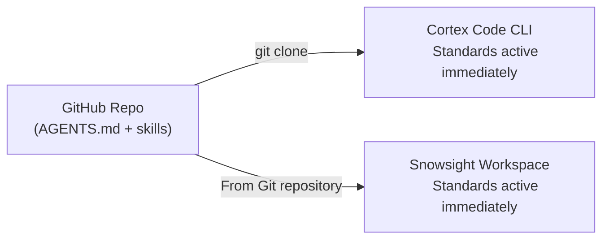
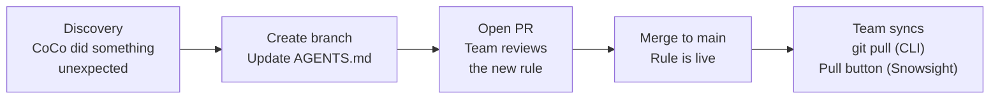
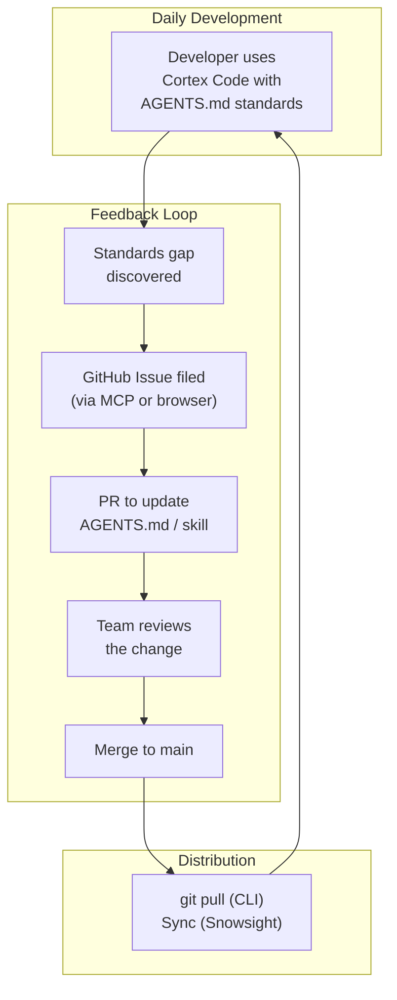

# Act 2: GitHub Team Management

Since your project tooling lives in a GitHub repo, GitHub's collaboration features become the management layer. Five features turn individual standards into a team-wide system.

## 1. Instant Onboarding

Every new team member gets the same standards from day one, on either surface.



**CLI path:** `git clone <repo>` -> `cd` into project -> `cortex`

**Snowsight path:** Projects > Workspaces > Create > From Git repository -> paste URL

No setup scripts. No config files to copy. No "ask your tech lead for the standards doc." Clone or connect, and the standards are live.

## 2. Standards Evolution via Pull Requests

Standards aren't static. When the team learns something new, `AGENTS.md` needs to change. Pull requests make those changes reviewable.



**Example PR: adding a new SQL rule**

Suppose Cortex Code generated a query using `UNION` where `UNION ALL` was appropriate (duplicating a dedup step). The fix:

1. Create a branch: `git checkout -b add-union-all-rule`
2. Add to `AGENTS.md` under SQL Standards:
   ```markdown
   - **Prefer UNION ALL over UNION** unless deduplication is explicitly required.
     UNION sorts and deduplicates, which is expensive and usually unnecessary.
   ```
3. Add a corresponding check in `.claude/skills/.../SKILL.md` under Step 2
4. Open a PR, explain the rationale, link the conversation where the issue occurred
5. Team reviews and merges

After merge, every team member gets the new rule on their next `git pull` or Snowsight workspace sync.

## 3. Gap Tracking via Issues

When Cortex Code does something the standards should have caught, file a GitHub Issue. This creates a backlog of standards improvements.

**Pattern:**
- Title: `[Standards Gap] CoCo used SELECT * despite AGENTS.md rule`
- Body: paste the conversation snippet, link to the rule that should have caught it, propose a fix
- Label: `standards-gap`

**With GitHub MCP** (see section 5 below), you can file issues directly from Cortex Code CLI without leaving your terminal:

```text
File a GitHub issue in our repo:
Title: Standards Gap - CoCo joined on mismatched types
Body: During data exploration, CoCo joined CUSTOMER_ID (NUMBER)
to ACCOUNT_REF (VARCHAR) without a cast warning. The AGENTS.md
rule about join type safety should be strengthened.
```

Over time, the Issues tab becomes a living record of what the team has learned about governing AI behavior.

## 4. Branch Protection

Protect the `main` branch so standards changes require approval before they take effect.

**Recommended settings** (GitHub > Settings > Branches > Branch protection rules):

| Setting | Value | Why |
|---------|-------|-----|
| Require pull request reviews | 1 reviewer | Standards changes affect the whole team |
| Require status checks to pass | Optional | Add CI if you have linting for AGENTS.md |
| Restrict who can push to matching branches | Team leads | Prevent accidental direct pushes |
| Include administrators | Yes | No exceptions for standards changes |

This means no one can push a change to `AGENTS.md` or a skill file directly to `main`. Every change goes through a PR, gets reviewed, and is documented in the Git history.

## 5. GitHub MCP in Cortex Code CLI

The [GitHub MCP server](https://github.com/modelcontextprotocol/servers/tree/main/src/github) connects Cortex Code CLI to GitHub, letting you interact with repos, issues, and PRs without leaving the terminal.

### Setup

Add the GitHub MCP server to `~/.snowflake/cortex/mcp.json`. Two auth patterns:

**Pattern A: 1Password CLI (recommended for teams)**

The token never touches disk. 1Password injects it at runtime.

```json
{
  "mcpServers": {
    "github": {
      "command": "op",
      "args": [
        "run",
        "--env-file=/Users/YOUR_USERNAME/.config/op/mcp.env",
        "--no-masking",
        "--",
        "npx", "-y", "@modelcontextprotocol/server-github"
      ],
      "env": {
        "PATH": "/opt/homebrew/bin:/usr/local/bin:/usr/bin:/bin"
      }
    }
  }
}
```

With `~/.config/op/mcp.env`:
```
GITHUB_PERSONAL_ACCESS_TOKEN=op://Personal/GitHub MCP/token
```

See [reference/mcp-github-1password.json](../reference/mcp-github-1password.json) for the template.

**Pattern B: PAT in environment (simpler for individual use)**

```json
{
  "mcpServers": {
    "github": {
      "command": "npx",
      "args": ["-y", "@modelcontextprotocol/server-github"],
      "env": {
        "GITHUB_PERSONAL_ACCESS_TOKEN": "ghp_YOUR_TOKEN_HERE"
      }
    }
  }
}
```

See [reference/mcp-github-pat.json](../reference/mcp-github-pat.json) for the template.

### Verify

```text
cortex
/mcp
```

The GitHub server should appear as connected.

### Toolset Scoping

The GitHub MCP server supports limiting which tools are available. Fewer tools means better accuracy and smaller context window.

| Profile | Arg | What's available |
|---------|-----|-----------------|
| Read-only | `--toolsets repos` | Repo listing, file reading, branch info |
| Standard | `--toolsets repos,issues` | Repos + issue read/write |
| Full | `--toolsets all` | Everything including PRs, code search, user management |

Add `"--toolsets", "repos,issues"` to the `args` array in your `mcp.json` to scope it.

**Recommendation:** Start with `repos,issues`. This covers the most common team management tasks (reading code, filing issues) without exposing write operations on PRs or code.

### What you can do with GitHub MCP

Once connected, ask Cortex Code to:
- "List open issues labeled standards-gap in our repo"
- "Show the diff for the latest PR that modified AGENTS.md"
- "File an issue about the SELECT * violation I just found"
- "What branches have changes to AGENTS.md?"

This closes the loop: the same tool that follows the standards can also help manage them.

## The Team Management Cycle



No new tools required. No admin console. No separate governance platform. GitHub IS the management layer.

## Next

For teams where opt-in standards aren't enough -- where IT needs to enforce policy across all machines -- there's one more layer.

[Act 3: Intune Enterprise](03-INTUNE-ENTERPRISE.md)
