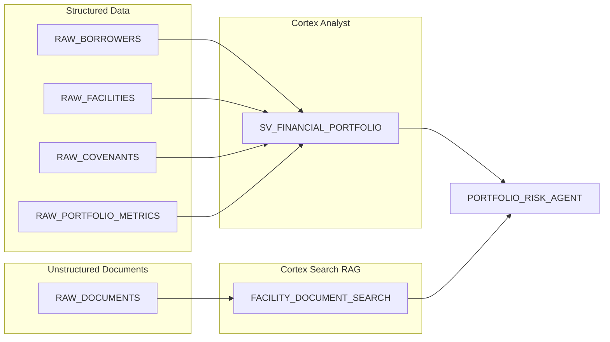

# Cortex Financial Agents

> DEMONSTRATION PROJECT - EXPIRES: 2026-04-09
> This demo uses Snowflake features current as of March 2026.

Conversational agent for specialty finance portfolio risk assessment. Combines structured facility and covenant data (Cortex Analyst) with unstructured credit memos, legal documents, and compliance certificates (Cortex Search) into a single Intelligence agent that eliminates manual cross-referencing across data silos.

**Pair-programmed by:** SE Community + Cortex Code
**Created:** 2026-03-10 | **Expires:** 2026-04-09 | **Status:** ACTIVE

## Brand New to GitHub or Cortex Code?

Start with the [Getting Started Guide](../guide-coco-setup/) -- it walks you through downloading the code and installing Cortex Code (the AI assistant that will help you with everything else).

## First Time Here?

1. **Deploy** - Copy `deploy_all.sql` into Snowsight, click "Run All"
2. **Chat** - Open the `PORTFOLIO_RISK_AGENT` in Snowflake Intelligence and ask questions
3. **Try these questions:**
   - "What is our total exposure to watchlist facilities?"
   - "Which borrowers have leverage ratio covenant breaches?"
   - "What did the credit committee memo say about the Apex Manufacturing deal?"
   - "Summarize the annual review findings for our real estate bridge portfolio"
4. **Cleanup** - Run `teardown_all.sql` when done

## What Gets Built

| Object | Type | Purpose |
|--------|------|---------|
| `SNOWFLAKE_EXAMPLE.FINANCIAL_AGENTS` | Schema | Project schema |
| `SFE_FINANCIAL_AGENTS_WH` | Warehouse | XS compute |
| `RAW_BORROWERS` | Table | Middle-market company profiles (25 synthetic borrowers) |
| `RAW_FACILITIES` | Table | Credit facilities (asset-based, term, equipment, bridge, revolver) |
| `RAW_COVENANTS` | Table | Quarterly covenant test results (leverage, coverage, EBITDA) |
| `RAW_PORTFOLIO_METRICS` | Table | Time-series facility health (DSCR, LTV, days past due) |
| `RAW_DOCUMENTS` | Table | Unstructured credit memos, legal docs, compliance certificates |
| `FACILITY_DOCUMENT_SEARCH` | Cortex Search | RAG over documents with citation support |
| `SV_FINANCIAL_PORTFOLIO` | Semantic View | Structured portfolio analytics for Cortex Analyst |
| `PORTFOLIO_RISK_AGENT` | Agent | Dual-tool conversational agent (Analyst + Search) |

## Architecture

## Estimated Demo Costs

| Component | Size | Est. Credits/Run | Notes |
|-----------|------|-----------------|-------|
| Warehouse | X-SMALL | ~0.3 | Sample data load + queries |
| Cortex Search | — | ~0.5 | Index ~40 documents |
| Cortex Agent | — | ~0.2 | Per conversation turn |
| Storage | — | Minimal | <1 MB synthetic data |
| **Total** | | **~1.0 credits** | Single deployment run |

**Edition Required:** Enterprise (for Cortex Search + Intelligence Agents)

## Troubleshooting

| Symptom | Fix |
|---------|-----|
| Cortex Search unavailable | Verify your region supports Cortex Search. See [availability docs](https://docs.snowflake.com/en/user-guide/snowflake-cortex/cortex-search/cortex-search-overview). |
| Agent not visible | Ensure the semantic view `SV_FINANCIAL_PORTFOLIO` exists in `SEMANTIC_MODELS` schema. |
| Agent can't answer structured questions | Verify `SV_FINANCIAL_PORTFOLIO` has correct table references and the warehouse is running. |
| Agent can't find documents | Check that `FACILITY_DOCUMENT_SEARCH` service is active: `SHOW CORTEX SEARCH SERVICES`. |

## Cleanup

Run `teardown_all.sql` in Snowsight to remove all demo objects.

## Development Tools

This project is designed for AI-pair development.

- **AGENTS.md** -- Project instructions for Cortex Code and compatible AI tools
- **.claude/skills/** -- Project-specific AI skills (Cursor + Claude Code)
- **Cortex Code in Snowsight** -- Open this project in a Workspace for AI-assisted development
- **Cursor** -- Open locally with Cursor for AI-pair coding

> New to AI-pair development? See [Cortex Code docs](https://docs.snowflake.com/en/user-guide/cortex-code/cortex-code)
