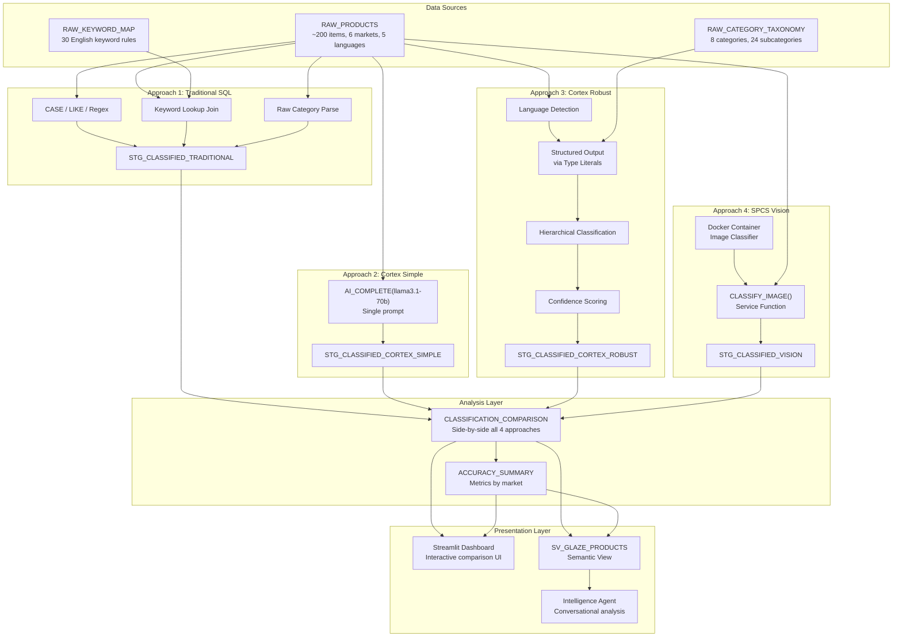

# Data Flow — Glaze & Classify

```mermaid
flowchart TB
    subgraph sources [Data Sources]
        Products[RAW_PRODUCTS<br/>~200 items, 6 markets, 5 languages]
        Taxonomy[RAW_CATEGORY_TAXONOMY<br/>8 categories, 24 subcategories]
        Keywords[RAW_KEYWORD_MAP<br/>30 English keyword rules]
    end

    subgraph approach1 [Approach 1: Traditional SQL]
        CaseLike[CASE / LIKE / Regex]
        KeywordJoin[Keyword Lookup Join]
        RawParse[Raw Category Parse]
        CaseLike --> TradResult[STG_CLASSIFIED_TRADITIONAL]
        KeywordJoin --> TradResult
        RawParse --> TradResult
    end

    subgraph approach2 [Approach 2: Cortex Simple]
        SingleCall["AI_COMPLETE(llama3.1-70b)<br/>Single prompt"]
        SingleCall --> SimpleResult[STG_CLASSIFIED_CORTEX_SIMPLE]
    end

    subgraph approach3 [Approach 3: Cortex Robust]
        LangDetect[Language Detection]
        StructOutput[Structured Output<br/>via Type Literals]
        HierClass[Hierarchical Classification]
        Confidence[Confidence Scoring]
        LangDetect --> StructOutput --> HierClass --> Confidence
        Confidence --> RobustResult[STG_CLASSIFIED_CORTEX_ROBUST]
    end

    subgraph approach4 [Approach 4: SPCS Vision]
        Container[Docker Container<br/>Image Classifier]
        ServiceFn["CLASSIFY_IMAGE()<br/>Service Function"]
        Container --> ServiceFn
        ServiceFn --> VisionResult[STG_CLASSIFIED_VISION]
    end

    Products --> CaseLike
    Products --> KeywordJoin
    Products --> RawParse
    Keywords --> KeywordJoin
    Products --> SingleCall
    Products --> LangDetect
    Taxonomy --> StructOutput
    Products --> ServiceFn

    subgraph analysis [Analysis Layer]
        CompView[CLASSIFICATION_COMPARISON<br/>Side-by-side all 4 approaches]
        AccView[ACCURACY_SUMMARY<br/>Metrics by market]
    end

    TradResult --> CompView
    SimpleResult --> CompView
    RobustResult --> CompView
    VisionResult --> CompView
    CompView --> AccView

    subgraph presentation [Presentation Layer]
        Dashboard[Streamlit Dashboard<br/>Interactive comparison UI]
        Agent[Intelligence Agent<br/>Conversational analysis]
        SemView[SV_GLAZE_PRODUCTS<br/>Semantic View]
    end

    CompView --> Dashboard
    AccView --> Dashboard
    CompView --> SemView
    AccView --> SemView
    SemView --> Agent
```
