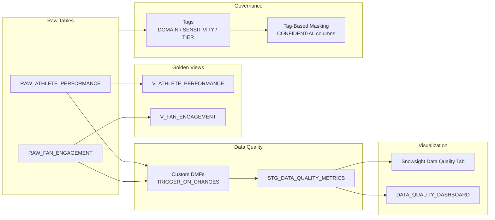

# Data Quality Metrics & Reporting

Inspired by a real customer question: *"How do I know when bad data lands in my tables -- and automatically filter it out of downstream analytics?"*

This demo answers that question with Data Metric Functions that fire on every data change, golden dataset views that automatically exclude invalid records, object tagging for governance classification, and tag-based masking policies that enforce column-level security. Insert bad data, watch the metrics update, see the golden views stay clean.

**Author:** SE Community
**Last Updated:** 2026-03-02 | **Expires:** 2026-05-01 | **Status:** ACTIVE

> **No support provided.** This code is for reference only. Review, test, and modify before any production use.
> This demo expires on 2026-05-01. After expiration, validate against current Snowflake docs before use.

---

## The Problem

A sports analytics platform ingests athlete performance metrics and fan engagement events from multiple sources. Raw data frequently arrives with NULLs in required fields, out-of-range values (negative percentages, impossible session durations), and sensitivity levels that vary by column.

The data team needs three things:

1. **Automatic detection** -- Know within minutes when bad data lands, without writing custom monitoring jobs
2. **Clean analytics** -- Downstream views that only contain valid records, without manual filtering in every query
3. **Governance** -- Classify every table and column by domain, sensitivity, and quality tier -- and enforce masking on confidential columns automatically

---

## The Progression

### 1. Data Metric Functions -- event-driven quality checks

Custom DMFs validate metric ranges and session durations. The `TRIGGER_ON_CHANGES` schedule means DMFs fire automatically when data changes -- no cron job, no polling.

```sql
CREATE DATA METRIC FUNCTION DMF_METRIC_VALUE_VALID_PCT(ref TABLE(metric_value FLOAT))
    RETURNS NUMBER AS
    'SELECT ROUND(100.0 * COUNT_IF(metric_value BETWEEN 0 AND 100) / NULLIF(COUNT(*), 0), 2)
     FROM TABLE(ref)';
```

> [!TIP]
> **Pattern demonstrated:** Custom DMFs with `TRIGGER_ON_CHANGES` -- serverless, event-driven data quality monitoring that fires on every INSERT.

### 2. Golden dataset views -- automatic quality filtering

Views wrap raw tables with quality predicates. Downstream consumers query `V_ATHLETE_PERFORMANCE` instead of `RAW_ATHLETE_PERFORMANCE` and only see valid records.

> [!TIP]
> **Pattern demonstrated:** Golden dataset views over raw tables -- the pattern for separating data quality enforcement from data consumption.

### 3. Object tagging -- governance classification

Three tags with `ALLOWED_VALUES` classify every table and column: `DATA_DOMAIN` (Performance, Engagement, Quality Metrics), `DATA_SENSITIVITY` (Public, Internal, Confidential), `DATA_QUALITY_TIER` (Raw, Validated, Curated).

> [!TIP]
> **Pattern demonstrated:** Object tags with `ALLOWED_VALUES` for governance classification -- enforceable metadata across tables and columns.

### 4. Tag-based masking -- automatic column protection

A masking policy attached to the `DATA_SENSITIVITY` tag automatically masks any column tagged as `CONFIDENTIAL` for non-admin roles. Tag a column, and masking follows.

> [!TIP]
> **Pattern demonstrated:** Tag-based masking policy -- attach once to a tag, and every column with that tag gets masked automatically.

---

## Architecture



---

## Explore the Results

After deployment (and ~10 minutes for `TRIGGER_ON_CHANGES` to activate):

- **Snowsight Data Quality Tab** -- Navigate to Catalog > select any table > **Data Quality** tab to see DMF results, trends, and drill-down to failing records. No Streamlit required.
- **Streamlit Dashboard** -- Alternative custom view via `DATA_QUALITY_DASHBOARD` in **Projects > Streamlit**.
- **Live Demo** -- Insert bad data with `tools/insert_sample_data.sql`, refresh the Data Quality tab, and watch metrics update.
- **Governance** -- Query `TAG_REFERENCES` to see all tag assignments. Query a CONFIDENTIAL column as a non-admin role to see masking in action.

---

<details>
<summary><strong>Deploy (2 steps, ~5 minutes + 10 min wait)</strong></summary>

> [!IMPORTANT]
> Requires **Enterprise** edition (for Streams, Tasks, DMFs, Streamlit), `SYSADMIN` + `ACCOUNTADMIN` role access.

**Step 1 -- Deploy:**

Copy [`deploy_all.sql`](deploy_all.sql) into a Snowsight worksheet and click **Run All**.

**Step 2 -- Wait ~10 minutes:**

The `TRIGGER_ON_CHANGES` schedule takes ~10 minutes to activate after deployment. After that, any INSERT triggers DMFs immediately.

### What Gets Created

| Object Type | Name | Purpose |
|---|---|---|
| Schema | `SNOWFLAKE_EXAMPLE.DATA_QUALITY` | Demo schema |
| Warehouse | `SFE_DATA_QUALITY_WH` | XSMALL, auto-suspend 60s |
| Tables (TRANSIENT) | `RAW_ATHLETE_PERFORMANCE`, `RAW_FAN_ENGAGEMENT`, `STG_DATA_QUALITY_METRICS` | Source + metrics |
| DMFs | `DMF_METRIC_VALUE_VALID_PCT`, `DMF_SESSION_DURATION_VALID_PCT` | Quality rules |
| Views | `V_ATHLETE_PERFORMANCE`, `V_FAN_ENGAGEMENT`, `V_DATA_QUALITY_METRICS`, `V_QUALITY_SCORE_TREND` | Golden + reporting |
| Tags | `DATA_DOMAIN`, `DATA_SENSITIVITY`, `DATA_QUALITY_TIER` | Governance classification |
| Masking Policy | `CONFIDENTIAL_STRING_MASK` | Tag-based column masking |
| Streamlit App | `DATA_QUALITY_DASHBOARD` | Interactive monitoring |

### Estimated Costs

| Component | Size | Notes |
|---|---|---|
| Warehouse | XSMALL (1 credit/hour) | ~1 hour demo usage |
| DMFs | Serverless | Minimal for demo volume |
| Storage | Negligible | TRANSIENT tables, <1 GB |
| **Total** | | **~1 credit** for deployment + 1 hour of exploration |

</details>

<details>
<summary><strong>Troubleshooting</strong></summary>

| Symptom | Fix |
|---------|-----|
| DMFs not triggering | `TRIGGER_ON_CHANGES` schedule takes ~10 min to activate after deployment. Wait, then INSERT new data. |
| Task not running | Check `SHOW TASKS LIKE 'refresh_data_quality%'` and ensure the task is RESUMED. |
| Streamlit app not visible | Navigate to Snowsight > Streamlit. Verify the Git repository stage is accessible. |
| Data Quality tab empty in Catalog | DMFs must have run at least once. Insert sample data and wait for the schedule. |

</details>

## Cleanup

Run [`sql/99_cleanup/teardown_all.sql`](sql/99_cleanup/teardown_all.sql) in Snowsight to remove all demo objects.

<details>
<summary><strong>Development Tools</strong></summary>

This project is designed for AI-pair development.

- **AGENTS.md** -- Project instructions for Cortex Code and compatible AI tools
- **.claude/skills/** -- Project-specific AI skills (Cursor + Claude Code)
- **Cortex Code in Snowsight** -- Open this project in a Workspace for AI-assisted development
- **Cursor** -- Open locally with Cursor for AI-pair coding

> New to AI-pair development? See [Cortex Code docs](https://docs.snowflake.com/en/user-guide/cortex-code/cortex-code)

</details>
