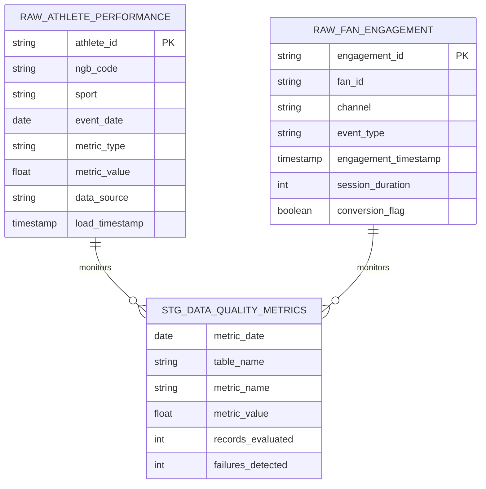

# Data Model - Data Quality Metrics & Reporting Demo

Author: SE Community
Last Updated: 2026-01-15
Status: Reference Implementation

**Reference Implementation:** This code demonstrates production-grade architectural patterns and best practices. Review and customize security, networking, and logic for your organization's specific requirements before deployment.

## Overview

This diagram shows the core data tables used for data quality monitoring, including raw data sources and the metrics table that records validation outcomes.

## Diagram

## Component Descriptions

- RAW_ATHLETE_PERFORMANCE: Raw performance metrics collected from partner systems and uploads.
- RAW_FAN_ENGAGEMENT: Raw engagement events captured from digital channels.
- STG_DATA_QUALITY_METRICS: Daily metric results produced by data quality checks.

## Change History

See `.cursor/DIAGRAM_CHANGELOG.md` for version history.
