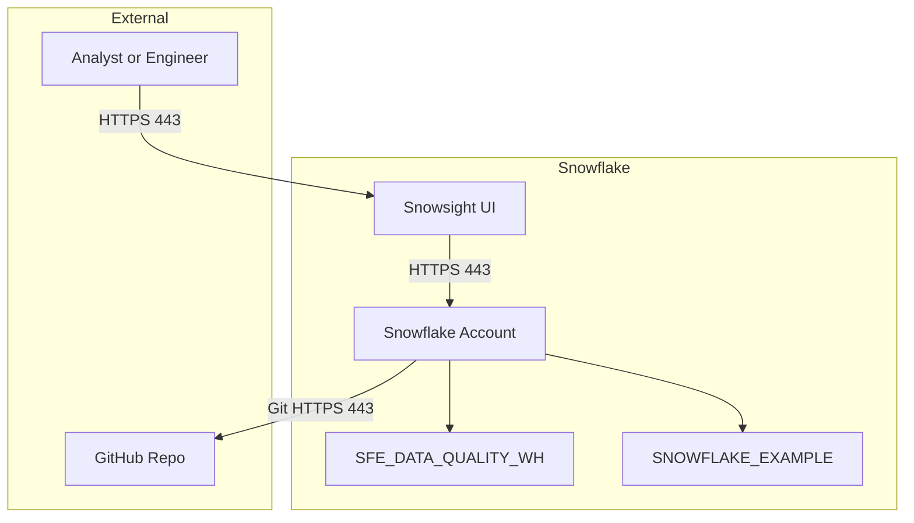

# Network Flow - Data Quality Metrics & Reporting Demo

Author: SE Community
Last Updated: 2026-01-15
Status: Reference Implementation

**Reference Implementation:** This code demonstrates production-grade architectural patterns and best practices. Review and customize security, networking, and logic for your organization's specific requirements before deployment.

## Overview

This diagram shows the network boundaries between users, Snowflake services, and the GitHub repository used for native deployment.

## Diagram

## Component Descriptions

- Snowsight UI: Browser-based interface used to run deployment and view Streamlit.
- Snowflake Account: Hosts all database objects, streams, tasks, and Streamlit apps.
- GitHub Repo: Source of SQL scripts and Streamlit code accessed via Git integration.

## Change History

See `.cursor/DIAGRAM_CHANGELOG.md` for version history.
