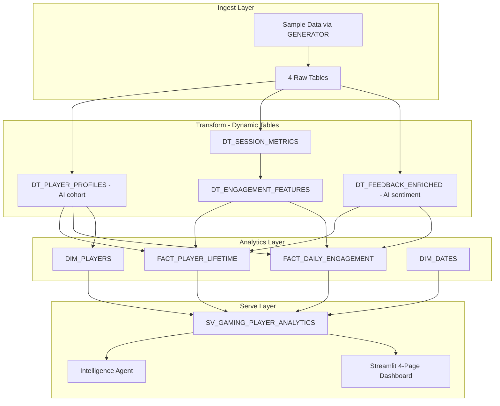

# Gaming Player Analytics

Inspired by a real customer question: *"We're already running our data pipeline on Snowflake -- how do we get player analytics and AI on top of it without adding another platform?"*

This demo answers that question by building a player intelligence layer on top of an existing Dynamic Table pipeline: AI-powered player segmentation, feedback analysis, churn risk scoring, and self-service analytics -- all inside Snowflake, using data that's already flowing through the pipeline.

**Pair-programmed by:** SE Community + Cortex Code
**Created:** 2026-03-25 | **Expires:** 2026-04-24 | **Status:** ACTIVE

> **No support provided.** This code is for reference only. Review, test, and modify before any production use.
> This demo expires on 2026-04-24. After expiration, validate against current Snowflake docs before use.

---

## The Problem

Gaming studios collect massive volumes of player telemetry -- sessions, purchases, feedback, progression events -- and most have a solid pipeline moving that data into a warehouse. But the analytics layer on top often lags behind:

- **Player segmentation is manual** -- Product managers maintain spreadsheets of "whale" and "at-risk" lists instead of classifying players automatically from behavioral data
- **Feedback is unstructured** -- App store reviews, support tickets, and survey responses pile up in free-text columns with no way to surface trends at scale
- **Every question requires engineering** -- When the game team wants to know "which cohort is churning fastest?", someone has to write SQL and send back a screenshot
- **AI stays on the roadmap** -- Teams want ML-powered insights but the overhead of standing up a separate platform keeps it in "next quarter" territory

The data is already flowing. This demo shows what happens when you add AI enrichment and self-service analytics directly inside the pipeline that's already running.

---

## The Progression

### 1. The Pipeline They Already Have

Player events flow in via COPY ingestion. Dynamic Tables transform raw events into player profiles, session metrics, and engagement features. This mirrors the studio's existing production workload.

```sql
CREATE DYNAMIC TABLE DT_SESSION_METRICS
  TARGET_LAG = '1 hour'
  WAREHOUSE = SFE_GAMING_PLAYER_ANALYTICS_WH
AS SELECT player_id, event_date, session_count, total_playtime_minutes, ...
```

> [!TIP]
> **Pattern demonstrated:** Dynamic Tables with `TARGET_LAG` for automated transformation -- the existing pipeline that the customer is already running.

### 2. AI Enrichment Inside the Pipeline

Cortex AI functions run *inside* the Dynamic Tables, not as a separate step. `AI_CLASSIFY` segments players into behavioral cohorts (Whale, Casual, Churning, New). `AI_EXTRACT` pulls structured metadata from free-text player feedback. A second `AI_CLASSIFY` scores sentiment.

```sql
AI_CLASSIFY(
    player_description,
    ['Whale', 'Casual', 'Churning', 'New'],
    {'task_description': 'Classify this player based on spending and engagement behavior'}
):labels[0]::VARCHAR AS ai_player_cohort
```

> [!TIP]
> **Pattern demonstrated:** `AI_CLASSIFY` + `AI_EXTRACT` inside Dynamic Tables -- AI enrichment runs during transformation, amortized across all downstream consumers.

### 3. Self-Service Analytics

A Streamlit dashboard gives the game team what they've been asking for: player cohort explorer, engagement trends, churn risk indicators, and session analysis. No BI tool, no data export, no waiting for engineering.

> [!TIP]
> **Pattern demonstrated:** Streamlit in Snowflake with Git integration -- multi-page dashboard deployed via `CREATE STREAMLIT FROM` a Git repository stage.

### 4. Ask Questions in English

An Intelligence Agent backed by a semantic view lets anyone ask player behavior questions in plain English:

- *"Which player cohort has the highest churn risk?"*
- *"What's the average session length trend for whales?"*
- *"Show me the top 10 players by lifetime spend who haven't played in 30 days"*

> [!TIP]
> **Pattern demonstrated:** Semantic View + `CREATE AGENT` -- a semantic model over the analytics tables powers natural-language queries via Cortex Analyst.

---

## Architecture



---

## Explore the Results

After deployment, two interfaces let you explore the data:

- **Streamlit Dashboard** -- Player cohorts, engagement trends, churn risk, and feedback analysis. Navigate to **Projects > Streamlit** in Snowsight.
- **Intelligence Agent** -- Ask player behavior questions in plain English. Navigate to **AI & ML > Snowflake Intelligence** in Snowsight.

---

<details>
<summary><strong>Deploy (2 steps, ~10 minutes)</strong></summary>

> [!IMPORTANT]
> Requires **Enterprise** edition (for Cortex AI), `SYSADMIN` + `ACCOUNTADMIN` role access, and Cortex AI enabled in your region.

**Step 1 -- Deploy in Snowsight:**

Copy [`deploy_all.sql`](deploy_all.sql) into a Snowsight worksheet and click **Run All**.

**Step 2 -- Open the dashboard:**

Navigate to **Projects > Streamlit > GAMING_PLAYER_ANALYTICS_APP** in Snowsight.

### Estimated Costs

| Component | Size | Est. Credits | Notes |
|-----------|------|-------------|-------|
| Warehouse | X-SMALL | ~0.5 | Sample data load + Dynamic Tables |
| Cortex AI | -- | ~1.5 | AI_CLASSIFY (cohorts + sentiment) + AI_EXTRACT on 500 feedback entries |
| Dynamic Tables | -- | ~0.5 | 4 DTs with 1-hour refresh |
| Storage | -- | Minimal | <10 MB sample data |
| **Total** | | **~2.5 credits** | Single deployment run |

</details>

<details>
<summary><strong>Troubleshooting</strong></summary>

| Symptom | Fix |
|---------|-----|
| AI_CLASSIFY unavailable | Verify your region supports Cortex AI. See [Cortex availability](https://docs.snowflake.com/en/user-guide/snowflake-cortex/llm-functions#availability). |
| Dynamic Tables not refreshing | Check `SHOW DYNAMIC TABLES` -- verify warehouse is running and TARGET_LAG is set. |
| Intelligence agent errors | Verify `SV_GAMING_PLAYER_ANALYTICS` exists in `SEMANTIC_MODELS` schema and warehouse is running. |
| Streamlit app blank | Ensure `GAMING_PLAYER_ANALYTICS` schema exists and tables have data. Rerun data load if needed. |
| DT_ENGAGEMENT_FEATURES empty | This table uses `TARGET_LAG = DOWNSTREAM`. Verify downstream FACT tables exist and have refreshed. |

</details>

## Cleanup

Run [`teardown_all.sql`](teardown_all.sql) in Snowsight to remove all demo objects.

<details>
<summary><strong>Development Tools</strong></summary>

This project is designed for AI-pair development.

- **AGENTS.md** -- Project instructions for Cortex Code and compatible AI tools
- **.claude/skills/** -- Project-specific AI skill (Cursor + Claude Code)
- **Cortex Code in Snowsight** -- Open this project in a Workspace for AI-assisted development
- **Cursor** -- Open locally with Cursor for AI-pair coding

> New to AI-pair development? See [Cortex Code docs](https://docs.snowflake.com/en/user-guide/cortex-code/cortex-code)

</details>

## Documentation

- [Deployment Guide](docs/01-DEPLOYMENT.md)
- [Usage Guide](docs/02-USAGE.md)
- [Cleanup Guide](docs/03-CLEANUP.md)
