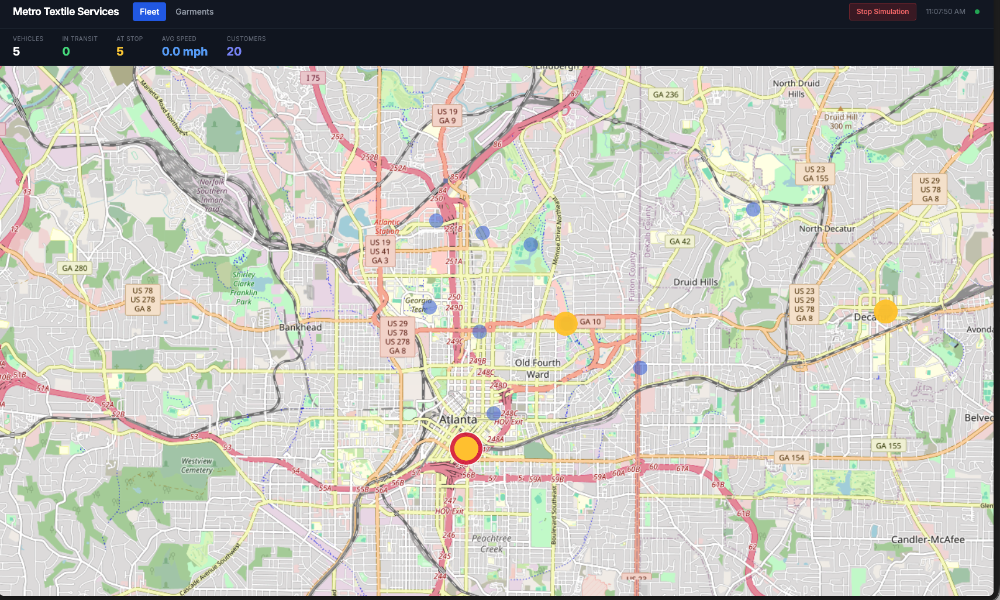

# IoT Lifecycle Demo — Animated Fleet Map, RFID Tracking & CFO Agent

End-to-end IoT lifecycle demonstration for **Metro Textile Services**, a fictional uniform rental and linen supply company operating in the Atlanta, GA metro area. Runs entirely on Snowpark Container Services with a live simulator, real-time garment pipeline, and a natural-language CFO Agent powered by Snowflake Intelligence.

## Screenshots

| Fleet Map | Garment Lifecycle Pipeline |
|-----------|---------------------------|
|  |  |

**Fleet Map** — Live vehicle positions on an OpenStreetMap Atlanta base layer (deck.gl ScatterplotLayer). Orange = idle at stop, red/yellow pulse = active vehicle. Blue dots = customer locations. KPI bar shows fleet status in real time.

**Garment Pipeline** — Visual lifecycle flow showing garment counts at each processing stage (CHECK_IN → WASH → DRY → FOLD → DISPATCH → DELIVER). Inventory table with 40 tracked garments, and a live event feed with color-coded stage transitions.

## What It Does

| Component | Feature | Tech |
|-----------|---------|------|
| **Fleet Dashboard** | Live vehicle simulation on dark Atlanta map with real-time position updates | React, deck.gl ScatterplotLayer + TileLayer, SPCS |
| **Garment Pipeline** | RFID lifecycle tracking with visual stage pipeline, inventory table, live event feed | React, FastAPI polling, QUALIFY deduplication |
| **Live Simulator** | Background thread cycling 40 garments through 6 stages + moving 5 vehicles along routes | FastAPI BackgroundTasks, Snowflake connector |
| **CFO Agent** | Natural language financial Q&A (Snowflake Intelligence) | Semantic View, Cortex Agent |

## Architecture

```
┌─────────────────────────────────────────────────┐
│  React Frontend (Vite + deck.gl + Tailwind)     │
│  • ScatterplotLayer: vehicles + customers       │
│  • TileLayer: OpenStreetMap base map            │
│  • Garment Pipeline: stage counts + event feed  │
│  • 5-second polling for live updates            │
├─────────────────────────────────────────────────┤
│  FastAPI Backend (Python)                       │
│  • /api/positions → simulated GPS coords        │
│  • /api/garments → V_GARMENT_LIFECYCLE view     │
│  • /api/garment-pipeline → stage aggregation    │
│  • /api/garment-events → latest 50 events       │
│  • /api/customers, /api/vehicles                │
│  • Background simulator thread                  │
├─────────────────────────────────────────────────┤
│  Snowpark Container Services (SPCS)             │
│  • CPU_X64_XS compute pool                      │
│  • Public endpoint → shareable URL              │
│  • EAI for OpenStreetMap tile access            │
└─────────────────────────────────────────────────┘
         ↕
┌─────────────────────────────────────────────────┐
│  Snowflake Data Layer                           │
│  • 11 tables (fleet, garments, events, finance) │
│  • 6 analytics views (QUALIFY deduplication)    │
│  • Semantic view + Cortex Agent (Intelligence)  │
└─────────────────────────────────────────────────┘
```

## Quick Start

### Step 1: Deploy data + agent (Snowsight)

1. Open Snowsight, create a new SQL worksheet
2. Paste the contents of `deploy_all.sql`
3. Click **Run All**
4. This creates all tables, views, the CFO Agent, image repo, and compute pool
5. The final output confirms success and tells you to proceed to Step 2

### Step 2: Build & push the container (terminal)

```bash
cd demo-iot-lifecycle
./build_and_push.sh
```

The script will:
- Build the React frontend natively (Node.js)
- Auto-detect your registry URL from Snowflake (via Snow CLI)
- Build the container image for linux/amd64 (Podman)
- Authenticate to the registry via Snow CLI
- Push the image

> **Requires:**
> - [Podman](https://podman.io/getting-started/installation) (no Docker license needed)
> - [Snow CLI](https://docs.snowflake.com/en/developer-guide/snowflake-cli/installation) with a configured connection
> - [Node.js](https://nodejs.org/) for the frontend build

### Step 3: Start the service (Snowsight)

1. Open a new SQL worksheet
2. Paste the contents of `deploy_service.sql`
3. Click **Run All**
4. The last query output shows your dashboard URL in the `ingress_url` column
5. Open that URL in your browser — takes ~60 seconds on first launch

### Running the Demo

1. Open the dashboard URL
2. Click **Start Simulation** — vehicles begin moving along Atlanta routes, garments cycle through processing stages
3. Switch between **Fleet** and **Garments** tabs to show different aspects
4. The live event feed and pipeline update every 5 seconds
5. Click **Stop Simulation** when done

### Using the CFO Agent

The CFO Assistant is automatically available in **Snowflake Intelligence** (the sidebar panel in Snowsight). Ask financial questions like:
- "What is our revenue by customer?"
- "Which customers have the highest garment loss rate?"
- "Show me monthly invoice trends"

### Local Development (optional)

```bash
cd demo-iot-lifecycle/app/frontend
npm install && npm run dev

# In another terminal:
cd demo-iot-lifecycle/app/backend
pip install -r requirements.txt
SNOWFLAKE_CONNECTION_NAME=default uvicorn main:app --reload
```

## Object Catalog

| Object | Name | Purpose |
|--------|------|---------|
| Database | `SNOWFLAKE_EXAMPLE` | Shared demo database |
| Schema | `IOT_LIFECYCLE` | All project objects |
| Warehouse | `SFE_IOT_LIFECYCLE_WH` | XSMALL, auto-suspend 60s |
| Compute Pool | `IOT_FLEET_POOL` | CPU_X64_XS for SPCS |
| Service | `FLEET_DASHBOARD_SERVICE` | React dashboard container |
| Image Repo | `IOT_IMAGE_REPO` | Container registry |
| Tables | 11 TRANSIENT | Fleet, garments, events, invoices, financials |
| Views | 6 | Fleet status, garment lifecycle, financials |
| Semantic View | `SV_IOT_FINANCIAL` | CFO Agent structured data |
| Agent | `CFO_ASSISTANT` | Snowflake Intelligence |
| EAI | `OSM_TILES_ACCESS` | OpenStreetMap tile loading |

## Key Design Patterns

| Pattern | Where | Why |
|---------|-------|-----|
| `QUALIFY ROW_NUMBER()` | Views, pipeline query | Deduplicate to latest event per garment without correlated subqueries |
| SPCS OAuth token | `/snowflake/session/token` | Zero-credential Snowflake connection inside containers |
| EAI + Network Rule | Service spec | Allow outbound HTTPS to `tile.openstreetmap.org` for map tiles |
| Background thread | FastAPI `on_event("startup")` | Simulate live IoT data without external scheduler |
| Polling (5s) | React `useEffect` | Real-time feel without WebSocket complexity |

## Cleanup

```sql
-- Copy teardown_all.sql into a Snowsight worksheet and Run All
```

## License

Apache License 2.0.
