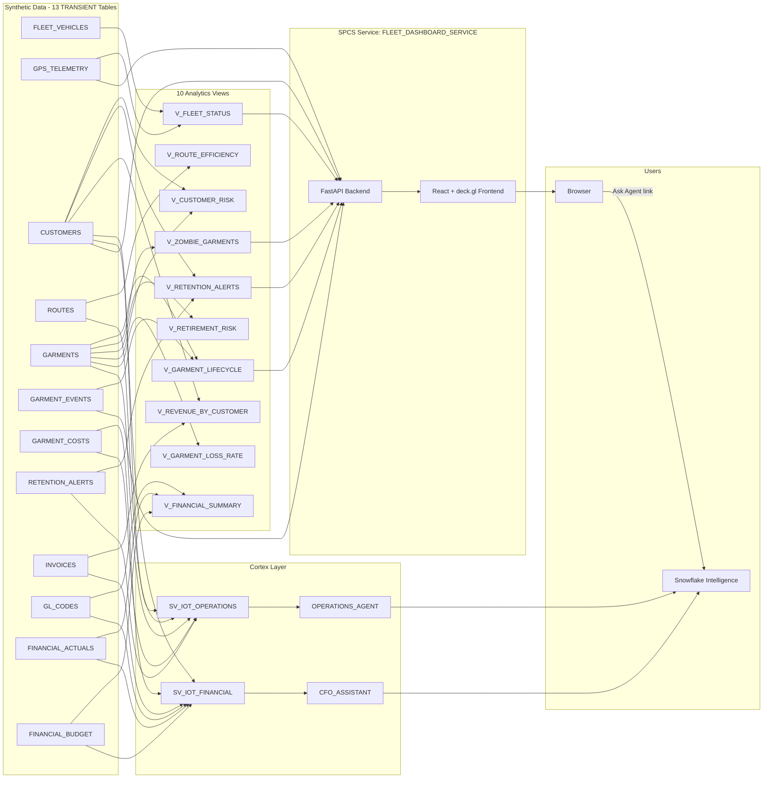

# Data Flow - IoT Lifecycle Demo

Author: SE Community
Last Updated: 2026-05-13
Expires: 2026-06-11
Status: Reference Implementation

Reference Implementation: Review and customize for your requirements.

## Overview
Synthetic data flows from 13 TRANSIENT tables into 10 analytics views. Two semantic views feed two Cortex Agents (CFO + Operations) accessible in Snowflake Intelligence. A FastAPI + React frontend deployed as an SPCS service exposes the live fleet map and garment pipeline UI.

## Diagram

## Component Descriptions

| Layer | Component | Purpose |
|-------|-----------|---------|
| Data | 13 TRANSIENT tables | Synthetic seed data; fleet, garments, customers, financials, alerts |
| Views | `V_ZOMBIE_GARMENTS`, `V_CUSTOMER_RISK`, `V_RETENTION_ALERTS` | Power the agentic operations narrative |
| Views | `V_GARMENT_LIFECYCLE`, `V_FLEET_STATUS` | Power the live React dashboard |
| Views | `V_FINANCIAL_SUMMARY`, `V_REVENUE_BY_CUSTOMER` | Power the CFO P&L narrative |
| Semantic | `SV_IOT_FINANCIAL` | Verified queries for monthly P&L, budget variance, top customers |
| Semantic | `SV_IOT_OPERATIONS` | Verified queries for silent leaks, zombie summary, fuel anomalies |
| Agent | `CFO_ASSISTANT` | Financial Q&A in Snowflake Intelligence |
| Agent | `OPERATIONS_AGENT` | Zombie / retention / route Q&A in Snowflake Intelligence |
| App | `FLEET_DASHBOARD_SERVICE` | SPCS-hosted React + FastAPI dashboard with deck.gl map |

## Change History
See `.claude/DIAGRAM_CHANGELOG.md` or project-specific changelog.
