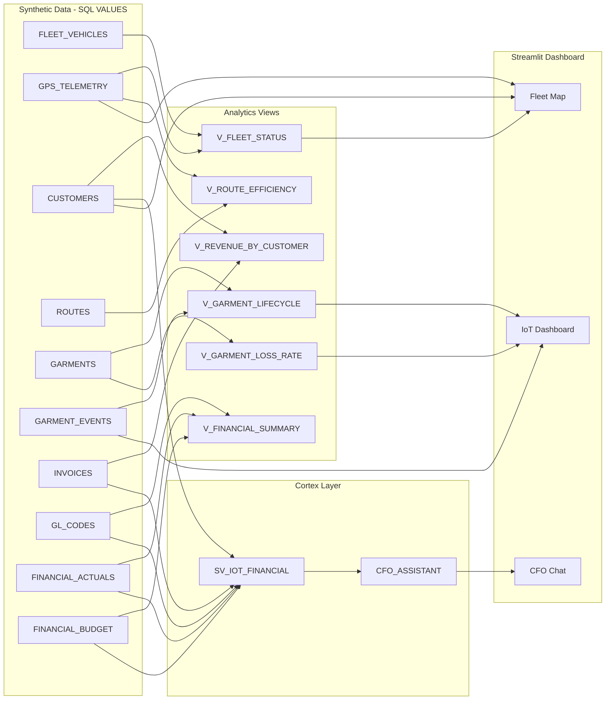

# Data Flow

```mermaid
flowchart LR
  subgraph synthetic [Synthetic Data - SQL VALUES]
    Fleet[FLEET_VEHICLES]
    GPS[GPS_TELEMETRY]
    Customers[CUSTOMERS]
    Routes[ROUTES]
    Garments[GARMENTS]
    Events[GARMENT_EVENTS]
    Invoices[INVOICES]
    GLCodes[GL_CODES]
    Actuals[FINANCIAL_ACTUALS]
    Budget[FINANCIAL_BUDGET]
  end

  subgraph views [Analytics Views]
    VFleet[V_FLEET_STATUS]
    VLifecycle[V_GARMENT_LIFECYCLE]
    VLoss[V_GARMENT_LOSS_RATE]
    VRoute[V_ROUTE_EFFICIENCY]
    VFinance[V_FINANCIAL_SUMMARY]
    VRevenue[V_REVENUE_BY_CUSTOMER]
  end

  subgraph cortex [Cortex Layer]
    SV[SV_IOT_FINANCIAL]
    Agent[CFO_ASSISTANT]
  end

  subgraph app [Streamlit Dashboard]
    MapTab[Fleet Map]
    IoTTab[IoT Dashboard]
    CFOTab[CFO Chat]
  end

  Fleet --> VFleet
  GPS --> VFleet
  Routes --> VRoute
  GPS --> VRoute
  Garments --> VLifecycle
  Events --> VLifecycle
  Garments --> VLoss
  Actuals --> VFinance
  Budget --> VFinance
  GLCodes --> VFinance
  Invoices --> VRevenue
  Customers --> VRevenue

  Actuals --> SV
  Budget --> SV
  GLCodes --> SV
  Invoices --> SV
  Customers --> SV
  SV --> Agent

  VFleet --> MapTab
  GPS --> MapTab
  Customers --> MapTab
  VLifecycle --> IoTTab
  VLoss --> IoTTab
  Events --> IoTTab
  Agent --> CFOTab
```
