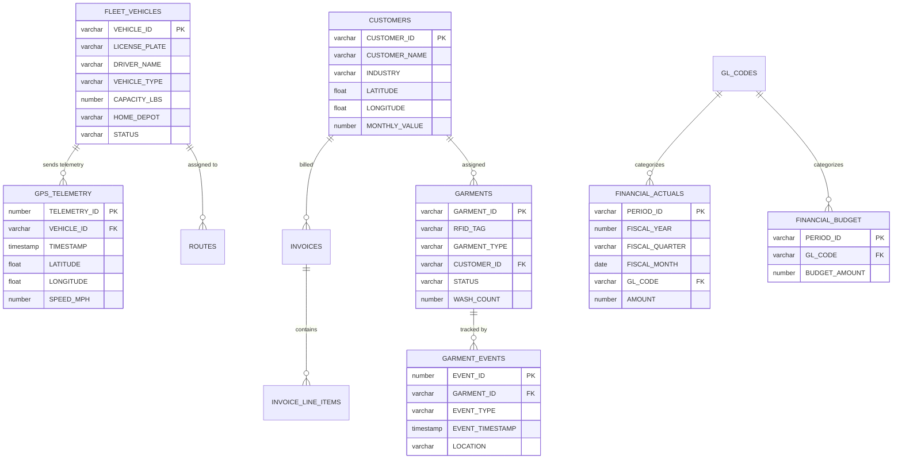

# Data Model

```mermaid
erDiagram
    FLEET_VEHICLES ||--o{ GPS_TELEMETRY : "sends telemetry"
    FLEET_VEHICLES ||--o{ ROUTES : "assigned to"
    CUSTOMERS ||--o{ INVOICES : "billed"
    CUSTOMERS ||--o{ GARMENTS : "assigned"
    GARMENTS ||--o{ GARMENT_EVENTS : "tracked by"
    INVOICES ||--o{ INVOICE_LINE_ITEMS : "contains"
    GL_CODES ||--o{ FINANCIAL_ACTUALS : "categorizes"
    GL_CODES ||--o{ FINANCIAL_BUDGET : "categorizes"

    FLEET_VEHICLES {
        varchar VEHICLE_ID PK
        varchar LICENSE_PLATE
        varchar DRIVER_NAME
        varchar VEHICLE_TYPE
        number CAPACITY_LBS
        varchar HOME_DEPOT
        varchar STATUS
    }

    CUSTOMERS {
        varchar CUSTOMER_ID PK
        varchar CUSTOMER_NAME
        varchar INDUSTRY
        float LATITUDE
        float LONGITUDE
        number MONTHLY_VALUE
    }

    GPS_TELEMETRY {
        number TELEMETRY_ID PK
        varchar VEHICLE_ID FK
        timestamp TIMESTAMP
        float LATITUDE
        float LONGITUDE
        number SPEED_MPH
    }

    GARMENTS {
        varchar GARMENT_ID PK
        varchar RFID_TAG
        varchar GARMENT_TYPE
        varchar CUSTOMER_ID FK
        varchar STATUS
        number WASH_COUNT
    }

    GARMENT_EVENTS {
        number EVENT_ID PK
        varchar GARMENT_ID FK
        varchar EVENT_TYPE
        timestamp EVENT_TIMESTAMP
        varchar LOCATION
    }

    FINANCIAL_ACTUALS {
        varchar PERIOD_ID PK
        number FISCAL_YEAR
        varchar FISCAL_QUARTER
        date FISCAL_MONTH
        varchar GL_CODE FK
        number AMOUNT
    }

    FINANCIAL_BUDGET {
        varchar PERIOD_ID PK
        varchar GL_CODE FK
        number BUDGET_AMOUNT
    }
```
