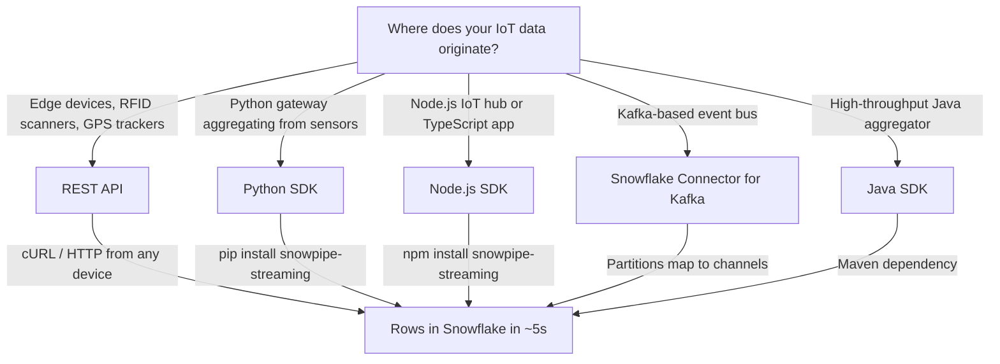
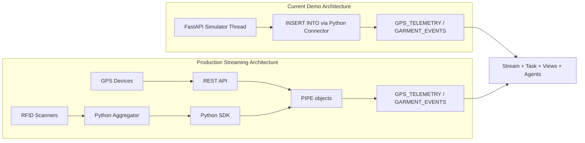

# Streaming IoT Data Ingest

This guide explains how IoT data -- GPS telemetry, RFID garment scans, sensor readings -- would flow into Snowflake in a production deployment using **Snowpipe Streaming** (high-performance architecture, GA Sep 2025).

The demo simulator uses `INSERT INTO` via the Snowflake Python Connector, which is fine for a self-contained demo. In production, thousands of devices generate rows continuously, and Snowpipe Streaming is the purpose-built service for this.

---

## Why Streaming for IoT?

| Concern | INSERT via Connector | Snowpipe Streaming |
|---------|---------------------|--------------------|
| Latency | Depends on client polling interval | Data queryable in ~5 seconds |
| Throughput | Limited by single connection | Up to 10 GB/s per table |
| Exactly-once delivery | Application must handle dedup | Built-in via offset tokens |
| Staging files | N/A (direct INSERT) | Not needed -- rows stream directly into tables |
| Infrastructure | You manage the INSERT loop | Serverless, auto-scaling compute |
| Error recovery | Manual rollback logic | Reopen channel at last committed offset |

**Bottom line**: Snowpipe Streaming replaces file-based and polling-based patterns with row-level streaming. You send rows, Snowflake handles the rest.

---

## Choosing Your Ingestion Path



| Scenario | Recommended | Why |
|----------|-------------|-----|
| Edge/constrained devices (RFID scanners, GPS trackers) | **REST API** | No SDK install required. Works with cURL. Runs on any device that can make HTTP requests. |
| Python service aggregating from multiple sensors | **Python SDK** | `pip install snowpipe-streaming`. Batches rows, tracks offsets, exactly-once delivery. |
| Node.js IoT hub or TypeScript application | **Node.js SDK** | `npm install snowpipe-streaming`. Same Rust-based core as Python SDK. |
| Kafka-based event bus already in place | **Snowflake Connector for Kafka** | Kafka partitions map to channels. Zero custom ingestion code. |
| High-throughput Java aggregator (>1 GB/s) | **Java SDK** | Most mature SDK. Requires Java 11+. |

> **Snowflake recommendation**: Start with the SDK over the REST API for the improved performance and getting-started experience. Use the REST API when you need lightweight ingestion from edge devices that cannot run an SDK.

---

## How It Works: Key Concepts

### PIPE Object

The PIPE is the server-side "receiving dock" for streaming data. It validates schema, applies in-flight transformations (column reordering, type casting, filtering), and can pre-cluster data at ingest time.

A **default pipe** is auto-created for each table the first time you stream data into it. For advanced use cases, create a custom pipe:

```sql
CREATE PIPE gps_telemetry_pipe
AS COPY INTO GPS_TELEMETRY
  FROM TABLE (DATA_SOURCE(TYPE => 'STREAMING'))
  MATCH_BY_COLUMN_NAME = CASE_SENSITIVE;
```

### Channel

A channel is your dedicated lane into a pipe. One channel per data source partition -- for example, one per GPS device or one per RFID scanner zone. Rows within a channel arrive **in order**.

**Naming convention**: Use deterministic names like `gps-prod-southeast-V001` to simplify troubleshooting and automated recovery.

### Offset Token

Your bookmark. After a crash, reopen the channel and resume from the last committed offset. No duplicates, no gaps. This is how exactly-once delivery works.

### Schema Evolution

If a device starts sending a new field (e.g., `BATTERY_PCT`), Snowflake can auto-add the column. No DDL change required.

---

## Walk-Through: GPS Telemetry via REST API

This shows how a GPS tracking device (or a cURL script simulating one) would stream telemetry into the existing `GPS_TELEMETRY` table.

### Prerequisites

- Key-pair authentication configured for your Snowflake user
- JWT generated via SnowSQL:

```bash
snowsql --private-key-path rsa_key.p8 --generate-jwt \
  -a <ACCOUNT_IDENTIFIER> \
  -u MY_USER
```

### Step 1: Set environment variables

```bash
export JWT_TOKEN="<your_jwt>"
export ACCOUNT="<account_identifier>"
export DB="SNOWFLAKE_EXAMPLE"
export SCHEMA="IOT_LIFECYCLE"
export PIPE="GPS_TELEMETRY-STREAMING"   # default pipe name = TABLE-STREAMING
export CHANNEL="gps-prod-southeast-V001"
export CONTROL_HOST="${ACCOUNT}.snowflakecomputing.com"
```

### Step 2: Discover ingest host and get scoped token

```bash
export INGEST_HOST=$(curl -sS -X GET \
  -H "Authorization: Bearer $JWT_TOKEN" \
  -H "X-Snowflake-Authorization-Token-Type: KEYPAIR_JWT" \
  "https://${CONTROL_HOST}/v2/streaming/hostname")

export SCOPED_TOKEN=$(curl -sS -X POST "https://$CONTROL_HOST/oauth/token" \
  -H 'Content-Type: application/x-www-form-urlencoded' \
  -H "Authorization: Bearer $JWT_TOKEN" \
  -d "grant_type=urn:ietf:params:oauth:grant-type:jwt-bearer&scope=${INGEST_HOST}")
```

### Step 3: Open a channel

```bash
curl -sS -X PUT \
  -H "Authorization: Bearer $SCOPED_TOKEN" \
  -H "Content-Type: application/json" \
  "https://${INGEST_HOST}/v2/streaming/databases/$DB/schemas/$SCHEMA/pipes/$PIPE/channels/$CHANNEL" \
  -d '{}' | tee open_resp.json | jq .
```

### Step 4: Append a GPS reading

```bash
export CONT_TOKEN=$(jq -r '.next_continuation_token' open_resp.json)
export OFFSET_TOKEN=$(jq -r '.channel_status.last_committed_offset_token' open_resp.json)
export NEW_OFFSET=$((OFFSET_TOKEN + 1))

NOW_TS=$(date -u +"%Y-%m-%dT%H:%M:%SZ")

cat <<EOF > gps_row.ndjson
{
  "VEHICLE_ID": "V-001",
  "TIMESTAMP": "$NOW_TS",
  "LATITUDE": 33.7490,
  "LONGITUDE": -84.3880,
  "SPEED_MPH": 22.0,
  "HEADING": 45.0,
  "ENGINE_STATUS": "ON"
}
EOF

curl -sS -X POST \
  -H "Authorization: Bearer $SCOPED_TOKEN" \
  -H "Content-Type: application/x-ndjson" \
  "https://${INGEST_HOST}/v2/streaming/data/databases/$DB/schemas/$SCHEMA/pipes/$PIPE/channels/$CHANNEL/rows?continuationToken=$CONT_TOKEN&offsetToken=$NEW_OFFSET" \
  --data-binary @gps_row.ndjson | jq .
```

### Step 5: Verify committed offset

```bash
curl -sS -X POST \
  -H "Authorization: Bearer $SCOPED_TOKEN" \
  -H "Content-Type: application/json" \
  "https://${INGEST_HOST}/v2/streaming/databases/$DB/schemas/$SCHEMA/pipes/$PIPE:bulk-channel-status" \
  -d "{\"channel_names\": [\"$CHANNEL\"]}" | jq ".channel_statuses.\"$CHANNEL\""
```

Wait until `last_committed_offset_token` >= your `NEW_OFFSET`, then query:

```sql
SELECT * FROM GPS_TELEMETRY ORDER BY TIMESTAMP DESC LIMIT 5;
```

The row should appear within ~5 seconds of offset commitment.

---

## Walk-Through: Garment Events via Python SDK

This shows a Python aggregator service that collects RFID scan events and streams them into the existing `GARMENT_EVENTS` table.

### Install

```bash
pip install snowpipe-streaming
```

### Example: Stream garment lifecycle events

```python
import json
import time
from datetime import datetime, timezone
from snowpipe_streaming import SnowpipeStreamingClient

with open("profile.json") as f:
    profile = json.load(f)

client = SnowpipeStreamingClient(
    account=profile["account"],
    user=profile["user"],
    private_key_file=profile["private_key_file"],
    role=profile["role"],
    database="SNOWFLAKE_EXAMPLE",
    schema="IOT_LIFECYCLE",
    pipe="GARMENT_EVENTS-STREAMING",
)

channel, status = client.open_channel(
    channel_name="rfid-plant-zone-A",
    offset_token=None,
)

events = [
    {"GARMENT_ID": "G-0001", "EVENT_TYPE": "CHECK_IN",  "LOCATION": "Receiving Dock", "SCANNER_ID": "SC-001"},
    {"GARMENT_ID": "G-0001", "EVENT_TYPE": "WASH",      "LOCATION": "Wash Line 2",    "SCANNER_ID": "SC-003"},
    {"GARMENT_ID": "G-0001", "EVENT_TYPE": "DRY",       "LOCATION": "Dryer Bay 1",    "SCANNER_ID": "SC-004"},
    {"GARMENT_ID": "G-0001", "EVENT_TYPE": "FOLD",      "LOCATION": "Finishing Area",  "SCANNER_ID": "SC-005"},
    {"GARMENT_ID": "G-0001", "EVENT_TYPE": "DISPATCH",  "LOCATION": "Loading Dock",    "SCANNER_ID": "SC-006"},
]

for i, event in enumerate(events):
    event["EVENT_TIMESTAMP"] = datetime.now(timezone.utc).isoformat()
    event["NOTES"] = f"Streamed via SDK"
    channel.append_row(event, offset_token=str(i))

statuses = client.get_channel_statuses(["rfid-plant-zone-A"])
print(f"Committed offset: {statuses['rfid-plant-zone-A'].last_committed_offset_token}")
print(f"Rows inserted:    {statuses['rfid-plant-zone-A'].rows_inserted}")
print(f"Error count:      {statuses['rfid-plant-zone-A'].rows_error_count}")
```

> **Important**: Pass event data as native Python dicts, not JSON strings. The SDK handles serialization. Passing a string literal results in data stored as `VARCHAR`, not structured `VARIANT`.

### Error handling with exponential backoff

```python
import time
from snowpipe_streaming import SFException

MAX_RETRIES = 5

for attempt in range(MAX_RETRIES):
    try:
        channel.append_row(row, offset_token=str(offset))
        break
    except SFException as e:
        if e.status_code in (429, 500, 503):
            wait = min(2 ** attempt, 60)
            print(f"Retryable error {e.status_code}, waiting {wait}s...")
            time.sleep(wait)
        elif e.status_code == 409:
            print("Channel invalidated. Reopening...")
            token = client.get_channel_statuses([channel_name])[channel_name].last_committed_offset_token
            channel, _ = client.open_channel(channel_name, offset_token=token)
        else:
            raise
```

---

## Table Design for Streaming

For production streaming workloads, add metadata columns to your tables for error detection and recovery:

```sql
CREATE OR REPLACE TABLE GPS_TELEMETRY_STREAMING (
    TELEMETRY_ID    NUMBER(10,0) IDENTITY START 1 INCREMENT 1,
    VEHICLE_ID      VARCHAR(10)   NOT NULL,
    TIMESTAMP       TIMESTAMP_NTZ NOT NULL,
    LATITUDE        FLOAT         NOT NULL,
    LONGITUDE       FLOAT         NOT NULL,
    SPEED_MPH       NUMBER(5,1)   DEFAULT 0,
    HEADING         NUMBER(5,1),
    ENGINE_STATUS   VARCHAR(10)   DEFAULT 'ON',

    -- Streaming metadata columns
    CHANNEL_ID      INTEGER,
    STREAM_OFFSET   BIGINT
);
```

Create a PIPE with column matching and ingest-time clustering:

```sql
CREATE PIPE gps_telemetry_streaming_pipe
AS COPY INTO GPS_TELEMETRY_STREAMING
  FROM TABLE (DATA_SOURCE(TYPE => 'STREAMING'))
  MATCH_BY_COLUMN_NAME = CASE_SENSITIVE
  CLUSTER_AT_INGEST_TIME = TRUE;
```

**Why MATCH_BY_COLUMN_NAME?** You are billed only for the data values ingested, not for JSON keys. This reduces costs when ingesting verbose JSON payloads.

### Gap detection query

Use the metadata columns to find missing or out-of-order records:

```sql
SELECT
  CHANNEL_ID,
  STREAM_OFFSET,
  LAG(STREAM_OFFSET) OVER (
    PARTITION BY CHANNEL_ID
    ORDER BY STREAM_OFFSET
  ) AS previous_offset,
  STREAM_OFFSET - LAG(STREAM_OFFSET) OVER (
    PARTITION BY CHANNEL_ID
    ORDER BY STREAM_OFFSET
  ) AS gap
FROM GPS_TELEMETRY_STREAMING
QUALIFY gap > 1;
```

---

## Production Best Practices

### Channel management

- **Long-lived channels**: Open once, keep active. Avoid repeatedly opening/closing.
- **Deterministic names**: `{source}-{env}-{region}-{device_id}` (e.g., `gps-prod-southeast-V001`).
- **Scale with multiple channels**: One channel per source partition. Multiple channels can target the same pipe.

### Resiliency

- **Wrap ingestion in try-catch**: Don't assume `appendRow` always succeeds.
- **Exponential backoff**: For 429 (throttled), 500, 503 errors.
- **Verify offset progress**: Periodically call `getChannelStatus` to confirm offsets are advancing.
- **Monitor `row_error_count`**: An increasing count means records are being rejected.

### Performance

- **Use ZSTD compression** for REST API requests to fit more data per 4 MB request limit.
- **Batch rows**: `appendRows` is more efficient than calling `appendRow` in a loop. Keep batches under 16 MB compressed.
- **Native data types**: Pass Python dicts, JS objects, or Java Maps for VARIANT columns. Never pass serialized JSON strings.

### Monitoring

Enable Prometheus metrics on your Snowpipe Streaming client:

```bash
export SS_ENABLE_METRICS=true
```

Scrape configuration:

```yaml
scrape_configs:
  - job_name: snowpipe_streaming
    metrics_path: /metrics
    static_configs:
      - targets: ['127.0.0.1:50000']
```

---

## Understanding Costs

Snowpipe Streaming (high-performance architecture) uses **throughput-based billing**: a flat rate per uncompressed GB of data values ingested.

- Only data **values** are metered, not JSON keys
- No per-client or per-channel charges
- No separate compute costs -- serverless and included

### Monitor your usage

```sql
SELECT
  m.START_TIME,
  p.PIPE_NAME,
  m.CREDITS_USED
FROM SNOWFLAKE.ACCOUNT_USAGE.METERING_HISTORY m
JOIN SNOWFLAKE.ACCOUNT_USAGE.PIPES p
  ON m.ENTITY_ID = p.PIPE_ID
 AND m.NAME = p.PIPE_NAME
 AND m.SERVICE_TYPE = 'SNOWPIPE_STREAMING'
ORDER BY m.START_TIME DESC;
```

---

## How This Connects to the Demo



**The downstream pipeline is unchanged.** Whether rows arrive via INSERT or Snowpipe Streaming, the existing analytics views, semantic views, and Cortex Agents continue to work. The Stream on `GPS_TELEMETRY` (`GPS_TELEMETRY_STREAM`) captures new rows regardless of how they were ingested.

---

## References

- [Snowpipe Streaming overview](https://docs.snowflake.com/en/user-guide/snowpipe-streaming/data-load-snowpipe-streaming-overview)
- [Key concepts (PIPE, channels, offset tokens)](https://docs.snowflake.com/en/user-guide/snowpipe-streaming/snowpipe-streaming-high-performance-overview)
- [Tutorial: Get started with the SDK](https://docs.snowflake.com/en/user-guide/snowpipe-streaming/snowpipe-streaming-high-performance-getting-started)
- [Tutorial: Get started with the REST API](https://docs.snowflake.com/en/user-guide/snowpipe-streaming/snowpipe-streaming-high-performance-rest-tutorial)
- [Best practices (high-performance architecture)](https://docs.snowflake.com/en/user-guide/snowpipe-streaming/snowpipe-streaming-high-performance-best-practices)
- [Understand your costs](https://docs.snowflake.com/en/user-guide/snowpipe-streaming/snowpipe-streaming-high-performance-cost)
- [REST API endpoints reference](https://docs.snowflake.com/en/user-guide/snowpipe-streaming/snowpipe-streaming-high-performance-rest-api)
- [SDK examples (GitHub)](https://github.com/snowflakedb/snowpipe-streaming-sdk-examples)
