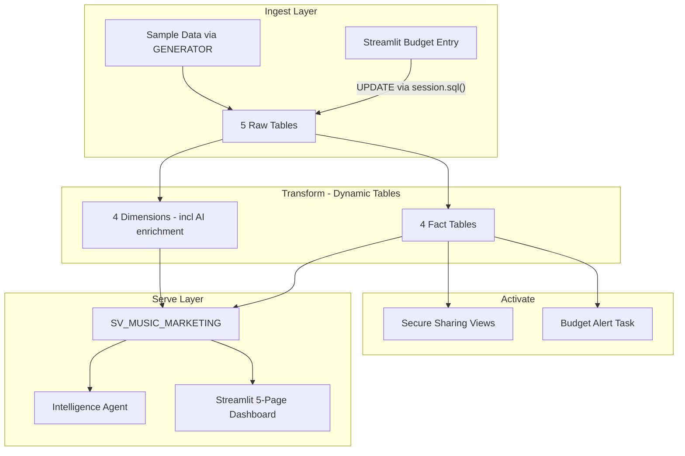

# Music Label Marketing Analytics

Inspired by a real customer challenge: *"How do I get my marketing team to stop emailing spreadsheets without taking away their spreadsheets?"*

This project answers that question by building a Snowflake-powered marketing analytics platform for a fictional music label — while keeping the spreadsheet workflow the marketing team already knows.

**Pair-programmed by:** SE Community + Cortex Code
**Created:** 2026-03-25 | **Expires:** 2026-04-24 | **Status:** ACTIVE

> **No support provided.** This code is for reference only. Review, test, and modify before any production use.
> This demo expires on 2026-04-24. After expiration, validate against current Snowflake docs before use.

---

## The Problem

An independent music label ("Apex Records") manages marketing budgets across 50 artists, 200 campaigns, and 5 channels using Google Sheets. The same budget gets tracked different ways by different people:

| Source | Q1 Social Budget for Nia Blaze | Last Updated | Status |
|--------|-------------------------------|--------------|--------|
| Sarah's spreadsheet | $12,500 | Mar 3 | "final" |
| James's spreadsheet | $15,000 | Mar 8 | "updated — ignore Sarah's" |
| Maria's email to finance | $11,800 | Mar 1 | "use this one" |
| The slide deck from last Tuesday | $14,000 | Feb 28 | "approved" |

Nobody can answer "Which campaigns had the best ROI last quarter?" without hours of manual work. Marketing spend is completely disconnected from streaming and royalty data. Campaign metadata — genre, territory, campaign type — is entered by hand and is frequently wrong or missing.

---

## The Progression

### 1. The Spreadsheet — we didn't take it away

The Streamlit Budget Entry page uses `st.data_editor` to present a familiar editable grid. The marketing team enters and adjusts budget allocations exactly like they would in Google Sheets. When they click Save, changes write directly to Snowflake via a SQL UPDATE.

```python
edited = st.data_editor(budget_df, column_config={
    "ALLOCATED_AMOUNT": st.column_config.NumberColumn("Budget ($)", format="$%.2f"),
    "NOTES": st.column_config.TextColumn("Notes"),
})

if st.button("Save Changes"):
    session.sql(f"UPDATE RAW_MARKETING_BUDGET SET allocated_amount = ...").collect()
```

They think they're in a spreadsheet. They're writing to Snowflake.

> [!TIP]
> **Pattern demonstrated:** `st.data_editor` + `session.sql()` UPDATE — the simplest pattern for giving spreadsheet users a familiar interface backed by Snowflake.

### 2. The AI Cleanup — metadata that fixes itself

Campaign metadata is messy. Some campaigns have no type, some have "Other" as a placeholder, and territory is often missing. Instead of asking someone to fix it by hand, Dynamic Tables run `AI_CLASSIFY` and `AI_EXTRACT` automatically:

| Campaign | Manual Type | AI Type | Manual Territory | AI Territory |
|----------|------------|---------|-----------------|-------------|
| Nia Blaze - Single Launch | `NULL` | Single Launch | `NULL` | US |
| Marco Fuentes - TikTok Promo | Other | TikTok Promo | LATAM | LATAM |
| Jade Moon - Playlist Push | `NULL` | Playlist Push | Europe | Europe |

```sql
AI_CLASSIFY(
    campaign_description,
    ['Single Launch', 'Album Cycle', 'Playlist Push', 'Tour Support', 'TikTok Promo'],
    {'task_description': 'Classify this music marketing campaign based on its description'}
):labels[0]::VARCHAR AS ai_campaign_type
```

> [!TIP]
> **Pattern demonstrated:** `AI_CLASSIFY` + `AI_EXTRACT` inside Dynamic Tables — AI enrichment runs during transformation, not at query time, so the cost is amortized across all downstream consumers.

### 3. The Single Source of Truth — no more "which spreadsheet?"

Dynamic Tables auto-refresh the dimensional model with a 1-hour lag. No manual refresh, no stale data, no version conflicts. Four dimensions and four fact tables maintain themselves:

```sql
CREATE DYNAMIC TABLE FACT_CAMPAIGN_PERFORMANCE
  TARGET_LAG = '1 hour'
  WAREHOUSE = SFE_MUSIC_MARKETING_WH
AS
SELECT campaign_id, total_spend, total_streams, roi, streams_per_dollar, ...
```

> [!TIP]
> **Pattern demonstrated:** Dynamic Tables with `TARGET_LAG` for automated dimensional modeling — the transformation layer that replaces manual ETL and scheduled refresh jobs.

### 4. The Questions — ask in English, get answers

A Snowflake Intelligence agent answers marketing questions in plain English without anyone building a report:

- *"Which campaigns had the highest ROI last quarter?"*
- *"How does our social media spend compare to streaming revenue by artist?"*
- *"Show me budget vs. actual for this quarter by territory"*
- *"Which marketing channels drive the most streams per dollar spent?"*

> [!TIP]
> **Pattern demonstrated:** Semantic View + `CREATE AGENT` — a semantic model over the dimensional tables powers natural-language queries via Cortex Analyst.

### 5. The Dashboards — spend meets outcomes

Four analytics pages connect marketing spend to business outcomes for the first time:

- **Budget vs. Actual** — live variance highlighting with monthly trend
- **Campaign Performance** — ROI metrics, streams per dollar, sortable top-25
- **Artist Marketing Profile** — per-artist investment vs. streaming and royalty impact
- **Anomaly Alerts** — overspending campaigns and underperformers flagged automatically

> [!TIP]
> **Pattern demonstrated:** Streamlit in Snowflake with Git integration — multi-page dashboard deployed via `CREATE STREAMLIT FROM` a Git repository stage.

---

## Architecture



---

## Explore the Results

After deployment, four interfaces let you explore the data:

- **Streamlit Dashboard** — Budget entry, variance analysis, campaign ROI, artist profiles, and anomaly alerts. Navigate to **Projects > Streamlit** in Snowsight.
- **Intelligence Agent** — Ask marketing questions in plain English. Navigate to **AI & ML > Snowflake Intelligence** in Snowsight.
- **Secure Views** — Share campaign and streaming data with distribution partners without emailing spreadsheets.
- **Cortex Code** — Open this project in a Workspace and use Cortex Code for AI-assisted exploration and extension.

---

<details>
<summary><strong>Deploy (2 steps, ~10 minutes)</strong></summary>

> [!IMPORTANT]
> Requires **Enterprise** edition (for Cortex AI), `SYSADMIN` + `ACCOUNTADMIN` role access, and Cortex AI enabled in your region.

**Step 1 — Deploy in Snowsight:**

Copy [`deploy_all.sql`](deploy_all.sql) into a Snowsight worksheet and click **Run All**.

**Step 2 — Open the dashboard:**

Navigate to **Projects > Streamlit > MUSIC_MARKETING_APP** in Snowsight.

### Estimated Costs

| Component | Size | Est. Credits | Notes |
|-----------|------|-------------|-------|
| Warehouse | X-SMALL | ~0.5 | Sample data load + Dynamic Tables |
| Cortex AI | — | ~1.0 | AI_CLASSIFY + AI_EXTRACT on 200 campaigns |
| Dynamic Tables | — | ~0.5 | 8 tables with 1-hour refresh |
| Storage | — | Minimal | <10 MB sample data |
| **Total** | | **~2.0 credits** | Single deployment run |

</details>

<details>
<summary><strong>Troubleshooting</strong></summary>

| Symptom | Fix |
|---------|-----|
| AI_CLASSIFY / AI_EXTRACT unavailable | Verify your region supports Cortex AI. See [Cortex availability](https://docs.snowflake.com/en/user-guide/snowflake-cortex/llm-functions#availability). |
| Dynamic Tables not refreshing | Check `SHOW DYNAMIC TABLES` — verify warehouse is running and TARGET_LAG is set. |
| Intelligence agent errors | Verify `SV_MUSIC_MARKETING` exists in `SEMANTIC_MODELS` schema and warehouse is running. |
| Streamlit app blank | Ensure `MUSIC_MARKETING` schema exists and tables have data. Rerun data load if needed. |
| Budget Entry shows no rows | The page filters to current month and forward. Verify budget data exists for current period. |

</details>

## Cleanup

Run [`teardown_all.sql`](teardown_all.sql) in Snowsight to remove all demo objects.

<details>
<summary><strong>Development Tools</strong></summary>

This project is designed for AI-pair development.

- **AGENTS.md** — Project instructions for Cortex Code and compatible AI tools
- **.claude/skills/** — Project-specific AI skill (Cursor + Claude Code)
- **Cortex Code in Snowsight** — Open this project in a Workspace for AI-assisted development
- **Cursor** — Open locally with Cursor for AI-pair coding

> New to AI-pair development? See [Cortex Code docs](https://docs.snowflake.com/en/user-guide/cortex-code/cortex-code)

</details>

## Documentation

- [Deployment Guide](docs/01-DEPLOYMENT.md)
- [Usage Guide](docs/02-USAGE.md)
- [Cleanup Guide](docs/03-CLEANUP.md)
