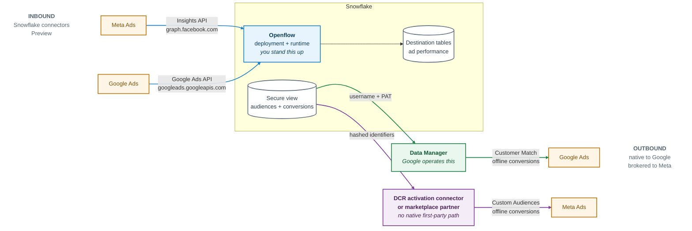

# Snowflake and the Ad Platforms: Google Ads Data Manager and the Openflow Ads Connectors

Moving advertising data between Snowflake and Meta or Google runs through two unrelated
mechanisms, and the direction determines which one applies.

**Google Ads Data Manager** is a Google product that reads first-party audience and conversion
data *out of* Snowflake. Snowflake is one of its supported source connectors. It requires no
Snowflake infrastructure beyond a view and a service identity.

**The Openflow connectors for Meta Ads and Google Ads** are Snowflake products that ingest
advertising performance data *into* Snowflake. They run inside Snowflake Openflow, which is a
deployment and runtime you stand up.

**Audience:** Marketing data engineers and Snowflake administrators moving advertising data in
either direction, and SEs fielding "can Snowflake talk to Meta or Google Ads?" questions.

Pair-programmed by SE Community + Cortex Code

**Created:** 2026-08-28 | **Expires:** 2026-11-28 | **Status:** ACTIVE

> **No support provided.** Reference only; validate before production use.

---

## Start Here

**Direction determines mechanism.** Inbound and outbound are unrelated products with different owners, different auth, and very different setup.



Blue is inbound and runs on Openflow, which you deploy. Green is outbound and operated by Google. Purple is also outbound but brokered — Meta has no native first-party path, so it goes through a clean-room activation connector or a marketplace partner.

Pick the row that matches the direction you need.

| Goal | Mechanism | Built by | Status | Section |
|---|---|---|---|---|
| Push audience lists from Snowflake to Google Ads | Google Ads Data Manager, Snowflake source | Google | Native source, no status label | [Part 1](#part-1--google-ads-data-manager) |
| Push offline conversions from Snowflake to Google Ads | Google Ads Data Manager, Snowflake source | Google | Native source | [Part 1](#part-1--google-ads-data-manager) |
| Pull Meta Ads performance data into Snowflake | Openflow Connector for Meta Ads | Snowflake | **Preview** | [Part 2](#part-2--openflow-connector-for-meta-ads) |
| Pull Google Ads performance data into Snowflake | Openflow Connector for Google Ads | Snowflake | **Preview** | [Both directions](#google-ads-goes-both-directions) |
| Push audience lists from Snowflake to **Meta** | DCR activation connector, or a marketplace partner | Snowflake / third party | No native first-party path | [Closing the gap](#closing-the-snowflake--meta-gap) |

### The prerequisite difference

The two halves of this guide ask for very different setup, which is the main thing to establish
before scoping either:

| | Google Ads Data Manager | Openflow Ads connectors |
|---|---|---|
| Direction | Snowflake → ad platform | Ad platform → Snowflake |
| Snowflake objects | A view, a role, a service user, a PAT | Deployment, compute pool, runtime, execute-as role, network rule, EAI |
| Who initiates the connection | Google, inbound to Snowflake | Your Openflow runtime, outbound |
| Openflow required | No | **Yes** |
| Credits consumed when idle | None | None — only active runtimes consume credits |

### Before you start

**Part 1:** Google Ads administrator access, plus Snowflake privileges to create a role, a
service user, and a PAT (`CREATE ROLE` and `CREATE USER` are account-level).

**Part 2:** a Meta App with the Marketing API enabled and a long-lived token; on the Snowflake
side, `CREATE OPENFLOW DATA PLANE INTEGRATION`, `CREATE OPENFLOW RUNTIME INTEGRATION`, and
`CREATE COMPUTE POOL` on the account. Openflow — Snowflake Deployment is not automatically
available in trial accounts.

### Provenance of the claims in this guide

This guide spans three independently versioned products, so claims are tagged:

- **Verified** — read from official Snowflake or Google documentation, or executed against a
  live Snowflake account.
- **Unverified** — stated in one vendor's documentation but not confirmable elsewhere, or
  documented inconsistently. Called out inline where it matters.

**Executed against a live Snowflake account (v10.30.102) on 2026-08-28, then torn down:**

- Part 1, end to end — least-privilege role, `SERVICE_AGENT` user, a real PAT with no network
  policy, both views, positive *and* negative access tests, and the teardown ordering.
- Part 2 prerequisites — all three Openflow account privileges granted to a non-ACCOUNTADMIN
  role and confirmed in `SHOW GRANTS`, plus the egress network rules and external access
  integrations for `graph.facebook.com` and `googleads.googleapis.com`.

That run corrected two defects in an earlier draft: least-privilege verification needs
`USE SECONDARY ROLES NONE` to mean anything, and the Part 1 service user needs
`DEFAULT_SECONDARY_ROLES = ()`. Both are called out inline.

**Not executed:** the Openflow deployment, runtime, and connector flow itself, which require an
Openflow deployment the validation account did not have. Those steps are transcribed from
Snowflake documentation, not observed.

---

## Part 1 — Google Ads Data Manager

### Where it lives

Google Ads: **Tools → Data manager** (direct: `https://ads.google.com/aw/productlinks`).

Note that Google collapsed the old "Tools & settings" menu into **Tools**. Older
walkthroughs routing you through *Tools & settings → Shared library → Audience manager*
describe a still-functional but secondary entry point.

Data Manager also exists in **Display & Video 360** (Advertiser settings → Data manager) and
**Campaign Manager 360**, each with its own scope and its own admin requirement. The DV360
source list is nearly identical but swaps Google Drive for Google Business Profile.

Do not confuse this with **Marketing Data Manager**, a separate Google product currently in
limited beta.

### Snowflake is a first-party source

**Verified.** Snowflake is one of 17 direct-connection sources, alongside Amazon Redshift,
BigQuery, S3, Salesforce, HubSpot, PostgreSQL, MySQL, Oracle, Shopify, and others. Google's
own supported-sources table describes these as connecting "directly to Google Ads without
third-party integration partners."

Snowflake and S3 were added together, and the launch note scoped both to **Customer Match
and offline conversion imports**. Enhanced conversions for leads is also documented.

**One honest caveat:** Google never labels the Snowflake connector GA, beta, or allowlisted.
It carries no preview banner, and sibling features in the same help navigation *do* carry
explicit "(beta)" tags — so GA is a reasonable inference, but it is an inference. Do not tell
a customer it is "GA" as though Google said so.

### Architecture

```
   ┌──────────────────────────────────────────────────────┐
   │ Snowflake                                            │
   │                                                      │
   │   base tables (PII, all history)                     │
   │        │                                             │
   │        ▼                                             │
   │   SECURE VIEW  V_GOOGLE_CUSTOMER_MATCH               │
   │   column aliases = Google's expected headers         │
   │        │                                             │
   │   granted SELECT to GOOGLE_ADS_DM_ROLE only          │
   │        │                                             │
   │   GOOGLE_ADS_DM_SVC  (service user, PAT auth)        │
   └────────┼─────────────────────────────────────────────┘
            │  outbound-initiated by Google
            │  HTTPS from Google Cloud egress IPs
            │  username + Programmatic Access Token
            ▼
   ┌──────────────────────────────────────────────────────┐
   │ Google Ads Data Manager                              │
   │   normalize → SHA-256 (hex) → confidential match     │
   │        │                                             │
   │        ▼                                             │
   │   Customer Match list  /  offline conversions        │
   └──────────────────────────────────────────────────────┘
```

Google initiates the connection. There is no Snowflake-side scheduler, no egress
integration, and no Google service account to grant. Snowflake is a passive source.

### Authentication: it is a PAT, not a password

**Verified, and this is the detail most people get wrong.** Google's requirements block for
the Snowflake source asks for:

- Snowflake **username**
- **Account identifier**
- A **Programmatic Access Token (PAT)**, "used in place of a password"

The connector is **not** key-pair and **not** OAuth. The UI field is labeled *password* —
paste the PAT into it. This matches Snowflake's own guidance for third-party tools.

> **Documented contradiction, flagged deliberately:** the collapsed step-by-step body on the
> same Google help page still says "enter your Snowflake account identifier, username, and
> password." The Requirements block saying PAT is the newer and authoritative text. Do not
> "correct" this guide back to password auth.

**Account identifier format.** Copy it from Snowsight; it arrives as
`orgname.account_name`. If underscores are rejected, replace them with hyphens.

**There is no ROLE field.** This is the important consequence: because Google gives you
nowhere to specify a role, you must pin the role server-side with `ROLE_RESTRICTION` on the
PAT. Otherwise the connection runs as the user's default role, which is exactly the kind of
implicit privilege you do not want on a PII view.

### The network policy problem — read this before you promise a customer it works

This is the single hardest operational constraint, and it is a genuine conflict between the
two products.

**Google's side:** "Snowflake is accessed from Google Cloud IP addresses. However, Google
Cloud external IP ranges are dynamic and subject to change." Google publishes the ranges at
`https://www.gstatic.com/ipranges/cloud.json` and expects you to refresh your firewall from
it.

**Snowflake's side:** PAT authentication is network-policy-gated by default. With
`NETWORK_POLICY_EVALUATION = ENFORCED_REQUIRED`, a `TYPE = SERVICE` user cannot generate or
use a PAT unless it is subject to a network policy.

So Snowflake wants a static allowlist and Google offers a moving target. Three ways out,
in descending order of preference:

1. **Use `TYPE = SERVICE_AGENT`.** This user type can generate and use a PAT without being
   subject to a network policy. It is the cleanest resolution and avoids both a bypass flag
   and a self-updating firewall job.
2. **Maintain a network policy from Google's published ranges**, refreshed on a schedule.
   Highest assurance, real ongoing maintenance cost, and it breaks silently when Google adds
   a range before your job runs.
3. **Set `PAT_POLICY = (NETWORK_POLICY_EVALUATION = ENFORCED_NOT_REQUIRED)`.** Works.
   Snowflake does not recommend it. Disclose it as a deliberate exception, not a default.

**PrivateLink: unverified, and probably incompatible.** Neither Google's nor Snowflake's
documentation addresses PrivateLink for this connector. Given Google connects to the public
endpoint from Google Cloud IPs, a Snowflake account restricted to PrivateLink-only ingress
will very likely break it. Test before asserting either way.

### Let Google do the hashing

**Verified, and it saves you compute.** Data Manager states plainly: it "will hash the data
for you using the SHA256 algorithm," hex-encoded, and "you don't need to pre-format your
data." Normalization, hashing, and encoding all happen on Google's side.

So do **not** burn Snowflake credits on SHA-256 unless a customer policy forbids sending
unhashed PII outbound. If you must pre-hash:

- Normalize first: trim, lowercase, phone numbers in **E.164**, strip periods before the
  domain for `gmail.com` and `googlemail.com`.
- Hash to **hex** SHA-256. Snowflake's `SHA2(col, 256)` returns a lowercase 64-character hex
  string — **verified by execution** — which is the correct format.
- **Do not hash `Country` or `Zip`.** They must stay in cleartext.

> **Second documented contradiction:** Google's legacy manual-upload page labels its hashed
> examples "Base64 Encoded," while the Data Manager data-prep page specifies hex, and the
> Data Manager API rejects non-hex with `INVALID_HEX_ENCODING`. For the Data Manager path,
> **hex wins.**

### Column headers

Customer Match expects these exact English headers:

`Email` · `Phone` · `First Name` · `Last Name` · `Country` · `Zip` · `Mobile Device ID`

- Mailing-address matching requires **all four** of First Name, Last Name, Country, Zip.
- Multiple `Email`, `Phone`, or `Zip` columns are allowed for one customer.
- `Mobile Device ID` must be the **only** header present, and must be **unhashed** —
  hashing device IDs is unsupported.
- No name prefixes ("Mr."). Emails need a domain. Accented characters are fine in names but
  will not match in emails.

Google's field-mapping UI can map arbitrary source columns to destination fields, so exact
naming is a convenience rather than a hard requirement — but matching the headers in your
view removes a manual step and a class of mapping mistakes. Note that the headers contain
spaces, so they need **double-quoted identifiers** in Snowflake. See
`sql/google_ads_data_manager_setup.sql`.

**Offline conversion and enhanced-conversion column names are not documented here.**
`conversion_value` and the conversion time/date columns are confirmed; the exact required
set, including the gclid column name, sits inside a collapsed accordion in Google's help
that could not be read programmatically. Open Google's data-prep page in a browser and read
the schema table before building that view.

### Scheduling and refresh semantics

- **Daily import and daily scheduled refresh** are documented. Manual one-off runs are
  supported.
- Google's confidential-matching FAQ claims "daily, weekly, and ad hoc." Two other pages say
  daily only. **The docs conflict**; verify in the UI for your account.
- **Google does not detect change.** You must refresh the Snowflake object *before* the
  scheduled start time. If your data is stale, Google imports stale data.
- **Whether a run is incremental or a full read is undocumented.** What *is* documented is at
  the audience level: replace all data, add customers, or remove specific customers. The
  safe design is therefore to model the view as **the desired current state**, not an
  append-only event log.
- Customer Match processing can take **up to 48 hours**.
- **Imports should not exceed 100 million rows.**

### Constraints worth knowing before the customer finds them

**Minimums — the widely-repeated "1,000 users" figure is wrong.** Current Google docs say:

- Minimum **100 user records** per submitted file.
- Match rates display only with **at least 100 rows matched**.
- A list stays eligible with **at least 100 members added or updated in the last 540 days**.

Membership duration caps at **540 days**. Reported list size is bucketed and will always be
lower than rows uploaded. Mobile-device-ID lists only include users active on Google
networks in the past 30 days.

**Filters run in Google, not Snowflake.** One filter with up to 25 conditions per connection.
You do not need a separate Snowflake view per audience variant — though a view per *use case*
is still the right boundary.

**Reauthorize per connection.** Every new audience segment or conversion action connection
requires reauthorizing the Snowflake account. Credentials are stored against the Google Ads
account and shared by all its users.

**Data source name is load-bearing.** Rename it and the integration breaks; data silently
stops updating.

**Date parsing will bite you.** `02/01/2026` is read as **February 1** (MM/DD/YYYY). If
Google detects even one unambiguous DD/MM/YYYY row, the **entire import fails** by design.
Rows without a timezone are dropped unless you set a fallback. Emit ISO 8601 from Snowflake
and remove the ambiguity.

**PAT expiry is an operational time bomb.** Default expiry is **15 days**, maximum 365, and
**expiry cannot be changed after creation** — you revoke and reissue. A PAT that quietly
expires looks exactly like a broken connector. The reference SQL overrides the default to
**90 days** so reissue fits a quarterly process; set your renewal reminder from whichever
value you actually choose, and monitor `LOGIN_HISTORY`.

**EEA/UK restriction.** Since March 2024, Customer Match lists activated on Google Partner
inventory or third-party exchanges in the EEA, UK, and Switzerland are unavailable for web
and app. Google's owned-and-operated properties still work. This is a real targeting
limitation, not a configuration issue.

**Consent.** Data Manager has a Consent settings tab covering both tag and imported data,
with per-connection override. At the API layer the DMA fields are `adUserData` and
`adPersonalization`, each `CONSENT_GRANTED` / `CONSENT_DENIED` / `CONSENT_STATUS_UNSPECIFIED`.
Whether the *UI connector* exposes these as per-row mappable columns from Snowflake is
**unverified** — the UI definitely exposes connection-level defaults. Either way, the user's
own signal wins: if Google lacks consent for a user, that user is ineligible regardless of
what you send.

### Confidential matching — the good news, and its one limit

**Verified and worth leading with.** Confidential matching is **on by default, at no cost,
requiring no advertiser action** for Customer Match via a direct connection — which is
exactly what the Snowflake connector is. Google states that all Data Manager Customer Match
sources support it, so Snowflake qualifies.

It runs in a Trusted Execution Environment (Google Cloud Confidential Space), strips unused
identifiers, and supports cryptographic attestation. The implementation is open source at
`github.com/google-ads-confidential-computing/confidential-match`, and NCC Group has
published an independent review of Confidential Space.

**The limit that matters for Snowflake:** optional customer-side *encryption* — the stronger
tier — is awkward here. Google notes it "may be complex or infeasible… if your preferred data
source is not an object store," and names GCS as the example that works. If a customer
demands encrypted confidential matching, **Snowflake is the wrong source and GCS is the right
one.** Say so early rather than discovering it in implementation.

### Snowflake-side recommendations

These are recommendations, not vendor doctrine. Snowflake's documentation does not mention
Google Ads Data Manager anywhere — a real content gap.

- **Expose a view, not a table.** Google explicitly accepts "table (or view)." A view
  decouples the activation contract from physical storage.
- **Prefer a `SECURE VIEW`** for PII activation. **Verified by execution:** a role holding
  only `USAGE` + `SELECT` on the view cannot run `GET_DDL` against it, so the definition and
  the base table name stay hidden. Trade-off: some optimizations are disabled, so expect
  slower scans. A standard view is defensible when the base table is already tightly scoped.

  **The caveat that invalidates most people's test of this:** that protection only holds if
  the session is not carrying a privileged *secondary* role. An interactive user usually has
  `DEFAULT_SECONDARY_ROLES = ALL`, so `USE ROLE GOOGLE_ADS_DM_ROLE` leaves `ACCOUNTADMIN`
  active alongside it — and under those conditions `GET_DDL` **succeeds**. Run
  `USE SECONDARY ROLES NONE` first, and set `DEFAULT_SECONDARY_ROLES = ()` on the service
  user so the connector identity never has the problem at all.
- **One view per use case**, named for the destination. Use Google's filters for variants
  within a use case.
- **Grant `SELECT` on the specific view only.** Never `SELECT ON ALL TABLES` and never
  future grants in that schema.
- **Pin the role via PAT `ROLE_RESTRICTION`**, since Google has no role field. Consider an
  authentication policy with `PAT_POLICY = (BLOCKED_ROLES_LIST = ('ACCOUNTADMIN','SYSADMIN'))`.
- **Set `DEFAULT_SECONDARY_ROLES = ()` on the service user.** Left at the default, Snowflake
  gives it `[ALL]`, which quietly widens the identity's reach past what `ROLE_RESTRICTION`
  suggests. Verified by execution, and accepted inline on `CREATE USER`.
- **Size the warehouse small and set `STATEMENT_TIMEOUT_IN_SECONDS`.** This is a periodic
  extract, not analytics.
- **Audit it.** Join `LOGIN_HISTORY` where
  `first_authentication_factor = 'PROGRAMMATIC_ACCESS_TOKEN'` to `CREDENTIALS` on credential
  ID to prove which PAT authenticated when, then to `SESSIONS` and `QUERY_HISTORY` for what
  it read.

Full SQL: **`sql/google_ads_data_manager_setup.sql`**.

### The API is where this is heading

Google Ads API Customer Match uploads via `OfflineUserDataJobService` and `UserDataService`
are being retired in favor of the **Data Manager API**. Google's own help pages now carry
banners telling developers to "avoid implementing new Customer Match workflows using the
Google Ads API."

The Data Manager API uses OAuth 2.0 with the `datamanager` scope, offers REST and gRPC, has a
`validateOnly` dry-run parameter, and supports confidential matching and encryption the old
API did not. If you are writing code rather than clicking, target it.

Specific sunset **dates** circulating in trade press are **not** on Google's help pages.
The direction is confirmed by Google's own banners; the calendar is not. Do not put dates in
a customer deck.

---

## Part 2 — Openflow Connector for Meta Ads

### What it is

The **Openflow Connector for Meta Ads** ingests Meta Ads data into Snowflake using the Meta Ads
Insights API. It is Snowflake-built and runs inside Snowflake Openflow. Data flows **inbound**:
Meta Ads → Snowflake. There is a sibling **Openflow Connector for Google Ads** that works the
same way.

**Status: Preview feature.** Subject to the Snowflake Connector Terms.

Region availability differs by deployment model:

| Deployment model | Status | Regions |
|---|---|---|
| Openflow — Snowflake Deployments (runs on SPCS) | **Generally Available** | AWS, Azure, GCP commercial |
| Openflow — BYOC | Generally Available | **AWS commercial only** |

Note the split: the Openflow *platform* on Snowflake Deployments is GA, while the Meta Ads and
Google Ads *connectors* are Preview.

### Openflow is a prerequisite

The connector is a set of flow parameters. It runs inside an Openflow deployment and runtime, so
standing those up is part of the work. The documented task order is:

```
1. Core Snowflake        OPENFLOW_ADMIN role + 3 account privileges
2. [optional] PrivateLink UI access
3. Deployment            data plane container, backed by a compute pool
4. Execute-as role       + external access integrations
5. Runtime               hosts the flows, has its own execute-as role
6. Allowed domains       network rules + EAI for the connector's endpoints
7. Connector             install, configure parameters, start
```

Steps 3–5 are typically repeated per connector.

### Prerequisites, validated

Every statement in this section was executed against a live Snowflake account and then dropped.

**Account-level privileges.** Exactly three, all grantable to a non-ACCOUNTADMIN role:

```sql
USE ROLE ACCOUNTADMIN;

CREATE ROLE IF NOT EXISTS OPENFLOW_ADMIN;
GRANT ROLE OPENFLOW_ADMIN TO USER <openflow_user>;

GRANT CREATE OPENFLOW DATA PLANE INTEGRATION ON ACCOUNT TO ROLE OPENFLOW_ADMIN;
GRANT CREATE OPENFLOW RUNTIME INTEGRATION    ON ACCOUNT TO ROLE OPENFLOW_ADMIN;
GRANT CREATE COMPUTE POOL                    ON ACCOUNT TO ROLE OPENFLOW_ADMIN;
```

All three appear in `SHOW GRANTS TO ROLE` afterward. `CREATE COMPUTE POOL` is documented on the
*Core Snowflake* setup page rather than the deployment page — worth checking explicitly, since a
deployment cannot be created without it.

**Outbound network access.** Openflow runtimes have no outbound access by default. Each connector
needs a network rule and an external access integration:

```sql
CREATE NETWORK RULE meta_ads_nr
  MODE = EGRESS
  TYPE = HOST_PORT
  VALUE_LIST = ('graph.facebook.com');

CREATE EXTERNAL ACCESS INTEGRATION meta_ads_eai
  ALLOWED_NETWORK_RULES = (meta_ads_nr)
  ENABLED = TRUE;
```

Endpoints: **`graph.facebook.com`** for Meta Ads, **`googleads.googleapis.com`** for Google Ads.
Separate rules per connector keep each EAI scoped to one endpoint; a single combined rule also
works. The EAI is attached to the runtime's execute-as role.

**Destination objects.** The database and schema must exist before the connector is installed:

```sql
CREATE DATABASE META_ADS_DESTINATION_DB;
CREATE SCHEMA   META_ADS_DESTINATION_DB.META_ADS_DESTINATION_SCHEMA;

GRANT USAGE        ON DATABASE META_ADS_DESTINATION_DB TO ROLE <connector_role>;
GRANT USAGE        ON SCHEMA   META_ADS_DESTINATION_DB.META_ADS_DESTINATION_SCHEMA TO ROLE <connector_role>;
GRANT CREATE TABLE ON SCHEMA   META_ADS_DESTINATION_DB.META_ADS_DESTINATION_SCHEMA TO ROLE <connector_role>;
```

Destination names are **case-sensitive** in the connector parameters. For unquoted identifiers,
supply the name in uppercase.

### Authentication

**Meta side.** Create a Meta App (or use an existing one), enable the Marketing API in the App
dashboard, and generate a long-lived token. To raise the rate limit, change the app access type
from Standard to Advanced access on Ads Management Standard Access and enable `ads_read` and
`ads_management`.

**Snowflake side.** Two strategies, set by the `Snowflake Authentication Strategy` parameter:

| Strategy | When | Notes |
|---|---|---|
| `SNOWFLAKE_MANAGED` | Snowflake Deployments, or BYOC with runtime roles configured | Token managed by Snowflake. Account identifier, username, and private key fields must be **blank**. |
| `KEY_PAIR` | BYOC | Requires a `TYPE = SERVICE` user, PKCS8 RSA private key, account identifier as `[org]-[account]`. |

On Snowflake Deployments, execute-as roles are linked to Openflow session tokens, which removes
the need for a separate service user and key pair. Where key-pair auth is used, Snowflake
recommends storing the keys in a supported secrets manager (AWS, Azure, HashiCorp) and referencing
them through an Openflow Parameter Provider, so no sensitive values persist in Openflow.

### Two Openflow behaviors that surprise people

Both are documented, and both are the opposite of what Part 1 requires:

- **A user whose default role is `ACCOUNTADMIN` cannot log in to an Openflow runtime.** Assign a
  different default role to anyone who needs runtime access.
- **Snowflake recommends `DEFAULT_SECONDARY_ROLES = ('ALL')` for Openflow users.** That is the
  reverse of the `DEFAULT_SECONDARY_ROLES = ()` hardening in Part 1 — and both are correct for
  their context. Part 1's identity is a machine account scoped to one PII view; an Openflow user
  is a human who needs to reach many objects across the setup flow.

### Report configuration

Ingestion is driven by parameters rather than SQL. The ones that shape the output:

| Parameter | Values / meaning |
|---|---|
| `Report Object Id` | The Meta object to pull — ad account, ad set, ad, or campaign |
| `Report Level` | Aggregation level: `account`, `campaign`, `ad`, `adset` |
| `Report Ingestion Strategy` | `snapshot` or `incremental` |
| `Report Time Increment` | `1` daily, `3`, `7` weekly, `monthly`, `90` quarterly, `all_days` |
| `Report Fields` | Comma-separated Insights fields |
| `Report Breakdowns` | Comma-separated breakdowns (age, gender, placement, and others) |
| `Report Action Time` | `conversion`, `impression`, or `mixed` |
| `Report Click Attribution Window` | `1d_click`, `7d_click`, `28d_click` |
| `Report View Attribution Window` | `1d_view`, `7d_view`, `28d_view` |
| `Meta Ads Version` | Meta Marketing API version to call |
| `Report Name` | Becomes the destination table name; must be unique in the schema |

One report definition maps to one destination table, so a wide matrix of accounts × levels ×
breakdowns becomes a correspondingly large number of configurations.

**On `Meta Ads Version`:** the setup documentation lists `v22.0` as the allowed value. Meta
retires Marketing API versions on its own schedule, so confirm the version the connector currently
supports with Snowflake before finalizing a design that depends on it — particularly for a
long-lived pipeline.

### Documented limitations

- **Incremental ingestion is supported only when `Report Time Increment` is daily.** Any other
  increment is snapshot-only.
- **Changing a report definition while processors are running can produce data inconsistencies.**
  Stop the processors and clear the queues before updating configuration.
- **If the Meta Ads API rate limit is hit, data does not get ingested** while the connector keeps
  attempting to pull. Raising the limit requires Advanced access plus `ads_read` and
  `ads_management`.
- **Data can be fetched only from the past 37 months**, a Meta-imposed bound.
- Openflow — Snowflake Deployment is **not automatically available in trial accounts**; it has to
  be requested through the account team.
- **PrivateLink requires Business Critical Edition.**

### Cost model

There is no separate charge for a deployment; **only active runtimes consume Snowflake credits.**
A deployment is backed by a compute pool, and multiple runtimes can share one deployment, so
workload isolation by project or environment does not require additional deployments.

### Resetting the connector

To return it to its initial state: drain the queues, stop all processors, right-click the
**Create Meta Ads Report** processor → **View State** → **Clear State**, then drop the destination
table.

Full setup reference: **`sql/openflow_ads_connectors_setup.sql`**.

---

## Google Ads goes both directions

This is the part worth being precise about, because the two Google paths are unrelated products
that happen to share a name.

| | Google Ads Data Manager | Openflow Connector for Google Ads |
|---|---|---|
| Direction | Snowflake → Google Ads | Google Ads → Snowflake |
| Purpose | Activate audiences and conversions | Ingest performance reporting |
| Built by | Google | Snowflake |
| Status | Native source, no status label | **Preview** |
| Snowflake infrastructure | A view, a service user, a PAT | Openflow deployment + runtime |
| Auth to Snowflake | Username + PAT | `SNOWFLAKE_MANAGED` or key pair |
| Auth to Google | N/A — Google connects in | Service account JSON + developer token |

The Openflow Google Ads connector needs a Google Cloud project with the Google Ads API enabled,
service account authentication, and a developer token at Basic or Standard access level. Its
ingestion modes mirror the Meta connector: **snapshot** (default, appends each run) and
**incremental** (enabled by including the `segments.date` segment, overlapping by the conversion
window — a 14-day window on a daily run yields 13 days of overlap, so plan deduplication).
Documented limitations: no filtering, no custom columns, no attributed-resource ingestion, one
report per (resource name, client ID) pair, and all-zero metric rows dropped when segmenting.

Snowflake also ships Openflow connectors for **Amazon Ads** and **LinkedIn Ads**, and a separate
**Snowflake Connector for Google Analytics Raw Data** (a distinct, GA product on the Marketplace).

---

## Closing the Snowflake → Meta gap

Both Meta paths covered above move data **into** Snowflake. Google Ads Data Manager moves data
**out**. There is no Meta equivalent of Data Manager's Snowflake source — Meta publishes no
first-party connector that reads a Snowflake table directly.

That is a gap in the *native* path, not a dead end. There are three routes, in rough order of
how close they sit to Snowflake.

| | Into Snowflake | Out of Snowflake |
|---|---|---|
| Google Ads | Openflow connector (Preview) | Data Manager (native first-party source) |
| Meta Ads | Openflow connector (Preview) | Clean-room activation connector, marketplace partner, or Marketing API |

### Route 1 — Data Clean Rooms activation connector

Snowflake Data Clean Rooms ships a **Meta Ads Manager activation connector** alongside a Google
Ads one. It pushes the result of a clean-room analysis to Meta as an audience segment. This is
the closest thing to a native path.

Configuration, which requires the `MANAGE_DCR_CONNECTORS` role: clean rooms UI → **Connectors**
→ **Activation** tab → expand **Meta Ads Manager** → enter Meta Business Manager credentials and
the Meta Ads Manager Account ID → Save.

Activation: run an analysis, then **Results** → **Activate** → **Activation Hub** → Meta Ads
Manager. Supply the account ID, a segment name, a description, and select the columns holding
identifiers plus each identifier's type, then **Push Data**.

Constraints, all documented:

- **Third-party activation is UI only.** It is not available through custom templates, and the
  support matrix lists it as "UI only" for both provider-run and consumer-run analyses.
- **Only the Audience Overlap & Segmentation template supports third-party activation.**
- The clean rooms account must be configured to allow activation, and an administrator must
  select and configure the connector before any clean room can use it.
- Activation respects differential privacy rules and budgets where enabled, and both parties
  must approve activation for their own columns via an activation policy.
- If provider and consumer are in different cloud regions, cross-cloud auto-fulfillment must be
  enabled in both accounts and for both clean rooms.
- **Third-party connectors are not offered by Snowflake** and may carry additional terms.
- **Snowflake Data Clean Rooms do not support data subject consent management.** Obtaining
  consents is the customer's responsibility.

> **Time-box this one.** The Meta Ads Manager connector is documented on the **legacy** Provider
> and Consumer clean rooms, which are being discontinued in favor of the Collaboration API:
> no new legacy clean rooms via the web UI after **2026-10-01**; the web UI becomes inaccessible
> and no new legacy clean rooms can be created via the Provider/Consumer API after
> **2027-02-01**; legacy clean rooms stop being accessible after **2027-06-01**. Because
> third-party activation is **UI only**, and the UI is what goes away, confirm how Meta
> activation is delivered under the Collaboration API before building on this route.

### Route 2 — Marketplace partners

Several providers list Snowflake-side activation to Meta on the Snowflake Marketplace. Listings
below are as described by their providers; capability, pricing, and terms are the provider's, and
none of this is a Snowflake-supported path.

**Meta-specific**

- **Audience Activation for Meta and TikTok** — Deep Sync — https://app.snowflake.com/marketplace/listing/GZT1ZJ0SDY
  Reformats, enriches, and sends custom audiences for activation on social platforms. The
  closest direct analogue to Customer Match for Meta.
- **Connect Offline Conversions to Meta** — Deep Sync — https://app.snowflake.com/marketplace/listing/GZT1ZJ0SDU
  Reformats, enriches, and sends offline conversion data to Meta's Offline Conversions API —
  the Meta counterpart to Google's offline conversion import.
- **Data Activation for Social Channels** — Rivery — https://app.snowflake.com/marketplace/listing/GZSYZ6AVF
  Create audiences in Snowflake and activate to Facebook, Snap, TikTok, and LinkedIn.

**Multi-destination hubs**

- **MadConnect** — MadTech — https://app.snowflake.com/marketplace/listing/GZTSZ91TLO38
  Integration hub connecting Snowflake data to AdTech and MarTech platforms for activation,
  reporting, and privacy-safe transfers.
- **GrowthLoop Audience Segmentation** — GrowthLoop — https://app.snowflake.com/marketplace/listing/GZ2FQZ3MOWJ
  AI-driven customer journeys, decisioning, and activation without moving data.
- **Activation** — Experian Marketing Services — https://app.snowflake.com/marketplace/listing/GZSTZNOUX
  Pipes to hundreds of destination endpoints for first-, second-, and third-party audiences.
- **Activation & Insights** — Acxiom — https://app.snowflake.com/marketplace/listing/GZTSZ12XF2AJ
  Audience portrait plus activation against Acxiom's marketing universe.
- **Tealium Audience Discovery** — Tealium — https://app.snowflake.com/marketplace/listing/GZSOZ70FXV
  Native app that builds audiences from Snowflake data and activates them in Tealium without
  moving data out of Snowflake.

**Clean-room and collaboration alternatives**

- **Data Clean Rooms for Audience Segmentation and Private Activation** — AppsFlyer — https://app.snowflake.com/marketplace/listing/GZSVZGLY8N
  Private set intersection to build segments from Snowflake audience lists and pass them for
  activation or suppression.
- **Narrative Data Collaboration** — Narrative, Inc — https://app.snowflake.com/marketplace/listing/GZTSZI0HICH
  Native app for data collaboration within Snowflake.

**Identity resolution, if match rates are the problem**

- **Linkedin To HEM** — Springbolt Group — https://app.snowflake.com/marketplace/listing/GZT1Z4EQXFA
  Resolves a LinkedIn profile URL into a SHA-256 hashed email for privacy-safe activation across
  Meta, Google, The Trade Desk, and other platforms; output feeds custom audience uploads.

### Route 3 — Meta Marketing API directly

Write against Meta's Marketing API from Snowflake using an external access integration and your
own code, holding the Meta token yourself. This is the same API the partners above call. It gives
full control over payload shape and scheduling, and makes token custody, hashing, normalization,
retry, and rate-limit handling your responsibility.

### What this means for scoping

Google's outbound path is a native connector Google operates; Meta's outbound path is brokered
by a third party in every case. Both are achievable. The work, the contracting, and the party
accountable for the data in transit are different — so "do for Meta what we do for Google" is
not a like-for-like request, even though both end with an audience in an ad account.

Note also that hashing responsibility flips. Google Ads Data Manager normalizes and hashes for
you (hex SHA-256). On the Meta side, the clean-room connector asks you to identify which columns
hold identifiers and of what type, and the partner listings describe reformatting as part of
their service — so confirm per route who is doing the normalization and hashing before assuming
either.

## Quick reference

| | Google Ads Data Manager | Openflow Ads connectors |
|---|---|---|
| Direction | Snowflake → Google Ads | Meta / Google Ads → Snowflake |
| Built and operated by | Google | Snowflake |
| Status | Native source, no status label | **Preview** (platform on Snowflake Deployments is GA) |
| Openflow required | No | Yes |
| Snowflake source/target object | Table or view (prefer secure view) | Connector-created destination tables |
| Auth to Snowflake | Username + PAT | `SNOWFLAKE_MANAGED`, or key pair on BYOC |
| Auth to the ad platform | N/A — Google connects in | Meta long-lived token; Google service account + developer token |
| Who initiates the connection | Google, inbound | Your runtime, outbound |
| Outbound network config | N/A | Network rule + EAI required |
| Network policy consideration | Yes — dynamic Google Cloud IPs | No |
| PII hashing | Google does it, hex SHA-256 | N/A — reporting data, not audiences |
| Meta outbound equivalent | — | See [Closing the gap](#closing-the-snowflake--meta-gap) — DCR connector or partner |
| Cadence | Daily scheduled, or manual | Per `Report Schedule` |
| Idle cost | None | None — only active runtimes consume credits |
| Documented by Snowflake | **No** | Yes |

---

## Related Guides

- [Google Ads Data Manager — connect Snowflake](https://support.google.com/google-ads-data-manager/answer/14186945)
- [About Openflow Connector for Meta Ads](https://docs.snowflake.com/en/user-guide/data-integration/openflow/connectors/meta-ads/about)
- [Set up Openflow — Snowflake Deployment: Core Snowflake](https://docs.snowflake.com/en/user-guide/data-integration/openflow/setup-openflow-spcs-sf)
- [Snowflake Programmatic Access Tokens](https://docs.snowflake.com/en/user-guide/programmatic-access-tokens)

## External References

**Google Ads Data Manager (outbound)**

- [Data Manager overview](https://support.google.com/google-ads-data-manager/answer/13761872)
- [Supported data sources](https://support.google.com/google-ads-data-manager/table/13860693)
- [Connect Snowflake](https://support.google.com/google-ads-data-manager/answer/14186945)
- [Prepare your data (hashing, dates, filters, row limits)](https://support.google.com/google-ads-data-manager/answer/14184381)
- [Manage connections](https://support.google.com/google-ads-data-manager/answer/13944739)
- [Confidential matching](https://support.google.com/google-ads-data-manager/answer/14577185)
- [Customer Match about page (540-day, minimums, EEA)](https://support.google.com/google-ads/answer/6379332)
- [Customer Match data formatting](https://support.google.com/google-ads/answer/7659867)
- [Data Manager API](https://developers.google.com/data-manager/api)
- [DMA Consent object](https://developers.google.com/data-manager/api/reference/rest/v1/Consent)
- [DV360 Data Manager sources](https://support.google.com/displayvideo/answer/17233737)
- [Google Cloud IP ranges (JSON)](https://www.gstatic.com/ipranges/cloud.json)
- [Confidential match, open source](https://github.com/google-ads-confidential-computing/confidential-match)

**Openflow platform**

- [About Openflow — Snowflake Deployments](https://docs.snowflake.com/en/user-guide/data-integration/openflow/about-spcs)
- [Set up Openflow — Snowflake Deployment: task overview](https://docs.snowflake.com/en/user-guide/data-integration/openflow/setup-openflow-spcs)
- [Set up Openflow — Snowflake Deployment: Core Snowflake (privileges)](https://docs.snowflake.com/en/user-guide/data-integration/openflow/setup-openflow-spcs-sf)
- [Create deployment](https://docs.snowflake.com/en/user-guide/data-integration/openflow/setup-openflow-spcs-deployment)
- [Openflow connectors index](https://docs.snowflake.com/en/user-guide/data-integration/openflow/connectors/about)

**Openflow ads connectors (inbound)**

- [About Openflow Connector for Meta Ads](https://docs.snowflake.com/en/user-guide/data-integration/openflow/connectors/meta-ads/about)
- [Set up Openflow Connector for Meta Ads](https://docs.snowflake.com/en/user-guide/data-integration/openflow/connectors/meta-ads/setup)
- [About Openflow Connector for Google Ads](https://docs.snowflake.com/en/user-guide/data-integration/openflow/connectors/google-ads/about)
- [Set up Openflow Connector for Google Ads](https://docs.snowflake.com/en/user-guide/data-integration/openflow/connectors/google-ads/setup)
- [About Openflow Connector for Amazon Ads](https://docs.snowflake.com/en/user-guide/data-integration/openflow/connectors/amazon-ads/about)
- [About Openflow Connector for LinkedIn Ads](https://docs.snowflake.com/en/user-guide/data-integration/openflow/connectors/linkedin-ads/about)
- [Meta Ads Insights API breakdowns](https://developers.facebook.com/docs/marketing-api/insights/breakdowns)
- [Google Ads Query Builder](https://developers.google.com/google-ads/api/fields/v18/overview_query_builder)

**Snowflake → Meta activation**

- [Data Clean Rooms: Activation connectors (Google Ads, Meta Ads Manager)](https://docs.snowflake.com/en/user-guide/cleanrooms/connector-activation)
- [Data Clean Rooms: Activating query results](https://docs.snowflake.com/en/user-guide/cleanrooms/v1/activation)
- [Data Clean Rooms: Identity and data provider connectors](https://docs.snowflake.com/en/user-guide/cleanrooms/connector-identity)
- [Data Clean Rooms Collaboration API (legacy migration target)](https://docs.snowflake.com/en/user-guide/cleanrooms/collaboration-api/about)
- [Meta Marketing API — Custom Audiences](https://developers.facebook.com/docs/marketing-api/audiences/guides/custom-audiences)
- [Meta Offline Conversions API](https://developers.facebook.com/docs/marketing-api/offline-conversions)

**Snowflake platform**

- [Programmatic access tokens](https://docs.snowflake.com/en/user-guide/programmatic-access-tokens)
- [Account identifiers](https://docs.snowflake.com/en/user-guide/admin-account-identifier)
- [Access control privileges](https://docs.snowflake.com/en/user-guide/security-access-control-privileges)
- [CREATE NETWORK RULE](https://docs.snowflake.com/en/sql-reference/sql/create-network-rule)
- [CREATE EXTERNAL ACCESS INTEGRATION](https://docs.snowflake.com/en/sql-reference/sql/create-external-access-integration)
- [Snowflake Connector for Google Analytics Raw Data](https://docs.snowflake.com/en/connectors/google/gard/gard-connector-about)
