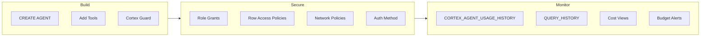

# Agent Governance Playbook

> [!CAUTION]
> **No support provided.** This content is for reference only. Review and validate before applying to any production workflow.


**Pair-programmed by:** SE Community + Cortex Code
**Created:** 2026-03-23 | **Expires:** 2027-03-23 | **Status:** ACTIVE

Operational patterns for running Cortex Agents responsibly in production: monitoring, access control, guardrails, cost controls, and audit trails. Everything in this guide comes from patterns proven in the demos and tools in this repository.



**Time:** ~30 minutes to read | **Result:** Production-ready governance checklist for Cortex Agents

## Who This Is For

Teams that have built a Cortex Agent (or plan to) and need to answer: "How do we run this safely in production?" You should already be familiar with agent basics -- if not, start with the [Campaign Engine Workshop](../demo-campaign-engine/GUIDED_BUILD.md) to build one first.

---

## Part 1: Content Safety -- Cortex Guard

Cortex Guard filters harmful content before it reaches users. Enable it by setting `guardrails: true` in AI_COMPLETE options.

```sql
SELECT AI_COMPLETE(
    'mistral-large2',
    [
        {'role': 'system', 'content': 'You are a helpful assistant.'},
        {'role': 'user', 'content': :user_input}
    ],
    {'guardrails': true, 'temperature': 0.7, 'max_tokens': 500}
):choices[0]:messages::STRING;
```

### Key Points

- Use the boolean `true` (not the old object syntax)
- Cortex Guard evaluates both input and output for safety
- Adds latency (~100-200ms) -- acceptable for production, may want to skip for batch processing
- Works with `AI_COMPLETE` function calls; agent objects have their own guardrail configuration in the YAML spec

### Agent YAML Guardrails

For agents created with `CREATE AGENT`, configure guardrails in the YAML specification:

```yaml
models:
  orchestration: auto

orchestration:
  budget:
    seconds: 60
    tokens: 16000
```

The `budget` block caps each agent invocation -- preventing runaway token consumption or long-running orchestration loops.

---

## Part 2: Access Control -- RBAC for Agents

### Grant Pattern

Every agent needs explicit grants. Follow the principle of least privilege:

```sql
-- Create a dedicated role for agent consumers
CREATE ROLE IF NOT EXISTS CORTEX_AGENT_USERS;

-- Grant access to the agent and its dependencies
GRANT USAGE ON DATABASE SNOWFLAKE_EXAMPLE TO ROLE CORTEX_AGENT_USERS;
GRANT USAGE ON SCHEMA SNOWFLAKE_EXAMPLE.<YOUR_SCHEMA> TO ROLE CORTEX_AGENT_USERS;
GRANT USAGE ON WAREHOUSE <YOUR_WAREHOUSE> TO ROLE CORTEX_AGENT_USERS;
GRANT USAGE ON AGENT SNOWFLAKE_EXAMPLE.<YOUR_SCHEMA>.<YOUR_AGENT> TO ROLE CORTEX_AGENT_USERS;

-- Grant the role to users who need access
GRANT ROLE CORTEX_AGENT_USERS TO ROLE SYSADMIN;
```

### Database Roles

For Cortex AI features, users need the `SNOWFLAKE.CORTEX_USER` database role:

```sql
GRANT DATABASE ROLE SNOWFLAKE.CORTEX_USER TO ROLE CORTEX_AGENT_USERS;
```

For cost monitoring views, grant `SNOWFLAKE.USAGE_VIEWER` instead of blanket `IMPORTED PRIVILEGES`:

```sql
GRANT DATABASE ROLE SNOWFLAKE.USAGE_VIEWER TO ROLE <MONITORING_ROLE>;
```

### Row Access Policies for Data Isolation

When agents serve multiple tenants, use Row Access Policies to enforce per-user data boundaries. The agent respects whatever RBAC context the calling user has:

```sql
CREATE OR REPLACE ROW ACCESS POLICY tenant_isolation_policy
  AS (row_tenant_id VARCHAR) RETURNS BOOLEAN ->
    row_tenant_id = CURRENT_USER()
    OR CURRENT_ROLE() IN ('ACCOUNTADMIN', 'SYSADMIN');

ALTER TABLE <YOUR_TABLE>
  ADD ROW ACCESS POLICY tenant_isolation_policy ON (tenant_id);
```

The Agent Run API supports `X-Snowflake-Role` headers for per-request RBAC context -- see [demo-agent-multicontext](../demo-agent-multicontext/) for the full pattern.

---

## Part 3: Authentication for Agent APIs

Three methods, each suited to a different use case:

| Method | Best For | Header |
|---|---|---|
| PAT | Development and testing | `Authorization: Bearer <pat_token>` |
| Key-Pair JWT | Service accounts in production | `Authorization: Bearer <jwt>` + `X-Snowflake-Authorization-Token-Type: KEYPAIR_JWT` |
| OAuth | End-user SSO (e.g., Azure AD) | `Authorization: Bearer <oauth_token>` |

### Decision Tree

- **Quick testing?** Use a PAT. Rotate it regularly ([tool-secrets-rotation-aws](../tool-secrets-rotation-aws/)).
- **Service account calling the API?** Use key-pair JWT. No secret to rotate, just the key pair.
- **End users authenticating?** Use OAuth with your IdP (Azure AD, Okta, etc.).

See [guide-api-agent-context](../guide-api-agent-context/) for working code examples of all three methods.

---

## Part 4: Network Security

Network policies control which IP addresses can access your Snowflake account. As of March 2026, network policies ARE supported for Cortex Agents with two caveats:

- IP addresses from Entra ID can be stale -- users may need to re-authenticate
- IPv6 addresses from Entra ID are not yet supported
- Private Link is NOT supported for agent endpoints

```sql
CREATE NETWORK POLICY agent_access_policy
    ALLOWED_IP_LIST = ('203.0.113.0/24', '198.51.100.0/24')
    COMMENT = 'Restrict agent API access to corporate network';

ALTER ACCOUNT SET NETWORK_POLICY = agent_access_policy;
```

---

## Part 5: Monitoring and Observability

### CORTEX_AGENT_USAGE_HISTORY

The primary view for agent monitoring. Available in `SNOWFLAKE.ACCOUNT_USAGE` with up to 3-hour latency:

```sql
SELECT
    start_time,
    end_time,
    user_name,
    agent_name,
    request_id,
    token_credits,
    tokens,
    DATEDIFF('ms', start_time, end_time) AS latency_ms
FROM SNOWFLAKE.ACCOUNT_USAGE.CORTEX_AGENT_USAGE_HISTORY
WHERE start_time >= DATEADD('day', -7, CURRENT_TIMESTAMP())
ORDER BY start_time DESC
LIMIT 50;
```

### Token Breakdown

The `TOKENS_GRANULAR` column is an OBJECT (not an array). Access fields with colon notation:

```sql
SELECT
    start_time,
    user_name,
    agent_name,
    tokens_granular:"input"::NUMBER AS input_tokens,
    tokens_granular:"output"::NUMBER AS output_tokens,
    token_credits
FROM SNOWFLAKE.ACCOUNT_USAGE.CORTEX_AGENT_USAGE_HISTORY
WHERE start_time >= DATEADD('day', -1, CURRENT_TIMESTAMP())
ORDER BY token_credits DESC;
```

### Hourly Cost Rollup

```sql
SELECT
    DATE_TRUNC('hour', start_time) AS hour,
    COUNT(*) AS invocations,
    SUM(token_credits) AS total_credits,
    AVG(DATEDIFF('ms', start_time, end_time)) AS avg_latency_ms
FROM SNOWFLAKE.ACCOUNT_USAGE.CORTEX_AGENT_USAGE_HISTORY
WHERE start_time >= DATEADD('day', -7, CURRENT_TIMESTAMP())
GROUP BY 1
ORDER BY 1 DESC;
```

### QUERY_HISTORY for Audit Trails

Every SQL query generated by an agent is logged in `QUERY_HISTORY`. Cross-reference with `CORTEX_AGENT_USAGE_HISTORY` via timestamps and user context for a complete audit trail.

---

## Part 6: Cost Controls

### Orchestration Budget (Per-Invocation)

Set in the agent YAML to cap each individual run:

```yaml
orchestration:
  budget:
    seconds: 60
    tokens: 16000
```

### Per-User Monthly Budgets

Use the governance module from [tool-cortex-cost-intelligence](../tool-cortex-cost-intelligence/) for organization-wide controls:

```sql
-- Grant a user a monthly AI budget (in credits)
CALL PROC_GRANT_AI_ACCESS('ALICE', 500);
CALL PROC_GRANT_AI_ACCESS('BOB', 1000);

-- Check current budget status
CALL PROC_CHECK_USER_BUDGETS();
```

### Runaway Detection

Automated detection and cancellation of queries exceeding a credit threshold:

```sql
CALL PROC_MONITOR_AND_CANCEL_RUNAWAY_QUERIES(50);
```

### Warehouse-Level Controls

Always set timeouts on agent warehouses to prevent runaway queries:

```sql
ALTER WAREHOUSE SFE_MY_AGENT_WH SET
    STATEMENT_TIMEOUT_IN_SECONDS = 120
    AUTO_SUSPEND = 60
    AUTO_RESUME = TRUE;
```

---

## Production Readiness Checklist

| Category | Check | Reference |
|---|---|---|
| **Content Safety** | Cortex Guard enabled on AI_COMPLETE calls | Part 1 |
| **Content Safety** | Orchestration budget set in agent YAML | Part 1 |
| **Access Control** | Dedicated role for agent consumers (not PUBLIC) | Part 2 |
| **Access Control** | Row Access Policies for multi-tenant data | Part 2 |
| **Access Control** | CORTEX_USER database role granted | Part 2 |
| **Authentication** | Key-pair JWT or OAuth for production (not PAT) | Part 3 |
| **Authentication** | PAT rotation automated if PATs are used | Part 3 |
| **Network** | Network policy restricts agent API access | Part 4 |
| **Monitoring** | CORTEX_AGENT_USAGE_HISTORY queries scheduled | Part 5 |
| **Monitoring** | Cost views deployed from tool-cortex-cost-intelligence | Part 5 |
| **Cost Controls** | Per-user budgets configured | Part 6 |
| **Cost Controls** | Warehouse timeout set | Part 6 |
| **Audit** | QUERY_HISTORY retention policy reviewed | Part 5 |

---

## Related Projects

- [`demo-campaign-engine`](../demo-campaign-engine/) -- Build an agent from scratch with GUIDED_BUILD workshop
- [`demo-cortex-teams-agent`](../demo-cortex-teams-agent/) -- Agent deployed to Teams with Cortex Guard and security integration
- [`demo-agent-multicontext`](../demo-agent-multicontext/) -- Per-request context injection with Row Access Policies and observability
- [`tool-cortex-cost-intelligence`](../tool-cortex-cost-intelligence/) -- Cost governance platform with budgets, alerts, and runaway detection
- [`tool-agent-config-diff`](../tool-agent-config-diff/) -- Extract agent specs for version control
- [`guide-api-agent-context`](../guide-api-agent-context/) -- Agent Run API with three auth methods
- [`guide-agent-multi-tenant`](../guide-agent-multi-tenant/) -- Multi-tenant architecture with Azure AD OAuth + RAPs
