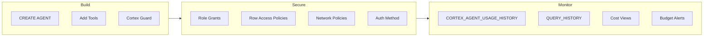

# Agent Governance Playbook

Inspired by the question every team asks after building their first agent: *"How do we run this safely in production?"*

Operational patterns for running Cortex Agents responsibly: content safety with Cortex Guard, RBAC with dedicated roles and Row Access Policies, three authentication methods, network security, observability via CORTEX_AGENT_USAGE_HISTORY, and cost controls with per-user budgets and runaway detection. Everything comes from patterns proven in the demos and tools in this repository.

**Pair-programmed by:** SE Community + Cortex Code
**Created:** 2026-03-23 | **Expires:** 2026-05-22 | **Status:** ACTIVE

> **No support provided.** This content is for reference only. Review and validate before applying to any production workflow.

**Time:** ~30 minutes to read | **Result:** Production-ready governance checklist for Cortex Agents

---

## Who This Is For

Teams that have built a Cortex Agent (or plan to) and need to answer: *"How do we run this safely in production?"* You should already be familiar with agent basics -- if not, start with the [Campaign Engine Workshop](../demo-campaign-engine/GUIDED_BUILD.md) to build one first.

---

## The Approach



Six parts, each with SQL you can copy into Snowsight:

| Part | What It Covers |
|------|---------------|
| [Part 1: Content Safety](#part-1-content-safety----cortex-guard) | Cortex Guard + orchestration budgets |
| [Part 2: Access Control](#part-2-access-control----rbac-for-agents) | Dedicated roles, database roles, Row Access Policies |
| [Part 3: Authentication](#part-3-authentication-for-agent-apis) | PAT vs Key-Pair JWT vs OAuth decision tree |
| [Part 4: Network Security](#part-4-network-security) | Network policies for agent endpoints |
| [Part 5: Monitoring](#part-5-monitoring-and-observability) | CORTEX_AGENT_USAGE_HISTORY, token breakdown, hourly rollups |
| [Part 6: Cost Controls](#part-6-cost-controls) | Per-invocation budgets, per-user monthly budgets, runaway detection |

> [!TIP]
> **Pattern demonstrated:** Six-pillar agent governance framework -- the production checklist for any Cortex Agent deployment.

---

## Part 1: Content Safety -- Cortex Guard

Cortex Guard filters harmful content before it reaches users. Enable it by setting `guardrails: true` in AI_COMPLETE options.

```sql
SELECT AI_COMPLETE(
    'mistral-large2',
    PROMPT('You are a helpful assistant.', :user_input),
    {'guardrails': true, 'temperature': 0.7, 'max_tokens': 500}
)::STRING;
```

For agents created with `CREATE AGENT`, set orchestration budgets in the YAML:

```yaml
orchestration:
  budget:
    seconds: 60
    tokens: 16000
```

---

## Part 2: Access Control -- RBAC for Agents

```sql
CREATE ROLE IF NOT EXISTS CORTEX_AGENT_USERS;

GRANT USAGE ON DATABASE SNOWFLAKE_EXAMPLE TO ROLE CORTEX_AGENT_USERS;
GRANT USAGE ON SCHEMA SNOWFLAKE_EXAMPLE.<YOUR_SCHEMA> TO ROLE CORTEX_AGENT_USERS;
GRANT USAGE ON WAREHOUSE <YOUR_WAREHOUSE> TO ROLE CORTEX_AGENT_USERS;
GRANT USAGE ON AGENT SNOWFLAKE_EXAMPLE.<YOUR_SCHEMA>.<YOUR_AGENT> TO ROLE CORTEX_AGENT_USERS;

-- CORTEX_AGENT_USER is scoped to Agents API only (preferred for least privilege).
-- CORTEX_USER is broader and granted to PUBLIC by default; revoke it from
-- consumer roles if you standardize on the agent-specific role.
GRANT DATABASE ROLE SNOWFLAKE.CORTEX_AGENT_USER TO ROLE CORTEX_AGENT_USERS;
```

For multi-tenant agents, Row Access Policies enforce per-user data boundaries:

```sql
CREATE OR REPLACE ROW ACCESS POLICY tenant_isolation_policy
  AS (row_tenant_id VARCHAR) RETURNS BOOLEAN ->
    row_tenant_id = CURRENT_USER()
    OR CURRENT_ROLE() IN ('ACCOUNTADMIN', 'SYSADMIN');
```

---

## Part 3: Authentication for Agent APIs

| Method | Best For | Header |
|---|---|---|
| PAT | Development and testing | `Authorization: Bearer <pat_token>` |
| Key-Pair JWT | Service accounts in production | `Authorization: Bearer <jwt>` + `X-Snowflake-Authorization-Token-Type: KEYPAIR_JWT` |
| OAuth | End-user SSO (Azure AD, Okta) | `Authorization: Bearer <oauth_token>` |

See [guide-api-agent-context](../guide-api-agent-context/) for working code examples of all three methods.

---

## Part 4: Network Security

Network policies are supported for Cortex Agents as of March 2026, with caveats (stale Entra ID IPs, no IPv6, no Private Link for agent endpoints).

```sql
CREATE NETWORK POLICY agent_access_policy
    ALLOWED_IP_LIST = ('203.0.113.0/24', '198.51.100.0/24')
    COMMENT = 'Restrict agent API access to corporate network';
```

---

## Part 5: Monitoring and Observability

`TOKENS_GRANULAR` is an `ARRAY` -- each element represents one service call within the agent invocation. Flatten it to extract per-call token counts:

```sql
SELECT
    h.start_time,
    h.user_name,
    h.agent_name,
    t.value:"service_type"::STRING  AS service_type,
    t.value:"model"::STRING         AS model,
    t.value:"input"::NUMBER         AS input_tokens,
    t.value:"output"::NUMBER        AS output_tokens,
    h.token_credits
FROM SNOWFLAKE.ACCOUNT_USAGE.CORTEX_AGENT_USAGE_HISTORY h,
     LATERAL FLATTEN(input => h.tokens_granular) t
WHERE h.start_time >= DATEADD('day', -7, CURRENT_TIMESTAMP())
ORDER BY h.token_credits DESC;
```

> [!IMPORTANT]
> This view covers requests made through the Cortex Agents Run API only. Requests originating from **Snowflake Intelligence** are tracked separately in `SNOWFLAKE.ACCOUNT_USAGE.SNOWFLAKE_INTELLIGENCE_USAGE_HISTORY`.

---

## Part 6: Cost Controls

### Native resource budgets

Snowflake's built-in budget system provides tag-scoped credit monitoring with threshold alerts:

```sql
CALL SNOWFLAKE.LOCAL.ACCOUNT_ROOT_BUDGET!SET_SPENDING_LIMIT(500);
CALL SNOWFLAKE.LOCAL.ACCOUNT_ROOT_BUDGET!SET_EMAIL_NOTIFICATIONS('agent-ops@example.com');
```

For finer control, create custom budgets scoped to specific warehouses or tags using `SNOWFLAKE.CORE.BUDGET`.

### Custom governance procedures

For per-user limits and runaway detection beyond native budgets, see [tool-ai-spend-controls](../tool-ai-spend-controls/):

```sql
CALL PROC_GRANT_AI_ACCESS('ALICE', 500);
CALL PROC_CHECK_USER_BUDGETS();
CALL PROC_MONITOR_AND_CANCEL_RUNAWAY_QUERIES(50);

ALTER WAREHOUSE SFE_MY_AGENT_WH SET
    STATEMENT_TIMEOUT_IN_SECONDS = 120
    AUTO_SUSPEND = 60
    AUTO_RESUME = TRUE;
```

---

## Production Readiness Checklist

| Category | Check | Reference |
|---|---|---|
| **Content Safety** | Cortex Guard enabled on AI_COMPLETE calls | Part 1 |
| **Content Safety** | Orchestration budget set in agent YAML | Part 1 |
| **Access Control** | Dedicated role for agent consumers (not PUBLIC) | Part 2 |
| **Access Control** | Row Access Policies for multi-tenant data | Part 2 |
| **Access Control** | CORTEX_AGENT_USER database role granted (least-privilege) | Part 2 |
| **Authentication** | Key-pair JWT or OAuth for production (not PAT) | Part 3 |
| **Authentication** | PAT rotation automated if PATs are used | Part 3 |
| **Network** | Network policy restricts agent API access | Part 4 |
| **Monitoring** | CORTEX_AGENT_USAGE_HISTORY queries scheduled | Part 5 |
| **Monitoring** | Cost views deployed from tool-ai-spend-controls | Part 5 |
| **Cost Controls** | Per-user budgets configured | Part 6 |
| **Cost Controls** | Warehouse timeout set | Part 6 |
| **Audit** | QUERY_HISTORY retention policy reviewed | Part 5 |

---

## Appendix: Agent Config Diff

As teams build more Cortex Agents, configuration drift becomes invisible. An agent's YAML spec, profile, and tool list can change without anyone tracking what was different.

The scripts in `scripts/` extract agent specifications for diff tools and version control using `DESC AGENT` + `RESULT_SCAN`.

### Interactive SQL (Snowsight / SnowSQL)

See [`scripts/extract_agent_spec.sql`](scripts/extract_agent_spec.sql). Set the agent FQN and output format, then run:

```sql
SET agent_fqn = 'YOUR_DATABASE.YOUR_SCHEMA.YOUR_AGENT';
SET output_format = 'export';  -- Options: 'full', 'spec_only', 'export'
DESC AGENT IDENTIFIER($agent_fqn);
```

Three output formats:
- **full** -- All agent properties with parsed profile JSON (config management)
- **spec_only** -- Just the YAML spec (line-by-line diff)
- **export** -- Single JSON document with config hash (version control commits)

### Programmatic Python

See [`scripts/extract_agent_spec.py`](scripts/extract_agent_spec.py). No interactive session needed:

```bash
python scripts/extract_agent_spec.py DB.SCHEMA.AGENT --format export
python scripts/extract_agent_spec.py DB.SCHEMA.AGENT --format spec_only > agent_spec.yaml
diff agent_spec_v1.yaml agent_spec_v2.yaml
```

### Tips

- `DESC AGENT` is the correct syntax (not `DESC CORTEX AGENT`)
- Agent spec is returned as YAML, not JSON
- Profile is JSON inside a string column -- use `TRY_PARSE_JSON()` in SQL
- `RESULT_SCAN` requires an interactive session; the Python script is the programmatic alternative
- Use `SHOW AGENTS IN SCHEMA <db>.<schema>` to list all agents

---

## Related Projects

- [`demo-campaign-engine`](../demo-campaign-engine/) -- Build an agent from scratch with GUIDED_BUILD workshop
- [`demo-cortex-teams-agent`](../demo-cortex-teams-agent/) -- Agent deployed to Teams with Cortex Guard and security integration
- [`demo-agent-multicontext`](../demo-agent-multicontext/) -- Per-request context injection with Row Access Policies and observability
- [`tool-ai-spend-controls`](../tool-ai-spend-controls/) -- Cost governance platform with budgets, alerts, and runaway detection
- [`guide-api-agent-context`](../guide-api-agent-context/) -- Agent Run API with three auth methods
- [`guide-agent-multi-tenant`](../guide-agent-multi-tenant/) -- Multi-tenant architecture with Azure AD OAuth + RAPs

## References

- [Cortex Agents Overview](https://docs.snowflake.com/en/user-guide/snowflake-cortex/cortex-agents)
- [CREATE AGENT](https://docs.snowflake.com/en/sql-reference/sql/create-agent)
- [CORTEX_AGENT_USAGE_HISTORY](https://docs.snowflake.com/en/sql-reference/account-usage/cortex_agent_usage_history)
- [AI_COMPLETE (Prompt object)](https://docs.snowflake.com/en/sql-reference/functions/ai_complete-prompt-object)
- [CREATE ROW ACCESS POLICY](https://docs.snowflake.com/en/sql-reference/sql/create-row-access-policy)
- [Resource Budgets for Cortex Agents](https://docs.snowflake.com/en/user-guide/snowflake-cortex/cortex-agents-resource-budgets)
- [REST API Authentication](https://docs.snowflake.com/en/developer-guide/snowflake-rest-api/authentication)
- [Network Policies](https://docs.snowflake.com/en/user-guide/network-policies)
