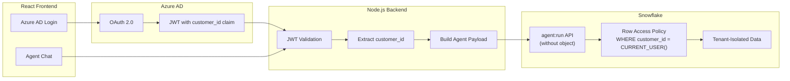

# Multi-Tenant Cortex Agent with Azure AD

Inspired by the question every ISV asks: *"How do I build a customer-facing AI agent where each tenant only sees their own data -- with real authentication, not a user picker?"*

This guide provides the reference architecture for a production multi-tenant agent: React frontend, Azure AD OAuth for customer identity, Node.js backend with JWT claim extraction, and Snowflake Row Access Policies for per-tenant data isolation enforced at the SQL layer. Every request carries the customer's identity from Azure AD all the way down to the Row Access Policy -- no simulated users, no hardcoded roles.

**Author:** SE Community
**Last Updated:** 2026-03-02 | **Status:** ACTIVE

> **No support provided.** This content is for reference only. Review, test, and modify before any production use.

---

## Who This Is For

Teams designing a production multi-tenant agent application on Snowflake. You should already be familiar with the Cortex Agent API (see [guide-api-agent-context](../guide-api-agent-context/) for code snippets) and understand Snowflake RBAC basics.

**Want to see context injection working first?** Start with the [demo-agent-multicontext](../demo-agent-multicontext/) runnable demo, then come back here for the production architecture.

---

## The Approach

The complete implementation guide (~2,000 lines) is in [`agent_run_multitenant.md`](agent_run_multitenant.md). Architecture diagrams (12 Mermaid diagrams) are in [`diagrams.md`](diagrams.md).

### Key Design Decisions

| Decision | Choice | Why |
|---|---|---|
| API approach | "Without agent object" (inline config) | Full control over system prompt, tools, and role per request |
| Customer identity | Azure AD OAuth with JWT `customer_id` claim | Production-grade SSO with enterprise IdP |
| Data isolation | Row Access Policies via `CURRENT_USER()` | SQL-layer enforcement invisible to the agent |
| Auth for testing | PAT (switchable to JWT for production) | See [guide-api-agent-context](../guide-api-agent-context/) |

> [!TIP]
> **Pattern demonstrated:** End-to-end tenant isolation from Azure AD JWT claims through to Snowflake Row Access Policies -- the production pattern for multi-tenant agent applications.

---

## Related Projects

Three projects in this repo cover Cortex Agent context and multi-tenancy. This guide focuses on the production architecture.

| | This project | [demo-agent-multicontext](../demo-agent-multicontext/) | [guide-api-agent-context](../guide-api-agent-context/) |
|---|---|---|---|
| **Type** | Architecture guide | Runnable demo | Code snippet guide |
| **API Approach** | With agent object | Without agent object | Both |
| **Auth Pattern** | Azure AD + External OAuth | Simulated user picker | PAT / OAuth / Key-Pair JWT |
| **Data Isolation** | Row Access Policies via CURRENT_USER() | Row Access Policies via X-Snowflake-Role | Not implemented |
| **Start here if...** | "I'm designing a production app" | "I want to see context injection" | "I need the API syntax" |
