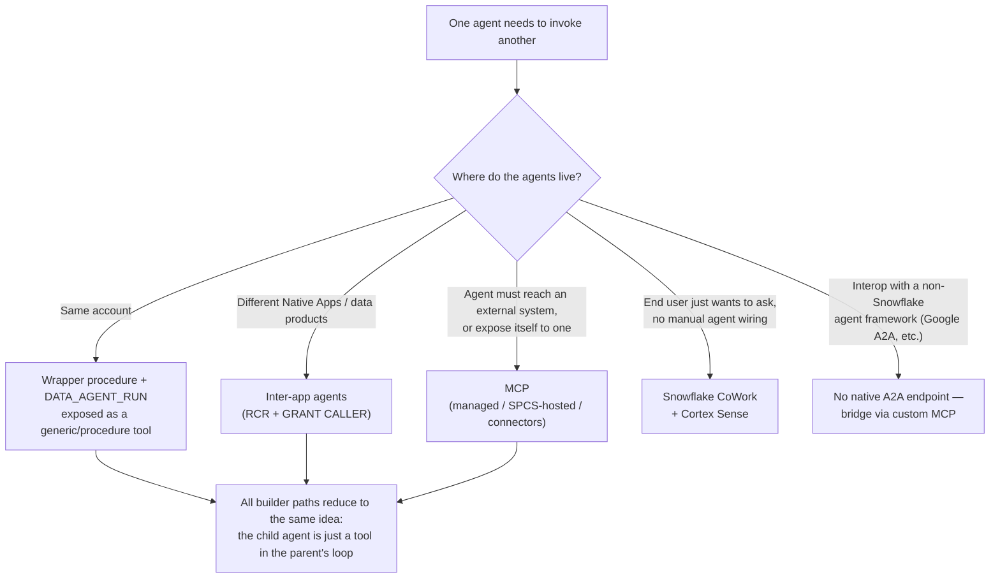

# Agent-to-Agent Orchestration on Snowflake

One agent calling another is not one feature — it's four different mechanisms with different maturity, security models, and failure modes. This guide tells you which one you actually need, hands you a working same-account pattern, and is honest about what isn't native yet.

**Audience:** SEs framing the agentic story for customers + builders wiring agents together
**Created:** 2026-06-30 | **Expires:** 2026-12-31 | **Status:** ACTIVE

Pair-programmed by SE Community + Cortex Code

> **No support provided.** Reference only; validate before production. This is a **fast-moving, mostly-preview area** — inter-app agents and the Natoma/MCP gateway are pre-GA and the syntax will drift. Every claim here was checked against Snowflake docs on the created date; re-verify before quoting maturity to a customer. Maturity is labeled per layer.

> **The one-line answer.** Snowflake does **not** ship a proprietary agent-to-agent bus. It makes the child agent look like a *tool* — either a SQL wrapper procedure (`DATA_AGENT_RUN`) or an MCP server — and lets the parent agent's normal plan→act loop call it. "Agent → agent" and "agent → system" converge on the same two primitives.

---

## Start Here: Which Path Do You Actually Need?

Pick by *what's calling what*, not by buzzword. The row you land on is the rest of the guide.

| Need | Use | Maturity |
|---|---|---|
| One agent delegates to another, **same account** | `generic`/`procedure` tool → owner's-rights wrapper proc → `DATA_AGENT_RUN` | **GA** primitives ([walkthrough](same-account-agent-to-agent.md)) |
| Agents across **Native Apps / data products** | Inter-app agents: RCR + `GRANT CALLER` | **Preview (Open)** — all accounts |
| Agent reaches an **external system**, or exposes itself | MCP: `CREATE MCP SERVER` / `CREATE CUSTOM MCP SERVER` / MCP connectors | **GA** (managed server) |
| End user **"just ask, it coordinates"** | Snowflake CoWork + Cortex Sense | **GA** |
| Interop with **non-Snowflake** agent frameworks | MCP today; Google A2A **only via custom bridge** | No native A2A |

> **One agent delegates to another, same account** is the only row most customer demos need. Start there — the [working spec](same-account-agent-to-agent.md) drops straight into a worksheet.

---

## The Layers, From Inside One Agent to Across Vendors

Each layer below is "make another agent look like a tool." Read only the rows you'll act on.

### 1. Single-agent loop (GA) — the substrate

A Cortex Agent already runs its own LLM-driven **plan → use tools → reflect** loop inside one `agent:run`. This isn't agent-to-agent, but everything else is just making *another* agent show up as a tool inside this loop. If you understand the agent's tool list, you understand orchestration.

### 2. Agent calls agent, same account (GA primitives) — the real mechanism

The actual plumbing for one agent invoking another:

1. Wrap a call to `SNOWFLAKE.CORTEX.DATA_AGENT_RUN('DB.SCHEMA.CHILD_AGENT', '<json>')` in an `EXECUTE AS OWNER` stored procedure.
2. Expose that procedure to the parent agent as a tool (`tool_spec` `type: generic`, with a `tool_resources` entry of `type: procedure`).

The parent treats the child as just another callable tool. This is the building block the Native App pattern formalizes. **Full working spec: [same-account-agent-to-agent.md](same-account-agent-to-agent.md).**

> **`DATA_AGENT_RUN` vs `AGENT_RUN` — don't confuse them.** `DATA_AGENT_RUN('db.schema.agent', …)` runs a **named agent object**. `AGENT_RUN(…)` runs an **objectless** agent whose tools/model you pass inline. For agent-to-agent you almost always want `DATA_AGENT_RUN` (the child is a real, governed object). Both are GA "utility wrappers around the Cortex Agents Run API." For app integrations Snowflake recommends the **streaming REST API** over either SQL wrapper — the SQL functions always return non-streaming JSON.

### 3. Inter-app agents (Preview — Open, all accounts) — the official cross-boundary story

A client app's agent can call another app's agent (agent-to-agent) or use another app's MCP server (agent-to-MCP). The security model is the part that bites you:

| What | Rule |
|---|---|
| Rights model | App agents run under **Restricted Caller's Rights (RCR)** — default **no access** to consumer data |
| Cross-app access | Requires explicit **`GRANT CALLER`** from the consumer admin (database/schema/object scope) |
| Enforcement date | **June 5, 2026** for Native App Cortex Agents — *this is now in effect*. Versions published before the cutoff are grandfathered under the old Caller's Rights model |
| MCP-in-app limit | App-created **managed** MCP servers are restricted to **app-owned tools** — no `SYSTEM_EXECUTE_SQL`, no cross-app tools |

> **Design-review landmine: caller grants do NOT chain.** When a parent agent calls a child agent's owner's-rights wrapper procedure, the wrapper **resets the caller context**. Each RCR agent's caller-grant requirement is evaluated *independently* — the child agent's access to consumer data depends on grants made directly to *its own* app, not on what the parent app was granted. Teams routinely assume grants flow through the chain. They don't. Flag this in any inter-app design.

### 4. MCP as the interop fabric (GA) — the strategic direction

Snowflake leans on **MCP**, not a proprietary bus, for cross-system orchestration:

| Object | What it wraps | When |
|---|---|---|
| `CREATE MCP SERVER` (Snowflake-managed) | Cortex Search, Cortex Analyst (semantic views), **Cortex Agents** (`CORTEX_AGENT_RUN`), UDFs/procs (`GENERIC`), SQL (`SYSTEM_EXECUTE_SQL`) | Tools map to Snowflake-native objects |
| `CREATE CUSTOM MCP SERVER` (SPCS-hosted) | Arbitrary code / ML behind an SPCS endpoint | You need custom compute, external APIs, a non-SQL framework |
| MCP connectors | Remote third-party MCP servers (Jira, Salesforce, your own) | Agent reaches outward |

Because an agent can be *wrapped as* an MCP tool **and** *consume* MCP tools, "agent → agent" and "agent → system" collapse into one pattern. Any MCP-compatible client — Claude, ChatGPT, Cursor, or another Cortex agent — can call a Snowflake agent through the managed endpoint.

> **New gotcha the layer adds: max recursion depth = 10.** An external client → Cortex Agent (via MCP) → another MCP server → back into a Cortex Agent is a circular path. Snowflake hard-caps recursion at **10 invocations** to stop unbounded, expensive loops. Design tool graphs so they don't cycle.

### 5. CoWork (GA) — the productized end-user layer

**Snowflake CoWork** is the packaged experience: a personal agent that uses multi-agent orchestration + **Cortex Sense** to decompose a request and coordinate specialist agents behind the scenes — no manual agent selection. App-created agents and managed MCP tools surface here automatically. This is the "we orchestrate for you" answer for knowledge workers; layers 2–4 are the builder plumbing underneath it.

---

## What Is NOT Native Yet (Be Honest With Customers)

| Gap | Reality |
|---|---|
| **Google A2A protocol** | No native Cortex A2A endpoint. Snowflake doesn't *expose* A2A. Bridging exists only via custom patterns — wrap a Cortex agent behind an A2A Agent Card server, or point Microsoft AI Foundry's A2A tool at a Cortex endpoint. Foundry can *consume*; Snowflake won't *serve* A2A. |
| **The `AGENT_RUN()` "no tool execution" claim** | A practitioner write-up reported child agents invoked through the SQL `AGENT_RUN()` path "show intent to query but never execute tools." This is **not** a documented limitation — treat it as a thing to **validate in a POC**, not a fact. The supported, working path is the **wrapper-procedure + `DATA_AGENT_RUN`** pattern in this guide. |
| **Deterministic chaining** | The managed agent loop is LLM-driven and can be non-deterministic. When you need failures to surface predictably (retries, ordering, idempotency), orchestrate with **Tasks / stored procedures** calling `DATA_AGENT_RUN`, not agent-to-agent delegation. |
| **Code-first multi-agent control** | If a customer wants explicit routing instead of the managed loop, point them at the Snowflake-Labs **`orchestration-framework`** (Agent Gateway) OSS project. |

---

## How to Frame It in a Customer Meeting

1. **There's no agent bus — there's a tool list.** Every path makes the child agent a callable tool. This is simpler than customers expect and reuses the governance they already have.
2. **Same account? It's GA today.** `DATA_AGENT_RUN` in an owner's-rights proc, exposed as a tool. Demo-ready now — see the [working spec](same-account-agent-to-agent.md).
3. **Across apps/vendors? It's MCP + RCR, and it's mostly preview.** Lead with the security model (RCR, `GRANT CALLER`, grants-don't-chain) because that's where designs go wrong, not the syntax.
4. **End users? CoWork hides all of it.** The plumbing above is for builders; business users get CoWork + Cortex Sense.

---

## External References

- [Cortex Agents](https://docs.snowflake.com/en/user-guide/snowflake-cortex/cortex-agents)
- [Cortex Agents Run API](https://docs.snowflake.com/en/user-guide/snowflake-cortex/cortex-agents-run)
- [`DATA_AGENT_RUN` (SNOWFLAKE.CORTEX)](https://docs.snowflake.com/en/sql-reference/functions/data_agent_run-snowflake-cortex)
- [`AGENT_RUN` (SNOWFLAKE.CORTEX)](https://docs.snowflake.com/en/sql-reference/functions/agent_run-snowflake-cortex)
- [Use inter-app agents and MCP servers](https://docs.snowflake.com/en/developer-guide/native-apps/inter-app-agents)
- [Use Cortex Agents and MCP servers in an app](https://docs.snowflake.com/en/developer-guide/native-apps/agents-mcp-servers)
- [Updating Native Apps for Restricted Caller's Rights (June 5, 2026)](https://community.snowflake.com/s/article/updating-native-apps-to-support-restricted-callers-rights-for-cortex-agents)
- [Snowflake-managed MCP server](https://docs.snowflake.com/en/user-guide/snowflake-cortex/cortex-agents-mcp)
- [Snowflake CoWork](https://www.snowflake.com/en/product/snowflake-cowork/)
- [Snowflake-Labs orchestration-framework (Agent Gateway)](https://github.com/snowflake-labs/orchestration-framework)

---

Pair-programmed by SE Community + Cortex Code
