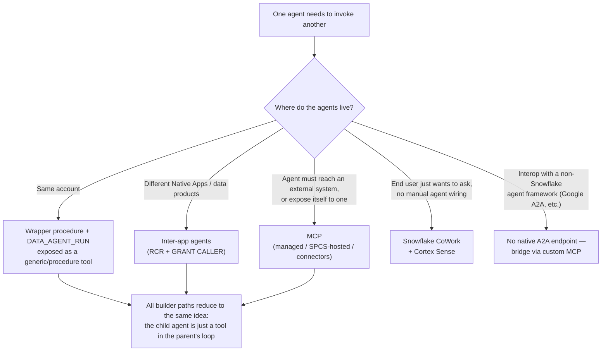

# Agent-to-Agent Orchestration on Snowflake

An **agent** is an AI assistant that lives in Snowflake and answers questions by reasoning and calling **tools** (run a query, search documents, call a function). **"Agent-to-agent"** simply means one agent handing part of a job to another agent — and **"orchestration"** is the behind-the-scenes coordination that makes that happen.

There are four ways to wire one agent to another. They differ in how mature they are, how they handle security, and how they can fail. This guide picks the right one for your situation, gives you a working example, and is honest about what Snowflake can't do yet.

**Audience:** anyone new to Snowflake who needs to understand or set up agents calling agents — whether you're explaining it to a customer or building it yourself. No prior Snowflake knowledge assumed.
**Created:** 2026-06-30 | **Expires:** 2026-12-31 | **Status:** ACTIVE

Pair-programmed by SE Community + Cortex Code

> **No support provided.** Reference only; test before you rely on it in production. This is a **fast-moving area**, and some features here are **pre-release** (Snowflake calls this "Preview") — the exact commands may change. Every claim was checked against Snowflake's official docs on the created date above; re-verify before quoting it to anyone. Each section says how mature its feature is.

## New to Snowflake? Read these words once

This vocabulary shows up throughout the guide. Skim the table once and the rest reads easily — you don't need to memorize it.

| Term | In plain words |
|---|---|
| **Snowflake account** | Your company's Snowflake environment — its data, its compute, and its users. |
| **Cortex Agent** | An AI assistant inside Snowflake that answers questions by reasoning and calling tools. |
| **Tool** | One capability an agent can call — run a query, search documents, run a function. The agent decides when to use each one. |
| **Orchestration** | The agent's loop of choosing which tools to use, and in what order, to answer a question. |
| **Cortex Analyst** | A tool that turns a plain-English question into a database query. |
| **Cortex Search** | A tool that searches documents and other free-form text. |
| **Semantic view** | A business-friendly description of your tables (their names, key numbers, and how they connect) so the AI asks for the right thing. |
| **Stored procedure** | A block of code saved inside Snowflake that you run by name, like a function. |
| **Owner's rights** (`EXECUTE AS OWNER`) | The saved code runs with *its creator's* permissions, not the permissions of whoever calls it. |
| **Warehouse** | Snowflake's compute engine. Agents and queries need one to actually run. |
| **`DATA_AGENT_RUN`** | A built-in Snowflake function that runs a named agent from SQL. |
| **Native App** | A packaged application installed from the Snowflake Marketplace that runs inside your own account. |
| **Restricted Caller's Rights (RCR)** | A safety rule for installed apps: the app gets **no** access to your data unless you explicitly grant it — and only exactly what you grant. |
| **`GRANT CALLER`** | The command an admin runs to give an installed app one of those explicit permissions. |
| **MCP** (Model Context Protocol) | An open industry standard that lets AI agents and tools talk to each other — and to outside systems — through one consistent interface. |
| **MCP server** | An endpoint that offers tools over MCP, so any MCP-aware app (Claude, ChatGPT, or another agent) can use them. |
| **SPCS** (Snowpark Container Services) | Snowflake's way to run your own containerized code inside Snowflake. |
| **CoWork** | Snowflake's chat experience for business users; it coordinates agents for you, with no wiring. |
| **Cortex Sense** | The service that hands your business definitions to an agent at the moment it answers. |
| **Google A2A** | Google's "Agent2Agent" — a *different*, non-Snowflake standard for agents to talk across vendors. |
| **GA / Preview** | Maturity labels. **GA** (Generally Available) = production-ready. **Preview** = early access, may still change. |

> **The one-line answer.** Snowflake has **no special "agent bus."** To make one agent call another, you make the second agent look like a **tool** that the first one can call — either through a small saved procedure (using the `DATA_AGENT_RUN` function) or through an **MCP server**. That's the whole trick. "One agent calling another" and "an agent calling an outside system" turn out to be the same move.

---

## Start Here: Which Path Do You Actually Need?

Pick by *what's calling what*, not by buzzword. The row you land on is the rest of the guide.

| Need | Use | Maturity |
|---|---|---|
| One agent hands work to another, **in the same account** | A small saved procedure (using `DATA_AGENT_RUN`) exposed as a tool | **GA** building blocks ([walkthrough](same-account-agent-to-agent.md)) |
| Agents across **Native Apps / data products** | Inter-app agents: RCR + `GRANT CALLER` | **Preview (Open)** — all accounts |
| Agent reaches an **external system**, or exposes itself | MCP: `CREATE MCP SERVER` / `CREATE CUSTOM MCP SERVER` / MCP connectors | **GA** (managed server) |
| End user **"just ask, it coordinates"** | Snowflake CoWork + Cortex Sense | **GA** |
| Interop with **non-Snowflake** agent frameworks | MCP today; Google A2A **only via custom bridge** | No native A2A |

> **The first row (same account) is the only one most demos need.** Start there — the [working example](same-account-agent-to-agent.md) drops straight into a Snowflake SQL worksheet.

---

## The Layers, From Inside One Agent to Across Vendors

Every layer below is the same idea — *make another agent look like a tool.* Read only the ones you'll actually use.

### 1. A single agent on its own (GA) — the foundation

A Cortex Agent already runs its own loop: **plan → use a tool → look at the result → repeat** until it can answer. This isn't agent-to-agent yet, but it's the base everything builds on — every other layer just makes *another* agent show up as one more tool inside this loop. Understand an agent's list of tools and you understand orchestration.

### 2. One agent calls another, same account (GA) — the real mechanism

The actual plumbing for one agent calling another:

1. Wrap a call to `SNOWFLAKE.CORTEX.DATA_AGENT_RUN('DB.SCHEMA.CHILD_AGENT', '<json>')` in an `EXECUTE AS OWNER` stored procedure.
2. Expose that procedure to the parent agent as a tool (`tool_spec` `type: generic`, with a `tool_resources` entry of `type: procedure`).

The parent treats the child as just another callable tool. This is the building block the Native App pattern formalizes. **Full working spec: [same-account-agent-to-agent.md](same-account-agent-to-agent.md).**

> **Two similarly named functions — don't mix them up.** `DATA_AGENT_RUN('db.schema.agent', …)` runs an agent you've already created and saved (a *named* agent). `AGENT_RUN(…)` runs a throwaway agent you define right inside the call (nothing saved). For one agent calling another, you almost always want `DATA_AGENT_RUN`, because the agent being called is a real, saved, permission-controlled object. Both are production-ready (GA) shortcuts that wrap Snowflake's underlying Cortex Agents web API. If you're building an app that needs to show the answer appear word-by-word, Snowflake suggests calling that web API directly instead — these SQL functions always return the whole answer in one piece.

### 3. Agents in two different installed apps (Preview — available to all accounts)

When the two agents live in *separate* installed apps (Native Apps), one app's agent can call the other app's agent, or use the other app's MCP server. The security model is the part that bites you.

> In this section, **"consumer"** = the account (or its admin) that *installed* the app; **"provider"** = whoever published it.

| What | Rule |
|---|---|
| Rights model | App agents run under **Restricted Caller's Rights (RCR)** — default **no access** to consumer data |
| Cross-app access | Requires explicit **`GRANT CALLER`** from the consumer admin (database/schema/object scope) |
| Enforcement date | **June 5, 2026** for Native App Cortex Agents — *this is now in effect*. Apps published before that date keep working under the older, looser rules (they're "grandfathered") |
| MCP-in-app limit | App-created **managed** MCP servers are restricted to **app-owned tools** — no `SYSTEM_EXECUTE_SQL`, no cross-app tools |

> **Design-review landmine: permissions don't pass down the chain.** Plain version: if agent A calls agent B, the data access you granted to **A does not flow to B** — you must grant B its own access directly. The technical reason: the call hops through a saved procedure that runs with *its own* identity (owner's rights), which resets who's asking. So each agent's permission requirement (RCR) is checked on its own. Teams routinely assume a grant to the first app covers the whole chain. It doesn't. Call this out in any cross-app design.

### 4. MCP — the shared connector (GA) — how agents reach other systems and each other

Snowflake leans on the **MCP** open standard, not a private Snowflake-only mechanism, to connect across systems:

| Object | What it wraps | When |
|---|---|---|
| `CREATE MCP SERVER` (Snowflake-managed) | Cortex Search, Cortex Analyst (semantic views), **Cortex Agents** (`CORTEX_AGENT_RUN`), UDFs/procs (`GENERIC`), SQL (`SYSTEM_EXECUTE_SQL`) | Tools map to Snowflake-native objects |
| `CREATE CUSTOM MCP SERVER` (SPCS-hosted) | Arbitrary code / ML behind an SPCS endpoint | You need custom compute, external APIs, a non-SQL framework |
| MCP connectors | Remote third-party MCP servers (Jira, Salesforce, your own) | Agent reaches outward |

Because an agent can be *wrapped as* an MCP tool **and** *consume* MCP tools, "agent → agent" and "agent → system" collapse into one pattern. Any MCP-compatible client — Claude, ChatGPT, Cursor, or another Cortex agent — can call a Snowflake agent through the managed endpoint.

> **A gotcha this layer adds: loops are capped at 10 hops.** If an outside app calls a Snowflake agent, which calls another MCP server, which calls back into an agent… you can accidentally create an endless circle that burns compute and money. Snowflake stops any such chain at **10 calls deep**. Make sure your tools don't end up calling each other in a circle.

### 5. CoWork (GA) — what business users actually see

**Snowflake CoWork** is the finished product for non-technical users: a personal assistant that quietly breaks a request into pieces and coordinates the right specialist agents behind the scenes (using **Cortex Sense** for business context) — the user never picks an agent or sees any wiring. Agents and MCP tools you've set up show up here automatically. This is the "Snowflake coordinates it for you" answer for business users; layers 2–4 are the plumbing underneath that makes it work.

---

## What Is NOT Possible on Snowflake Alone Yet (Be Honest)

| Gap | Reality |
|---|---|
| **Google's A2A protocol** | Snowflake has no built-in way to *speak* Google's "Agent2Agent" protocol. You can still bridge it with custom code — wrap a Snowflake agent so it looks like an A2A agent to the outside world, or point Microsoft AI Foundry's A2A feature at Snowflake. Foundry can *call into* Snowflake; Snowflake won't *answer* A2A on its own. |
| **The `AGENT_RUN()` "no tool execution" claim** | One practitioner's write-up reported that agents called through the `AGENT_RUN()` path "show intent to query but never actually run their tools." This is **not** something Snowflake documents — treat it as something to **test in a small proof-of-concept**, not a confirmed fact. The path proven to work is the saved-procedure + `DATA_AGENT_RUN` pattern in this guide. |
| **Guaranteed step-by-step reliability** | An agent's decisions are driven by an AI model, so they aren't perfectly repeatable. When you need predictable behavior (automatic retries, guaranteed ordering, never running the same step twice), drive `DATA_AGENT_RUN` from a scheduled **Task** or a stored procedure instead of letting one agent freely delegate to another. |
| **Hand-coded control over routing** | If you want to write the routing logic yourself instead of trusting the AI to coordinate, look at Snowflake-Labs' open-source **`orchestration-framework`** (Agent Gateway) project. |

---

## How to Explain This in One Minute

1. **There's no "agent network" — just a list of tools.** Every approach makes the second agent look like one more tool the first can call. It's simpler than people expect, and it reuses the permissions you already have.
2. **Same account? It works in production today.** Save a small procedure that calls `DATA_AGENT_RUN`, then list it as a tool. Ready to demo now — see the [working example](same-account-agent-to-agent.md).
3. **Across separate apps or vendors? Lead with security, not syntax.** The whole thing hinges on permissions — who's allowed to touch what, and the fact that those permissions don't pass down the chain (see layer 3). That's where designs go wrong.
4. **Business users see none of this.** CoWork hides all the plumbing; people just ask their question.

---

## External References

- [Cortex Agents](https://docs.snowflake.com/en/user-guide/snowflake-cortex/cortex-agents)
- [Cortex Agents Run API](https://docs.snowflake.com/en/user-guide/snowflake-cortex/cortex-agents-run)
- [`DATA_AGENT_RUN` (SNOWFLAKE.CORTEX)](https://docs.snowflake.com/en/sql-reference/functions/data_agent_run-snowflake-cortex)
- [`AGENT_RUN` (SNOWFLAKE.CORTEX)](https://docs.snowflake.com/en/sql-reference/functions/agent_run-snowflake-cortex)
- [Use inter-app agents and MCP servers](https://docs.snowflake.com/en/developer-guide/native-apps/inter-app-agents)
- [Use Cortex Agents and MCP servers in an app](https://docs.snowflake.com/en/developer-guide/native-apps/agents-mcp-servers)
- [Updating Native Apps for Restricted Caller's Rights (June 5, 2026)](https://community.snowflake.com/s/article/updating-native-apps-to-support-restricted-callers-rights-for-cortex-agents)
- [Snowflake-managed MCP server](https://docs.snowflake.com/en/user-guide/snowflake-cortex/cortex-agents-mcp)
- [Snowflake CoWork](https://www.snowflake.com/en/product/snowflake-cowork/)
- [Snowflake-Labs orchestration-framework (Agent Gateway)](https://github.com/snowflake-labs/orchestration-framework)

---

Pair-programmed by SE Community + Cortex Code
