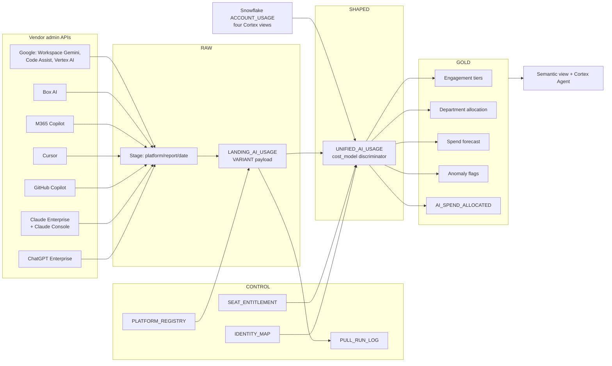

# Consolidating AI Spend and Adoption Across Platforms in Snowflake

Your organization is paying for ChatGPT Enterprise, Claude Enterprise, Microsoft 365 Copilot, GitHub
Copilot, Cursor, Box AI, Gemini in Workspace, and Snowflake Cortex. Each vendor has its own admin
console, its own definition of a "user", and its own meter. Leadership wants one number for total AI
spend, plus an answer to which groups are driving it. This guide builds that view in Snowflake at
**user-level grain**, without pretending the vendors measure the same thing.

The hard part is not the API calls. It is deciding what a unified row *means* when one platform
bills metered credits, another bills a flat seat, a third bills a seat that includes a usage pool,
and a fourth bills a seat that includes *no* usage at all — and what a "user" is when one platform
gives you a login, another gives you a pseudonymized hash, and a third gives you a numeric ID. This
guide is mostly about those two decisions, because they are the ones that survive a vendor
shipping a new API.

**Audience:** SEs, platform and FinOps engineers, and data teams asked to produce cross-platform
AI cost and adoption reporting.

Pair-programmed by SE Community + Cortex Code

**Created:** 2026-09-10 | **Expires:** 2027-03-10 | **Status:** ACTIVE

> **No support provided.** Reference only; validate before production use. The Snowflake-side SQL
> here was executed on the created date above. The **vendor API details were correct on that date
> and will drift** — every vendor in this guide changed a relevant endpoint during 2026. Treat the
> vendor sections as a worked illustration of the pattern, and the vendor's own documentation as
> the source of truth.

---

## Read These Words First

| Term | In plain words |
| --- | --- |
| **Metered** | The vendor charges per unit consumed — credits, tokens, requests. Cost varies with behavior. Snowflake Cortex, OpenAI credits, Anthropic tokens, and GitHub AI credits work this way. |
| **Seat** | The vendor charges a fixed amount per licensed person per month. Microsoft 365 Copilot is the only platform here that is *purely* this — a heavy user and an untouched license cost the same. |
| **Seat plus meter** | The common shape, and the one that breaks naive models. GitHub Copilot, Cursor, and Claude Enterprise all charge a seat *and* meter consumption. The two are not simply additive, and the relationship differs per vendor: a Cursor seat **includes** a usage pool, while a current Claude Enterprise seat includes **no usage at all**. |
| **Native quantity** | The unit the vendor actually reports — credits, tokens, messages, AI Units, interactions. Preserved rather than converted, because there is no honest exchange rate between them. Box's "AI Unit" is the clearest case: a vendor-proprietary composite that means nothing outside Box. |
| **Identity spine** | The mapping from each vendor's subject key to one person, plus that person's department and cost centre. Sourced from your IdP or HR system, not from any AI vendor. |
| **Unresolved** | A usage row whose subject could not be matched to a person. Kept as a visible bucket, never dropped. |
| **Restatement** | Re-loading a window of dates the vendor may still revise, rather than appending once and trusting it. Anthropic revises a given date's cost for up to 30 days, so append-only ingestion there produces numbers that quietly stop matching the vendor. |
| **Adapter** | The per-vendor code that pulls from an admin API and lands it in the shared contract. The disposable layer. |
| **Engagement tier** | A classification of users by activity depth — commonly low / medium / power. Every vendor defines this differently, so this guide computes its own and says so. |

---

## Start Here

### First fork: should you build this at all

Buying is often correct. Consider a vendor product instead when:

- You need **peer benchmarking** — "how does our adoption curve compare to similar companies".
  You cannot build this from your own data by definition.
- Your works council, privacy office, or employee relations function will only approve
  **team-level** reporting. Several commercial tools are built specifically to report aggregates
  without touching individual rows, and that constraint is easier to buy than to enforce.
- You want turnkey dashboards this quarter and have no data engineering capacity.

Build the pipeline in this guide when at least one of these is true:

- You need to **join AI usage to data only you have** — HR hierarchy, cost centres, project codes,
  revenue per team, ticket outcomes. This is the strongest reason and no vendor tool does it,
  because the join keys live in your systems.
- **Snowflake Cortex is already a material line item.** Half the work is then already done: the
  Snowflake-native side of this model comes straight out of `ACCOUNT_USAGE` with no connector at all.
- You need AI spend in the **same forecasting model as the rest of your platform spend**, owned by
  the same team, on the same refresh cadence.
- Your governance model will not permit employee activity metadata leaving your perimeter.

A reasonable middle path: build the Snowflake-native half first, because it needs no vendor API
and no credentials, and use it to prove the model and the reports before negotiating access to any
external admin API. It is the cheapest way to find out whether leadership actually wants what they
asked for.

### Second fork: what grain can each platform actually give you

Ask this **before** promising user-level reporting, because one of these platforms cannot deliver
it in the form people assume, and another delivers it only through a route most people miss.

| Platform | User-level rows? | Per-user cost? | The constraint that will surprise you |
| --- | --- | --- | --- |
| **Snowflake Cortex** | Yes | Yes, in credits | Four separate `ACCOUNT_USAGE` views with inconsistent column names. Cortex Code reports `USAGE_TIME` where the others report `START_TIME`, and carries no `USER_NAME` at all. |
| **GitHub Copilot** | Yes — user-level NDJSON report and API | Partly — AI credits are metered, the seat is a license | The legacy metrics API was **shut down in April 2026**. Seats come from a *different* API than usage. Team rollup needs a second report, and teams with fewer than five seated users are excluded from it. |
| **ChatGPT Enterprise** | Yes | Yes — credits by user, product, and model | The ChatGPT workspace and the OpenAI API Platform are **separate products with separate billing**. Summing them into one "OpenAI spend" number is the most common error on this path. The stateful conversation route was removed in June 2026. |
| **Claude Enterprise** | Yes | Yes — cost per user, with both effective and list amounts | The seat includes **no usage**, so metered token cost is the larger, more volatile half of the bill. Two structural limits: **no data exists before 2026-01-01**, and a date's value can be **revised for up to 30 days**, so this platform must be restated rather than appended. Per-user cost also *excludes* API-key and automation traffic, so it cannot reconcile to invoice alone. |
| **Anthropic Console (API)** | No | No | Grain is API key, workspace, and model. There is no user dimension at all. Ingested anyway, because it holds the traffic the per-user Claude Enterprise endpoints deliberately exclude. |
| **Cursor** | Yes — per user per day, keyed by email | Yes — in cents, but read the right field | The seat **includes** a usage pool, so seat and metered cost overlap and must not be added. Two feeds, not one: activity has no cost fields, cost has no activity. And without explicit pagination the activity endpoint returns **active users only** — silently omitting the idle seats you are trying to find. |
| **Box AI** | Yes | Yes — AI Units by user *and by agent* | Metered since **20 October 2025** — anyone still modelling Box AI as a bundled seat cost is a year out of date. The per-user cost view is a **console report**, not a JSON endpoint; the programmatic path is the Enterprise Events API, which has a hard retention cliff of **two weeks** on the streaming feed and **one year** on `admin_logs`. Miss the window and the data is gone. |
| **Gemini in Workspace** | Yes — but as audit events | **No** | There is no Gemini user usage report. Per-user data is an activity feed with an actor and an action, carrying **no tokens and no cost**. Baseline Gemini is bundled into the plan price, so there is no separable per-user cost to compute. Retention is 180 days rolling with nothing before 2025-06-20. |
| **Gemini Code Assist** | Yes — Cloud Logging carries the user's email | No — seat cost, allocated | The best per-user signal Google offers, and the easiest to miss: the Cloud *Monitoring* metrics for the same product are aggregate-only. Logging is **off by default** and there is no backfill. |
| **Vertex AI / Agent Platform** | No | **No, and not achievable** | Billing attribution stops at project, service, and SKU. Labels are the only request-level mechanism, and a label key is capped at roughly a thousand distinct values *for the life of the billing account* — so labelling by user email breaks permanently above that headcount, and Google warns against putting PII there anyway. |
| **Microsoft 365 Copilot** | Nominally | **No** | User principal name and display name are **pseudonymized by default**, and the payload is last-activity dates rather than usage volume. Without a tenant-level change this platform answers "is this seat being touched" and nothing more. |

Four consequences worth stating out loud to whoever asked for this:

1. **A single "cost per AI user" number across every platform is not obtainable**, because several of
   them do not meter per user at all. What *is* obtainable is metered cost per user for most of
   them, plus seat utilization for the rest. That is a better answer anyway — an unused seat is the
   cheapest saving available.
2. **Microsoft 365 Copilot and Gemini in Workspace will not support the engagement-tier analysis**
   they liked from ChatGPT Enterprise. Last-activity dates and bucketed usage levels cannot
   distinguish a light user from a power user on a definition you control.
3. **Google is not one platform and must not be modelled as one.** It gives you user-level *usage*
   nearly everywhere and user-level *cost* almost nowhere, and the three surfaces have different
   APIs, different auth, and different retention. The registry carries them as three rows for that
   reason.
4. **Box AI adds a dimension the others mostly lack: cost per *agent*.** AI Units are consumed by
   configured agents as well as by people, so "which agent is expensive" becomes answerable — and
   that is closer to "where should we invest next" than any per-person number. Snowflake Cortex
   carries the same idea in its agent name; see [Extending the model](#extending-the-model).

---

## The Two Decisions That Matter

Everything else in this guide is plumbing. These two are the design.

### Decision 1: do not blend meters

The tempting model is one `cost_amount` column so every dashboard can `SUM` it. Resist. A metered
credit and a fixed monthly seat are different kinds of number, and a chart that adds them produces
a total that moves for the wrong reasons and a "cost per message" that is arithmetic nonsense.

And the split is not simply one column per vendor, because most vendors are *both*. Three shapes
appear in this guide and each needs different handling:

- **Pure seat.** Microsoft 365 Copilot. Cost is fixed; usage is a touched / not-touched signal.
- **Seat that includes usage.** Cursor, GitHub Copilot. Seat and metered cost **overlap** — part of
  the metered figure is already paid for by the seat. Adding the two double-counts.
- **Seat that includes no usage.** Claude Enterprise. Seat and metered cost are genuinely additive,
  and the metered half is the volatile one that grows with adoption.

Anyone who models all three the same way will be wrong on two of them, in opposite directions.

`SHAPED.UNIFIED_AI_USAGE` carries an explicit discriminator:

```text
usage_date, platform, subject_key, person_key, identity_confidence,
cost_model              METERED | SEAT
native_qty              credits | tokens | messages | interactions
native_unit             the vendor's own unit, preserved
cost_amount             NULL when cost_model = 'SEAT'
source_billing_context  e.g. CHATGPT_WORKSPACE vs OPENAI_API_PLATFORM
```

Seat cost lives separately in `CONTROL.SEAT_ENTITLEMENT`, keyed by platform, person, and period.
This split makes the two useful questions answerable independently: *what did consumption cost*
and *are we paying for licenses nobody touches*.

Budgeting still needs one blended number, so the guide provides one — in
`GOLD.AI_SPEND_ALLOCATED`, a clearly named view that applies seat amortization and **exposes the
allocation rule as a column**. The invented precision stays visible instead of hiding inside a
`SUM`. That is the whole trick: allocate deliberately in one labelled place, rather than
accidentally everywhere.

`source_billing_context` exists for one specific reason. ChatGPT Enterprise and the OpenAI API
Platform are separate contracts with separate meters. Keeping the context on every row makes it
impossible to accidentally produce a combined "OpenAI" figure that matches neither invoice. Anthropic
repeats the pattern exactly — Claude Enterprise and the Claude Console are separate products with
non-interchangeable admin credentials — which is why they are two registry rows rather than one.

### Decision 2: identity is the actual project

Every platform names people differently:

| Platform | Subject key you get |
| --- | --- |
| Snowflake | numeric `USER_ID`, resolvable to a login name |
| GitHub | GitHub login — often not the corporate email |
| ChatGPT Enterprise | workspace member identifier |
| Claude Enterprise | both a stable user ID and an email — join on the ID, display the email |
| Cursor | email on the usage feeds, and a *different* ID namespace across endpoints |
| Gemini in Workspace / Code Assist | corporate email, which is the easy case for once |
| Vertex AI | no subject at all — a project or a label, never a person |
| Microsoft 365 Copilot | pseudonymized UPN hash, unless the tenant disables concealment |

There is no natural join key. `CONTROL.IDENTITY_MAP` is the spine, seeded from your IdP or HR
system — never from an AI vendor — and it carries the department and cost centre that make
allocation possible at all.

Two rules keep it honest:

- **Record confidence per row.** `identity_confidence` distinguishes a verified IdP match from a
  heuristic email-prefix guess. Allocation built on guesses should be visibly built on guesses.
- **Never drop unmatched rows.** They land in an `UNRESOLVED` bucket. Unattributed spend must stay
  in the total, because a 12 percent unresolved rate is itself a finding — and silently dropping
  those rows makes the platform total disagree with the invoice, which destroys trust in the whole
  report on first contact with finance.

---

## Architecture



Raw payloads land as `VARIANT` and are shredded in SQL rather than schematized on ingest. A
shredding bug is then fixed with `CREATE OR REPLACE` over data you already hold, rather than a
connector redeploy and a re-pull from an API with rate limits and a short retention window.

That retention point is not hypothetical. Box's streaming event feed holds **two weeks**, its
`admin_logs` feed **one year**, and anything older exists only as a console export. A shredding bug
discovered three weeks late is unrecoverable if you did not keep the raw payload. Landing the
vendor's bytes verbatim is the cheapest insurance in this design.

---

## What Is In This Guide

Run the SQL in numbered order. There is no `deploy_all.sql` — this is a reference implementation
you adapt, not a demo you deploy.

| File | What it does |
| --- | --- |
| [docs/adapter-contract.md](docs/adapter-contract.md) | **Read this second.** The landing contract every adapter satisfies, so a new vendor is a registry row and one procedure rather than a redesign. |
| [sql/01_landing.sql](sql/01_landing.sql) | Role, database, four schemas, warehouse, stage, and the four control tables. |
| [sql/02_network_secrets.sql](sql/02_network_secrets.sql) | Network rules per vendor host, external access integration, and `CREATE SECRET` templates left commented. |
| [sql/03_pull_github_copilot.sql](sql/03_pull_github_copilot.sql) | The one fully worked adapter. Watermarked, logged on both success and failure paths, `QUERY_TAG`ged. |
| [sql/04_adapter_stubs.sql](sql/04_adapter_stubs.sql) | Build specifications for ChatGPT Enterprise, Box AI, Microsoft 365 Copilot, Anthropic Claude, Cursor, and the three Google surfaces: endpoint family, auth shape, report list, required fields, and the trap each one hides. |
| [sql/05_snowflake_native.sql](sql/05_snowflake_native.sql) | The Snowflake side. No credentials, no API, works immediately. |
| [sql/06_normalize.sql](sql/06_normalize.sql) | `UNIFIED_AI_USAGE` plus identity resolution and the unresolved bucket. |
| [sql/07_gold_dts.sql](sql/07_gold_dts.sql) | Dynamic Tables for the five decisions, plus the labelled allocation view. |
| [sql/08_semantic_view_agent.sql](sql/08_semantic_view_agent.sql) | Semantic view and Cortex Agent, so leadership asks in English. |
| [sql/09_monitoring.sql](sql/09_monitoring.sql) | Freshness per platform, unresolved-identity rate, adapter drift detection. |
| [sql/99_teardown.sql](sql/99_teardown.sql) | Reverse-order removal. |

**Only one adapter is fully implemented on purpose.** Nine hand-maintained vendor connectors would
be stale within two quarters — GitHub retired its legacy Copilot metrics API in April 2026, OpenAI
removed a conversation log route in June, Box switched Box AI to metered AI Units with the
per-user report landing mid-2026, Cursor tightened its usage range cap and rebuilt Teams pricing,
and Google renamed Vertex AI outright. The contract, the identity spine, and the gold layer are the
durable parts, and they are what the numbered files after `05` protect. `04` gives each remaining
platform a build specification precise enough to implement against, without pretending its endpoint
paths will still be current a year from now.

---

## The Five Decisions It Supports

The reporting layer is built backwards from what leadership asked for.

| Decision | Where it lands | The caveat to state when you present it |
| --- | --- | --- |
| **Spend forecasting** for budget cycles | `GOLD.AI_SPEND_FORECAST` | Trailing-window projection, not a seasonal model. Seat cost is near-deterministic; metered cost is the volatile part, so forecast the two separately and say which is which. |
| **Departmental allocation** | `GOLD.AI_SPEND_BY_DEPARTMENT` | Only as good as `IDENTITY_MAP`. Always publish the unresolved percentage next to the allocation, or someone will quietly assume it is zero. |
| **High and low usage populations** | `GOLD.AI_ENGAGEMENT_TIERS` | Tier thresholds are a **choice**, not a fact. This guide computes percentile-based tiers and documents the cut points. Do not silently inherit a vendor's definition — OpenAI's power-user definition, for instance, is top-20-percent by message volume using three or more tools, which is specific to their product surface and not portable. |
| **Anomalous consumption** | `GOLD.AI_USAGE_ANOMALIES` | Deviation against each user's own trailing baseline, not a global threshold. Flags for review, not enforcement. Snowflake-side *enforcement* belongs to `SNOWFLAKE.CORE.QUOTA` — see the cost-controls demo, not this guide. |
| **Adoption trend by platform** | `GOLD.AI_ADOPTION_TREND` | Active-user counts are only comparable within a platform. Reporting Copilot last-activity next to Cortex request volume as though they are the same measure is the trap. |

---

## Extending the Model

Two extensions are worth knowing about before you start, because both are cheaper to design in now
than to retrofit.

### Cost per agent, not just per person

The model as shipped attributes cost to **people**. But AI spend is increasingly consumed by
*configured things* rather than by humans typing: a Box AI agent processing an inbox, a Cortex Agent
answering questions, a scheduled extraction job. Two platforms already report this natively —
Box AI breaks AI Units down by agent, and `CORTEX_AGENT_USAGE_HISTORY` carries `AGENT_NAME`.

This matters because it answers a question none of the five decisions above can:
*which of the things we built is actually earning its cost.* Per-person spend tells you about
adoption; per-agent spend tells you where to invest next.

The change is small and deliberate:

1. Add `ENTITY_KEY` and `ENTITY_KIND` (`PERSON` | `AGENT` | `SERVICE`) to `SHAPED.UNIFIED_AI_USAGE`.
   `RAW.V_SNOWFLAKE_NATIVE_USAGE` already computes the value as `ENTITY_NAME` and discards it.
2. Add a `GOLD.AI_SPEND_BY_AGENT` Dynamic Table alongside `AI_SPEND_BY_DEPARTMENT`.
3. Keep the person grain as-is. A single row should not try to be both — an agent has no department,
   and forcing one produces exactly the fake attribution this guide argues against.

The reason it is not in the base model: an agent is not a person, so it does not belong in
engagement tiers, seat utilization, or departmental allocation. Adding the dimension without
thinking about which gold objects it applies to is how a clean model becomes a confusing one.

### Value, not just cost

Everything here measures consumption. None of it measures whether the consumption was worth it,
and no vendor telemetry can tell you that — the signal lives in your own systems: tickets closed,
cycle time, deal velocity, code merged.

The join key already exists. `PERSON_KEY` is a corporate identity, so `GOLD.PERSON_DAY_USAGE` joins
directly to any operational fact keyed by employee. That is the whole argument for building this in
Snowflake rather than buying a dashboard: a vendor tool cannot join to data it does not have.

Treat that as the phase-2 conversation, and be honest that it is correlation. "Power users close
tickets faster" may mean the tool helps, or that fast people adopt tools early. Worth measuring,
not worth over-claiming.

---

## Gotchas: Read Before You Build

### 1. Metered and seat costs are not addable

Covered above, and it is the most consequential mistake available here. A blended total drops when
a heavy user goes on leave even though the seat bill did not change, and it rises when a team's
metered usage spikes even though headcount is flat. Finance will find the discrepancy against the
invoice, and the report loses credibility permanently.

### 2. Microsoft 365 Copilot pseudonymizes user identity by default

`getMicrosoft365CopilotUsageUserDetail` returns hashed values in the `userPrincipalName` and
`displayName` fields unless the tenant has disabled report concealment. The hashes are stable, so
you can trend an anonymous individual, but you **cannot join them to a department** without that
tenant setting changed by an Entra administrator.

Verify this setting before promising user-level Copilot reporting. In some organizations it is
deliberately on, and a privacy office may decline to change it — a legitimate answer that removes
Copilot from user-level scope entirely.

### 3. ChatGPT Enterprise and the OpenAI API Platform are different products

Separate organizations, separate entitlements, separate meters, separate agreements. Merging their
exports produces a number that reconciles to no invoice. `source_billing_context` on every row is
the guard, and it is worth keeping even if you only ingest one of the two today.

Also separate within OpenAI's own surface: analytics endpoints answer adoption questions, and the
compliance log platform answers audit questions. They are not interchangeable and they legitimately
disagree, because compliance returns raw system records — including internal messages and rows
without timestamps — while analytics returns cleaned data. Neither is wrong. Use analytics for
adoption reporting and expect the counts to differ from compliance.

### 4. Box AI's numbers live in a console report, and the API feed expires

Box exposes AI usage three ways, and they are not interchangeable:

| Surface | Grain | Programmatic? | Retention |
| --- | --- | --- | --- |
| AI Insights dashboard | AI Units by user, by agent, by capability | No — console | Current period |
| AI Units Admin Report | AI Units by user and agent, monthly | Export only, can auto-deliver to a Box folder | Historical months |
| Enterprise Events API | Individual AI events | Yes — `admin_logs` or `admin_logs_streaming` | **2 weeks streaming, 1 year `admin_logs`, 7 years console export only** |

That splits the work in an awkward but manageable way. The number finance wants — AI Units per user
per month — comes from a **report**, so the adapter ingests a file Box drops in a folder rather than
calling a JSON endpoint. The events API gives you granularity and freshness but not the billing
unit directly.

The retention cliff is the part that bites. Two weeks on the streaming feed means a pipeline that
breaks over a holiday loses data permanently, and a watermark that resumes from the last success is
not enough on its own — you also need the health view to scream well inside the window. This is the
strongest argument in the whole guide for landing raw payloads immutably: it is the only copy you
will ever have.

Also worth correcting a common assumption: **Box AI has been metered since 20 October 2025.** If
someone tells you Box AI is bundled into the seat, they are describing the pre-2026 model.

### 5. GitHub splits usage and licensing across two APIs

Usage metrics do not include seat or license state; that lives in the user management API and is
the source of truth for entitlement. You need both to answer "who has a seat and is not using it",
which is the question that pays for the project.

Two further traps: the legacy metrics API was retired in April 2026, so older sample code and blog
posts will not run. And team-level rollup requires joining a separate user-teams report which
excludes teams with fewer than five seated users — small teams vanish from team views while their
members remain in per-user data, so team totals will not sum to the organization total.

### 6. Vendor schema drift is the operational risk, not API downtime

These are young admin APIs and they change. An adapter that silently maps a renamed field to
`NULL` produces a chart that looks fine and is wrong, which is worse than a failed pull.

Make adapters assert on their own payload shape and **fail loudly** when a required field is
missing. `CONTROL.V_PIPELINE_HEALTH` surfaces per-platform freshness so a quietly dead adapter
shows up as stale data rather than a plausible flat line. A missing feed should look broken.

### 7. User-level AI telemetry is monitoring-adjacent — clear it first

You are building a per-person record of AI tool use. In many jurisdictions and under many works
council agreements that is employee monitoring, whatever the stated intent.

Settle four things before the first pull, not after:

- A named owner accountable for the dataset
- A stated purpose, and a decision on whether individual rows may be used in performance
  conversations — the defensible answer is usually no
- A retention period with an actual pruning task, not an intention
- RBAC that separates aggregate reporting from row-level access, so the department-allocation
  dashboard does not require access to individual rows

Note that this pipeline deliberately handles **usage metadata only** — no prompts, no completions,
no file contents. That boundary is much easier to defend in a privacy review than "we ingest the
compliance logs and promise not to look", and it is sufficient for all five decisions above.

### 8. Do not convert native units into each other

Credits, tokens, messages, and interactions are not interchangeable, and no exchange rate between
them is defensible. Preserve `native_qty` with `native_unit` and compare platforms on **currency
cost** or on **user counts**, never on raw quantity. "We sent 40 percent more messages than
Cortex requests" is not a sentence that means anything.

One exception worth building in deliberately: **Cursor reports cost already in currency**, not as a
native quantity needing conversion. Do not seed `CONTROL.PLATFORM_RATE` for it. Every other platform
needs a rate; applying one here multiplies cents by a rate and produces a plausible wrong number in
the right column, which is the hardest kind of error to notice.

### 9. Claude Enterprise revises history for 30 days — append-only ingestion is wrong there

This is the operational fact that changes the pipeline rather than just a field mapping. A cost or
usage value for a given date **can be revised for up to 30 days** as late events and reconciliation
arrive. Responses carry a `data_refreshed_at` timestamp for exactly this reason.

So for this platform, restate a rolling 30-day window on every run rather than appending once. Key
stability on `data_refreshed_at` rather than on the date you requested, and treat only dates older
than 30 days as invoicing-grade. An append-only load produces a number that was correct when
captured and quietly disagrees with the vendor a week later — the worst failure mode available,
because nothing errors.

Two related limits: **no data exists before 2026-01-01**, so there is no backfill conversation to
have and the Snowflake-side accumulation *is* the history. And per-user cost covers only seat users
— direct API-key and automation traffic is excluded by design, so per-user cost will not sum to the
invoice until you also ingest the organization-level cost report. Ingest one and finance finds the
discrepancy for you.

Also correct the mental model before forecasting: on current Enterprise plans **the seat includes no
usage at all**. Every token bills separately. Expect three billing generations in one tenant's
history, because the legacy seat shapes auto-transition at renewal — which silently changes what a
cost column means mid-history.

### 10. Cursor's seat and meter overlap, and the API hands you the wrong field first

The opposite trap to Anthropic's. A Cursor seat **includes** a per-user usage pool, and on-demand
billing starts only once that pool is exhausted. So seat cost and metered cost are not additive:
part of the metered figure is already paid for.

The API exposes both halves and the tempting one is wrong. Use the on-demand-only spend figure
alongside `SEAT_ENTITLEMENT`; the "overall" figure includes the seat's included usage, and adding it
to seat cost double-counts the allowance. Pools are allocated per user and do not transfer between
members, which makes seat utilization a real saving here rather than a rounding note.

One more, and it silently produces a wrong dashboard rather than an error: **the daily activity
endpoint returns active users only unless you paginate explicitly.** The rows it omits are exactly
the zero-activity seats a seat-utilization metric exists to find.

### 11. Google gives you user-level usage nearly everywhere and user-level cost almost nowhere

Say this before anyone builds a slide. Three consequences, one per surface:

- **Workspace Gemini has no separable per-user cost.** Baseline Gemini is inside the plan price, so
  the only honest per-user figure is plan cost divided by headcount — arithmetic, not measurement.
  The one genuine line item is the AI Expanded Access / AI Ultra Access **add-on seat** reintroduced
  in February 2026, which is assigned to named users and belongs in `SEAT_ENTITLEMENT`. Anyone who
  tells you Workspace AI no longer has a separate SKU is describing the 2025 state.
- **There is no Gemini user usage report.** Per-user data is an audit activity feed carrying an actor
  and an action, with no tokens and no cost. Retention is 180 days rolling with nothing before
  2025-06-20, so accumulate early or lose the trend permanently.
- **Vertex AI per-user cost is not achievable**, not merely awkward. Billing attribution stops at
  project, service, and SKU. Labels are the only request-level mechanism, and a label key is capped
  at roughly a thousand distinct values *for the life of the billing account* — lifetime, not
  concurrent — so labelling by user email breaks permanently above that headcount. Google separately
  warns against putting PII in labels at all. The defensible design is a team or cost-centre bucket
  under the ceiling, giving team-level metered cost joined to per-user *usage* from audit logs. Say
  that in the gold layer instead of dividing a project total by headcount.

The one bright spot is **Gemini Code Assist**, where Cloud Logging carries the user's email and
gives real per-user activity. Note the near-miss: the Cloud *Monitoring* metrics for the same
product are aggregate-only, and building on them then being asked for a team breakdown is a rewrite
rather than a filter. Logging is off by default with no backfill, so enabling it is step zero.

Finally, two name collisions that will corrupt a dimension table: "Gemini Enterprise" means both a
retired 2024 Workspace add-on SKU *and* the current Cloud agentic platform, and Vertex AI was
renamed to Gemini Enterprise Agent Platform in 2026 — a docs and console change only. The API
endpoint is unchanged, so do not "fix" working calls because the brand moved.

---

## Related Guides

- [Cortex AI functions usage history](https://docs.snowflake.com/en/sql-reference/account-usage/cortex_ai_functions_usage_history) — the Snowflake-native per-user credit source
- [Snowflake quotas](https://docs.snowflake.com/en/user-guide/quotas) — enforcement for the Snowflake side, once visibility exists
- [Dynamic Tables](https://docs.snowflake.com/en/user-guide/dynamic-tables-about) — the incremental engine behind the gold layer
- [External access with secrets](https://docs.snowflake.com/en/developer-guide/external-network-access/creating-using-external-network-access) — the credential pattern every adapter uses
- [Cortex Analyst semantic views](https://docs.snowflake.com/en/user-guide/views-semantic/overview) — the layer the agent reasons over

## External References

- [GitHub Copilot usage metrics data reference](https://docs.github.com/en/copilot/reference/copilot-usage-metrics/copilot-usage-metrics)
- [GitHub Copilot user management API](https://docs.github.com/en/rest/copilot/copilot-user-management)
- [OpenAI: Compliance API vs user analytics](https://help.openai.com/en/articles/11327494-compliance-api-vs-user-analytics-in-chatgpt-enterpriseedu)
- [OpenAI Compliance Platform](https://help.openai.com/en/articles/9261474-openai-compliance-platform-for-enterprise-and-edu-customers)
- [Microsoft Graph: getMicrosoft365CopilotUsageUserDetail](https://learn.microsoft.com/en-us/microsoft-365/copilot/extensibility/api/admin-settings/reports/copilotreportroot-getmicrosoft365copilotusageuserdetail)
- [Microsoft 365 admin center report concealment](https://learn.microsoft.com/en-us/microsoft-365/admin/activity-reports/activity-reports)
- [Box AI Insights dashboard](https://docs.box.com/en/box-admin-tools/reporting-and-insights/ai-insights) — AI Units by user, agent, and capability
- [Box Enterprise Events API](https://developer.box.com/guides/events/enterprise-events/for-enterprise) — the programmatic path, and the retention tiers
- [Box Platform API reference](https://developer.box.com/reference/)
- [Anthropic Admin API](https://platform.claude.com/docs/en/manage-claude/admin-api) — the metered Console side, and the org-scoped key requirement
- [Claude Enterprise Analytics API](https://platform.claude.com/docs/en/manage-claude/analytics-api) — per-user cost, the 30-day revision window, and the 2026-01-01 floor
- [Anthropic Claude Code analytics API](https://platform.claude.com/docs/en/manage-claude/claude-code-analytics-api)
- [How Enterprise plans are billed](https://support.claude.com/en/articles/11526368-how-am-i-billed-for-my-enterprise-plan) — the seat includes no usage
- [Cursor Admin API](https://cursor.com/docs/account/teams/admin-api) — members, daily usage, spend, and usage events
- [Cursor Teams pricing](https://cursor.com/docs/account/teams/pricing) — the seat's included usage pool and on-demand billing
- [Workspace Admin SDK: Gemini activity events](https://developers.google.com/workspace/admin/reports/v1/appendix/activity/gemini-in-workspace-apps)
- [Workspace log exports to BigQuery](https://knowledge.workspace.google.com/admin/reports/set-up-service-log-exports-to-bigquery) — the bulk path, and the Pacific-time partitions
- [Gemini Code Assist logging](https://docs.cloud.google.com/gemini/docs/log-gemini) — per-user entries via `labels.user_id`
- [Vertex AI labels on API calls](https://docs.cloud.google.com/vertex-ai/generative-ai/docs/multimodal/add-labels-to-api-calls) — the PII warning and the distinct-value ceiling
- [Cloud Billing export to BigQuery](https://docs.cloud.google.com/billing/docs/how-to/export-data-bigquery)
