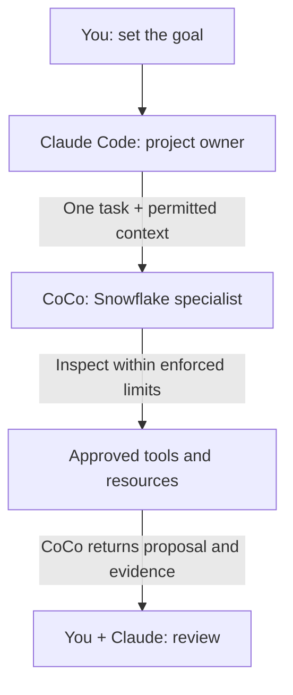

# Use Claude Code with CoCo for Snowflake Work

Keep building in Claude Code. Use the Snowflake Cortex Code plugin from Snowflake AI Kit to route Snowflake assignments to Cortex Code (CoCo), then review its proposal and evidence in Claude. Claude keeps ownership of application code and Git; you authorize changes separately.

**Audience:** Claude Code users building applications that involve Snowflake, and platform teams approving that workflow.

Pair-programmed by SE Community + Cortex Code

**Created:** 2026-10-09 | **Last verified:** 2026-10-08 | **Expires:** 2026-12-07 | **Status:** ACTIVE

> **No support provided.** Reference only; validate before production use.

---

## Start Here

**For Claude Code, start with the AI Kit plugin.** It packages Snowflake routing and a CoCo launcher. You can invoke it explicitly for a bounded assignment as well as use its automatic routing. Native MCP is the alternative when you want a direct tool connection without the routing plugin; it is not a prerequisite.



*Responsibilities, not a security boundary: returned information may enter Claude's provider context. Written instructions do not enforce access limits.*

**For example:** Keep an order-summary API in Claude; ask CoCo to check whether a join counts an order's revenue twice. CoCo returns a correction proposal and checks, not permission to deploy it. Think of a contractor assigning an electrician one job: the assignment is not a key to every room.

### In This Guide

- [Using Microsoft Visual Studio Code?](#using-microsoft-visual-studio-code)
- [Connect Claude with AI Kit](#recommended-ai-kit-plugin)
- [Try an order-summary assignment](#try-it-review-an-order-summary)
- [Use native MCP instead](#alternative-native-mcp)
- [Write a reliable handoff](#the-handoff-contract)
- [Manage permissions and data](#data-and-authority-boundaries)
- [Troubleshoot](#troubleshooting)

Prefer plain language? Read the [companion guide](ELI5.md).

## Using Microsoft Visual Studio Code?

**Default to the official [Snowflake extension in the VS Code Marketplace](https://marketplace.visualstudio.com/items?itemName=snowflake.snowflake-vsc)** if you want CoCo inside Microsoft's Visual Studio Code editor. Confirm the publisher is Snowflake and the extension ID is `snowflake.snowflake-vsc`.

1. Install the Snowflake extension through VS Code's Extensions view.
2. Sign in to your approved Snowflake account in the extension.
3. Open the CoCo side panel and start your Snowflake work there.

The extension includes CoCo chat; you do not need to install the CoCo CLI separately for that path. See the [official extension documentation](https://docs.snowflake.com/en/user-guide/vscode-ext).

This is direct use of CoCo in VS Code, not automatic delegation from Claude or GitHub Copilot. Continue below only when you specifically want **Claude Code to remain the coordinating assistant**, including when you run Claude Code inside VS Code. Do not build an MCP or ACP bridge just to get CoCo chat in the editor.

## Before Connecting Claude

Your organization must permit Claude Code and the information returned to it. Start with synthetic inputs, not production rows. Never send credentials or unrelated conversations.

Install the [CoCo CLI](https://docs.snowflake.com/en/user-guide/cortex-code/cortex-code-cli) through your approved process and configure a development connection. Confirm effective privileges; do not choose an administrative connection merely because it is the default. A read-only request is not a database-enforced restriction.

Use CoCo's **standard mode** for Snowflake work. Its separate **code mode** disables Snowflake data tools, MCP servers, and skills. [Mode reference](https://docs.snowflake.com/en/user-guide/cortex-code/code-mode)

```bash
cortex --version
cortex connections list
```

Keep connection output private. If the CLI reports an unsupported version, update through your approved process. No Snowflake infrastructure is deployed by this guide. Installing the plugin changes Claude's configuration; review that change first. Enable only one delegation integration for this workflow initially.

## Recommended: AI Kit Plugin

### 1. Understand what you are approving

The reviewed **AI Kit 3.4.0 Claude path** uses a permission callback and an envelope decision function. These checks are workflow guards, not database authorization or local isolation. The upstream README says the approval-mode wrapper remains a simulation: validating configuration does not implement interactive approval.

Review the [versioned executor](https://github.com/Snowflake-Labs/snowflake-ai-kit/blob/e2a3cbb45a9a62b5648266c5777c1b2edb3f8579/plugins/cortex-code/scripts/router/execute_cortex.py), [envelope policy](https://github.com/Snowflake-Labs/snowflake-ai-kit/blob/e2a3cbb45a9a62b5648266c5777c1b2edb3f8579/plugins/cortex-code/scripts/router/envelope_policy.py), and [configuration caveats](https://github.com/Snowflake-Labs/snowflake-ai-kit/blob/e2a3cbb45a9a62b5648266c5777c1b2edb3f8579/plugins/cortex-code/README.md#configuration). Establish independent database and local restrictions before real work. Do not assume a plugin mode named `RO` makes every execution path read-only.

### 2. Install the plugin

With Claude Code and the CoCo CLI already installed and approved, run:

```bash
claude plugin install snowflake-cortex-code@claude-plugins-official
```

This is the installation path in [Snowflake's Claude Code documentation](https://docs.snowflake.com/en/user-guide/cortex-code/cortex-code-claude-code). Do not combine it with the older `subagent-cortex-code` project or a second CoCo router.

A marketplace can pin a different revision than AI Kit's main branch. Inspect the installed plugin manifest and resolved source revision; do not use a README badge as release evidence. Keep the host, CLI, and plugin versions in your team's private qualification record and recheck controls after updates.

Python launcher and optional YAML dependencies are described in the [plugin README](https://github.com/Snowflake-Labs/snowflake-ai-kit/tree/main/plugins/cortex-code). Do not install dependencies into an externally managed system Python or bypass configuration errors by changing interpreters.

### 3. Prove one explicit handoff

Select the plugin's `cortex-run` skill from Claude's skill menu and supply:

```text
Delegate one Snowflake-related connectivity check to CoCo.
Use a fresh session. Have CoCo reply exactly DELEGATION_OK.
Do not use tools, read files, access database data, or modify anything.
Show the actual child result, not a result composed by Claude.
Stop and report any permission request or failure.
```

This marker checks that the plugin launched CoCo and returned a result. The no-tools instruction is a requested behavior, not a hard restriction. Run it in the constrained environment approved above and inspect execution evidence. It does not prove database access or write restrictions.

Before a data-connected assignment, name the approved connection and project directory, inspect the resolved launch configuration, and verify the child's effective account and role. If you cannot establish that context, stop; do not accept the default connection silently.

### 4. Add automatic routing after a useful assignment

The plugin uses a keyword prefilter and routing instructions. Use the explicit skill when you want a deliberate handoff or automatic routing misses a request. Do not assume the rendered skill prefix is identical across client versions.

For mixed requests, split the work: Claude edits the application, CoCo investigates the Snowflake interface, and Claude integrates the approved result. Do not forward the whole conversation because one sentence mentions Snowflake. Check that routing occurred and that Claude did not also execute the delegated change.

## Try It: Review an Order Summary

Select `cortex-run` and supply this small synthetic case:

```text
Ask CoCo to review only the synthetic facts below.
No tools, files, or database access. Return a proposal only.

orders has one row per order: order_id, order_date, order_total.
order_items has one row per item: order_id, item_id.
On the same date, order A totals 30 and has two items;
order B totals 20 and has one item.
The proposed report joins orders to order_items, counts the joined rows,
and sums order_total.

Explain the error, propose the correct daily aggregation approach,
and give the expected result. Identify assumptions and validation steps.
Do not change anything.
```

**Check the answer:** The correct daily result is **2 orders and 50 revenue**. The joined rows produce 3 and 80. CoCo should explain that the order total repeats for each item and propose aggregating at order grain. These are expected results from the supplied facts, not a recorded agent response.

**Then make it useful:** With separate authorization, supply the actual query and named objects. Ask CoCo to inspect only those definitions, check types and join grain, and return a correction plus validation steps. Business-query execution and row samples are not needed for that first review. Compilation alone does not prove correct results.

Claude retains API, file-edit, and Git ownership. Approve changes separately. This example teaches the handoff; routine arithmetic alone does not require another agent.

## Alternative: Native MCP

Choose this instead of AI Kit when you want Claude to call CoCo directly as a tool without plugin routing. Disable the plugin for this workflow before enabling the alternative.

### Connect the tool

Check that `cortex mcp serve --help` describes **Start Cortex Code as an MCP server over stdio**, not generic MCP management help. A successful exit code alone does not prove the subcommand exists.

Run from the intended project directory in a Bash-compatible shell:

```bash
cortex mcp serve --help
printf 'Approved development connection name: '
read -r COCO_CONNECTION
claude mcp add --transport stdio --scope local coco-snowflake -- \
  cortex mcp serve --connection "$COCO_CONNECTION" --workdir "$PWD"
```

Local scope keeps registration personal to the project. Use `/mcp` in Claude Code to inspect connectivity and discovered tools. Project-shared configuration belongs in `.mcp.json`, not `.claude/mcp_servers.json`; agree on portable connection names and paths before sharing it. [Claude MCP documentation](https://code.claude.com/docs/en/mcp)

### Check the round trip

```text
Call coco-snowflake's cortex_code_agent once.
Prompt: Reply exactly DELEGATION_OK. Do not use tools, read files,
access Snowflake data, or modify anything.
Set bypass=false and disallowed_tools=["*"].
Use the configured project directory and approved development connection.
Show the returned tool result. Do not infer success from server startup.
```

On the CoCo CLI 1.2.8 interface, `cortex_code_agent` calls are independent. Send the context needed for each assignment. The tool accepts `prompt`, `workdir`, `connection`, `profile`, `model`, `allowed_tools`, `disallowed_tools`, and `bypass`; only `prompt` is required. Per-call overrides mean registration defaults are not an access boundary.

**Before approving a call:** One delegation can start many inner actions. `allowed_tools` pre-approves matching tools; it is neither an exclusive allowlist nor a read-only SQL policy. `disallowed_tools` removes tools from the child's context. Do not add `--bypass` to fix a stalled approval. Inspect the actual arguments.

The server also offers direct documentation and discovery tools. Use the smallest useful tool; a documentation lookup does not require an autonomous child. If you adapt the order-summary example to native MCP, use `cortex_code_agent` with `bypass=false` and `disallowed_tools=["*"]`.

## The Handoff Contract

**Give CoCo a task, not the keys to the project.** Include:

```text
Objective: One concrete Snowflake outcome.
Connection: Exact approved connection; do not switch accounts or roles.
Workspace: Exact directory and relevant files; preserve unrelated changes.
Scope: Named objects or synthetic schema; no account-wide exploration.
Authority: Inspect and propose, or the exact separately approved change.
Context: Relevant requirements and evidence, not the complete chat history.
Return boundary: Metadata/aggregate summary only unless rows are authorized.
Acceptance: Observable checks that establish correctness.
Limits: Time/turn budget; stop and report if blocked or ambiguous.
Return: COMPLETE, PARTIAL, or BLOCKED; evidence; changed files/objects;
        validation results; query/session IDs when available; remaining work.
```

A budget in a prompt is not necessarily an enforced runtime limit. Configure supported controls rather than inventing tool fields.

Put this routing preference in Claude's `CLAUDE.md` if it fits your workflow:

```text
For Snowflake work, propose a bounded CoCo handoff using the configured plugin.
Keep application code, Git, and final acceptance here.
Name the approved connection and directory; ask if either is ambiguous.
Start with inspection/proposal. Do not authorize changes implicitly.
Send only relevant, permitted context and request concise evidence.
Treat denial, timeout, or partial completion as a blocker, not a reason
 to switch tools or retry a write. Do not delegate back into this router.
```

This guides behavior; it does not enforce security.

## Reliable Operation

- **One writer:** Do not let Claude and CoCo edit the same files or objects concurrently. Separate worktrees do not isolate a shared database schema. Keep commits, merges, pushes, and final review with Claude and you.
- **Explicit sessions:** AI Kit supports session resume, but the reviewed `--resume-last` state is one per-user pointer with a 30-minute freshness check, not a task/account mapping. Use a known session ID tied to the same task, directory, and connection, or start fresh. Native MCP calls are independent. [Session implementation](https://github.com/Snowflake-Labs/snowflake-ai-kit/blob/e2a3cbb45a9a62b5648266c5777c1b2edb3f8579/plugins/cortex-code/scripts/router/session_state.py)
- **Completion evidence:** Inspect process status and the final structured result, including errors. Preserve PARTIAL and BLOCKED. An initialization event, readable answer, or exit code alone is insufficient.
- **Timeouts:** Check what completed before retrying. A caller timeout does not prove the child stopped; submitted SQL may need separate cancellation or reconciliation.
- **Overhead:** Batch related investigation into one small handoff. Both assistants can incur inference usage, plus any Snowflake compute invoked. Measure rather than promise savings.

## Data and Authority Boundaries

Local process communication does not make the entire workflow local. Results returned to Claude can enter its provider context; CoCo separately communicates with Snowflake. Summarizing confidential data does not make it public.

Keep parent approval, child tool permissions, local isolation, and Snowflake authority separate. Claude's plan mode does not automatically make CoCo read-only. Do not assume Claude's sandbox covers every child process or that a Desktop restriction transfers to a CLI child.

[Restricted Session Scope](https://docs.snowflake.com/en/user-guide/restricted-session-scope) can impose a server-side privilege ceiling without granting access. Verify the restriction in the child session, including effective roles and callable programs. Arbitrary alternate SQL clients must not be assumed to inherit agent-aware protections.

Native MCP does not expose every CLI control, such as a named RSS startup option or a turn limit. If required controls cannot be enforced through your chosen interface, use a constrained documented CLI/SDK workflow or perform the task directly in CoCo. Never pass connection-file contents, private keys, tokens, or unrelated transcripts. Permission denial means stop, not change connection or increase privileges.

## Troubleshooting

- **Routing misses a prompt:** Select `cortex-run` explicitly or split mixed work. Do not install another router on top.
- **Wrong account or directory:** Inspect resolved launch settings and verify child identity before data access.
- **CoCo stalls:** Separate authentication failure, unanswered approval, timeout, and missing final result. Do not enable bypass or retry a write automatically.
- **Plugin configuration fails:** Follow the error's named file and interpreter guidance. Restart the host after approved PATH changes.
- **Follow-up uses the wrong task:** Start fresh or resume the exact session ID, not the global last session.
- **MCP command appears missing:** Confirm a connection is configured and inspect actual `serve --help` output; do not infer a release-channel cause.
- **Writes remain possible:** A permission callback or `RO` label is not a database restriction. Verify effective authority.

To stop delegation, disable the plugin or MCP registration for this workflow. Retain shared connections and unrelated servers. Disabling the integration does not undo completed changes.

## Development Tools

Reader documentation only. Coding assistants can follow the repository's contributor instructions; no project-specific `AGENTS.md`, `.claude/skills/`, wrapper, or deployment script is required. Configure integrations in your approved environment, not this repository.

## Related Guides

- [Cortex Code in Claude Code](https://docs.snowflake.com/en/user-guide/cortex-code/cortex-code-claude-code)
- [Official Snowflake extension for VS Code](https://marketplace.visualstudio.com/items?itemName=snowflake.snowflake-vsc)
- [CoCo CLI installation and connections](https://docs.snowflake.com/en/user-guide/cortex-code/cortex-code-cli)
- [Claude MCP configuration](https://code.claude.com/docs/en/mcp)

## External References

- [Snowflake AI Kit](https://github.com/Snowflake-Labs/snowflake-ai-kit)
- [Snowflake Cortex Code plugin listing](https://claude.com/plugins/snowflake-cortex-code)
- [Versioned AI Kit implementation](https://github.com/Snowflake-Labs/snowflake-ai-kit/tree/e2a3cbb45a9a62b5648266c5777c1b2edb3f8579/plugins/cortex-code)
- [Snowflake VS Code extension documentation](https://docs.snowflake.com/en/user-guide/vscode-ext)
- [CoCo CLI reference](https://docs.snowflake.com/en/user-guide/cortex-code/cli-reference)
- [CoCo Agent SDK approval handling](https://docs.snowflake.com/en/user-guide/cortex-code-agent-sdk/user-input)
