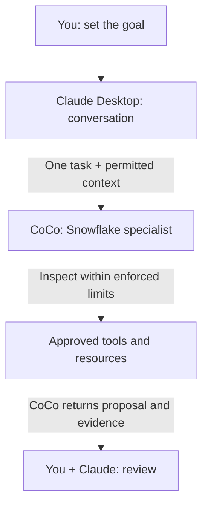

# Use Claude Desktop with CoCo for Snowflake Work

Keep your conversation in Claude Desktop. Connect Cortex Code (CoCo) as a local MCP server, give it one bounded Snowflake assignment, and review its proposal and evidence back in the chat. You remain responsible for approving changes; connecting a tool is not permission to modify your account or files.

**Audience:** Claude Desktop users on macOS or Windows who want Snowflake-specialist help in their conversations, and teams approving that workflow.

Pair-programmed by SE Community + Cortex Code

**Created:** 2026-10-09 | **Last verified:** 2026-10-08 | **Expires:** 2026-12-07 | **Status:** ACTIVE

> **No support provided.** Reference only; validate before production use.

---

## Start Here

**Use CoCo's native local MCP server for this Claude Desktop workflow.** Desktop launches the CoCo CLI and makes its tools available in your conversation. This guide uses Desktop's local-server configuration, not Claude Code's plugin installer or project-scoped MCP commands.



*Responsibilities, not a security boundary: returned information may enter Claude's provider context. Local transport does not keep the entire workflow local.*

**For example:** You are reviewing a daily order report. Ask CoCo to check whether joining orders to line items counts revenue twice, then have Claude explain the proposed correction. Start with synthetic facts rather than sharing production rows.

### In This Guide

- [Choose the right Claude surface](#choose-the-right-surface)
- [Check prerequisites](#before-connecting)
- [Connect the local server](#connect-claude-desktop)
- [Try an order-summary assignment](#try-it-review-an-order-summary)
- [Understand approvals and data](#approvals-and-data-boundaries)
- [Write a reliable handoff](#the-handoff-contract)
- [Troubleshoot or remove the connection](#troubleshooting-and-removal)

Prefer plain language? Read the [companion guide](ELI5.md).

## Choose the Right Surface

This walkthrough is for **Claude Desktop chat using local MCP tools**. It does not configure Claude Code, the Claude web app, or task execution in other Claude modes. Do not assume a setting from one surface carries into another.

- **A local MCP server** is a program Desktop starts on your computer. This is the path below; it does not need a public server URL.
- **A remote connector** connects to a hosted service. A connector exposing Snowflake account-side tools or Cortex Agents is not the same as calling the local CoCo runtime.
- **A Desktop extension** packages a local MCP server as an installable `.mcpb` bundle. Anthropic documents this distribution option; this guide uses the documented manual configuration route and does not supply a CoCo bundle.
- **The AI Kit instructions for Claude Code** target that coding client. Do not run `claude plugin install` or `claude mcp add` and expect those commands to register this Desktop chat connection.

See [Anthropic's local MCP overview](https://support.claude.com/en/articles/10949351-getting-started-with-local-mcp-servers-on-claude-desktop) and the [local-server setup walkthrough](https://modelcontextprotocol.io/docs/develop/connect-local-servers).

**Using Microsoft Visual Studio Code instead?** Default to the official [Snowflake extension in the VS Code Marketplace](https://marketplace.visualstudio.com/items?itemName=snowflake.snowflake-vsc), published by Snowflake. Install it, sign in, and open its CoCo side panel. The extension includes CoCo chat without requiring a separate CLI installation. This is direct CoCo use, not automatic delegation from Claude or GitHub Copilot. [Snowflake extension documentation](https://docs.snowflake.com/en/user-guide/vscode-ext)

## Before Connecting

Your organization must approve Claude Desktop, local MCP servers, and the information returned to Claude. Respect managed settings; if Developer settings or local servers are blocked, ask your administrator rather than changing configuration to bypass policy.

Install the [CoCo CLI](https://docs.snowflake.com/en/user-guide/cortex-code/cortex-code-cli) through your approved process. Configure an approved development connection, authenticate locally, and verify its effective privileges. Never put tokens, keys, passwords, or connection-file contents in the Desktop config or chat. A connection name is a reference to local configuration, not a credential.

Use CoCo's **standard mode**. Its separate **code mode** disables Snowflake data tools, MCP servers, and skills. [Mode reference](https://docs.snowflake.com/en/user-guide/cortex-code/code-mode)

In your terminal, run:

```bash
cortex --version
cortex connections list
cortex mcp serve --help
```

Keep connection output private. Confirm the last command describes **Start Cortex Code as an MCP server over stdio**, not just generic MCP management help. Update an unsupported CLI through your approved process before continuing.

Choose an existing, dedicated working directory containing only appropriate task files. The directory is a starting location, not a sandbox. Do not use your home directory as a convenient default. Desktop's server configuration is not automatically scoped to the chat or project you are discussing.

## Connect Claude Desktop

### 1. Open the existing configuration

In Claude Desktop's application settings, open **Developer > Edit Config**. The documented file locations are:

- macOS: `~/Library/Application Support/Claude/claude_desktop_config.json`
- Windows: `%APPDATA%\Claude\claude_desktop_config.json`

Use the file opened by Desktop. Save a backup before editing, and preserve all existing server entries and unrelated settings. Do not replace the whole file with a single-server example.

### 2. Generate a configuration fragment from your environment

Use the small [configuration generator](tools/generate_config.py) included with this guide. It asks for the approved connection and existing working directory, resolves the installed executable, and prints JSON. It does **not** read credentials, contact Snowflake, run CoCo, or modify Desktop's config.

From the downloaded guide directory on macOS:

```bash
python3 tools/generate_config.py
```

On Windows, with Python 3 installed through your approved process:

```powershell
py -3 tools/generate_config.py
```

Python is only needed for this helper, not an extra requirement imposed by CoCo's MCP transport. If Python is unavailable, an administrator can construct the same documented `mcpServers` entry using the fields below.

The output has one `coco-snowflake` entry under `mcpServers`:

- `command`: the absolute path to your installed `cortex` executable. Using an absolute path avoids relying on Desktop inheriting your terminal's PATH.
- `args`: separate strings for `mcp`, `serve`, `--connection`, the chosen connection name, `--workdir`, and the chosen absolute directory.

Review the values before use. The JSON serializer handles spaces and Windows backslashes. Do not put extra shell quotes inside path values, use a shell alias as the executable, or assume `$HOME`, `%USERPROFILE%`, or `~` will expand inside Desktop's JSON.

**Merge only the generated `coco-snowflake` entry into the existing `mcpServers` object.** If the file is new and empty, use the complete generated object. If that server name already exists, review it before replacing anything. Do not add `--bypass`, credentials, or a shell wrapper.

### 3. Restart and inspect the tools

Completely quit and reopen Claude Desktop; closing one window may leave the app running. In a new conversation, inspect **Connectors** from the chat's add/tools menu, or use Developer settings to inspect server status and logs.

Confirm `coco-snowflake` is connected and exposes **`cortex_code_agent`**. A listed server is not proof that an agent assignment will complete. Do not substitute a similarly named remote connector.

### 4. Prove a no-tools round trip

Paste this into Claude Desktop:

```text
Call coco-snowflake's cortex_code_agent once.
Prompt: Reply exactly DELEGATION_OK. Do not use tools, read files,
access Snowflake data, or modify anything.
Set bypass=false and disallowed_tools=["*"].
Use the configured approved connection and working directory.
Show the actual returned tool result, not a marker written by Claude.
Stop if the call fails or requests additional authority.
```

Inspect the actual call arguments and returned result. **This checks delegation and response, not database access or write restrictions.** If tools are unavailable, use the troubleshooting section instead of granting broader access.

On the CoCo CLI 1.2.8 interface, each agent call is independent. Desktop retaining the conversation does not mean CoCo retained a child session. Supply the relevant context on each assignment.

## Try It: Review an Order Summary

```text
Ask CoCo through cortex_code_agent to review these synthetic facts only.
Set bypass=false and disallowed_tools=["*"].
Do not read files, access a database, or change anything.

orders has one row per order: order_id, order_date, order_total.
order_items has one row per item: order_id, item_id.
On the same date, order A totals 30 and has two items;
order B totals 20 and has one item.
The proposed report joins orders to order_items, counts the joined rows,
and sums order_total.

Explain the error, propose the correct daily aggregation approach,
and give the expected result with assumptions and validation steps.
Return a proposal only. Claude should summarize it after the tool returns.
```

**Check the answer:** Correct totals are **2 orders and 50 revenue**. The joined rows produce 3 and 80. CoCo should explain that each item's row repeats its order total, and propose aggregating at order grain. These are expected results from the supplied facts, not a recorded agent response.

For real work, authorize a separate metadata-only inspection of named objects and the actual query. Verify the child's effective account and role before data access. Request a correction and validation steps before approving execution. Compilation alone does not prove correct results.

A document attached to Claude's chat is not automatically a file in CoCo's working directory. Explicitly pass only the relevant, permitted content, or separately authorize a named local file. Do not send the complete conversation or unrelated attachments.

## Approvals and Data Boundaries

**Approving a Desktop tool call is not approving each inner CoCo action individually.** The tool is an agent entry point and can start a multi-step workflow. Inspect its arguments and rely on independent database and local restrictions.

The discovered `cortex_code_agent` interface accepts `prompt`, `workdir`, `connection`, `profile`, `model`, `allowed_tools`, `disallowed_tools`, and `bypass`. Only `prompt` is required. Registration defaults can be overridden; they are not an access boundary.

- `allowed_tools` pre-approves matching tools. It is neither an exclusive allowlist nor a read-only SQL policy.
- `disallowed_tools` removes matching tools from the child's context; the marker test uses `['*']` to remove all of them.
- `bypass` can request broad authority. Do not enable it to fix an unanswered inner approval or a stalled call.
- The native tool does not expose every CLI control, such as named RSS startup or a turn limit. Do not invent fields in the tool call or Desktop config.

Desktop tool approval does not establish that a CoCo permission request can be answered interactively through this transport. If an inner request cannot be resolved, stop and perform the task in CoCo directly or choose a documented integration with the required approval handling.

**Local stdio describes only the connection between processes.** Claude still communicates with its provider; CoCo communicates with Snowflake. Tool results can enter Claude's provider context. Summarization does not make confidential information public, and local logs may also contain sensitive data.

Keep four controls separate: Desktop's tool approval, CoCo tool permissions, operating-system isolation, and Snowflake authority. A restriction in a CoCo Desktop chat is not evidence that the separately launched CLI child inherited it. [Restricted Session Scope](https://docs.snowflake.com/en/user-guide/restricted-session-scope) can impose a server-side privilege ceiling; verify the child's actual scope and effective roles rather than assuming inheritance.

Use direct documentation or discovery tools when they are sufficient. A single lookup need not invoke the autonomous agent. Never pass keys, tokens, or connection-file contents into chat. A permission denial means stop, not switch connections or increase privileges.

## The Handoff Contract

Include these details in the conversation before approving a real assignment:

```text
Objective: One concrete Snowflake outcome.
Connection: Exact approved connection; no account or role switching.
Directory: The configured task folder and any specifically approved files.
Scope: Named objects or supplied synthetic facts; no broad exploration.
Authority: Inspect and propose only, or the exact approved change.
Context: Relevant permitted content, not all chat history or attachments.
Return boundary: Metadata/aggregate summary only unless rows are authorized.
Acceptance: Observable correctness checks, not just "done".
Return: COMPLETE, PARTIAL, or BLOCKED; evidence; changes; validation;
        query IDs when available; remaining work.
```

Keep one owner for each file or database object. Do not let another coding assistant and CoCo apply the same change in parallel. Claude Desktop chat does not become a repository workflow merely because it has this tool; retain file-edit and Git approval with you and your chosen development tools.

A timeout or cancellation does not undo work or prove the child stopped. Inspect what completed before retrying, especially after writes. Submitted SQL may require separate cancellation or reconciliation. Both Claude and CoCo can incur inference usage, plus any Snowflake compute invoked; use the smallest useful handoff.

## Troubleshooting and Removal

- **No Developer settings or policy denies local servers:** Ask the administrator for an approved deployment path. Do not bypass managed settings by editing files directly.
- **Server cannot start or reports `ENOENT`:** Check the generated absolute executable path and existing working directory. A terminal alias or terminal-only PATH is not a Desktop launch configuration.
- **Invalid config:** Check JSON syntax, commas, and duplicate server names. Preserve unrelated entries; regenerate path strings rather than hand-escaping backslashes.
- **Authentication succeeds in the terminal but not Desktop:** Check the OS user, connection name, supported CLI version, and Desktop server logs. Complete required authentication locally; never paste credentials into chat or fix this with bypass.
- **Server connects but the marker fails:** Inspect the actual tool arguments and error. Separate authentication, inner approval, and host timeout; server discovery alone is not task completion.
- **Wrong account or folder:** Inspect defaults and per-call overrides, then verify effective child identity before data access. Desktop configuration can be reused across chats.
- **A follow-up forgets the prior task:** Native agent calls are independent. Send a concise, permitted summary explicitly.
- **Large or long tasks fail:** Split the assignment into bounded steps and inspect completion evidence. Do not copy Codex timeout settings into Desktop's JSON or assume its timeout is the same.

Use Developer settings for logs and connection status. Keep logs private and redact sensitive content before asking for help. To remove this setup, delete only the `coco-snowflake` entry you added and restart Desktop. Retain other servers and shared Snowflake connections. Removing the entry does not undo completed database changes.

## Development Tools

Reader documentation plus a local, print-only JSON helper. Coding assistants can follow the repository's contributor instructions; no project-specific agent skill or deployment script is required. The helper's offline tests run with `python3 -m unittest discover -s tests -v` from this guide directory. Integration configuration belongs in your approved environment, not this repository.

## Related Guides

- [Claude Desktop local MCP overview](https://support.claude.com/en/articles/10949351-getting-started-with-local-mcp-servers-on-claude-desktop)
- [Connect a local MCP server](https://modelcontextprotocol.io/docs/develop/connect-local-servers)
- [CoCo CLI installation and connections](https://docs.snowflake.com/en/user-guide/cortex-code/cortex-code-cli)
- [Official Snowflake extension for VS Code](https://marketplace.visualstudio.com/items?itemName=snowflake.snowflake-vsc)

## External References

- [CoCo CLI reference](https://docs.snowflake.com/en/user-guide/cortex-code/cli-reference)
- [CoCo Agent SDK permission handling](https://docs.snowflake.com/en/user-guide/cortex-code-agent-sdk/user-input)
- [Claude Desktop enterprise configuration](https://support.claude.com/en/articles/12622667-enterprise-configuration-for-claude-desktop)
- [MCP debugging guide](https://modelcontextprotocol.io/docs/tools/debugging)
