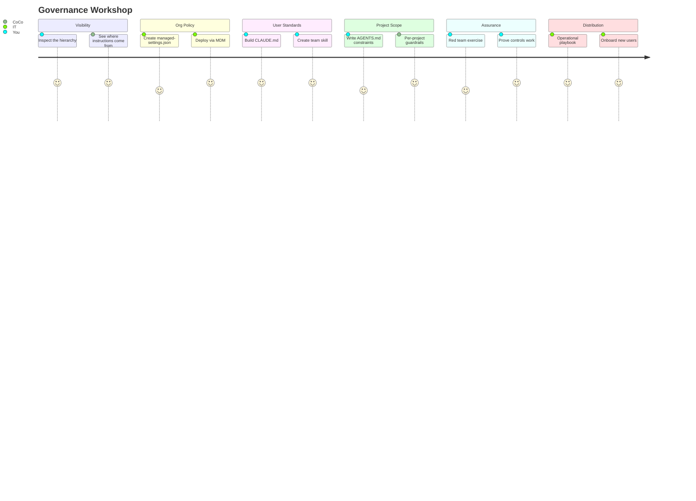

# Govern AI Coding Tools

Inspired by the question every IT leader asks: *"How do I control what AI coding tools can and can't do across my organization?"*

A hands-on workshop teaching teams to govern AI coding tools like Cortex Code, Cursor, and Claude Code. Replace *"AI is magic"* fear with *"AI follows explicit instructions I control."* Six steps, 75 minutes, and you walk out with a complete governance stack: org-level MDM policy, user-level standards, project-level guardrails, a red-team exercise, and a distribution playbook.

**Author:** SE Community
**Time:** ~75 minutes | **Steps:** 6 | **Result:** Complete governance stack + distribution playbook

> **No support provided.** This content is for reference only. Review and validate before applying to any production workflow.

---

## Who This Is For

IT leaders, team leads, and developers responsible for AI tool governance. You should already have Cortex Code installed -- this workshop teaches *governance*, not *usage*.

**New to Cortex Code?** Complete the [setup guide](../guide-coco-setup/README.md) first (~45 min).

---

## The Approach



| Step | What You Build | Governance Lesson |
|------|----------------|-------------------|
| [1. Visibility](prompts/01_visibility.md) | Inspect the hierarchy | See exactly where instructions come from |
| [2. Org Policy](prompts/02_org_policy.md) | managed-settings.json + MDM | IT enforces without user action |
| [3. User Standards](prompts/03_user_standards.md) | CLAUDE.md + team skill | Same baseline for all users |
| [4. Project Scope](prompts/04_project_scope.md) | AGENTS.md constraints | Per-project guardrails |
| [5. Assurance](prompts/05_assurance.md) | Red team exercise | Prove controls work |
| [6. Distribution](prompts/06_distribution_playbook.md) | Operational playbook | Onboard new users/projects |

### What You'll Build

| Artifact | Purpose |
|----------|---------|
| `managed-settings.json` | Org-level policy enforced by IT via MDM |
| `~/.claude/CLAUDE.md` | User-level standards applied every session |
| Team-standards skill | Procedural checks for credentials, destructive ops, naming |
| Project AGENTS.md | Per-project constraints and guardrails |
| Distribution playbook | How to onboard new users and projects |

> [!TIP]
> **Core insight:** The "AI is magic" fear comes from opacity. This workshop makes AI behavior visible and controllable.

---

## Quick Start

```bash
cd guide-coco-governance-general
cortex
```

Then open [WORKSHOP.md](WORKSHOP.md) and follow along -- or tell CoCo: *"Walk me through the governance workshop step by step."*

---

## References

| Resource | URL |
|----------|-----|
| Cortex Code CLI Settings | https://docs.snowflake.com/en/user-guide/cortex-code/settings |
| Extensibility (skills, hooks) | https://docs.snowflake.com/en/user-guide/cortex-code/extensibility |
| Data Governance Skills | https://docs.snowflake.com/en/user-guide/governance-skills |
| Setup Guide (prereq) | [guide-coco-setup](../guide-coco-setup/README.md) |
