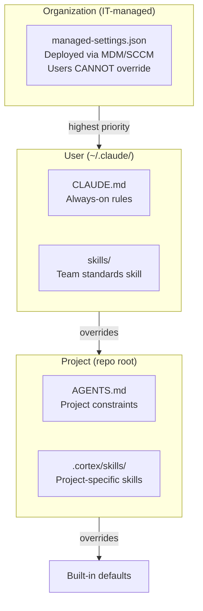
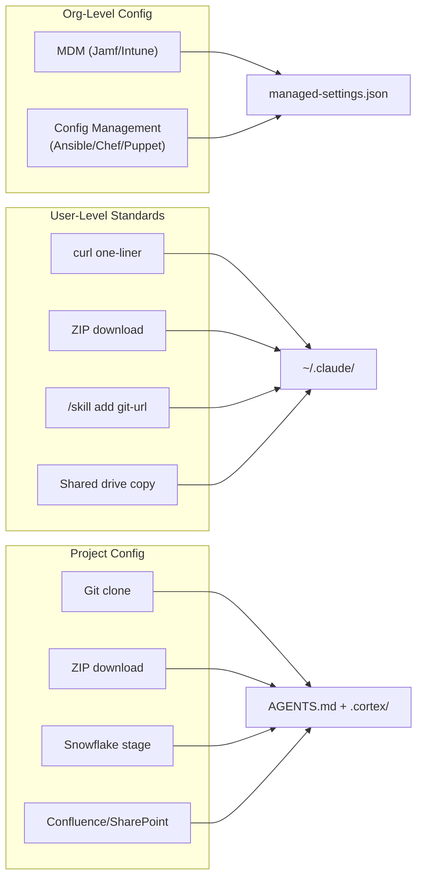

# Governance Workshop: Take Control of AI Coding Tools

Learn to govern AI pair-programming by building a complete control stack — from org-level policy to project-specific guardrails.

**Time:** ~75 minutes | **Steps:** 6 | **Result:** Governance stack + distribution playbook

## The Core Problem

"AI is magic" fear comes from **opacity**:
- "I don't know what instructions it's following"
- "I can't prevent it from doing dangerous things"
- "Standards drift and I can't tell why"
- "IT has no visibility or control"

This workshop replaces fear with **control**. Every step makes AI behavior more visible, constrained, and testable.

## Prerequisites

- [ ] Cortex Code CLI installed and connected (see [guide-coco-setup](../guide-coco-setup/README.md))
- [ ] Access to a Snowflake account (for testing)
- [ ] Admin access to your machine (for managed-settings exercise)
- [ ] ~75 minutes of focused time

## The 6 Steps

### [Step 1: Visibility](prompts/01_visibility.md)
**Time:** 10 min | **Build:** Nothing (inspection only)

Demystify the "black box" — see exactly where Cortex Code gets its instructions. You'll inspect:
- Built-in bundled skills
- User-level files (`~/.claude/CLAUDE.md`, `~/.snowflake/cortex/`)
- Project-level files (`AGENTS.md`, `.cortex/skills/`)
- Org-level policy (`managed-settings.json` if present)

**Takeaway:** The AI isn't magic. It follows a clear instruction hierarchy you can inspect.

---

### [Step 2: Org Policy](prompts/02_org_policy.md)
**Time:** 15 min | **Build:** `managed-settings.json`

Create organization-level guardrails that IT deploys via MDM (Jamf, Intune, SCCM) or config management (Ansible, Chef). Users cannot override these settings.

**What you'll configure:**
- `dangerouslyAllowAll: false` — prevent bypass mode
- Account restrictions — limit which Snowflake accounts can be used
- Required minimum version — force updates
- UI banner — "Managed by IT" visibility

**Takeaway:** IT can enforce enterprise policy without trusting individual behavior.

---

### [Step 3: User Standards](prompts/03_user_standards.md)
**Time:** 15 min | **Build:** `~/.claude/CLAUDE.md` + team-standards skill

Create user-level standards that apply to every session:
- Security rules (no credentials in code, no account IDs in output)
- SQL quality (sargable predicates, explicit columns)
- Destructive operation warnings (require confirmation for DROP/DELETE)

Build a team-standards skill with credential scanning and governance checks.

**Distribution options:** curl script, ZIP package, `/skill add` from git.

**Takeaway:** One-time setup, then standards auto-apply forever.

---

### [Step 4: Project Scope](prompts/04_project_scope.md)
**Time:** 10 min | **Build:** `AGENTS.md` with guardrails

Add project-specific constraints:
- "Never DROP the production schema"
- "Always use role ANALYST_ROLE for queries"
- "Require confirmation for any DELETE operation"

**Takeaway:** Each project can have its own safety boundaries.

---

### [Step 5: Assurance](prompts/05_assurance.md)
**Time:** 15 min | **Build:** Test results

Red team your governance stack:
- Try to expose credentials → should be blocked/warned
- Try to bypass managed settings → should fail
- Try to violate project constraints → should refuse or warn
- Try context compaction recovery → standards should persist

**Takeaway:** Governance is testable, not faith-based.

---

### [Step 6: Distribution Playbook](prompts/06_distribution_playbook.md)
**Time:** 10 min | **Build:** Operational documentation

Create a playbook answering:
- How do new employees get governance config?
- How do new projects get AGENTS.md templates?
- Who owns standard updates? How are they deployed?
- Emergency procedures for urgent policy changes?

**Takeaway:** Governance is an operational process, not a one-time setup.

---

## The Governance Hierarchy

## Distribution Channels

## After the Workshop

### Immediate Next Steps
1. **Deploy managed-settings.json** to your test machines via MDM
2. **Share the user setup script** with your team
3. **Create AGENTS.md templates** for common project types
4. **Schedule a red-team session** with security team

### Continue Learning
- [Campaign Engine Workshop](../demo-campaign-engine/GUIDED_BUILD.md) — apply governance in a real 7-step build
- [Data Governance Skills](https://docs.snowflake.com/en/user-guide/governance-skills) — built-in Snowflake governance capabilities
- [Extensibility Docs](https://docs.snowflake.com/en/user-guide/cortex-code/extensibility) — advanced skills and hooks

### Evolve Your Governance
After every session where:
- The AI did something unexpected → add a constraint
- A standard was violated → strengthen the check
- A new team member was confused → improve the playbook

Governance is a living system. The workshop gives you the structure; your team fills it with hard-won knowledge.
