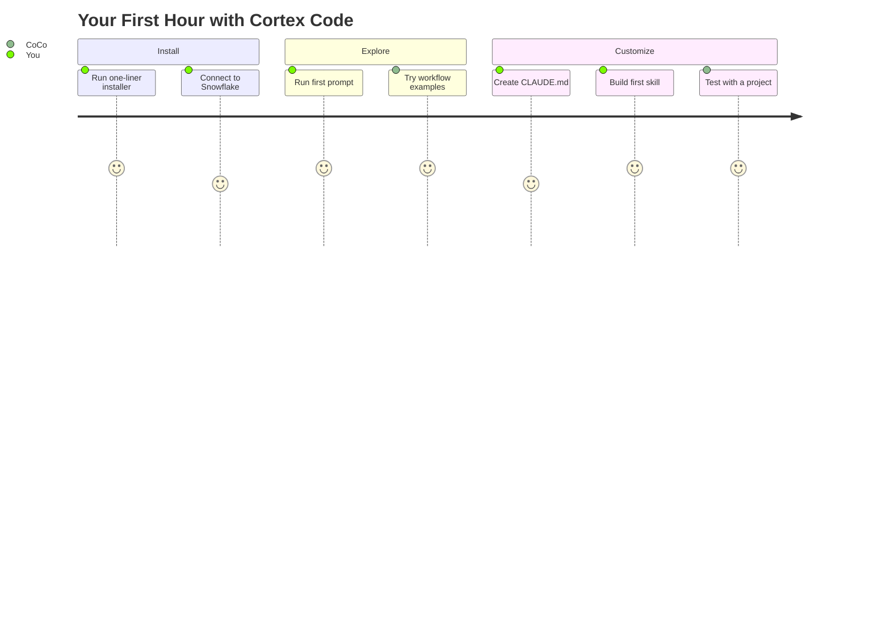
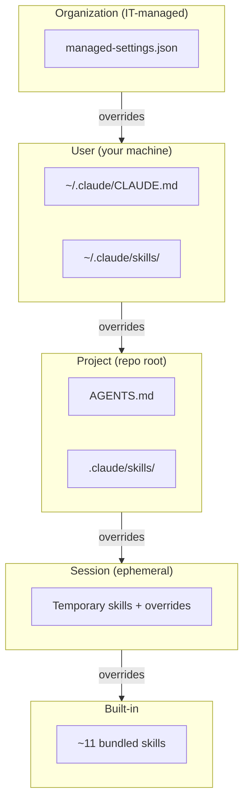

# Get Started with Cortex Code CLI

Inspired by the question every new user asks: *"I installed Cortex Code -- now how do I actually get good results from it?"*

A curated on-ramp for AI pair-programming with Snowflake. Install the CLI, understand how it finds its instructions (the guidance hierarchy), and build your first custom skill that encodes your team's standards. The secret to getting good results from AI pair-programming isn't better prompts -- it's better context management.

**Author:** SE Community
**Time:** ~45 minutes | **Result:** Working CLI + your first custom skill

> **No support provided.** This content is for reference only. Review and validate before applying to any production workflow.

---

## Who This Is For

Anyone new to AI pair-programming who wants to use Cortex Code with Snowflake. You don't need prior experience with AI coding tools, prompt engineering, or skills. You do need a Snowflake account.

**Already experienced with AI coding tools?** Skip to [Part 2](#part-2-how-coco-finds-its-instructions) for the guidance hierarchy, then [Part 3](#part-3-build-your-first-skill----team-standards) for the two-file standards pattern.

---

## The Approach



| Part | What You Learn | Time |
|------|---------------|------|
| [Part 0: Getting the Code](#part-0-getting-the-code) | Download from GitHub (zero experience assumed) | 5 min |
| [Part 1: The Learning Path](#part-1-the-learning-path) | Official docs in the right reading order | 15 min |
| [Part 2: How CoCo Finds Its Instructions](#part-2-how-coco-finds-its-instructions) | The guidance hierarchy (the key concept) | 10 min |
| [Part 3: Build Your First Skill](#part-3-build-your-first-skill----team-standards) | Team standards as always-on rules + on-demand review | 15 min |
| [Part 4: What's Next](#part-4-whats-next) | Campaign engine workshop, MCP servers, subagents | -- |

> [!TIP]
> **Core insight:** The AI is only as good as the context you give it. Cortex Code looks for instructions in multiple places, layered from broadest (organization) to narrowest (session). Understanding this hierarchy is the single most important concept for getting good results.

---

## Part 0: Getting the Code

<details>
<summary><strong>Downloading from GitHub (No Experience Required)</strong></summary>

1. Click the link you were given -- you'll see the project name and a list of files
2. Find the green **"Code"** button (right side, above the file list)
3. Click it and select **"Download ZIP"**
4. Find the ZIP in your Downloads folder and unzip it
5. Move the folder somewhere memorable

</details>

**Already comfortable with terminal?**

```bash
bash <(curl -sL https://raw.githubusercontent.com/sfc-gh-miwhitaker/sfe-public/main/shared/get-project.sh) <project-name>
cd sfe-public/<project-name>
```

---

## Part 1: The Learning Path

| # | Resource | What You Get | Time |
|---|----------|-------------|------|
| 1 | [What is Cortex Code?](https://medium.com/snowflake/snowflake-cortex-code-what-it-is-why-it-matters-and-when-to-use-it-35152de8edca) | Big picture: what, why, when | 9 min |
| 2 | [Install + Connect](https://docs.snowflake.com/en/user-guide/cortex-code/cortex-code-cli) | One-liner install, first prompt | 2 min |
| 3 | [CLI Reference](https://docs.snowflake.com/en/user-guide/cortex-code/cli-reference) | Every slash command | 5 min |
| 4 | [Workflow Examples](https://docs.snowflake.com/en/user-guide/cortex-code/workflows) | Data discovery, Streamlit, Agents | 15 min |
| 5 | [Skills + Extensibility](https://docs.snowflake.com/en/user-guide/cortex-code/extensibility) | Skills, subagents, hooks, MCP | 10 min |

> [!IMPORTANT]
> After Step 2, come back here. The rest of this guide covers concepts the official docs don't.

---

## Part 2: How CoCo Finds Its Instructions



1. **Organization** -- `managed-settings.json` via MDM. Always loaded, overrides everything.
2. **User** -- `~/.claude/CLAUDE.md` + `~/.claude/skills/`. Always loaded.
3. **Project** -- `AGENTS.md` + `.claude/skills/` at project root. Loaded when working in that project.
4. **Session** -- Temporary skills, `/plan` mode. Current session only.
5. **Built-in** -- ~11 bundled skills. Always available, overridden by everything above.

### Always-On vs On-Demand

> [!TIP]
> **Always-on** files (`AGENTS.md`, `~/.claude/CLAUDE.md`) are read at the start of every conversation. Put non-negotiable standards here.
> **On-demand** extensions (skills, MCP tools) are loaded when you reference them. Put specialized workflows here.

---

## Part 3: Build Your First Skill -- Team Standards

```bash
mkdir -p ~/.claude/skills/team-standards
cp reference/first-skill/SKILL.md ~/.claude/skills/team-standards/SKILL.md
cp -r reference/first-skill/references ~/.claude/skills/team-standards/
```

Verify: `/skill list` should show `team-standards`.

Test: *"Write a query that finds the top 10 customers by revenue from the ORDERS table"* -- the always-on rules in CLAUDE.md should prevent SELECT * and enforce QUALIFY.

---

## Part 4: What's Next

> [!TIP]
> The [Campaign Engine GUIDED_BUILD](../demo-campaign-engine/GUIDED_BUILD.md) applies everything you learned here in a real build: 7 prompts, ~90 minutes, ~1,200 lines of working code.

<details>
<summary><strong>Troubleshooting</strong></summary>

| Symptom | Fix |
|---------|-----|
| AGENTS.md not being followed | Must be at the root of the project, not in a subdirectory. Check `ls -la $(pwd)/AGENTS.md`. |
| Context compaction dropped instructions | Long sessions trigger summarization. Start fresh sessions for new tasks. |
| Skill not loaded | Check `/skill list`. Skills in `.claude/skills/` are on-demand, not always-on. |
| Settings leak between projects | User-level files apply to all projects. Move project-specific content to AGENTS.md. |

</details>

## References

| Resource | URL |
|----------|-----|
| Cortex Code CLI docs | https://docs.snowflake.com/en/user-guide/cortex-code/cortex-code-cli |
| CLI Reference | https://docs.snowflake.com/en/user-guide/cortex-code/cli-reference |
| Skills + Extensibility | https://docs.snowflake.com/en/user-guide/cortex-code/extensibility |
| "What is Cortex Code?" | https://medium.com/snowflake/snowflake-cortex-code-what-it-is-why-it-matters-and-when-to-use-it-35152de8edca |
| "How to Create a Skill" | https://medium.com/snowflake/how-to-create-a-skill-for-cortex-code-55bc5b38a223 |
