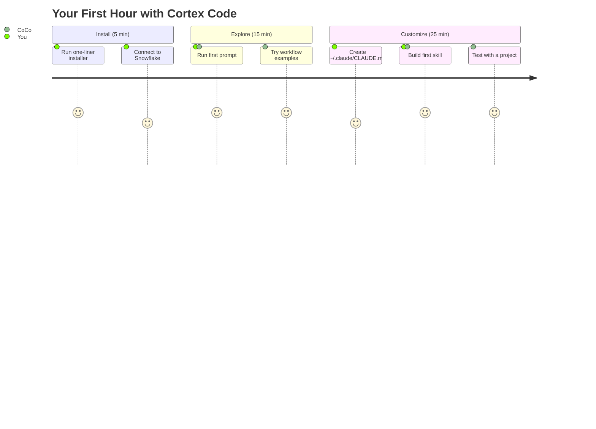
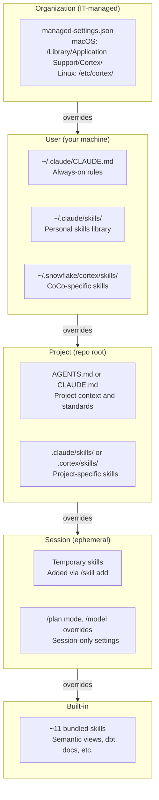

# Get Started with Cortex Code CLI

> [!CAUTION]
> **No support provided.** This content is for reference only. Review and validate before applying to any production workflow.

A curated on-ramp for AI pair-programming with Snowflake. Install the CLI, understand how it finds its instructions, and build your first custom skill.

**Time:** ~45 minutes | **Result:** Working CLI + your first custom skill

## Who This Is For

Anyone new to AI pair-programming who wants to use Cortex Code with Snowflake. You don't need prior experience with AI coding tools, prompt engineering, or skills. You do need a Snowflake account.

**Already experienced with AI coding tools?** Skip to [Part 2](#part-2-how-coco-finds-its-instructions) for the guidance hierarchy mental model, then [Part 3](#part-3-build-your-first-skill----team-standards) for the two-file standards pattern. These are the concepts the [campaign engine workshop](../demo-campaign-engine/GUIDED_BUILD.md) assumes.

---

## Part 0: Getting the Code

If someone sent you a link to a GitHub project and you've never used GitHub before, this section is for you. If you already have the code on your computer, skip to [Part 1](#part-1-the-learning-path).

<details>
<summary><strong>Downloading from GitHub (No Experience Required)</strong></summary>

1. **Click the link** you were given -- you'll arrive at a page showing the project name at the top and a list of files below

2. **Find the green button labeled "Code"** -- it's on the right side, above the file list. (If you don't see it, scroll up -- it's near the top of the page.)

3. **Click that green "Code" button** -- a small dropdown menu appears

4. **Click "Download ZIP"** -- this downloads all the project files as a single ZIP file

5. **Find the ZIP file** -- it's in your Downloads folder:
   - **Mac:** Open Finder, click "Downloads" in the sidebar
   - **Windows:** Open File Explorer, click "Downloads" in the sidebar

6. **Unzip the file:**
   - **Mac:** Double-click the ZIP file -- a folder appears next to it
   - **Windows:** Right-click the ZIP file, select "Extract All...", click "Extract"

7. **Move the folder somewhere memorable** -- drag it to your Documents folder (or anywhere you'll remember)

**That's it -- you have the code.** Continue to Part 1 to install Cortex Code.

#### Troubleshooting

| Problem | Solution |
|---------|----------|
| "I don't see a green Code button" | You might be on a file page, not the main project page. Look for a link near the top that shows just the project name (no file path after it) and click it. |
| "The ZIP file won't open" | On Windows, you may need to right-click and "Extract All" rather than double-clicking. On Mac, double-click should work -- if not, try right-click > "Open With" > "Archive Utility". |
| "I can't find my Downloads folder" | **Mac:** Click the Finder icon (smiley face) in your dock, then click "Downloads" in the left sidebar. **Windows:** Click the folder icon in your taskbar, then click "Downloads" in the left sidebar. |

</details>

### Already Comfortable with Terminal?

Clone the full repo (under 4 MB):

```bash
git clone https://github.com/sfc-gh-miwhitaker/sfe-public.git
cd sfe-public/<project-name>
```

Or clone just one project:

```bash
bash <(curl -sL https://raw.githubusercontent.com/sfc-gh-miwhitaker/sfe-public/main/shared/get-project.sh) <project-name>
cd sfe-public/<project-name>
```

### Don't Need Local Files?

Most **demo** projects deploy entirely inside Snowflake -- open the project's `deploy_all.sql` on GitHub, copy it into a Snowsight worksheet, and click **Run All**. This guide, however, is a walkthrough -- you'll need the files locally to follow along and build your first skill.

---

## Part 1: The Learning Path



These official resources cover install, connect, and basic usage. Read them in this order -- each builds on the previous.

| # | Resource | What You'll Get | Time |
|---|----------|-----------------|------|
| 1 | [What is Cortex Code?](https://medium.com/snowflake/snowflake-cortex-code-what-it-is-why-it-matters-and-when-to-use-it-35152de8edca) | Big picture: what CoCo is, why it exists, when to use it vs Cursor/Claude Code | 9 min |
| 2 | [Install + Connect](https://docs.snowflake.com/en/user-guide/cortex-code/cortex-code-cli) | One-liner install, setup wizard, first prompt | 2 min |
| 3 | [CLI Reference](https://docs.snowflake.com/en/user-guide/cortex-code/cli-reference) | Bookmark this -- every slash command, keyboard shortcut, exit code | skim 5 min |
| 4 | [Workflow Examples](https://docs.snowflake.com/en/user-guide/cortex-code/workflows) | Try data discovery, synthetic data, Streamlit, Cortex Agents | 15 min |
| 5 | [Skills + Extensibility](https://docs.snowflake.com/en/user-guide/cortex-code/extensibility) | Reference for skills, subagents, hooks, MCP -- you'll need this for Part 3 | skim 10 min |
| 6 | [How to Create a Skill](https://medium.com/snowflake/how-to-create-a-skill-for-cortex-code-55bc5b38a223) | Step-by-step skill creation walkthrough | 5 min |
| 7 | [Advanced Skill Techniques](https://medium.com/snowflake/advanced-techniques-for-creating-skills-in-cortex-code-cli-38f768eb2dcf) | Front-load research, build validators, iterate continuously | 8 min |

> [!IMPORTANT]
> **After Step 2, come back here.** The rest of this guide covers concepts the official docs don't.

---

## Part 2: How CoCo Finds Its Instructions

This is the single most important concept for getting good results from AI pair-programming: the AI is only as good as the context you give it. Cortex Code (and compatible tools like Cursor and Claude Code) look for instructions in multiple places, layered from broadest to narrowest scope.

### The Guidance Hierarchy

Higher layers override lower ones. See [diagrams/guidance-hierarchy.md](diagrams/guidance-hierarchy.md) for the full visual set.



1. **Organization** -- `managed-settings.json` (if IT deploys one). Always loaded, overrides everything below.
2. **User** -- `~/.claude/CLAUDE.md` + `~/.claude/skills/` + `~/.snowflake/cortex/skills/`. Always loaded.
3. **Project** -- `AGENTS.md` (or `CLAUDE.md`) at project root + `.cortex/skills/` or `.claude/skills/`. Loaded when working in that project.
4. **Session** -- Temporary skills, `/plan` mode, model overrides. Current session only.
5. **Built-in** -- ~11 bundled skills (semantic views, dbt, etc.). Always available, overridden by everything above.

### Always-On vs On-Demand

There are two kinds of guidance, and confusing them is a common mistake:

> [!TIP]
> **Always-on** files (`AGENTS.md`, `~/.claude/CLAUDE.md`, managed settings) are read at the start of every conversation. Put non-negotiable standards here.
>
> **On-demand** extensions (skills, subagents, MCP tools) are loaded when you reference them by name or the AI recognizes a matching trigger. Put specialized workflows here -- things you need sometimes, not always.

### AGENTS.md Explained

`AGENTS.md` is a markdown file at the root of your project that tells the AI what it needs to know. Think of it as a briefing document: project structure, environment details, coding standards, and guardrails.

**What goes in it:**

```markdown
# Project Name

One-sentence description.

## Project Structure
- Where the code lives, what each directory does

## Environment
- Database, schema, warehouse, roles
- External dependencies or integrations

## Development Standards
- SQL rules, naming conventions, testing expectations
- Patterns to follow, anti-patterns to avoid

## When Helping with This Project
- Specific guardrails (e.g., "never drop the production schema")
- Project-specific vocabulary or domain context
```

**When to update it:**
- After adding a major new component (new table, new feature, new integration)
- When the AI gets something wrong that it should know about
- When onboarding a new team member who will use AI tools on this project

**The specificity principle:** AGENTS.md needs *specifics*, not just *categories*. "We use Dynamic Tables" is too vague -- "Dynamic Tables with TARGET_LAG = '1 hour', columns: PLAYER_ID, TOTAL_WAGERS, AVG_BET_SIZE" is what the AI needs. In multi-step builds, the AI generates column names that vary between sessions. If you don't record the actual names in AGENTS.md, later steps that reference those columns will fail silently or produce mismatched code.

**The evolution pattern:** AGENTS.md starts sparse and grows as the project grows. After Step 1 of a project, it might only have the database and schema names. By Step 7, it contains every naming convention, every feature pattern, and every gotcha the AI needs to know. See the [campaign-engine GUIDED_BUILD](../demo-campaign-engine/GUIDED_BUILD.md) for a worked example of this evolution across 7 steps.

### CoCo + Cursor: What's Shared, What's Not

The practical takeaway: if you write your project guidance in `AGENTS.md` and your skills in `.claude/skills/`, they work in Cortex Code CLI, Cursor, and Claude Code. Use `.cortex/`-specific or `.cursor/`-specific paths only for tool-specific functionality.

> **Cursor note:** `AGENTS.md` loading in Cursor can be unreliable in some versions, particularly with background agents. If Cursor ignores your `AGENTS.md`, create a `.cursor/rules/` file with the same content as a workaround.

<details>
<summary>Full compatibility matrix</summary>

| File / Directory | Cortex Code CLI | Cursor | Claude Code |
|-----------------|-----------------|--------|-------------|
| `AGENTS.md` (project root) | Read automatically | Read automatically (as rule) | Read automatically |
| `.claude/skills/` (project) | Read as skills | Read as skills | Read as skills |
| `~/.claude/CLAUDE.md` | Read automatically | Read via rules | Read automatically |
| `~/.claude/skills/` | Read as skills | Read as skills | Read as skills |
| `.cursor/rules/` (project) | Not used | Project rules (highest priority) | Not used |
| `.cursor/skills/` (project) | Not used | Read as skills | Not used |
| `~/.snowflake/connections.toml` | Snowflake connection | Not used | Not used |
| `~/.snowflake/cortex/settings.json` | CoCo settings | Not used | Not used |
| `.cortex/skills/` (project) | Read as skills | Not used | Not used |
| `~/.snowflake/cortex/skills/` | Read as skills | Not used | Not used |

</details>

---

## Part 3: Build Your First Skill -- Team Standards

Most skill tutorials show you how to automate a task (CSV ingestion, test running, etc.). That's useful, but it's not the highest-leverage first skill. The highest-leverage first skill encodes your team's standards so that every session, in every project, starts with the right guardrails.

### Why Two Files, Not One

Part 2 taught the distinction between always-on and on-demand. Standards belong in both:

- **Always-on standards** go in `~/.claude/CLAUDE.md` -- loaded into the system prompt at every session start. These survive context compaction better because the system prompt is re-applied after compaction, while conversation content gets summarized.
- **The review procedure** goes in a skill -- a step-by-step workflow for checking code against your standards, plus compaction recovery and evolution guidance. Skills are procedures; CLAUDE.md is reference.

This split follows the [agentskills.io specification](https://agentskills.io/specification): skills should be *procedures* (what to do, in what order, with verification steps), not *documentation* (lists of rules).

### Step 1: Add Standards to CLAUDE.md

Open (or create) `~/.claude/CLAUDE.md` and add your team's non-negotiable rules. A template is in [`reference/claudemd-snippet.md`](reference/claudemd-snippet.md). The key sections:

- **SQL standards** -- no SELECT \*, sargable predicates, QUALIFY for window functions, explicit columns
- **Security rules** -- no credentials in code, use Snowflake secrets, no account IDs in output
- **Naming conventions** -- customizable `{TEAM_PREFIX}_` patterns, COMMENT on all objects

Replace all `{PLACEHOLDER}` values with your team's conventions.

### Step 2: Install the Skill

```bash
mkdir -p ~/.claude/skills/team-standards
cp reference/first-skill/SKILL.md ~/.claude/skills/team-standards/SKILL.md
cp -r reference/first-skill/references ~/.claude/skills/team-standards/
```

The skill at [`reference/first-skill/SKILL.md`](reference/first-skill/SKILL.md) is a **procedural review workflow** -- it tells the AI *how* to check your code against the standards in CLAUDE.md. The detailed rules live in [`references/standards.md`](reference/first-skill/references/standards.md) and load only when the AI needs specifics (progressive disclosure).

### Step 3: Verify

In Cortex Code CLI:

```text
/skill list
```

You should see `team-standards` in the output. If using Cursor or Claude Code, the skill will appear in their respective skill listings since it's in `~/.claude/skills/`.

### Step 4: Test it

Ask CoCo something that should trigger your standards:

```text
Write a query that finds the top 10 customers by revenue from the ORDERS table
```

The always-on rules in CLAUDE.md should prevent SELECT \* and enforce QUALIFY. If you explicitly invoke the team-standards skill, the AI should run the full review procedure.

### Step 5: Evolve it

> [!TIP]
> After every session where the AI made a mistake your standards should have caught, ask: *"What did we just learn that should be added to our standards?"*

Update `~/.claude/CLAUDE.md` for always-on rules, or the skill's `references/standards.md` for detailed reference patterns. Over time, your standards accumulate hard-won knowledge that's impossible to anticipate upfront.

### Project-Level vs User-Level: When to Use Which

| Scope | Path | Use When |
|-------|------|----------|
| User-level | `~/.claude/CLAUDE.md` + `~/.claude/skills/` | Standards that apply to ALL your projects (SQL rules, security, attribution) |
| Project-level | `AGENTS.md` + `.claude/skills/` in the project | Standards specific to ONE project (schema names, domain vocabulary, project patterns) |

Start with user-level. Move things to project-level when they're project-specific or when you're sharing a repo with others who have different standards.

---

## Troubleshooting

<details>
<summary><strong>"My AGENTS.md isn't being followed"</strong></summary>

**1. Wrong directory**
- AGENTS.md must be at the **root** of your project, not in a subdirectory
- Check: `ls -la $(pwd)/AGENTS.md` should show your file
- CoCo looks in the directory you launched from (or the `-w` path)

**2. Context compaction dropped it**
- Long sessions trigger automatic summarization, which can lose AGENTS.md content
- Fix: Ask CoCo to re-read it: "Please re-read the AGENTS.md file and follow its instructions"
- Prevention: Start fresh sessions for new tasks rather than extending very long ones

**3. Conflicting instructions**
- Higher-precedence layers override lower ones (see [hierarchy table](#the-guidance-hierarchy))
- Check if your `~/.claude/CLAUDE.md` or org-level settings contradict your project AGENTS.md
- Project AGENTS.md cannot override user-level or org-level rules

**4. Skill not loaded**
- Skills in `.claude/skills/` are on-demand, not always-on
- Check if your skill is loaded: `/skill list`
- If you expected automatic loading, the instructions belong in AGENTS.md instead

**5. File not saved**
- AGENTS.md changes aren't picked up until the file is saved
- Some editors don't auto-save; check for unsaved changes

</details>

<details>
<summary><strong>"CoCo ignores my skill"</strong></summary>

**1. Description doesn't match your request**
- The `description` field in SKILL.md frontmatter is the primary trigger mechanism -- agents use it to decide when to activate a skill
- Use specific keywords: "Use when reviewing SQL for quality" not "Helps with coding"
- Note: `triggers:` in frontmatter is a convention field for catalogs -- agents do not use it for activation

**2. Description summarizes the workflow**
- If your description explains *what the skill does* step by step, the agent may skip loading the full body
- Write descriptions that say *when to activate* and *what capabilities exist*, not the procedure itself

**3. Skill not in a recognized path**
- User skills: `~/.claude/skills/<name>/SKILL.md` or `~/.snowflake/cortex/skills/<name>/SKILL.md`
- Project skills: `.claude/skills/<name>/SKILL.md` or `.cortex/skills/<name>/SKILL.md`
- The directory name becomes the skill name and must match the `name` field in frontmatter

</details>

<details>
<summary><strong>"Settings from one project leak into another"</strong></summary>

- User-level files (`~/.claude/CLAUDE.md`, `~/.claude/skills/`) apply to ALL projects
- Move project-specific content to the project's AGENTS.md or `.claude/skills/` directory
- Check for stale context: start a new session with `cortex` (not `cortex --continue`)

</details>

---

## Part 4: What's Next

You now have a working Cortex Code CLI, an understanding of how it finds instructions, and a team-standards skill that improves every session.

### Continue to the AI-Pair Workshop

This guide taught you *context management* -- how the AI finds instructions, why AGENTS.md matters, and how skills prevent drift. The natural next step is to apply these concepts in a real build.

> [!TIP]
> The [Campaign Engine GUIDED_BUILD](../demo-campaign-engine/GUIDED_BUILD.md) walks through building a complete ML-powered application from scratch using 7 focused prompts (~90 minutes). Each step teaches one *prompting technique*, and the concepts you learned here -- especially the AGENTS.md mental model and the team-standards skill -- directly prevent the most common failure modes in Steps 5-7.

What you'll use from this guide:
- **AGENTS.md** -- You'll create one in the campaign engine's "Before You Start" and update it three times as the project grows. You now understand *why* each update matters and why recording specific column names (not just table names) is critical.
- **The guidance hierarchy** -- When the AI forgets your conventions mid-build (context compaction), you'll know how to recover: standards in CLAUDE.md survive compaction; the skill provides explicit recovery steps.
- **Your team-standards setup** -- The SQL quality rules in `~/.claude/CLAUDE.md` and the review procedure in your team-standards skill act as a safety net across all 7 steps.

### Other Directions

**Build a project-specific skill.** Follow [Jacob Prall's guide](https://medium.com/snowflake/how-to-create-a-skill-for-cortex-code-55bc5b38a223) to create a skill that automates a workflow you repeat often (data ingestion, test scaffolding, deployment).

**Add MCP servers.** Connect CoCo to GitHub, Jira, or other tools via [Model Context Protocol](https://docs.snowflake.com/en/user-guide/cortex-code/extensibility). Run `/mcp` in CoCo to see what's configured.

**Create custom subagents.** Define specialized agents for code review, testing, or exploration. See [Extensibility docs](https://docs.snowflake.com/en/user-guide/cortex-code/extensibility) for the agent definition format.

**Write an AGENTS.md for your next project.** Start with the template in [Part 2](#agentsmd-explained) and let it grow as you build.

---

## References

| Resource | URL |
|----------|-----|
| Cortex Code CLI docs | https://docs.snowflake.com/en/user-guide/cortex-code/cortex-code-cli |
| CLI Reference | https://docs.snowflake.com/en/user-guide/cortex-code/cli-reference |
| CLI Settings | https://docs.snowflake.com/en/user-guide/cortex-code/settings |
| Extensibility (skills, hooks, MCP) | https://docs.snowflake.com/en/user-guide/cortex-code/extensibility |
| Workflow Examples | https://docs.snowflake.com/en/user-guide/cortex-code/workflows |
| "What is Cortex Code?" (Daniel Myers) | https://medium.com/snowflake/snowflake-cortex-code-what-it-is-why-it-matters-and-when-to-use-it-35152de8edca |
| "How to Create a Skill" (Jacob Prall) | https://medium.com/snowflake/how-to-create-a-skill-for-cortex-code-55bc5b38a223 |
| "Advanced Skill Techniques" (Jacob Prall) | https://medium.com/snowflake/advanced-techniques-for-creating-skills-in-cortex-code-cli-38f768eb2dcf |
