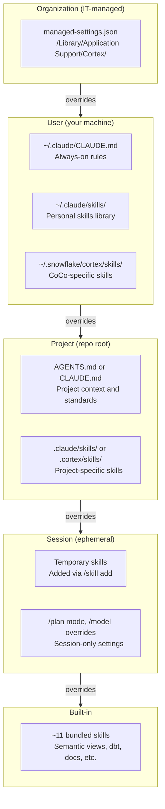
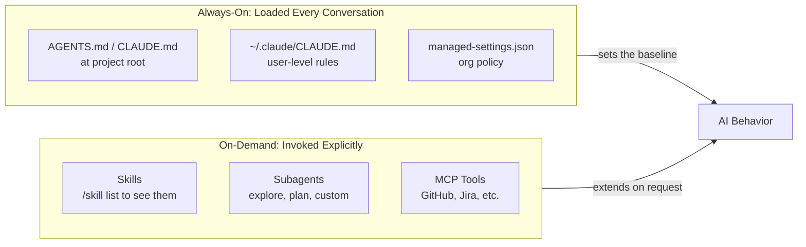
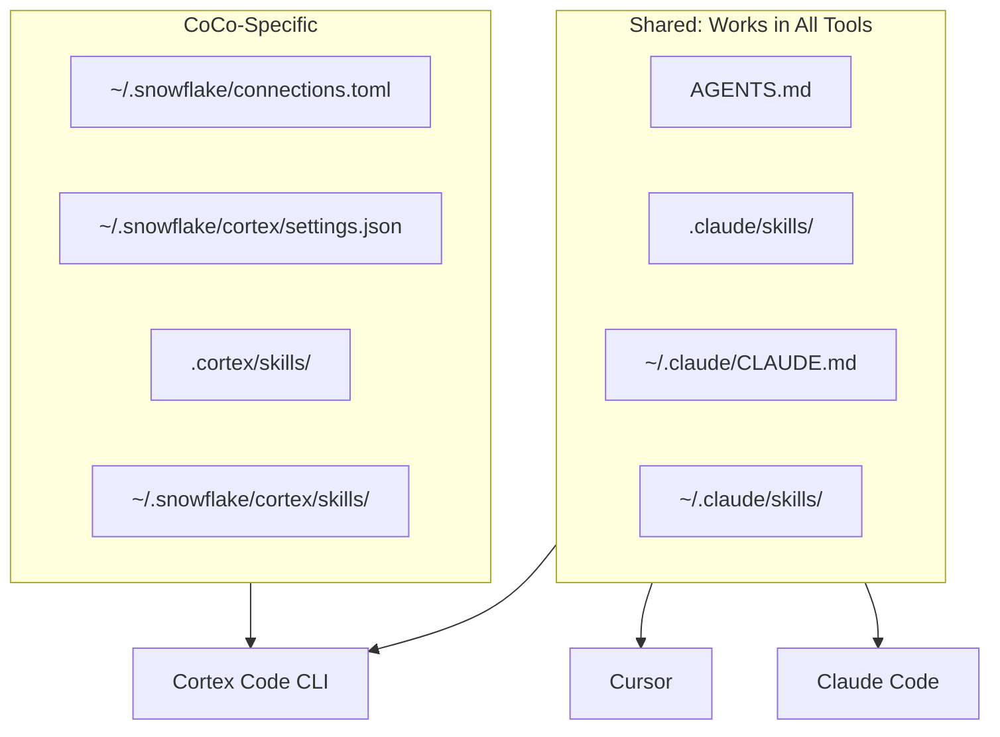

# Guidance Hierarchy: Where Cortex Code Finds Its Instructions

Cortex Code (and compatible tools like Cursor and Claude Code) look for guidance in multiple locations, layered from broadest to narrowest scope. Higher layers override lower ones.

## Always-On vs On-Demand

## Shared Files Across Tools

## Key Takeaway

Write your project guidance in `AGENTS.md` and your skills in `.claude/skills/` -- this ensures compatibility with Cortex Code CLI, Cursor, and Claude Code. Use `.cortex/`-specific paths only for CoCo-only functionality.
