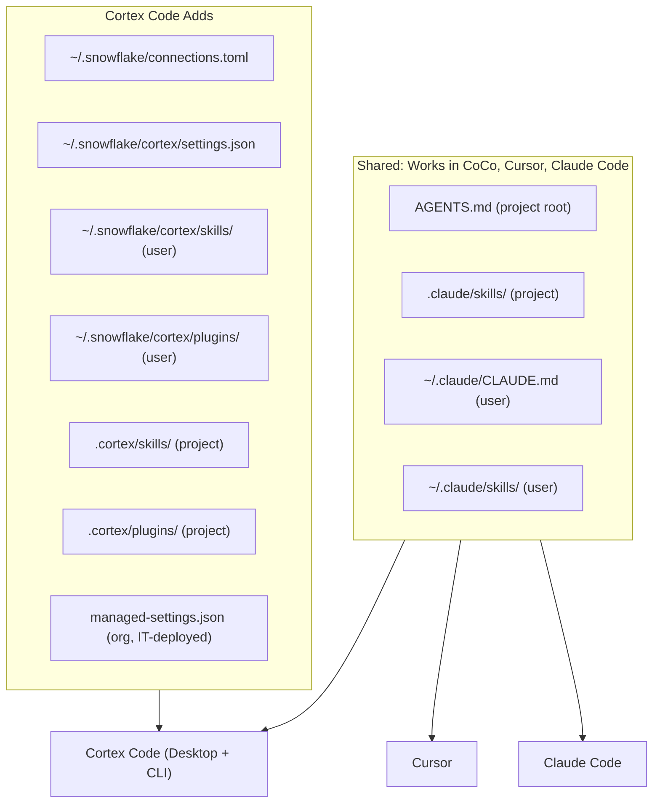

# What Cortex Code Adds to the Claude Code Configuration Model

Cortex Code reads all the same configuration files as Claude Code. For the base model (scopes, CLAUDE.md, skills, managed settings), see [Claude Code Settings](https://docs.anthropic.com/en/docs/claude-code/settings) and [Claude Code Memory](https://docs.anthropic.com/en/docs/claude-code/memory).

This diagram shows the Cortex Code-specific paths that extend the shared model.

```mermaid
flowchart TB
    subgraph shared ["Shared: Works in CoCo, Cursor, Claude Code"]
        S1["AGENTS.md (project root)"]
        S2[".claude/skills/ (project)"]
        S3["~/.claude/CLAUDE.md (user)"]
        S4["~/.claude/skills/ (user)"]
    end

    subgraph cocoOnly ["Cortex Code Adds"]
        C1["~/.snowflake/connections.toml"]
        C2["~/.snowflake/cortex/settings.json"]
        C3["~/.snowflake/cortex/skills/ (user)"]
        C4["~/.snowflake/cortex/plugins/ (user)"]
        C5[".cortex/skills/ (project)"]
        C6[".cortex/plugins/ (project)"]
        C7["managed-settings.json (org, IT-deployed)"]
    end

    shared --> CoCo["Cortex Code (Desktop + CLI)"]
    shared --> Cursor["Cursor"]
    shared --> ClaudeCode["Claude Code"]

    cocoOnly --> CoCo
```

## Priority Order (highest wins)

1. **Organization managed settings** (`managed-settings.json`) — IT-enforced, cannot be overridden
2. **Project** — `AGENTS.md`, `.claude/skills/`, `.cortex/skills/`
3. **User** — `~/.claude/CLAUDE.md`, `~/.claude/skills/`, `~/.snowflake/cortex/skills/`

## Guidance

- Write project-level instructions in `AGENTS.md` and skills in `.claude/skills/` — these work across CoCo, Claude Code, and Cursor.
- Use `.cortex/` paths only for CoCo-exclusive functionality (Snowflake connection settings, CoCo-only plugins).
- Plugins bundle skills + hooks + MCP servers into installable packages. Install via the Skills & Plugins catalog in Desktop, or manually place in `~/.snowflake/cortex/plugins/<name>/`.
