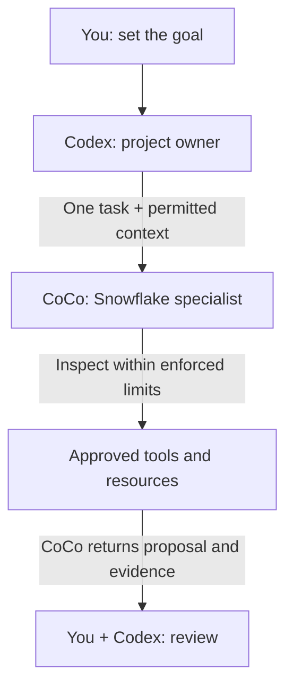

# Use Codex with CoCo for Snowflake Work

Keep building in OpenAI Codex. Connect Cortex Code (CoCo) as a native MCP tool for bounded Snowflake assignments, then review its proposal and evidence in Codex. Codex keeps ownership of application code and Git; you authorize changes separately.

**Audience:** Codex users building applications that involve Snowflake, and platform teams approving that workflow.

Pair-programmed by SE Community + Cortex Code

**Created:** 2026-10-09 | **Last verified:** 2026-10-08 | **Expires:** 2026-12-07 | **Status:** ACTIVE

> **No support provided.** Reference only; validate before production use.

---

## Start Here

**For Codex, start with native MCP.** It lets Codex call CoCo directly without the AI Kit router. The reviewed AI Kit Codex launcher automatically approves inner tool calls and disables child MCP connections; that is why its automatic-routing path is an alternative here, not the default. Native MCP still requires independent access controls.



*Responsibilities, not a security boundary: returned information may enter Codex's provider context. Written instructions do not enforce access limits.*

**For example:** Keep an order-summary API in Codex; ask CoCo to check whether a join counts an order's revenue twice. CoCo returns a correction proposal and checks, not permission to deploy it. Think of a contractor assigning an electrician one job: the assignment is not a key to every room.

### In This Guide

- [Using Microsoft Visual Studio Code?](#using-microsoft-visual-studio-code)
- [Connect Codex with native MCP](#recommended-native-mcp)
- [Try an order-summary assignment](#try-it-review-an-order-summary)
- [Consider AI Kit routing](#alternative-ai-kit-routing)
- [Write a reliable handoff](#the-handoff-contract)
- [Manage permissions and data](#data-and-authority-boundaries)
- [Troubleshoot](#troubleshooting)

Prefer plain language? Read the [companion guide](ELI5.md).

## Using Microsoft Visual Studio Code?

**Default to the official [Snowflake extension in the VS Code Marketplace](https://marketplace.visualstudio.com/items?itemName=snowflake.snowflake-vsc)** if you want CoCo inside Microsoft's Visual Studio Code editor. Confirm the publisher is Snowflake and the extension ID is `snowflake.snowflake-vsc`.

1. Install the Snowflake extension through VS Code's Extensions view.
2. Sign in to your approved Snowflake account in the extension.
3. Open the CoCo side panel and start your Snowflake work there.

The extension includes CoCo chat; you do not need to install the CoCo CLI separately for that path. See the [official extension documentation](https://docs.snowflake.com/en/user-guide/vscode-ext).

This is direct use of CoCo in VS Code, not automatic delegation from Codex or GitHub Copilot. Continue below only when you specifically want **Codex to remain the coordinating assistant**, including when you run Codex inside VS Code. Do not build an MCP or ACP bridge just to get CoCo chat in the editor.

## Before Connecting Codex

Your organization must permit Codex and the information returned to it. Start with synthetic inputs, not production rows. Never send credentials or unrelated conversations.

Install the [CoCo CLI](https://docs.snowflake.com/en/user-guide/cortex-code/cortex-code-cli) through your approved process, configure a development connection, and confirm effective privileges. Do not choose an administrative connection merely because it is the default. A read-only request is not a database-enforced restriction.

Use CoCo's **standard mode** for Snowflake work. Its separate **code mode** disables Snowflake data tools, MCP servers, and skills. [Mode reference](https://docs.snowflake.com/en/user-guide/cortex-code/code-mode)

No Snowflake infrastructure is deployed. Registering MCP changes Codex's configuration; review that change first. Enable only one delegation integration for this workflow initially.

## Recommended: Native MCP

Codex starts CoCo as a local process and calls its `cortex_code_agent` tool. They communicate over standard input and output (stdio). On the CoCo CLI 1.2.8 interface, each agent call is independent: send the context needed for that assignment.

### 1. Check CoCo

```bash
cortex --version
cortex connections list
cortex mcp serve --help
```

Keep connection output private. Confirm the last command describes **Start Cortex Code as an MCP server over stdio**, not generic MCP management help. A successful exit code alone does not prove the subcommand exists. If the CLI reports an unsupported version, update through your approved process.

### 2. Register the server

Run from the intended project directory in a Bash-compatible shell. The approved connection must already exist locally:

```bash
printf 'Approved development connection name: '
read -r COCO_CONNECTION
codex mcp add coco-snowflake -- \
  cortex mcp serve --connection "$COCO_CONNECTION" --workdir "$PWD"
```

Codex normally stores this in `~/.codex/config.toml`, shared by its local clients. The registration captures this project's absolute path: do not reuse it for another checkout without checking the directory. For separate projects, use distinct registrations or trusted project-scoped configuration. Use `/mcp` to inspect the active server. [Codex MCP documentation](https://developers.openai.com/codex/mcp)

### 3. Prove the round trip

Paste into Codex:

```text
Call coco-snowflake's cortex_code_agent once.
Prompt: Reply exactly DELEGATION_OK. Do not use tools, read files,
access Snowflake data, or modify anything.
Set bypass=false and disallowed_tools=["*"].
Use the configured project directory and approved development connection.
Show the returned tool result. Do not infer success from server startup.
```

**What this proves:** The agent tool accepted the assignment and returned the marker. Inspect the actual tool result, not just Codex's summary. This does not check database access or write restrictions.

Before a data-connected assignment, inspect the resolved connection and directory and verify the child's effective account and role. Registration defaults can be overridden; a connection label in a prompt is not proof of identity.

### 4. Inspect authority and timeout settings

The discovered agent tool accepts `prompt`, `workdir`, `connection`, `profile`, `model`, `allowed_tools`, `disallowed_tools`, and `bypass`. Only `prompt` is required. Do not invent additional JSON controls.

**One delegation can authorize many inner actions.** `allowed_tools` pre-approves matching tools; it is neither an exclusive allowlist nor a read-only SQL policy. `disallowed_tools` removes tools from the child's context. The caller can request broad authority through `bypass`. **Do not add `--bypass` to solve stalled approval.** Inspect the exact tool arguments and protect the account and local environment independently.

Codex documents a default MCP tool timeout of 60 seconds. Raise it deliberately for a bounded task. A timeout means the caller stopped waiting, not proof that all child work or submitted SQL stopped.

The server also exposes direct documentation and discovery tools. Use the smallest useful tool; a documentation lookup does not require an autonomous child.

## Try It: Review an Order Summary

Your API needs daily order count and revenue. Before connecting real data, give CoCo a synthetic case where the right answer is clear:

```text
Delegate this order-summary review to CoCo through cortex_code_agent.
Use only the synthetic facts below. No tools, files, or database access;
set bypass=false and disallowed_tools=["*"].

orders has one row per order: order_id, order_date, order_total.
order_items has one row per item: order_id, item_id.
On the same date, order A totals 30 and has two items;
order B totals 20 and has one item.
The proposed report joins orders to order_items, counts the joined rows,
and sums order_total.

Explain the error, propose the correct daily aggregation approach,
and give the expected result. Identify assumptions and validation steps.
Return a proposal only. Do not change anything.
```

**Check the answer:** The correct daily result is **2 orders and 50 revenue**. The joined rows produce 3 and 80. CoCo should explain that the order total repeats for each item and propose aggregating at order grain. These are expected results from the supplied facts, not a recorded agent response.

**Then make it useful:** With separate authorization, supply the actual query and named objects. Ask CoCo to inspect only those definitions, check types and join grain, and return a correction plus validation steps. Business-query execution and row samples are not needed for that first review. Compilation alone does not prove correct results.

Codex retains API, file-edit, and Git ownership. Approve changes separately. This example teaches the handoff; routine arithmetic alone does not require another agent.

## Alternative: AI Kit Routing

[Snowflake AI Kit](https://github.com/Snowflake-Labs/snowflake-ai-kit) packages hooks, routing instructions, and a CoCo launcher. Consider it only after reviewing the Codex-specific behavior against your team's required controls. Do not combine it with native MCP for the same workflow initially or with the older `subagent-cortex-code` project.

### Read this before installing

In the reviewed **AI Kit 3.4.0 Codex path**:

- The launcher uses `--dangerously-allow-all-tool-calls` and `--no-mcp`.
- It validates the selected envelope before launch but does not apply the Claude path's per-tool gate. **Selecting `RO` does not enforce read-only execution on this path.**
- Skills needing external MCP tools lose those connections.
- The upstream README says the approval-mode wrapper remains a simulation; validating configuration does not implement interactive approval.

Review the [versioned executor](https://github.com/Snowflake-Labs/snowflake-ai-kit/blob/e2a3cbb45a9a62b5648266c5777c1b2edb3f8579/plugins/cortex-code/scripts/router/execute_cortex.py#L557) and [configuration caveats](https://github.com/Snowflake-Labs/snowflake-ai-kit/blob/e2a3cbb45a9a62b5648266c5777c1b2edb3f8579/plugins/cortex-code/README.md#configuration). If these behaviors conflict with your requirements, stay with a suitably constrained native MCP setup or work directly in CoCo.

### Install only if those controls are acceptable

```bash
codex plugin marketplace add Snowflake-Labs/snowflake-ai-kit
codex plugin add snowflake-cortex-code@snowflake-ai-kit
```

The plugin still requires the CoCo CLI and an authenticated connection. Do not install a host your organization prohibits. Python launcher and optional YAML dependencies are described in the [plugin README](https://github.com/Snowflake-Labs/snowflake-ai-kit/tree/main/plugins/cortex-code); do not install dependencies into an externally managed system Python.

The plugin uses a keyword prefilter and routing instructions. Select `cortex-run` from Codex's skill menu for explicit invocation. Do not assume every version renders the same skill prefix. Inspect resolved connection/directory and child identity before accessing data. Keep mixed application and Snowflake tasks separate, and check that routing occurred without duplicate execution by Codex.

Marketplace and repository revisions can differ. Inspect the installed manifest and resolved source revision. Keep host, CLI, and plugin versions in a private qualification record and recheck controls after updates.

## The Handoff Contract

**Give CoCo a task, not the keys to the project.** Include:

```text
Objective: One concrete Snowflake outcome.
Connection: Exact approved connection; do not switch accounts or roles.
Workspace: Exact directory and relevant files; preserve unrelated changes.
Scope: Named objects or synthetic schema; no account-wide exploration.
Authority: Inspect and propose, or the exact separately approved change.
Context: Relevant requirements and evidence, not the complete chat history.
Return boundary: Metadata/aggregate summary only unless rows are authorized.
Acceptance: Observable checks that establish correctness.
Limits: Time/turn budget; stop and report if blocked or ambiguous.
Return: COMPLETE, PARTIAL, or BLOCKED; evidence; changed files/objects;
        validation results; query/session IDs when available; remaining work.
```

A budget in a prompt is not necessarily an enforced runtime limit. Configure supported controls rather than inventing tool fields.

Put this preference in the project's `AGENTS.md` if it fits your workflow:

```text
For Snowflake work, propose a bounded CoCo handoff through coco-snowflake.
Keep application code, Git, and final acceptance here.
Name the approved connection and directory; ask if either is ambiguous.
Start with inspection/proposal. Do not authorize changes implicitly.
Send only relevant, permitted context and request concise evidence.
Treat denial, timeout, or partial completion as a blocker, not a reason
 to switch tools or retry a write. Do not delegate back into this router.
```

This guides behavior; it does not enforce security.

## Reliable Operation

- **One writer:** Do not let Codex and CoCo edit the same files or objects concurrently. Separate worktrees do not isolate a shared database schema. Keep commits, merges, pushes, and final review with Codex and you.
- **Explicit context:** Native MCP calls are independent. Supply the relevant context each time instead of assuming a continued child session.
- **Plugin sessions:** If you choose AI Kit, use a known session ID tied to the task, directory, and connection, or start fresh. Its reviewed `--resume-last` state is one per-user pointer with a 30-minute freshness check, not a task/account mapping. [Session implementation](https://github.com/Snowflake-Labs/snowflake-ai-kit/blob/e2a3cbb45a9a62b5648266c5777c1b2edb3f8579/plugins/cortex-code/scripts/router/session_state.py)
- **Completion evidence:** Inspect process status and final structured results, including errors. Preserve PARTIAL and BLOCKED. An initialization event, readable answer, or exit code alone is insufficient.
- **Timeouts:** Check what completed before retrying. Submitted SQL may need separate cancellation or reconciliation; do not duplicate a write.
- **Overhead:** Batch related investigation into one small handoff. Both assistants can incur inference usage, plus any Snowflake compute invoked. Measure rather than promise savings.

## Data and Authority Boundaries

**Local stdio is transport, not the full data journey.** Prompts and results can enter Codex's provider context; CoCo separately communicates with Snowflake. Summarizing confidential data does not make it public.

Keep parent approval, child tool permissions, local isolation, and Snowflake authority separate. Codex's plan mode does not automatically make CoCo read-only. Do not assume Codex's sandbox covers every MCP subprocess or that a Desktop restriction transfers to a CLI child.

[Restricted Session Scope](https://docs.snowflake.com/en/user-guide/restricted-session-scope) can impose a server-side privilege ceiling without granting access. Verify the restriction in the child session, including effective roles and callable programs. Arbitrary alternate SQL clients must not be assumed to inherit agent-aware protections.

Native MCP does not expose every CLI control, such as a named RSS startup option or a turn limit. If required controls cannot be enforced through your chosen interface, use a constrained documented CLI/SDK workflow or perform the task directly in CoCo. Never pass connection-file contents, private keys, tokens, or unrelated transcripts. Permission denial means stop, not change connection or increase privileges.

## Troubleshooting

- **CoCo stalls:** Separate authentication failure, unanswered approval, timeout, and missing final result. Do not enable bypass or retry a write automatically.
- **MCP command appears missing:** Confirm a connection is configured and inspect actual `serve --help` output; do not infer a release-channel cause.
- **Wrong account or directory:** Inspect registration defaults and per-call overrides, then verify child identity before data access.
- **MCP tools disappear with AI Kit:** Its reviewed Codex launcher disables child MCP. Also check runtime policy and connection configuration.
- **Routing misses a prompt:** Use the explicit skill or tool; do not install a second router.
- **Follow-up uses the wrong task:** Native calls are independent. With AI Kit, start fresh or resume the exact session ID, not the global last session.
- **Writes remain possible:** Tool approval and read-only enforcement differ. Verify database restrictions, not the envelope label.

To stop delegation, disable the server or plugin for this workflow. Retain shared connections and unrelated servers. Disabling the integration does not undo completed changes.

## Development Tools

Reader documentation only. Coding assistants can follow the repository's contributor instructions; no project-specific `AGENTS.md`, `.claude/skills/`, wrapper, or deployment script is required. Configure integrations in your approved environment, not this repository.

## Related Guides

- [Codex MCP configuration](https://developers.openai.com/codex/mcp)
- [Official Snowflake extension for VS Code](https://marketplace.visualstudio.com/items?itemName=snowflake.snowflake-vsc)
- [CoCo CLI installation and connections](https://docs.snowflake.com/en/user-guide/cortex-code/cortex-code-cli)
- [Restricted Session Scope](https://docs.snowflake.com/en/user-guide/restricted-session-scope)

## External References

- [Snowflake AI Kit](https://github.com/Snowflake-Labs/snowflake-ai-kit)
- [Versioned AI Kit implementation](https://github.com/Snowflake-Labs/snowflake-ai-kit/tree/e2a3cbb45a9a62b5648266c5777c1b2edb3f8579/plugins/cortex-code)
- [Snowflake VS Code extension documentation](https://docs.snowflake.com/en/user-guide/vscode-ext)
- [CoCo CLI reference](https://docs.snowflake.com/en/user-guide/cortex-code/cli-reference)
- [CoCo Agent SDK approval handling](https://docs.snowflake.com/en/user-guide/cortex-code-agent-sdk/user-input)
