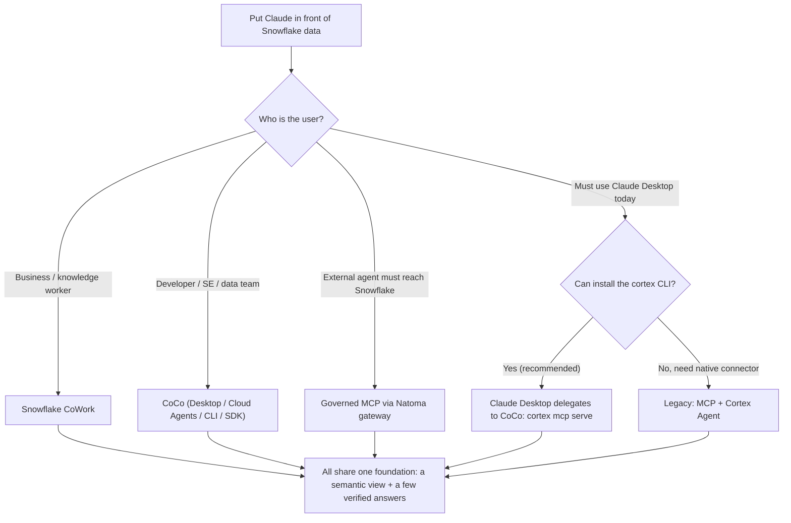

# Connecting Claude to Snowflake: Context Over Connection

There are several ways to put Claude in front of Snowflake data. This guide helps you pick the right one for your users, then walks you through it — and shows the small, shared foundation that makes answers accurate no matter which one you choose.

> **Just need to wire up Claude Desktop?** Jump straight to [Claude Desktop setup](governed-mcp.md#claude-desktop-setup).

**Audience:** SEs walking customers through setup + customer IT admins configuring independently
**Created:** 2026-05-06 | **Major revision:** 2026-06-15 (post-Summit 26) | **Expires:** 2026-12-31 | **Status:** ACTIVE

> **No support provided.** Reference only; validate before production. This guide spans features at different maturity. Several — **CoCo Desktop, the Natoma MCP gateway, Semantic Studio** — are in **public preview, which is fair game to use**: go ahead and try them, just know they're pre-GA and may change. Each is labeled where it appears.

---

## Start Here: Which Surface Fits Your User?

Decide by *who the user is*, not by protocol. Pick a row; the rest of the guide details it.

> New to the names below? **CoWork** (formerly Snowflake Intelligence) and **CoCo** (formerly Cortex Code) are defined in plain terms in the table under [Why This Guide Routes You This Way](#why-this-guide-routes-you-this-way).

| Criteria | CoWork | CoCo | Governed MCP (Natoma) | Legacy MCP text-to-SQL |
|---|---|---|---|---|
| **Best for** | Business users, NL questions | Developers, SEs, pipelines, apps | External agents needing governed tool access | Claude Desktop chat, business convenience |
| **Where it runs** | In Snowflake | Desktop / Snowsight Cloud Agents / CLI | Snowflake-managed gateway | Claude Desktop <-> MCP Server |
| **Accuracy posture** | Context-grounded (~86%) | Data-native (reads schema/RBAC/lineage) | Tool-scoped, deterministic | ~24% unless context added |
| **Cost posture** | Governed, attributed | 51% fewer tokens than generic agent | Per-tool-call audited | Uncontrolled per-turn |
| **Governance** | RBAC + Horizon Context | RBAC + envelopes + audit | Identity/policy/audit per call | RBAC + Semantic View + tool list |
| **Guide** | [context-layer.md](context-layer.md) | [coco.md](coco.md) | [governed-mcp.md](governed-mcp.md) | [governed-mcp.md](governed-mcp.md) (legacy section) |

> **One foundation, many surfaces.** Whichever column you choose, the work that makes answers accurate is the same: describe your data in business terms and save a few real questions with their correct answers (see [The Context Layer](context-layer.md)). The columns differ only in *what sits on top*. Pick the surface that fits your users — you're not signing up for different homework by choosing one over another, and the foundation keeps getting easier as Snowflake automates more of it.

### The guides

| | |
|---|---|
| **[Claude Desktop & Governed MCP](governed-mcp.md)** | **Setting up Claude Desktop? Start here.** The recommended delegate-to-CoCo path (works today, no semantic view required to begin), the Natoma MCP gateway, and — for native-connector cases — the legacy Snowflake OAuth / Entra ID External OAuth setup. |
| **[CoCo: The Data-Native Developer Surface](coco.md)** | CoCo Desktop, Cloud Agents (Snowsight), CLI, Agent SDK, MCP server + ACP, Skills Catalog. How Claude Desktop / Claude Code delegate to CoCo via `cortex mcp serve`. Connection auth, security envelopes, profiles, and the ADE-Bench efficiency story. |
| **[The Context Layer](context-layer.md)** | The shared foundation, in plain terms: describe your data, save a few real questions with their correct answers, check it. Points you to Snowflake's own learning resources for going deeper. |

---

## Why This Guide Routes You This Way

You don't need this section to follow the steps above — it's the rationale, in case you want to understand (or explain to a stakeholder) why the surfaces and the foundation matter.

### What changed at Summit 26

Five names appear throughout this guide. Read this table once and you're oriented — each row includes a plain-English "think of it as."

| Old name (pre-Summit) | New name / model | Think of it as | Maturity |
|---|---|---|---|
| Snowflake Intelligence | **Snowflake CoWork** | The chat experience for business users, built into Snowflake | GA |
| Cortex Code (a plugin) | **CoCo** | A data-aware coding agent (like Claude Code, but it knows your Snowflake) | CLI GA; Desktop in public preview |
| *(absent)* | **Cortex Sense** | The service that feeds your business definitions to an agent at the moment it answers | GA |
| *(absent)* | **Horizon Context** | Where your governed business definitions live (semantic views, metrics, lineage) | GA; Semantic Studio in public preview |
| Hand-rolled per-app OAuth | **Natoma MCP gateway** | One governed front door for agent tool-calls, instead of wiring OAuth per app | Public preview |
| "Connect Claude in from outside" | **Claude inside Cortex AI** | Claude models run *inside* Snowflake and power CoWork + CoCo ($200M Anthropic deal) | GA |

> The CLI binary is still invoked as `cortex` and config still lives in `~/.snowflake/cortex/`. "CoCo" is the product brand for what was Cortex Code. Public-preview features are usable today — labeled so you know what's pre-GA.

### The two numbers

| Metric | Generic agent over a pipe | Data-native + governed context | Source |
|---|---|---|---|
| **Accuracy** on hard structured-data questions | ~24% | **~86%** (with Cortex Sense context) | Snowflake Summit 26 benchmark |
| **Token + time cost** (vs CoCo on equivalent work) | +51% tokens, +8% time, *lower* pass rate (65.1%) | CoCo: 72.1% on ADE-Bench | [Snowflake CoCo blog](https://www.snowflake.com/en/blog/snowflake-coco-ai-coding-agent-modern-data-stack/) |

Raw natural-language-to-SQL through an MCP tunnel — no grounding, regenerated every turn, the human never sees the query — answers roughly **one in four** hard questions correctly while burning **more** tokens and warehouse credits than the alternative. That's why this guide leads with the foundation and prefers data-native surfaces.

### Three principles

1. **Run the intelligence next to the data.** Claude now runs *inside* Snowflake Cortex AI, powering CoWork and CoCo. No data egress, governed by your existing RBAC, inference inside the Snowflake perimeter.
2. **Ground every agent in governed context.** Horizon Context defines the truth; Cortex Sense delivers it at query time. This is the mechanism behind the 24% -> 86% jump.
3. **Govern tool access centrally.** The Natoma MCP gateway enforces identity, policy, and audit per tool-call — replacing fragile per-app OAuth plumbing.

---

## Governance Comparison

| Layer | CoWork / CoCo | Governed MCP (Natoma) | Legacy MCP text-to-SQL |
|---|---|---|---|
| **Authentication** | Snowflake SSO / connection | Centralized credential brokering | OAuth token (Snowflake or Entra) / PAT |
| **Identity** | Connection-based, RBAC | Non-human identity, per-call | Token-bound (per-session) |
| **Data visibility** | Full RBAC + Horizon Context | Tool-scoped | Semantic View boundary |
| **Operation control** | Security envelopes / agent design | Policy at tool-call level | Agent tool list (omit execute_sql) |
| **Accuracy mechanism** | Cortex Sense context (~86%) | Deterministic vetted tools | None by default (~24%) |
| **Audit** | Prompt/response logging, query tags | Full tool-call audit trail | Query history |

---

## Related Projects

- [`guide-mcp-auth`](../guide-mcp-auth/) — Comprehensive MCP auth for all AI clients (Cursor, VS Code, Windsurf)
- [`guide-agent-hardening`](../guide-agent-hardening/) — Agent governance: RBAC, monitoring, cost controls
- [`guide-external-access-playbook`](../guide-external-access-playbook/) — External access patterns: network rules, secrets, OAuth
- [`tool-secrets-rotation-aws`](../tool-secrets-rotation-aws/) — Automated PAT and key-pair rotation

## External References

- [Snowflake CoCo: AI Coding Agent for the Modern Data Stack](https://www.snowflake.com/en/blog/snowflake-coco-ai-coding-agent-modern-data-stack/)
- [Snowflake CoWork (formerly Snowflake Intelligence)](https://www.snowflake.com/en/product/snowflake-cowork/)
- [Snowflake Horizon Context: The Governed Context Layer](https://www.snowflake.com/en/blog/horizon-context-governed-context/)
- [Snowflake to Acquire Natoma — Governed Agentic Access](https://www.snowflake.com/en/blog/snowflake-acquire-natoma-governed-agentic-access/)
- [Snowflake + Anthropic $200M Expanded Partnership](https://www.anthropic.com/news/snowflake-anthropic-expanded-partnership)
- [Cortex Code CLI MCP Support (`cortex mcp serve`)](https://docs.snowflake.com/en/user-guide/cortex-code/cortex-code-mcp)
- [Snowflake MCP Server Documentation](https://docs.snowflake.com/en/user-guide/snowflake-cortex/cortex-agents-mcp)
- [Cortex Code CLI Extensibility](https://docs.snowflake.com/en/user-guide/cortex-code/extensibility)
