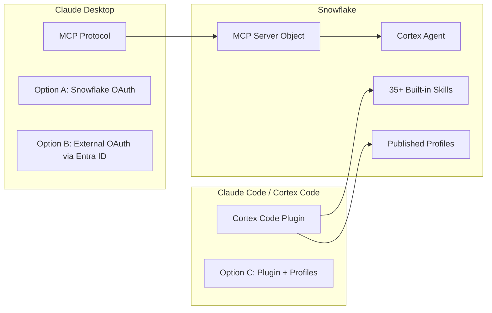
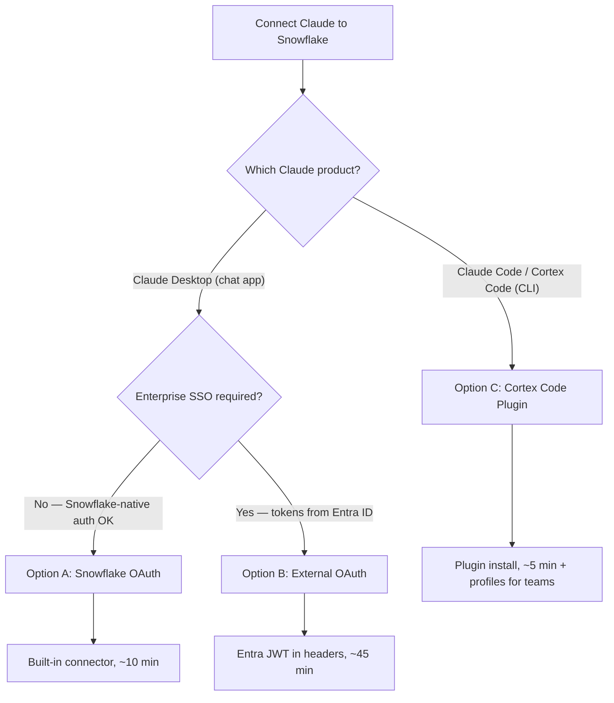
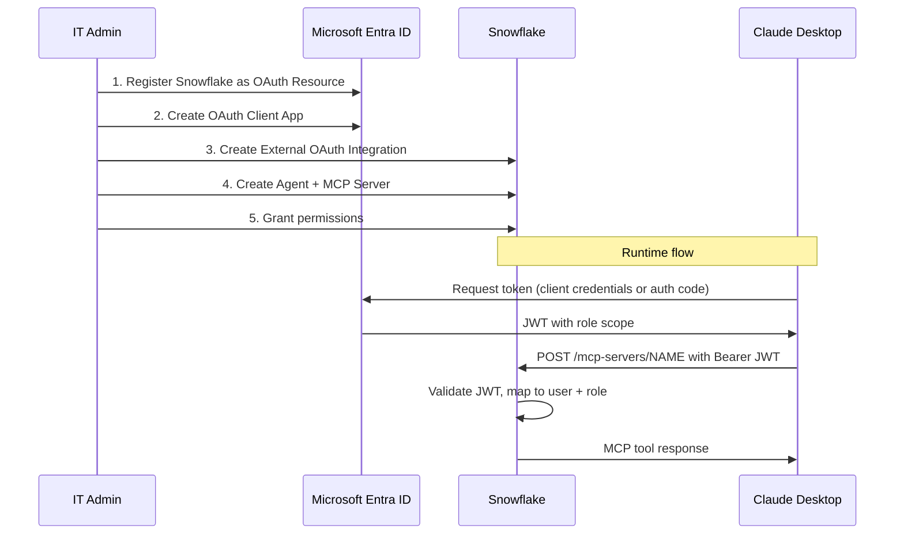
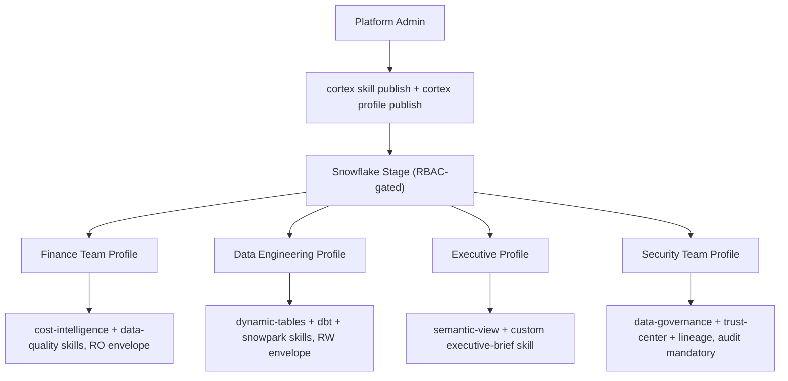

# Connecting Claude to Snowflake: MCP, OAuth, and Cortex Code

Three paths to connect Claude products to Snowflake data — from a 5-minute plugin install to full enterprise OAuth with Entra ID. Each path serves a different surface, governance model, and level of experience customization.

**Audience:** SEs walking customers through setup + customer IT admins configuring independently
**Created:** 2026-05-06 | **Expires:** 2026-06-05 | **Status:** ACTIVE

> **No support provided.** This content is for reference only. Review and validate before applying to any production workflow.

---

## Two Surfaces, Three Paths

Claude connects to Snowflake through two distinct products with fundamentally different integration models:



**Claude Desktop** is the chat application (macOS/Windows/Linux). It connects to Snowflake via the **MCP protocol** — you create an MCP Server object in Snowflake, configure auth, and Claude Desktop discovers and calls tools through JSON-RPC. You get data in, answers out. But there's no way to customize the experience, inject domain knowledge, or shape how Claude interprets responses.

**Claude Code / Cortex Code** is the CLI coding agent. It connects to Snowflake via the **Cortex Code plugin** which routes Snowflake prompts to Cortex Code CLI. No MCP server needed — it uses Cortex Code's existing connection and 35+ built-in skills. Admins can publish **profiles** that bundle custom skills, system prompts, and security policies per team. This is how you shape the experience.

| Capability | Options A/B (Claude Desktop + MCP) | Option C (Cortex Code Plugin) |
|---|---|---|
| **Enterprise SSO** | Option B only (requires External OAuth integration setup) | Built-in via `externalbrowser` (uses existing Snowflake SSO) |
| **Data access** | Via Cortex Agent + Semantic View | Via Cortex Code CLI connection (full RBAC) |
| **Experience shaping** | None — raw tool output | Profiles with skills + system prompts per team |
| **Domain expertise** | Limited to agent system prompt | 35+ specialized skills (data quality, governance, lineage, ML, etc.) |
| **Operation governance** | Agent tool list (no execute_sql = read-only) | Security envelopes (RO/RW/RESEARCH/DEPLOY) |
| **Centralized distribution** | Not applicable | Skills published to Snowflake stages, gated by RBAC |
| **Audit trail** | Query history only | Structured JSONL audit logging + query history |
| **Org policy enforcement** | None | Organization policy YAML for enterprise override |

---

## Quick Decision: Which Path?



| Criteria | Option A | Option B | Option C |
|---|---|---|---|
| **Setup time** | ~10 minutes | ~45 minutes | ~5 minutes |
| **Identity** | Snowflake-native OAuth | Entra ID (your tenant) | Browser SSO, PAT, or key-pair via connections.toml |
| **Enterprise SSO** | No (Snowflake OAuth only) | Yes (Entra ID tokens) | Yes (externalbrowser opens IdP — Entra/Okta/SAML) |
| **Requires MCP Server object** | Yes | Yes | No |
| **Requires OAuth integration** | Yes (Snowflake OAuth) | Yes (External OAuth) | No (uses existing Snowflake SSO config) |
| **Experience shaping** | No | No | Yes (profiles + skills) |
| **Best for** | Quick setup, business users in Claude Desktop | Enterprise SSO mandates for MCP specifically | Developers, SEs, power users wanting specialized Snowflake expertise |
| **Governance model** | RBAC + Semantic View + Agent Tool List | RBAC + Semantic View + Agent Tool List | Security envelopes + RBAC + org policy |

---

## Prerequisites (Options A and B)

Options A and B require a Cortex Agent and MCP Server in Snowflake. Option C does not — skip to [Option C](#option-c-cortex-code-plugin-with-profiles) if that's your path.

### 1. Create a Cortex Agent

```sql
USE ROLE SYSADMIN;

CREATE OR REPLACE AGENT MY_DB.MY_SCHEMA.MY_AGENT
  COMMENT = 'Cortex Agent for MCP access'
  FROM SPECIFICATION
  $$
  models:
    orchestration: auto

  instructions:
    system: "You are a data analytics assistant. Answer questions about the data."

  tools:
    - tool_spec:
        type: "cortex_analyst_text_to_sql"
        name: "analyst"
        description: "Converts natural language to SQL"

  tool_resources:
    analyst:
      semantic_view: "MY_DB.MY_SCHEMA.MY_SEMANTIC_VIEW"
      execution_environment:
        type: "warehouse"
        warehouse: "MY_WAREHOUSE"
        query_timeout: 60
  $$;
```

> **Governance note:** By assigning only `cortex_analyst_text_to_sql` (and NOT `execute_sql`), the agent is structurally limited to read-only analytical queries generated through the semantic view. No amount of prompt engineering bypasses this.

### 2. Create the MCP Server

```sql
CREATE OR REPLACE MCP SERVER MY_DB.MY_SCHEMA.MY_MCP_SERVER
  FROM SPECIFICATION $$
    tools:
      - name: "my-agent"
        type: "CORTEX_AGENT_RUN"
        identifier: "MY_DB.MY_SCHEMA.MY_AGENT"
        description: "Analytics agent for natural language data queries"
        title: "My Analytics Agent"
  $$;
```

### 3. Grant Permissions

```sql
GRANT USAGE ON WAREHOUSE MY_WAREHOUSE TO ROLE DATA_READER;
GRANT USAGE ON DATABASE MY_DB TO ROLE DATA_READER;
GRANT USAGE ON SCHEMA MY_DB.MY_SCHEMA TO ROLE DATA_READER;
GRANT DATABASE ROLE SNOWFLAKE.CORTEX_USER TO ROLE DATA_READER;
GRANT USAGE ON AGENT MY_DB.MY_SCHEMA.MY_AGENT TO ROLE DATA_READER;
GRANT USAGE ON MCP SERVER MY_DB.MY_SCHEMA.MY_MCP_SERVER TO ROLE DATA_READER;
GRANT SELECT ON SEMANTIC VIEW MY_DB.MY_SCHEMA.MY_SEMANTIC_VIEW TO ROLE DATA_READER;
```

> No SELECT on underlying tables is needed — the semantic view acts as the interface.

---

## Option A: Snowflake OAuth (Built-in Claude Desktop Connector)

This uses Claude Desktop's native Snowflake connector with Snowflake's built-in OAuth. Fastest path if you don't need Entra ID tokens.

### Step 1: Create OAuth Security Integration

```sql
USE ROLE ACCOUNTADMIN;

CREATE OR REPLACE SECURITY INTEGRATION claude_mcp_oauth
  TYPE = OAUTH
  OAUTH_CLIENT = CUSTOM
  ENABLED = TRUE
  OAUTH_CLIENT_TYPE = 'CONFIDENTIAL'
  OAUTH_REDIRECT_URI = 'https://claude.ai/api/mcp/auth_callback'
  OAUTH_USE_SECONDARY_ROLES = IMPLICIT;
```

> **Critical:** `OAUTH_USE_SECONDARY_ROLES = IMPLICIT` is required. Other values cause opaque connection failures with no useful error message.

### Step 2: Retrieve Client Credentials

```sql
SELECT SYSTEM$SHOW_OAUTH_CLIENT_SECRETS('CLAUDE_MCP_OAUTH');
```

Copy the `OAUTH_CLIENT_ID` and `OAUTH_CLIENT_SECRET` from the output.

### Step 3: Configure Claude Desktop

1. Open Claude Desktop → **Customize** → **Connectors**
2. Browse for the **Snowflake** connector
3. Enter:
   - **MCP Server URL:** `https://<ORG-ACCOUNT>.snowflakecomputing.com/api/v2/mcp/servers/<DB>.<SCHEMA>.<MCP_SERVER_NAME>/sse`
   - **Client ID:** from Step 2
   - **Client Secret:** from Step 2
4. Click **Connect** — you'll be redirected to Snowflake's OAuth consent screen
5. After authorization, enable the **agent usage toggle** on the connector

### Step 4: Verify

Start a new conversation in Claude Desktop. You should see a hammer icon indicating MCP tools are available. Ask a question like *"What were our top 5 products by revenue last quarter?"* and verify it routes through the agent.

---

## Option B: External OAuth via Entra ID (Enterprise)

Use this when your organization requires tokens issued by your own Entra ID tenant for centralized identity governance or Zero Trust compliance.



### Step 1: Register Snowflake as an OAuth Resource in Entra ID

1. **Azure Portal** → Microsoft Entra ID → App Registrations → **New Registration**
2. Name: `Snowflake OAuth Resource`
3. Supported account types: **Single Tenant**
4. Click **Register**
5. Go to **Expose an API** → Click **Set** next to Application ID URI
   - Set a unique URI (e.g., `api://<guid>`)
   - Save this as `<SNOWFLAKE_APPLICATION_ID_URI>`
6. **Add a scope** for delegated access (on behalf of user):
   - Scope name: `session:scope:<role_name>` (e.g., `session:scope:data_reader`)
   - Who can consent: Admins and users
   - Click **Add Scope**

**For client credentials flow (service-to-service)**, add App Roles in the Manifest instead:

```json
"appRoles": [
    {
        "allowedMemberTypes": ["Application"],
        "description": "Snowflake role for MCP access",
        "displayName": "MCP Data Reader",
        "id": "<generate-a-guid>",
        "isEnabled": true,
        "lang": null,
        "origin": "Application",
        "value": "session:role:data_reader"
    }
]
```

### Step 2: Create an OAuth Client App in Entra ID

1. **Azure Portal** → App Registrations → **New Registration**
2. Name: `Claude Desktop MCP Client`
3. Supported account types: **Single Tenant**
4. Click **Register**
5. Copy **Application (client) ID** → this is `<OAUTH_CLIENT_ID>`
6. **Certificates & secrets** → New client secret → Copy value → this is `<OAUTH_CLIENT_SECRET>`
7. **API Permissions** → Add Permission → My APIs → Select **Snowflake OAuth Resource**
   - For delegated: check **Delegated Permissions** (the scopes from Step 1)
   - For client credentials: check **Application Permissions** (the roles from Step 1)
8. Click **Grant Admin Consent**

### Step 3: Collect Entra ID Metadata

Navigate to **App Registrations** → Snowflake OAuth Resource → **Endpoints**:

| Value | Where to Find It |
|-------|-----------------|
| `<AZURE_AD_ISSUER>` | Federation metadata → `entityID` in XML root (e.g., `https://sts.windows.net/<tenant_id>/`) |
| `<AZURE_AD_JWS_KEY_ENDPOINT>` | OpenID Connect metadata → `jwks_uri` (e.g., `https://login.microsoftonline.com/<tenant_id>/discovery/v2.0/keys`) |
| `<AZURE_AD_OAUTH_TOKEN_ENDPOINT>` | OAuth 2.0 token endpoint (v2) (e.g., `https://login.microsoftonline.com/<tenant_id>/oauth2/v2.0/token`) |

### Step 4: Create External OAuth Security Integration in Snowflake

```sql
USE ROLE ACCOUNTADMIN;

CREATE OR REPLACE SECURITY INTEGRATION external_oauth_entra_mcp
  TYPE = EXTERNAL_OAUTH
  ENABLED = TRUE
  EXTERNAL_OAUTH_TYPE = AZURE
  EXTERNAL_OAUTH_ISSUER = '<AZURE_AD_ISSUER>'
  EXTERNAL_OAUTH_JWS_KEYS_URL = '<AZURE_AD_JWS_KEY_ENDPOINT>'
  EXTERNAL_OAUTH_AUDIENCE_LIST = ('<SNOWFLAKE_APPLICATION_ID_URI>')
  EXTERNAL_OAUTH_TOKEN_USER_MAPPING_CLAIM = 'upn'
  EXTERNAL_OAUTH_SNOWFLAKE_USER_MAPPING_ATTRIBUTE = 'login_name'
  EXTERNAL_OAUTH_ANY_ROLE_MODE = 'ENABLE';
```

**Important notes:**

- `EXTERNAL_OAUTH_ANY_ROLE_MODE = 'ENABLE'` allows the token holder to use any role granted to them
- The `upn` claim maps to Snowflake `login_name` — ensure each Snowflake user has `login_name` set to their Entra UPN
- Values are **case-sensitive** and must exactly match what Entra provides
- The issuer URL trailing slash matters — check with/without `/`

### Step 5: Verify Snowflake User Mapping

```sql
ALTER USER my_user SET LOGIN_NAME = 'user@company.com';
```

### Step 6: Get an Entra Token (Client Credentials Flow)

```bash
TOKEN=$(curl -s -X POST \
  "https://login.microsoftonline.com/<TENANT_ID>/oauth2/v2.0/token" \
  -d "client_id=<OAUTH_CLIENT_ID>" \
  -d "client_secret=<OAUTH_CLIENT_SECRET>" \
  -d "scope=<SNOWFLAKE_APPLICATION_ID_URI>/.default" \
  -d "grant_type=client_credentials" | jq -r .access_token)
```

For **authorization code flow** (on behalf of a user), see the [Snowflake community KB on Auth Code + PKCE with Entra](https://community.snowflake.com/s/article/oauth-authorization-code-grant-entra-id).

### Step 7: Validate the Token in Snowflake

```sql
SELECT SYSTEM$VERIFY_EXTERNAL_OAUTH_TOKEN('<access_token>');
```

### Step 8: Configure Claude Desktop

**Config file locations:**

| OS | Path |
|---|---|
| macOS | `~/Library/Application Support/Claude/claude_desktop_config.json` |
| Windows | `%APPDATA%\Claude\claude_desktop_config.json` |
| Linux | `~/.config/Claude/claude_desktop_config.json` |

```json
{
    "mcpServers": {
        "snowflake": {
            "url": "https://<ORG-ACCOUNT>.snowflakecomputing.com/api/v2/databases/<DB>/schemas/<SCHEMA>/mcp-servers/<MCP_SERVER_NAME>",
            "headers": {
                "Authorization": "Bearer <ENTRA_ACCESS_TOKEN>"
            }
        }
    }
}
```

> **Token refresh:** Entra access tokens expire (~60 minutes). For production, implement a refresh mechanism or use a lightweight proxy for token exchange.

Restart Claude Desktop fully (quit and reopen) after editing the config.

---

## Option C: Cortex Code Plugin (with Profiles)

Option C is fundamentally different from A and B. Instead of the MCP protocol, it uses the **Cortex Code plugin** to route Snowflake prompts from Claude Code (or any coding agent) directly to Cortex Code CLI. No MCP server object, no OAuth integration, no Cortex Agent setup — just a plugin install on top of an existing Cortex Code connection.

**What this unlocks that Options A/B cannot provide:**

- 35+ built-in specialized skills (data quality, governance, lineage, semantic views, ML, Streamlit, dbt, and more)
- **Profiles** that shape the experience per team — custom system prompts, curated skill sets, security policies
- Security envelopes that control operation types (RO/RW/RESEARCH/DEPLOY)
- Centralized skill distribution via Snowflake stages, gated by RBAC
- Structured audit logging with hash chaining for compliance

### Prerequisites

```bash
which cortex            # Cortex Code CLI must be installed
cortex connections list # Must show an active Snowflake connection
```

If not installed: `curl -LsS https://ai.snowflake.com/static/cc-scripts/install.sh | sh`

### Authentication Options for Cortex Code

Cortex Code authenticates via `~/.snowflake/connections.toml` — the same connection file used by the Snowflake CLI. It supports full enterprise SSO:

| Method | Config in connections.toml | Best For |
|---|---|---|
| **Browser SSO** (recommended) | `authenticator = "externalbrowser"` | Interactive users with Entra ID / Okta / any SAML IdP |
| **Programmatic Access Token** | `token = "${SNOWFLAKE_PAT}"` | Service accounts, CI/CD, role-scoped access |
| **Username + Password** | `user` + `password` fields | Legacy (not recommended) |
| **Key-pair** | `private_key_path = "..."` | Automated systems, no browser available |

**Browser SSO with Entra ID** — the same federated identity used in Option B works here with zero extra Snowflake configuration:

```toml
[my-connection]
account = "myorg-myaccount"
authenticator = "externalbrowser"
role = "DATA_READER"
warehouse = "MY_WAREHOUSE"
```

On first run, Cortex Code opens a browser → user authenticates via Entra ID (or whatever IdP is configured for Snowflake SSO) → session token is cached locally. No OAuth security integration, no app registrations, no client secrets.

**PAT with role restriction** — for least-privilege service accounts:

```toml
[cortex-readonly]
account = "myorg-myaccount"
token = "${SNOWFLAKE_PAT}"
role = "ANALYST_ROLE"
warehouse = "MY_WAREHOUSE"
```

> **Key insight:** The Entra ID setup from Option B (Steps 1-4) is NOT required for Cortex Code SSO. If your Snowflake account already has SAML/SSO configured (which most enterprises do), `externalbrowser` Just Works. Option B's complexity exists because Claude Desktop's MCP protocol requires programmatic token exchange — Cortex Code avoids this entirely by opening a browser directly.

### Install the Plugin

From inside a Claude Code session:

```
/plugin install snowflake-cortex-code
```

Or via the `npx` skills ecosystem (works with Claude Code, Cursor, Windsurf, Codex, GitHub Copilot, and 40+ agents):

```bash
npx skills add snowflake-labs/subagent-cortex-code --copy --global
```

### How Routing Works

The plugin detects Snowflake intent automatically:

- *"Show me the top 10 customers by revenue"* → Routes to Cortex Code
- *"Check data quality for the SALES_DATA table"* → Routes to Cortex Code
- *"Fix the bug in auth.py"* → Stays in Claude Code (not Snowflake-related)

For explicit routing, use `$cortex-run`:

```
$cortex-run analyze query performance for the last 7 days
```

### Security Envelopes

Each request is wrapped in a security envelope that controls what Cortex Code can do:

| Envelope | Allows | Blocks |
|---|---|---|
| **RO** (Read-Only) | Queries, reads, exploration | Edit, Write, destructive Bash |
| **RW** (Read-Write) | Data modifications, DDL | Destructive shell patterns |
| **RESEARCH** | Read access + web tools | Write operations |
| **DEPLOY** | Deployment operations | Destructive Bash (requires confirmation) |

### Approval Modes

| Mode | Behavior | Best For |
|---|---|---|
| `prompt` (default) | Shows predicted tools, asks user to approve | Interactive sessions, production |
| `auto` | Auto-approves with mandatory audit logging | Automated workflows, CI/CD |
| `envelope_only` | Auto-approves, no tool prediction (faster) | Trusted environments |

### Verify

Ask a Snowflake question in Claude Code:

```
How many databases do I have access to?
```

If routing works, you'll see Cortex Code handle the request with its specialized Snowflake skills.

---

### Shaping the Experience with Profiles

This is where Option C bridges the gaps in Options A and B. While MCP gives you a data pipe (question in → answer out), profiles give you a **shaped experience** — controlling what skills are available, how responses are framed, what operations are permitted, and who gets which persona.

**The problem with Options A/B alone:**

- No way to customize how Claude interprets or presents data
- No domain specialization beyond the agent's system prompt
- No centralized way to push new capabilities to users
- No operation-type governance beyond "has role" or "doesn't have role"

**How profiles solve this:**



#### Publishing Skills to a Stage

Publish custom skills to a Snowflake stage for centralized distribution:

```bash
cortex skill publish ./my-team-skills --to-stage @MY_DB.MY_SCHEMA.SKILLS_STAGE/skills/
```

Users with READ on the stage can load these skills:

```bash
cortex skill add @MY_DB.MY_SCHEMA.SKILLS_STAGE/skills/
```

#### Publishing a Profile

A profile bundles skills + persona configuration into a named experience:

```bash
cortex profile publish data-analyst --skill-stage @MY_DB.MY_SCHEMA.SKILLS_STAGE/skills/
```

#### Use Case Examples

**1. Finance Team — Read-only exploration**

Profile publishes `cost-intelligence` and `data-quality` skills with a system prompt focused on financial analysis. Organization policy enforces `approval_mode: prompt` and `default_envelope: RO` — they can explore data but never modify it. Bridges the Option A/B gap: instead of raw SQL results, users get cost breakdowns, trend analysis, and budget recommendations from the specialized skills.

**2. Data Engineering Team — Build and deploy**

Profile publishes `dynamic-tables`, `dbt-projects-on-snowflake`, `snowpark-python`, and `iceberg` skills with RW envelope. Engineers get deep expertise for building pipelines, not just querying data. The semantic view limitation of Options A/B doesn't apply — they work with the full schema.

**3. Executive Dashboards — Summarized insights**

Profile publishes `semantic-view` skill plus a custom `executive-brief` skill that formats responses as bullet-point summaries with KPIs. Executives never see raw SQL — they get business-language insights. This experience shaping is impossible in Options A/B where the outer Claude session has no domain guidance.

**4. Security/Compliance Team — Full governance focus**

Profile publishes `data-governance`, `trust-center`, and `lineage` skills with mandatory audit logging. Every operation is logged to structured JSONL with hash chaining. Organization policy YAML enforces this centrally — individual users cannot disable it.

#### RBAC Gate

Skills live on a Snowflake stage. Only roles with READ on that stage can load the profile. Same RBAC model as Snowflake data governance — no new access control system to learn.

```sql
GRANT READ ON STAGE MY_DB.MY_SCHEMA.SKILLS_STAGE TO ROLE FINANCE_TEAM;
GRANT READ ON STAGE MY_DB.MY_SCHEMA.SKILLS_STAGE TO ROLE DATA_ENGINEERS;
```

#### Organization Policy (Enterprise Override)

For enterprise-wide enforcement, admins deploy `~/.snowflake/cortex/claude-skill-policy.yaml`:

```yaml
security:
  approval_mode: "prompt"
  allowed_envelopes: ["RO", "RESEARCH"]
  sanitize_conversation_history: true
audit:
  enabled: true
  require_hash_chain: true
```

This overrides user-level config — even if a user sets `auto` mode locally, the org policy forces `prompt` mode.

---

## Governance Comparison

| Governance Layer | Options A/B (MCP) | Option C (Plugin + Profiles) |
|---|---|---|
| **Authentication** | OAuth token (Snowflake or Entra) / PAT | Browser SSO (Entra/Okta/SAML), PAT, or key-pair |
| **Identity** | Token-bound (per-session) | Connection-based (persistent in connections.toml) |
| **Role binding** | Token scope → Snowflake role | Connection default role (switchable) |
| **Data visibility** | Semantic View boundary | Full Snowflake RBAC (no semantic view required) |
| **Operation control** | Agent tool list (no execute_sql) | Security envelopes (RO/RW/RESEARCH/DEPLOY) |
| **Experience shaping** | None (raw tool output) | Profiles with skills + system prompts |
| **Audit** | Query history | Structured JSONL + query history |
| **Centralized policy** | None | Organization policy YAML |
| **Skill distribution** | Not applicable | Stage-based with RBAC gating |
| **Domain expertise** | Limited to agent system prompt | 35+ built-in skills + custom skills |

### MCP Governance (Options A/B)

Three layers working together:

| Layer | What It Controls | How |
|-------|-----------------|-----|
| **Snowflake RBAC** | Who can access the MCP server and agent | `GRANT USAGE ON MCP SERVER` + `GRANT USAGE ON AGENT` |
| **Semantic View** | What data the agent can see | Only tables/columns in the view are queryable |
| **Agent Tool List** | What operations are possible | Omitting `execute_sql` = structurally read-only |

### Plugin Governance (Option C)

Four layers working together:

| Layer | What It Controls | How |
|-------|-----------------|-----|
| **Snowflake RBAC** | What the user's connection can access | Standard role grants |
| **Security Envelopes** | What operation types are permitted | RO blocks writes, DEPLOY requires confirmation |
| **Profiles + Skills** | What expertise and framing the user gets | Stage-published, RBAC-gated |
| **Organization Policy** | Enterprise-wide override | YAML deployed to user machines |

---

## Testing

### Test 1: Verify Agent in Snowsight (Options A/B)

1. Navigate to the Agent in Snowsight
2. Use the built-in chat panel
3. Send test prompts to verify the semantic view is working

### Test 2: Test MCP Endpoint with curl (Options A/B)

```bash
curl -s -X POST \
  "https://<ORG-ACCOUNT>.snowflakecomputing.com/api/v2/databases/<DB>/schemas/<SCHEMA>/mcp-servers/<MCP_SERVER_NAME>" \
  -H "Content-Type: application/json" \
  -H "Accept: application/json" \
  -H "Authorization: Bearer $TOKEN" \
  -d '{"jsonrpc":"2.0","id":1,"method":"tools/list","params":{}}'
```

### Test 3: Verify Plugin Routing (Option C)

In Claude Code, ask: *"How many databases do I have in Snowflake?"*

Confirm Cortex Code handles the request (you'll see routing and execution output).

### Test 4: Verify Read-Only Enforcement

- **Options A/B:** Try *"Create a view..."* — agent refuses (cortex_analyst_text_to_sql only generates SELECT)
- **Option C with RO envelope:** Try *"Drop table X"* — blocked by envelope before execution

---

## Common Gotchas

| Issue | Applies To | Cause | Fix |
|-------|-----------|-------|-----|
| Connection fails silently | Option A | `OAUTH_USE_SECONDARY_ROLES` not `IMPLICIT` | Set to `IMPLICIT` |
| "does not exist or not authorized" | A/B | Role lacks USAGE on MCP server | `GRANT USAGE ON MCP SERVER ...` |
| URL connection failure / TLS error | A/B | Underscores in org/account name | Replace `_` with `-` in hostname |
| Token validation fails | B | Issuer URL trailing slash mismatch | Exact match required |
| HTTP 200 but JSON-RPC error | A/B | Auth failure in JSON-RPC body | Check `error` field, not HTTP status |
| "Incompatible auth server: DCR" | A/B | Client uses `mcp-remote` | Use PAT or built-in connector |
| Token expires mid-session | B | Entra tokens ~60 min TTL | Implement refresh or use PAT for dev |
| Plugin not routing | C | Cortex CLI not found | `which cortex` — install if missing |
| "Permission denied" despite auto mode | C | Tool blocked by envelope | Switch to less restrictive envelope |
| Skills not loading | C | Stage READ grant missing | `GRANT READ ON STAGE ... TO ROLE ...` |

---

## URL Format Reference (Options A/B)

| Use Case | URL Pattern |
|---|---|
| Claude Desktop native connector (SSE) | `https://<ORG-ACCOUNT>.snowflakecomputing.com/api/v2/mcp/servers/<DB>.<SCHEMA>.<SERVER_NAME>/sse` |
| REST / curl / JSON config (JSON-RPC) | `https://<ORG-ACCOUNT>.snowflakecomputing.com/api/v2/databases/<DB>/schemas/<SCHEMA>/mcp-servers/<SERVER_NAME>` |

**Hostname rule:** Always use hyphens, never underscores.

```sql
SELECT CURRENT_ORGANIZATION_NAME() || '-' || CURRENT_ACCOUNT_NAME();
```

---

## Related Projects

- [`guide-mcp-auth`](../guide-mcp-auth/) — Comprehensive MCP auth for all AI clients (Cursor, VS Code, Windsurf)
- [`guide-agent-hardening`](../guide-agent-hardening/) — Agent governance: RBAC, monitoring, cost controls
- [`guide-external-access-playbook`](../guide-external-access-playbook/) — External access patterns: network rules, secrets, OAuth
- [`tool-secrets-rotation-aws`](../tool-secrets-rotation-aws/) — Automated PAT and key-pair rotation

## External References

- [Snowflake MCP Server Documentation](https://docs.snowflake.com/en/user-guide/snowflake-cortex/cortex-agents-mcp)
- [Cortex Code CLI Extensibility (Skills, Profiles, Hooks, MCP)](https://docs.snowflake.com/en/user-guide/cortex-code/extensibility)
- [Cortex Code CLI Bundled Skills](https://docs.snowflake.com/en/user-guide/cortex-code/bundled-skills)
- [Configure Entra ID for External OAuth](https://docs.snowflake.com/en/user-guide/oauth-azure)
- [CREATE MCP SERVER Reference](https://docs.snowflake.com/en/sql-reference/sql/create-mcp-server)
- [CREATE AGENT Reference](https://docs.snowflake.com/en/sql-reference/sql/create-agent)
- [Kevin Keller: External OAuth + MCP (Mar 2026)](https://kevinkeller.org/posts/snowflake-mcp-external-oauth-authentication/)
- [InterWorks: Governed NL Access via Claude Desktop (Apr 2026)](https://interworks.com/blog/2026/04/01/governed-natural-language-access-to-snowflake-data-via-claude-desktop/)
- [Cortex Code Plugin (Anthropic Marketplace)](https://claude.com/plugins/snowflake-cortex-code)
- [subagent-cortex-code (GitHub)](https://github.com/Snowflake-Labs/subagent-cortex-code)
- [Claude Desktop Snowflake Connector](https://claude.com/connectors/snowflake)
