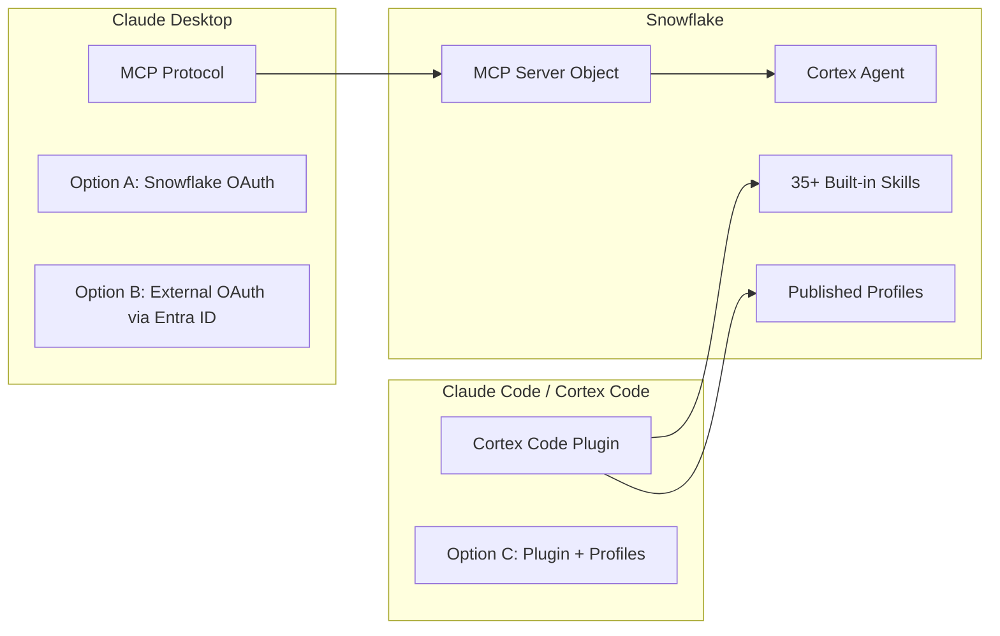
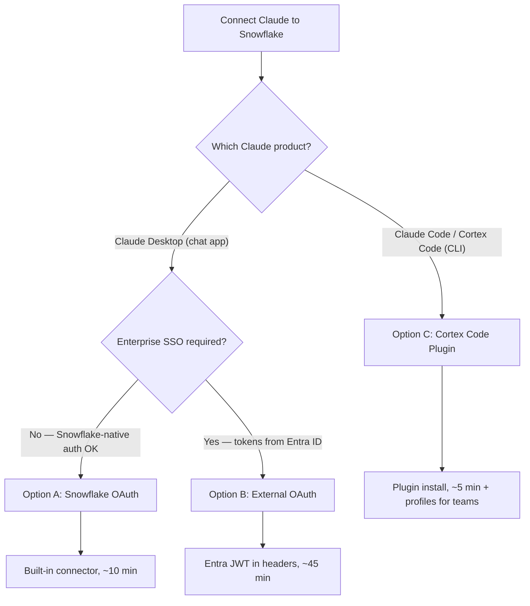

# Connecting Claude to Snowflake: MCP, OAuth, and Cortex Code

Three paths to connect Claude products to Snowflake data — from a 5-minute plugin install to full enterprise OAuth with Entra ID. Each path serves a different surface, governance model, and level of experience customization.

**Audience:** SEs walking customers through setup + customer IT admins configuring independently
**Created:** 2026-05-06 | **Expires:** 2026-06-05 | **Status:** ACTIVE

> **No support provided.** This content is for reference only. Review and validate before applying to any production workflow.

---

## Two Surfaces, Three Paths

**[Claude Desktop + MCP](mcp-oauth.md)** — the chat application (macOS/Windows/Linux). Connects via MCP protocol. You create an MCP Server object in Snowflake, configure OAuth, and Claude Desktop discovers and calls tools through JSON-RPC. Data access is scoped by a Semantic View + Cortex Agent.

**[Claude Code + Cortex Code Plugin](cortex-code-plugin.md)** — the CLI coding agent. Connects via the Cortex Code plugin which routes Snowflake prompts to Cortex Code CLI. No MCP server needed. Uses existing Snowflake connection (including browser SSO). Admins publish **profiles** to shape the experience per team.

---

## Quick Decision

| Criteria | Option A | Option B | Option C |
|---|---|---|---|
| **Setup time** | ~10 minutes | ~45 minutes | ~5 minutes |
| **Identity** | Snowflake-native OAuth | Entra ID (your tenant) | Browser SSO, PAT, or key-pair |
| **Enterprise SSO** | No | Yes (Entra ID tokens) | Yes (externalbrowser — Entra/Okta/SAML) |
| **Requires MCP Server** | Yes | Yes | No |
| **Requires OAuth integration** | Yes | Yes | No (uses existing Snowflake SSO) |
| **Experience shaping** | No | No | Yes (profiles + skills) |
| **Best for** | Business users, quick setup | Enterprise SSO mandates for MCP | Developers, SEs, power users |
| **Governance** | RBAC + Semantic View + Agent Tool List | RBAC + Semantic View + Agent Tool List | Security envelopes + RBAC + org policy |

---

## Detailed Guides

| | |
|---|---|
| **[MCP + OAuth](mcp-oauth.md)** | Claude Desktop path: Snowflake OAuth (Option A) and External OAuth via Entra ID (Option B). Covers Cortex Agent, MCP Server, grants, and end-to-end configuration. |
| **[Cortex Code Plugin](cortex-code-plugin.md)** | CLI path: Plugin install, browser SSO, security envelopes, profiles, experience shaping, and centralized skill distribution. |

---

## Governance Comparison

| Layer | Options A/B (MCP) | Option C (Plugin + Profiles) |
|---|---|---|
| **Authentication** | OAuth token (Snowflake or Entra) / PAT | Browser SSO, PAT, or key-pair |
| **Identity** | Token-bound (per-session) | Connection-based (persistent) |
| **Role binding** | Token scope → Snowflake role | Connection default role (switchable) |
| **Data visibility** | Semantic View boundary | Full Snowflake RBAC |
| **Operation control** | Agent tool list (no execute_sql) | Security envelopes (RO/RW/RESEARCH/DEPLOY) |
| **Experience shaping** | None | Profiles with skills + system prompts |
| **Audit** | Query history | Structured JSONL + query history |
| **Centralized policy** | None | Organization policy YAML |
| **Skill distribution** | Not applicable | Stage-based with RBAC gating |
| **Domain expertise** | Limited to agent system prompt | 35+ built-in + custom skills |

---

## Related Projects

- [`guide-mcp-auth`](../guide-mcp-auth/) — Comprehensive MCP auth for all AI clients (Cursor, VS Code, Windsurf)
- [`guide-agent-hardening`](../guide-agent-hardening/) — Agent governance: RBAC, monitoring, cost controls
- [`guide-external-access-playbook`](../guide-external-access-playbook/) — External access patterns: network rules, secrets, OAuth
- [`tool-secrets-rotation-aws`](../tool-secrets-rotation-aws/) — Automated PAT and key-pair rotation

## External References

- [Snowflake MCP Server Documentation](https://docs.snowflake.com/en/user-guide/snowflake-cortex/cortex-agents-mcp)
- [Cortex Code CLI Extensibility](https://docs.snowflake.com/en/user-guide/cortex-code/extensibility)
- [Cortex Code CLI Bundled Skills](https://docs.snowflake.com/en/user-guide/cortex-code/bundled-skills)
- [Configure Entra ID for External OAuth](https://docs.snowflake.com/en/user-guide/oauth-azure)
- [Cortex Code Plugin (Anthropic Marketplace)](https://claude.com/plugins/snowflake-cortex-code)
- [subagent-cortex-code (GitHub)](https://github.com/Snowflake-Labs/subagent-cortex-code)
- [Claude Desktop Snowflake Connector](https://claude.com/connectors/snowflake)
