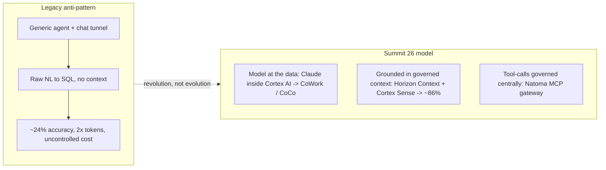
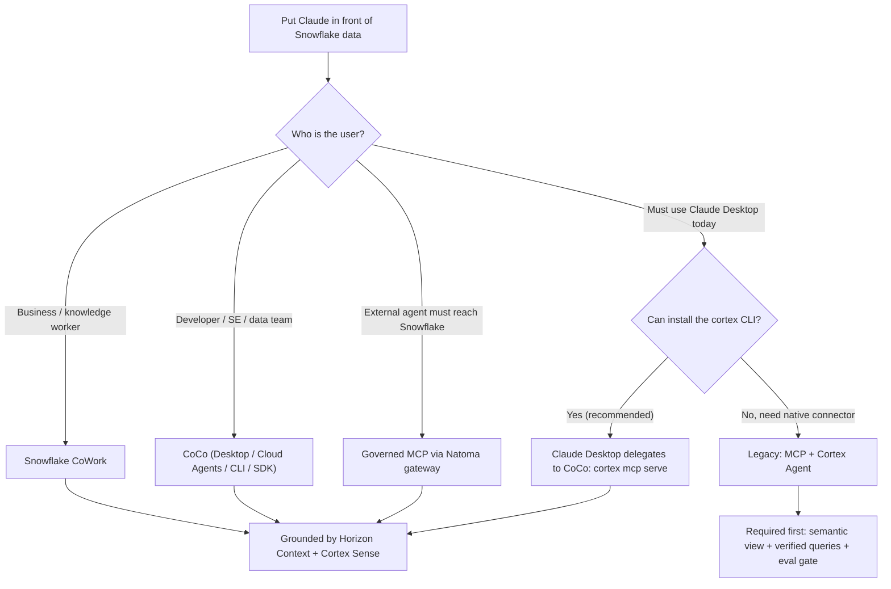

# Connecting Claude to Snowflake: Context Over Connection

The problem was never the connection. It was the missing **context** — and the wrong **direction** of data flow.

This guide was rebuilt after **Snowflake Summit 26 (June 1-4, 2026)**, which reframed the entire question. Wiring a generic chat agent to Snowflake through an MCP pipe and asking it to write SQL is the slowest, most expensive, *least accurate* way to put Claude in front of enterprise data. Snowflake's own benchmarks make the case in two numbers.

**Audience:** SEs walking customers through setup + customer IT admins configuring independently
**Created:** 2026-05-06 | **Major revision:** 2026-06-15 (post-Summit 26) | **Expires:** 2026-12-31 | **Status:** ACTIVE

> **No support provided.** This content is for reference only. Review and validate before applying to any production workflow. Several capabilities referenced here (CoCo Desktop, Natoma MCP gateway, Semantic Studio, Advanced Semantics) were announced at Summit 26 as preview or forward-looking — confirm GA status for your account before relying on them.

---

## The Two Numbers

| Metric | Generic agent over a pipe | Data-native + governed context | Source |
|---|---|---|---|
| **Accuracy** on hard structured-data questions | ~24% | **~86%** (with Cortex Sense context) | Snowflake Summit 26 benchmark |
| **Token + time cost** (vs CoCo on equivalent work) | +51% tokens, +8% time, *lower* pass rate (65.1%) | CoCo: 72.1% on ADE-Bench | [Snowflake CoCo blog](https://www.snowflake.com/en/blog/snowflake-coco-ai-coding-agent-modern-data-stack/) |

Raw natural-language-to-SQL through an MCP tunnel — no grounding, regenerated every turn, the human never sees the query — answers roughly **one in four** hard questions correctly while burning **more** tokens and warehouse credits than the alternative. That is the anti-pattern this guide now steers you away from.

---

## What Changed at Summit 26

New here? Five names appear throughout this guide. Read this table once and you're oriented — each row includes a plain-English "think of it as" so you don't need to have attended Summit.

| Old name (pre-Summit) | New name / model | Think of it as | Maturity |
|---|---|---|---|
| Snowflake Intelligence | **Snowflake CoWork** | The chat experience for business users, built into Snowflake | GA |
| Cortex Code (a plugin) | **CoCo** | A data-aware coding agent (like Claude Code, but it knows your Snowflake) | CLI GA; Desktop GA soon |
| *(absent)* | **Cortex Sense** | The service that feeds your business definitions to an agent at the moment it answers | GA |
| *(absent)* | **Horizon Context** | Where your governed business definitions live (semantic views, metrics, lineage) | GA; Semantic Studio in preview |
| Hand-rolled per-app OAuth | **Natoma MCP gateway** | One governed front door for agent tool-calls, instead of wiring OAuth per app | Announced (preview) |
| "Connect Claude in from outside" | **Claude inside Cortex AI** | Claude models run *inside* Snowflake and power CoWork + CoCo ($200M Anthropic deal) | GA |

> The CLI binary is still invoked as `cortex` and config still lives in `~/.snowflake/cortex/`. "CoCo" is the product brand for what was Cortex Code. Features marked *preview* / *announced* were disclosed at Summit 26 — confirm GA status for your account before relying on them.

---

## The Shift: Bring the Model to the Data

Three principles replace "pick a connection method":

1. **Run the intelligence next to the data.** Claude now runs *inside* Snowflake Cortex AI, powering CoWork and CoCo. No data egress, governed by your existing RBAC, inference inside the Snowflake perimeter.
2. **Ground every agent in governed context.** Horizon Context defines the truth; Cortex Sense delivers it at query time. This is the mechanism behind the 24% -> 86% jump.
3. **Govern tool access centrally.** The Natoma MCP gateway enforces identity, policy, and audit per tool-call — replacing fragile per-app OAuth plumbing.

---

## Which Surface? (Decision by User, Not by Protocol)

| Criteria | CoWork | CoCo | Governed MCP (Natoma) | Legacy MCP text-to-SQL |
|---|---|---|---|---|
| **Best for** | Business users, NL questions | Developers, SEs, pipelines, apps | External agents needing governed tool access | Claude Desktop chat, business convenience |
| **Where it runs** | In Snowflake | Desktop / Snowsight Cloud Agents / CLI | Snowflake-managed gateway | Claude Desktop <-> MCP Server |
| **Accuracy posture** | Context-grounded (~86%) | Data-native (reads schema/RBAC/lineage) | Tool-scoped, deterministic | ~24% unless context added |
| **Cost posture** | Governed, attributed | 51% fewer tokens than generic agent | Per-tool-call audited | Uncontrolled per-turn |
| **Governance** | RBAC + Horizon Context | RBAC + envelopes + audit | Identity/policy/audit per call | RBAC + Semantic View + tool list |
| **Guide** | [context-layer.md](context-layer.md) | [coco.md](coco.md) | [governed-mcp.md](governed-mcp.md) | [governed-mcp.md](governed-mcp.md) (legacy section) |

> **One foundation, many surfaces.** Whichever column you choose, the work that makes answers accurate is the same: describe your data in business terms and save a few real questions with their correct answers (see [The Context Layer](context-layer.md)). The columns above only differ in *what sits on top*. So pick the surface that fits your users — you're not signing up for different homework by choosing one over another, and the foundation keeps getting easier as Snowflake automates more of it.

---

## Detailed Guides

| | |
|---|---|
| **[The Context Layer](context-layer.md)** | The foundation **every** path shares — and it's the same work whether you pick Claude Desktop, CoCo, or CoWork, so starting with Claude Desktop costs you nothing extra. In plain terms: describe your data in business terms, save a few real questions with their correct answers, and check it. Build it once; every surface gets more accurate. |
| **[CoCo: The Data-Native Developer Surface](coco.md)** | CoCo Desktop, Cloud Agents (Snowsight), CLI, Agent SDK, MCP server + ACP, Skills Catalog. How Claude Desktop / Claude Code delegate to CoCo via `cortex mcp serve`. Connection auth, security envelopes, profiles, and the ADE-Bench efficiency story. |
| **[Claude Desktop & Governed MCP](governed-mcp.md)** | **Setting up Claude Desktop?** Start here for the steps. Covers the recommended delegate-to-CoCo path, the Natoma MCP gateway, Claude-inside-Cortex, and — for native-connector cases — the legacy Snowflake OAuth / Entra ID External OAuth setup. |

---

## Governance Comparison

| Layer | CoWork / CoCo | Governed MCP (Natoma) | Legacy MCP text-to-SQL |
|---|---|---|---|
| **Authentication** | Snowflake SSO / connection | Centralized credential brokering | OAuth token (Snowflake or Entra) / PAT |
| **Identity** | Connection-based, RBAC | Non-human identity, per-call | Token-bound (per-session) |
| **Data visibility** | Full RBAC + Horizon Context | Tool-scoped | Semantic View boundary |
| **Operation control** | Security envelopes / agent design | Policy at tool-call level | Agent tool list (omit execute_sql) |
| **Accuracy mechanism** | Cortex Sense context (~86%) | Deterministic vetted tools | None by default (~24%) |
| **Audit** | Prompt/response logging, query tags | Full tool-call audit trail | Query history |

---

## Related Projects

- [`guide-mcp-auth`](../guide-mcp-auth/) — Comprehensive MCP auth for all AI clients (Cursor, VS Code, Windsurf)
- [`guide-agent-hardening`](../guide-agent-hardening/) — Agent governance: RBAC, monitoring, cost controls
- [`guide-external-access-playbook`](../guide-external-access-playbook/) — External access patterns: network rules, secrets, OAuth
- [`tool-secrets-rotation-aws`](../tool-secrets-rotation-aws/) — Automated PAT and key-pair rotation

## External References

- [Snowflake CoCo: AI Coding Agent for the Modern Data Stack](https://www.snowflake.com/en/blog/snowflake-coco-ai-coding-agent-modern-data-stack/)
- [Snowflake CoWork (formerly Snowflake Intelligence)](https://www.snowflake.com/en/product/snowflake-cowork/)
- [Snowflake Horizon Context: The Governed Context Layer](https://www.snowflake.com/en/blog/horizon-context-governed-context/)
- [Snowflake to Acquire Natoma — Governed Agentic Access](https://www.snowflake.com/en/blog/snowflake-acquire-natoma-governed-agentic-access/)
- [Snowflake + Anthropic $200M Expanded Partnership](https://www.anthropic.com/news/snowflake-anthropic-expanded-partnership)
- [Cortex Code CLI MCP Support (`cortex mcp serve`)](https://docs.snowflake.com/en/user-guide/cortex-code/cortex-code-mcp)
- [Snowflake MCP Server Documentation](https://docs.snowflake.com/en/user-guide/snowflake-cortex/cortex-agents-mcp)
- [Cortex Code CLI Extensibility](https://docs.snowflake.com/en/user-guide/cortex-code/extensibility)
