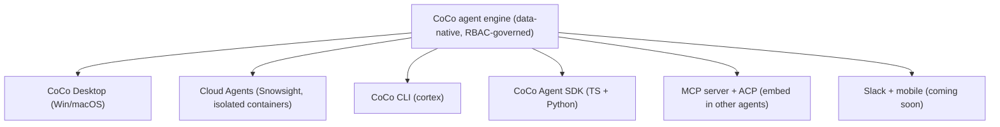
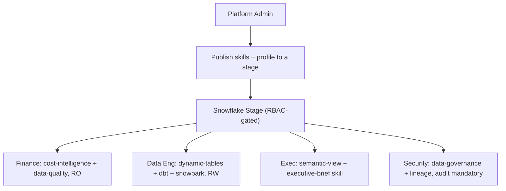

# CoCo: The Data-Native Developer Surface

**CoCo** (formerly Cortex Code) is Snowflake's data-native agentic platform for builders. Unlike a generic coding agent wired to a database through a pipe, CoCo reads your schemas, RBAC policies, and lineage *before* it generates code — and it runs governed by your existing Snowflake permissions.

> **See also:** [The Context Layer](context-layer.md) for the grounding that makes any agent accurate, and [Governed MCP](governed-mcp.md) for the Claude Desktop / legacy paths.

---

## Why a Data-Native Agent Wins (Accuracy *and* Cost)

On [ADE-Bench](https://www.getdbt.com/blog/ade-bench-dbt-data-benchmarking) — dbt Labs' framework for real-world analytics and data-engineering tasks — the numbers favor the data-native approach decisively:

| Agent | ADE-Bench pass rate | Tokens vs CoCo | Time vs CoCo |
|---|---|---|---|
| **CoCo** | **72.1%** | baseline | baseline |
| Claude Code (Opus 4.7) | 65.1% | **+51%** | **+8%** |
| OpenAI Codex | 65.1% | — | — |

CoCo wins on accuracy *while spending half the tokens*. Two design choices drive it:

- **Targeted vs. exhaustive exploration** — CoCo navigates directly to the data that matters instead of scanning everything in sight.
- **Native tools, not bash** — CoCo uses native tools for Snowflake, dbt, and Airflow rather than falling back on shell workflows, keeping work close to the data.

This is the cost half of the guide's thesis: a generic agent over a pipe is *more* expensive and *less* accurate than an agent that understands the stack.

---

## The CoCo Surfaces

At Summit 26, CoCo expanded from a CLI into a full platform. Pick the surface that matches where work happens.



| Surface | What it is | Availability |
|---|---|---|
| **CoCo Desktop** | Native IDE for Win/macOS: build pipelines, apps, agents, debug notebooks, visualize data flows in one governed surface, with a persistent always-on agent | GA soon (limited access) |
| **Cloud Agents** | Full agentic runtime inside Snowsight — each session spins up an isolated Snowflake-managed container (shell, Python, dbt builds, web search) with no local setup | GA soon |
| **CoCo CLI** | The `cortex` command-line agent; config in `~/.snowflake/cortex/` | GA |
| **CoCo Agent SDK** | Installable library (TypeScript + Python) exposing the same agent loop, tools, and SQL execution CoCo uses in production | New |
| **MCP server + ACP** | CoCo runs as an MCP server or Agent Client Protocol endpoint so other agents can delegate to it | GA (`cortex mcp serve`) |
| **Skills Catalog** | Discover, share, and reuse workflows across teams | Public preview |

---

## Authentication

CoCo authenticates via `~/.snowflake/connections.toml` — the same file the Snowflake CLI uses. Full enterprise SSO with none of the OAuth integration setup the legacy MCP path requires.

| Method | Config in connections.toml | Best for |
|---|---|---|
| **Browser SSO** (recommended) | `authenticator = "externalbrowser"` | Interactive users with Entra ID / Okta / any SAML IdP |
| **Programmatic Access Token** | `token = "${SNOWFLAKE_PAT}"` | Service accounts, CI/CD, role-scoped access |
| **Key-pair** | `private_key_path = "..."` | Automated systems, no browser available |

```toml
[my-connection]
account = "myorg-myaccount"
authenticator = "externalbrowser"
role = "DATA_READER"
warehouse = "MY_WAREHOUSE"
```

On first run, CoCo opens a browser, the user authenticates via the IdP already configured for Snowflake SSO, and the session token is cached locally. No OAuth security integration, no app registrations, no client secrets.

> **Key insight:** If your Snowflake account already has SAML/SSO configured (most enterprises do), `externalbrowser` Just Works. The legacy MCP path's Entra complexity exists only because Claude Desktop's MCP protocol requires programmatic token exchange — CoCo avoids it by opening a browser directly.

---

## Install the CLI

**Prerequisites:**

```bash
which cortex            # CoCo CLI must be installed
cortex connections list # Must show an active Snowflake connection
```

If not installed:

```bash
curl -LsS https://ai.snowflake.com/static/cc-scripts/install.sh | sh
```

---

## Claude Code <-> CoCo: Delegation, Not Text-to-SQL

The most important integration for this guide: instead of pointing Claude at a raw Snowflake MCP text-to-SQL agent, have Claude (or Cursor, or any MCP client) **delegate to the full CoCo agent loop**. CoCo then does the data-native, context-grounded work and returns results.

Run CoCo as an MCP server:

```bash
cortex mcp serve -c my_connection --bypass
```

Configure the MCP client (Claude Desktop shown; Cursor uses `.cursor/mcp.json`):

```json
{
  "mcpServers": {
    "cortex-code": {
      "command": "cortex",
      "args": ["mcp", "serve", "-c", "my_connection", "--bypass"]
    }
  }
}
```

This exposes data-native tools to the client, not just text-to-SQL:

| Tool | What it does |
|---|---|
| `cortex_code_agent` | Delegates a full task to the CoCo agent loop (writes code, runs SQL, edits files, multi-step) — returns results + an activity summary |
| `cortex_analyst_query` | Natural language to SQL via Cortex Analyst (grounded in semantic views) |
| `cortex_search_objects` | Search Snowflake catalog objects |
| `cortex_search_docs` | Search Snowflake product documentation |
| `cortex_agents_list` / `describe` / `search` | Discover and inspect Cortex Agents |

> Why this beats raw MCP text-to-SQL: the client delegates *intent* ("find top customers and run it") and CoCo handles exploration, SQL generation grounded in catalog + context, execution, and a verifiable activity summary — all under the user's RBAC. `--bypass` is recommended in server mode because the calling client manages its own confirmation flow.

---

## Connecting CoCo to Your Tools (MCP Client Mode)

CoCo is also an MCP *client* — add external tools (GitHub, Jira, internal APIs) and they become available to the agent automatically. Config lives in `~/.snowflake/cortex/mcp.json`.

```bash
cortex mcp add git uvx mcp-server-git
cortex mcp add my-api https://api.example.com --type http
cortex mcp list
cortex mcp start
```

| Transport | Use for |
|---|---|
| `stdio` | Local tools, CLI wrappers (default) |
| `http` | Web services, hosted APIs (Streamable HTTP) |
| `sse` | Real-time streaming services |

Credentials passed via `-e`/`-H` are migrated into the OS keychain on first connection — never hardcode tokens in `mcp.json`; use `${ENV_VAR}` expansion. Tool permissions are governed via `~/.snowflake/cortex/permissions.json` (`allow` / `deny` / `ask`, with `mcp__*` wildcards). Administrators can disable user MCP servers, enforce a base set, and apply a URL allowlist through [managed settings](https://docs.snowflake.com/en/user-guide/cortex-code/managed-settings).

---

## Build on CoCo: the Agent SDK

The CoCo Agent SDK packages the production agent loop as an installable library — embed data-native agents in pipelines, internal tools, and CI/CD.

```python
import asyncio
from cortex_code_agent_sdk import query

async def main():
    async for message in query(
        prompt="""Profile the ORDERS table in MY_DATABASE.ANALYTICS:
        - Total row count and date range covered
        - Null rate for each column
        - Top 5 customers by order volume
        Summarize findings in plain English.""",
        options={"cwd": ".", "connection": "my-connection"},
    ):
        if message["type"] == "assistant":
            for block in message["content"]:
                if block["type"] == "text":
                    print(block["text"], end="", flush=True)

asyncio.run(main())
```

The SDK supports multi-turn sessions, structured (schema-validated JSON) output, MCP server integration, hooks for intercepting agent behavior, streaming, and custom system prompts.

---

## Shaping the Experience: Profiles and Skills

Profiles give different teams different experiences — without changing any Snowflake objects or RBAC grants.



**Publish skills and a profile to a stage for centralized, RBAC-gated distribution:**

```bash
cortex skill publish ./my-team-skills --to-stage @MY_DB.MY_SCHEMA.SKILLS_STAGE/skills/
cortex skill add @MY_DB.MY_SCHEMA.SKILLS_STAGE/skills/
cortex profile publish data-analyst --skill-stage @MY_DB.MY_SCHEMA.SKILLS_STAGE/skills/
```

```sql
GRANT READ ON STAGE MY_DB.MY_SCHEMA.SKILLS_STAGE TO ROLE FINANCE_TEAM;
GRANT READ ON STAGE MY_DB.MY_SCHEMA.SKILLS_STAGE TO ROLE DATA_ENGINEERS;
```

Same RBAC model as Snowflake data governance — only roles with READ on the stage can load the profile. The new **Skills Catalog** (public preview) adds team-wide discovery and reuse on top of this.

---

## Security Envelopes and Approval Modes

Each request is wrapped in a security envelope controlling what CoCo can do:

| Envelope | Allows | Blocks |
|---|---|---|
| **RO** | Queries, reads, exploration | Edit, Write, destructive Bash |
| **RW** | Data modifications, DDL | Destructive shell patterns |
| **RESEARCH** | Read access + web tools | Write operations |
| **DEPLOY** | Deployment operations | Destructive Bash (requires confirmation) |

| Approval mode | Behavior |
|---|---|
| `prompt` (default) | Shows predicted tools, asks user to approve |
| `auto` | Auto-approves with mandatory audit logging |
| `envelope_only` | Auto-approves, no tool prediction (faster) |

For enterprise-wide enforcement, admins deploy organization policy that overrides user-level config (e.g., forcing `prompt` mode even if a user sets `auto`). See [managed settings](https://docs.snowflake.com/en/user-guide/cortex-code/managed-settings).

> Verify the current envelope and approval-mode names against the [security docs](https://docs.snowflake.com/en/user-guide/cortex-code/security) for your CLI version — these have evolved across releases.

---

## Governance Built In

| Layer | What it controls |
|---|---|
| **Snowflake RBAC** | What the user's connection can access (every operation runs under existing RBAC) |
| **Security envelopes** | What operation types are permitted |
| **Profiles + skills** | What expertise and framing the user gets (stage-published, RBAC-gated) |
| **Managed settings** | Enterprise-wide override (MCP allowlists, enforced servers, approval mode) |

LLM inference stays within Snowflake's security perimeter; layered guardrails help protect against prompt injection; prompt/response logging, query tagging, and admin cost controls give auditability. More than 7,100 customers are already building with CoCo.

---

## Testing

```bash
# Verify SSO
cortex                       # opens browser for Entra/Okta auth
cortex connections list      # confirm active connection

# Verify MCP server mode (Claude/Cursor delegation)
cortex mcp serve -c my_connection --bypass   # then call from the client

# Verify read-only enforcement
# With RO envelope, "drop table X" is blocked before execution
```

---

## Common Gotchas

| Issue | Cause | Fix |
|---|---|---|
| `cortex` not found | CLI not installed | Run the install script; `which cortex` |
| Browser SSO not opening | Wrong authenticator | Set `authenticator = "externalbrowser"` in connections.toml |
| Skills not loading | Stage READ grant missing | `GRANT READ ON STAGE ... TO ROLE ...` |
| MCP tools not appearing | Server disabled or invalid tool names | Check `/mcp`, `cortex mcp list`, `mcp-disabled.json` |
| Client can't drive CoCo server interactively | Missing `--bypass` | Add `--bypass` so the client manages confirmations |
| Org policy overriding user config | Managed settings force different values | Check managed settings / org policy |

---

## References

- [Snowflake CoCo: AI Coding Agent for the Modern Data Stack](https://www.snowflake.com/en/blog/snowflake-coco-ai-coding-agent-modern-data-stack/)
- [Cortex Code CLI MCP support (`cortex mcp serve`, client + server mode)](https://docs.snowflake.com/en/user-guide/cortex-code/cortex-code-mcp)
- [Cortex Code CLI Extensibility (Skills, Profiles, Hooks, MCP)](https://docs.snowflake.com/en/user-guide/cortex-code/extensibility)
- [Cortex Code CLI Managed Settings](https://docs.snowflake.com/en/user-guide/cortex-code/managed-settings)
- [Cortex Code Security Best Practices](https://docs.snowflake.com/en/user-guide/cortex-code/security)
- [CoCo Cloud Agents (Snowsight)](https://docs.snowflake.com/en/user-guide/cortex-code/cortex-code-snowsight/cloud-agents)
- [CoCo Agent SDK](https://docs.snowflake.com/en/user-guide/cortex-code-agent-sdk/cortex-code-agent-sdk)
- [ADE-Bench (dbt Labs)](https://www.getdbt.com/blog/ade-bench-dbt-data-benchmarking)
