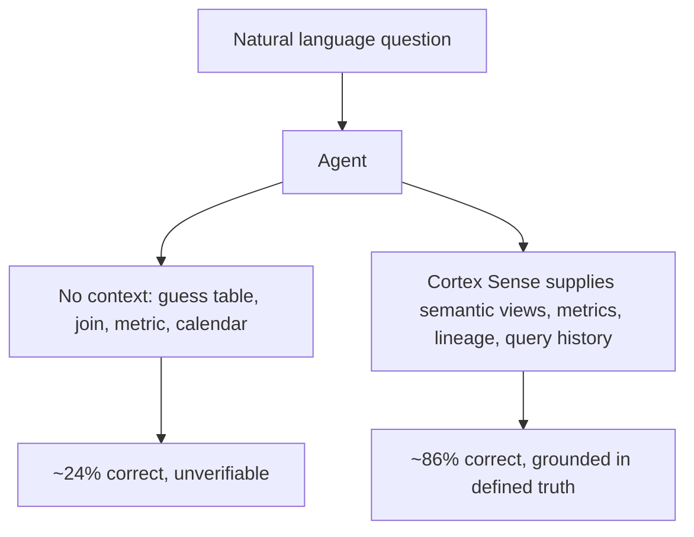
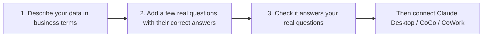

# The Context Layer: Why 24% Becomes 86%

The single most important decision in connecting Claude to Snowflake is not the auth method or the transport. It is whether the agent is **grounded in governed business context**. Snowflake's Summit 26 benchmark put a number on it: frontier agents answer hard structured-data questions at roughly **24% accuracy alone, rising to ~86% with full context** from Cortex Sense.

> **See also:** [CoCo](coco.md) for the developer surface that consumes this context, and [Governed MCP](governed-mcp.md) for tool-call governance.

---

## Why Raw Text-to-SQL Fails

A generic agent asked "what was Q3 net revenue by region?" against a bare schema must guess:

- **Which table** is the source of truth (there are often a dozen `REVENUE`-ish tables)
- **Which join path** is correct (fan-out on a one-to-many join silently doubles totals)
- **What "net revenue" means** (gross minus what? which currency? which fiscal calendar?)
- **What "region" maps to** (sales region? billing region? a derived rollup?)

Every turn regenerates the SQL non-deterministically, and the human never sees it — so a confident, wrong number is indistinguishable from a correct one. This is the mechanism behind the ~24% figure. It is not a model-quality problem; it is a **missing-context** problem.



---

## Horizon Context: Defining the Truth

**Horizon Context** is Snowflake's governed semantic and context layer — the place where business definitions live so every engine and agent sees the same truth.

| Component | What it provides |
|---|---|
| **Semantic Views** | Defined entities, metrics, dimensions, and join paths — the contract an agent assembles answers from |
| **Advanced Semantics** (private preview) | Level-of-detail calculations, composable definitions, user-defined materializations with automatic query rewrite |
| **Semantic Studio** (private preview) | AI-assisted IDE for building semantic views, with git versioning and CoCo edits in one workspace |
| **Semantic View Autopilot** | Auto-generates business-ready semantic definitions from existing BI sources (Tableau, Power BI) |
| **Column-level lineage** | Quality and provenance signals across Snowflake and external databases |
| **Open Semantic Interchange (OSI)** | Open standard (50+ participating companies) so definitions are portable, not vendor-locked |

The principle: an agent should never invent the definition of a metric. It should **retrieve** it from a governed semantic view.

---

## Cortex Sense: Delivering Context at Query Time

**Horizon Context defines the truth; Cortex Sense makes it consumable by agents.** Rather than relying on a pre-built static cache, Cortex Sense assembles context **at query time** from:

- Query history (how the organization actually queries this data)
- Object metadata and documentation
- BI dashboard definitions
- Semantic views from Horizon Context

It then hands that context to CoWork and CoCo the moment they need it. This runtime assembly is what produces the 3-4x accuracy lift.

> Cortex Sense is an *implementation* of Horizon Context — the runtime that turns governed definitions into agent-ready context. You invest in semantic views and definitions once; Cortex Sense delivers them everywhere.

---

## The One Thing Every Path Shares

Here is the good news, especially if your assignment is "just wire up Claude Desktop": **the work that makes answers accurate is the same no matter which path you pick.** It isn't an extra hoop for the Claude Desktop route, and it isn't busywork — it's a small, reusable asset you build once. Every surface today (CoWork, CoCo, Claude Desktop) and every surface Snowflake ships next reads from it. Wiring the connection is the quick part; this is the part that's worth your time.

You only need to do three things, and none of them require new skills beyond SQL you already know.



### 1. Describe your data in business terms

This is a **semantic view** — a plain description of what your data means: what a "customer" is, how "net revenue" is calculated, which tables join to which, and the everyday words people use for each thing. The agent reads this instead of guessing at raw table names, which is the whole reason accuracy jumps.

You don't have to write it from scratch. **Semantic View Autopilot** can draft one from your existing Tableau or Power BI definitions; you then refine the wording. If your data team already set up Cortex Analyst, a semantic view may already exist — ask them.

### 2. Add a few real questions with their correct answers

Pick the 10-30 questions your analysts actually ask and pair each with the SQL that gives the right answer. When someone asks a matching question, the agent returns *your verified answer* instead of improvising. This is the single biggest accuracy win, and it's the part you most control.

```yaml
# A "verified query" is just a question + the SQL you know is correct.
verified_queries:
  - name: "California profit last month"
    question: "What was the profit from California last month?"
    sql: "SELECT SUM(profit) FROM sales WHERE state = 'CA' AND ..."
```

You don't have to write the SQL by hand: the open-source [semantic-model-generator](https://github.com/Snowflake-Labs/semantic-model-generator) app lets you ask a question, check the answer, and click **Save as verified query**. Snowsight also *suggests* verified queries based on what people actually ask. One thing to keep in mind: use specific dates ("Q1 2025") rather than "last quarter" so the saved answer stays correct over time.

### 3. Check it answers your real questions

Before you let analysts loose, confirm it gets your real questions right. In Snowsight: **AI & ML » Cortex Analyst »** pick your semantic view **» Evaluations**. It runs your questions, shows an accuracy score, and points out any it got wrong so you can fix the description or add a verified query. Fix, re-check, repeat until you're comfortable — then connect.

> **Going deeper (optional):** evaluations and view optimization can also be driven from SQL/CI (`EXECUTE_AI_EVALUATION`) and there are a couple of authoring details (logical column names, the required role grants) that matter at scale. None of it is needed to get started — see the [Verified Query Repository](https://docs.snowflake.com/en/user-guide/snowflake-cortex/cortex-analyst/verified-query-repository) and [evaluations](https://docs.snowflake.com/en/user-guide/snowflake-cortex/cortex-analyst-evaluations) docs when you're ready.

### Then connect

Now point Claude Desktop, CoCo, or CoWork at it. Whatever accuracy you saw in step 3 is what your users get — because every path reads the same description and the same verified answers. And this only gets easier over time: the platform is moving toward grounding agents automatically (Semantic View Autopilot drafting views, Cortex Sense assembling context at query time), so the foundation you build today keeps paying off with less effort tomorrow.

---

## The Payoff

| Without context layer | With Horizon Context + Cortex Sense |
|---|---|
| ~24% accuracy on hard questions | ~86% accuracy |
| Unverifiable, regenerated every turn | Grounded in defined, governed truth |
| Metric meaning guessed | Metric meaning retrieved |
| Nothing reusable, never checked | Saved answers, checked before launch, reused by every tool |

Context is the work. Everything downstream — which surface, which auth, which transport — is plumbing by comparison.

---

## References

- [Snowflake Horizon Context: The Governed Context Layer for AI, BI and Apps](https://www.snowflake.com/en/blog/horizon-context-governed-context/)
- [Horizon Context | Governed Semantic Layer & Data Catalog](https://www.snowflake.com/en/product/features/horizon-context/)
- [Open Semantic Interchange (OSI)](https://open-semantic-interchange.org/)
- [Cortex Analyst Verified Query Repository (VQR)](https://docs.snowflake.com/en/user-guide/snowflake-cortex/cortex-analyst/verified-query-repository)
- [Cortex Analyst Evaluations (`EXECUTE_AI_EVALUATION`)](https://docs.snowflake.com/en/user-guide/snowflake-cortex/cortex-analyst-evaluations)
- [Optimize a semantic view with verified queries](https://docs.snowflake.com/en/user-guide/snowflake-cortex/cortex-analyst/analyst-optimization)
- [Verified query suggestions](https://docs.snowflake.com/en/user-guide/snowflake-cortex/cortex-analyst/verified-query-suggestions)
- [Cortex Analyst & Semantic Views](https://docs.snowflake.com/en/user-guide/snowflake-cortex/cortex-analyst/semantic-model-spec)
- [Snowflake CoWork (formerly Snowflake Intelligence)](https://www.snowflake.com/en/product/snowflake-cowork/)
