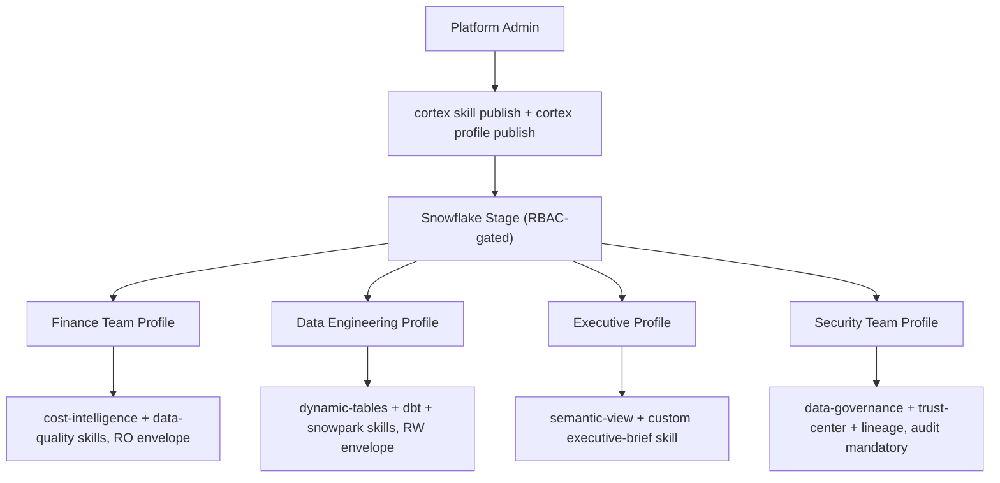

# Cortex Code Plugin: Profiles, Skills, and Experience Shaping

Connect Claude Code (or any coding agent) to Snowflake via the Cortex Code plugin — with 35+ specialized skills, security envelopes, enterprise SSO, and team-level experience shaping through profiles.

> **See also:** [MCP + OAuth](mcp-oauth.md) for the Claude Desktop path using MCP protocol with Snowflake OAuth or Entra ID External OAuth.

---

## Why Option C?

Options A/B (Claude Desktop + MCP) give you a data pipe: question in, answer out. Option C gives you a **shaped experience** — controlling what skills are available, how responses are framed, what operations are permitted, and who gets which persona.

| Gap in Options A/B | How Option C Solves It |
|---|---|
| No domain specialization | 35+ specialized skills (data quality, governance, lineage, ML, Streamlit, dbt) |
| No experience shaping | Profiles inject custom system prompts + curated skill sets per team |
| Limited operation governance | Security envelopes (RO/RW/RESEARCH/DEPLOY) control operation types |
| No centralized skill distribution | `cortex skill publish --to-stage` distributes skills via Snowflake RBAC |
| No audit trail of AI operations | Structured JSONL audit logging with hash chaining |
| No org policy enforcement | Organization policy YAML for enterprise-wide config override |
| Complex auth setup (Option B) | Browser SSO via `externalbrowser` — uses existing Snowflake SSO config |

---

## Authentication

Cortex Code authenticates via `~/.snowflake/connections.toml` — the same connection file used by the Snowflake CLI. It supports full enterprise SSO without any of the OAuth integration setup required by Options A/B.

| Method | Config in connections.toml | Best For |
|---|---|---|
| **Browser SSO** (recommended) | `authenticator = "externalbrowser"` | Interactive users with Entra ID / Okta / any SAML IdP |
| **Programmatic Access Token** | `token = "${SNOWFLAKE_PAT}"` | Service accounts, CI/CD, role-scoped access |
| **Key-pair** | `private_key_path = "..."` | Automated systems, no browser available |
| **Username + Password** | `user` + `password` fields | Legacy (not recommended) |

### Browser SSO with Entra ID

The same federated identity used in Option B works here with zero extra Snowflake configuration:

```toml
[my-connection]
account = "myorg-myaccount"
authenticator = "externalbrowser"
role = "DATA_READER"
warehouse = "MY_WAREHOUSE"
```

On first run, Cortex Code opens a browser → user authenticates via Entra ID (or whatever IdP is configured for Snowflake SSO) → session token is cached locally. No OAuth security integration, no app registrations, no client secrets.

### PAT with Role Restriction

For least-privilege service accounts:

```toml
[cortex-readonly]
account = "myorg-myaccount"
token = "${SNOWFLAKE_PAT}"
role = "ANALYST_ROLE"
warehouse = "MY_WAREHOUSE"
```

> **Key insight:** The Entra ID setup from Option B (Steps 1-4) is NOT required for Cortex Code SSO. If your Snowflake account already has SAML/SSO configured (which most enterprises do), `externalbrowser` Just Works. Option B's complexity exists because Claude Desktop's MCP protocol requires programmatic token exchange — Cortex Code avoids this entirely by opening a browser directly.

---

## Install the Plugin

**Prerequisites:**

```bash
which cortex            # Cortex Code CLI must be installed
cortex connections list # Must show an active Snowflake connection
```

If not installed: `curl -LsS https://ai.snowflake.com/static/cc-scripts/install.sh | sh`

**Install from inside Claude Code:**

```
/plugin install snowflake-cortex-code
```

**Or via the npx skills ecosystem** (works with Claude Code, Cursor, Windsurf, Codex, GitHub Copilot, and 40+ agents):

```bash
npx skills add snowflake-labs/subagent-cortex-code --copy --global
```

---

## How Routing Works

The plugin detects Snowflake intent automatically:

- *"Show me the top 10 customers by revenue"* → Routes to Cortex Code
- *"Check data quality for the SALES_DATA table"* → Routes to Cortex Code
- *"Fix the bug in auth.py"* → Stays in Claude Code (not Snowflake-related)

For explicit routing, use `$cortex-run`:

```
$cortex-run analyze query performance for the last 7 days
```

**What gets routed to Cortex Code:**
- Snowflake databases, warehouses, schemas, tables
- SQL queries specifically for Snowflake
- Cortex AI features (Cortex Search, Cortex Analyst, ML functions)
- Snowpark, dynamic tables, streams, tasks
- Data governance, data quality, security in Snowflake

**What stays in your coding agent:**
- Local file operations
- General programming (Python, JavaScript, etc.)
- Non-Snowflake databases (PostgreSQL, MySQL, etc.)
- Web development, frontend work
- Git operations, version control

---

## Security Envelopes

Each request is wrapped in a security envelope that controls what Cortex Code can do:

| Envelope | Allows | Blocks |
|---|---|---|
| **RO** (Read-Only) | Queries, reads, exploration | Edit, Write, destructive Bash |
| **RW** (Read-Write) | Data modifications, DDL | Destructive shell patterns |
| **RESEARCH** | Read access + web tools | Write operations |
| **DEPLOY** | Deployment operations | Destructive Bash (requires confirmation) |

### Approval Modes

| Mode | Behavior | Best For |
|---|---|---|
| `prompt` (default) | Shows predicted tools, asks user to approve | Interactive sessions, production |
| `auto` | Auto-approves with mandatory audit logging | Automated workflows, CI/CD |
| `envelope_only` | Auto-approves, no tool prediction (faster) | Trusted environments |

---

## Shaping the Experience with Profiles

Profiles are how you give different teams different experiences — without changing any Snowflake objects or RBAC grants.



### Publishing Skills to a Stage

Publish custom skills to a Snowflake stage for centralized distribution:

```bash
cortex skill publish ./my-team-skills --to-stage @MY_DB.MY_SCHEMA.SKILLS_STAGE/skills/
```

Users with READ on the stage can load these skills:

```bash
cortex skill add @MY_DB.MY_SCHEMA.SKILLS_STAGE/skills/
```

### Publishing a Profile

A profile bundles skills + persona configuration into a named experience:

```bash
cortex profile publish data-analyst --skill-stage @MY_DB.MY_SCHEMA.SKILLS_STAGE/skills/
```

### Use Case Examples

**1. Finance Team — Read-only exploration**

Profile publishes `cost-intelligence` and `data-quality` skills with a system prompt focused on financial analysis. Organization policy enforces `approval_mode: prompt` and `default_envelope: RO` — they can explore data but never modify it. Instead of raw SQL results, users get cost breakdowns, trend analysis, and budget recommendations from the specialized skills.

**2. Data Engineering Team — Build and deploy**

Profile publishes `dynamic-tables`, `dbt-projects-on-snowflake`, `snowpark-python`, and `iceberg` skills with RW envelope. Engineers get deep expertise for building pipelines, not just querying data. The semantic view limitation of Options A/B doesn't apply — they work with the full schema.

**3. Executive Dashboards — Summarized insights**

Profile publishes `semantic-view` skill plus a custom `executive-brief` skill that formats responses as bullet-point summaries with KPIs. Executives never see raw SQL — they get business-language insights. This experience shaping is impossible in Options A/B where the outer Claude session has no domain guidance.

**4. Security/Compliance Team — Full governance focus**

Profile publishes `data-governance`, `trust-center`, and `lineage` skills with mandatory audit logging. Every operation is logged to structured JSONL with hash chaining. Organization policy YAML enforces this centrally — individual users cannot disable it.

### RBAC Gate

Skills live on a Snowflake stage. Only roles with READ on that stage can load the profile:

```sql
GRANT READ ON STAGE MY_DB.MY_SCHEMA.SKILLS_STAGE TO ROLE FINANCE_TEAM;
GRANT READ ON STAGE MY_DB.MY_SCHEMA.SKILLS_STAGE TO ROLE DATA_ENGINEERS;
```

Same RBAC model as Snowflake data governance — no new access control system to learn.

### Organization Policy (Enterprise Override)

For enterprise-wide enforcement, admins deploy `~/.snowflake/cortex/claude-skill-policy.yaml`:

```yaml
security:
  approval_mode: "prompt"
  allowed_envelopes: ["RO", "RESEARCH"]
  sanitize_conversation_history: true
audit:
  enabled: true
  require_hash_chain: true
```

This overrides user-level config — even if a user sets `auto` mode locally, the org policy forces `prompt` mode.

---

## Governance Model (Plugin)

Four layers working together:

| Layer | What It Controls | How |
|-------|-----------------|-----|
| **Snowflake RBAC** | What the user's connection can access | Standard role grants |
| **Security Envelopes** | What operation types are permitted | RO blocks writes, DEPLOY requires confirmation |
| **Profiles + Skills** | What expertise and framing the user gets | Stage-published, RBAC-gated |
| **Organization Policy** | Enterprise-wide override | YAML deployed to user machines |

---

## Testing

### Verify Plugin Routing

In Claude Code, ask: *"How many databases do I have in Snowflake?"*

Confirm Cortex Code handles the request (you'll see routing and execution output).

### Verify Read-Only Enforcement

With RO envelope, try: *"Drop table X"* — blocked by envelope before execution.

### Verify SSO

```bash
cortex  # Should open browser for Entra/Okta authentication
```

After authenticating, run `cortex connections list` to confirm the active connection.

---

## Common Gotchas

| Issue | Cause | Fix |
|-------|-------|-----|
| Plugin not routing | Cortex CLI not found | `which cortex` — install if missing |
| "Permission denied" despite auto mode | Tool blocked by envelope | Switch to less restrictive envelope |
| Skills not loading | Stage READ grant missing | `GRANT READ ON STAGE ... TO ROLE ...` |
| Org policy overriding user config | Enterprise YAML forces different settings | Check `~/.snowflake/cortex/claude-skill-policy.yaml` |
| Browser SSO not opening | Wrong authenticator value | Set `authenticator = "externalbrowser"` in connections.toml |
| Connection refused | Snowflake connection not configured | Run `cortex connections list` then `cortex connections create` |

---

## References

- [Cortex Code CLI Extensibility (Skills, Profiles, Hooks, MCP)](https://docs.snowflake.com/en/user-guide/cortex-code/extensibility)
- [Cortex Code CLI Bundled Skills](https://docs.snowflake.com/en/user-guide/cortex-code/bundled-skills)
- [Cortex Code Security Best Practices](https://docs.snowflake.com/en/user-guide/cortex-code/security)
- [Cortex Code Plugin (Anthropic Marketplace)](https://claude.com/plugins/snowflake-cortex-code)
- [subagent-cortex-code (GitHub)](https://github.com/Snowflake-Labs/subagent-cortex-code)
- [Snowflake AI Kit — Plugin Source](https://github.com/snowflake-labs/snowflake-ai-kit/tree/main/plugins/cortex-code)
